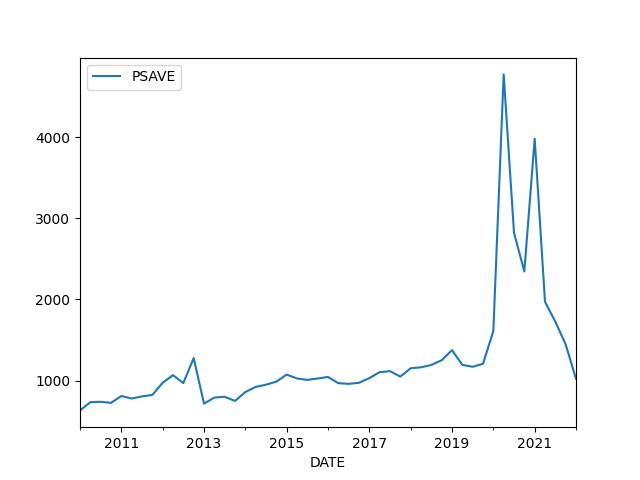
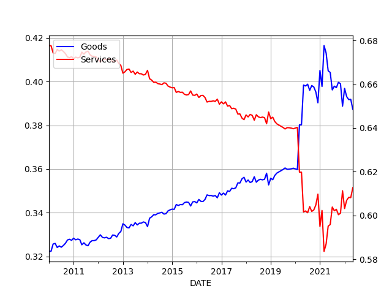

# Week 29 

H2 Fuel News: "Network of hydrogen fuel stations to roll out from
Sydney to Melbourne.. The $20 million Australian strategy will involve
constructing at least four refueling locations"

---

ClassNK: "Tokyo - ClassNK has issued an Approval in Principle (AiP)
for an ammonia-fueled tugboat (A-Tug) jointly developed by Nippon
Yusen Kabushiki Kaisha (NYK Line) and IHI Power Systems Co.,
Ltd.. Ammonia is expected to be used as ship fuel for decarbonization
since it does not emit CO2 when combusted"

---

The Advocate: "Premier sells Japan on NSW green hydrogen.. With the
war in Ukraine driving up oil and gas prices, alternative sources of
clean energy, particularly green hydrogen, underscore NSW Premier
Dominic Perrottet's trade mission to Japan...

He hoped his government would have a whopping $270 billion invested
into the.. industry as the world pushes for decarbonisation..

With a blue Toyota hydrogen-powered vehicle parked behind him, the
premier said NSW has the scale and infrastructure to supply Japan and
other markets with 110,000 tonnes of green hydrogen annually by 2030"

---

"@AirbusPRESS

Airbus invests in world’s largest clean hydrogen infrastructure fund
managed by Hy24"

[[-]](https://fly.airbus.com/3RMcR8h #FIA2022)

---

Aha this is the famous methane pyrolysis process.. Nice.

"C-Zero's technology, which was initially developed at the University
of California Santa Barbara, uses high temperatures to split methane -
the primary molecule in natural gas and renewable natural gas- into
hydrogen and solid carbon in a process known as methane pyrolysis."

---

<iframe width="340" src="https://www.youtube.com/embed/JGe8R0N20ps?start=412&end=545" title="How Cheap Hydrogen Could Become the Next Clean Fuel" frameborder="0" allow="accelerometer; autoplay; clipboard-write; encrypted-media; gyroscope; picture-in-picture" allowfullscreen></iframe>

---

Nordstream 2 has same capacity as Nordstream 1. It is blocked though,
first by US (due to its persistent strategy around sowing discord in
Eurasia), now it won't get turned on due to the war in Ukraine. 1 and
2 combined gives 130 GW. 

---

As a comparison.. Nordstream 1 has a full daily gas capacity of around
150 million cubic meters. Natural gas has 10.55 kWh per cubic
meters, 10.55 * 150 * 1000000 / (24*1e6) equals 65 Gigawatts. 

---

Silicon production for solar panels. Dam

[[-]](../../2022/06/the-end-of-the-world-is-just-the-beginning-zeihan.html#silicon)

---

Need cheaper, more easily accessible materials.. What's up with those
perovskites?

---

An area at 56 km2, a square whose side is over 7 kilometers..

Great - let's have more of such plants.

It's a massive area though, trying to think of the materials required
to make that happen..

---

"The Bhadla Solar Park, which is the largest solar power plant in the
world, is based in Bhadla village, in India's Rajasthan's Jodhpur
district – a region known for its solar-friendly high
temperatures. The power plant was commissioned in March 2020 with an
installed capacity of 2.25GW and it spans 14,000 acres"

---

<blockquote class="twitter-tweet"><p lang="en" dir="ltr">The Queensland government has started work on Australia’s first hydrogen refuelling facility at one of Brisbane’s busiest stations. The <a href="https://twitter.com/bp_plc?ref_src=twsrc%5Etfw">@bp_plc</a> truck stop at Brisbane Port, a critical link on the east coast hydrogen superhighway.<br><br>Read more here: <a href="https://t.co/u5KwsfAmc1">https://t.co/u5KwsfAmc1</a> <a href="https://t.co/0iKO48hWNf">pic.twitter.com/0iKO48hWNf</a></p>&mdash; Hazer Group Ltd (@hazergroupltd) <a href="https://twitter.com/hazergroupltd/status/1549907444175970304?ref_src=twsrc%5Etfw">July 21, 2022</a></blockquote> <script async src="https://platform.twitter.com/widgets.js" charset="utf-8"></script>

---

*Ghost in the Shell*, how come I missed this? Thank you DIY
recommender. Part *Bladerunner*, part *The Matrix*, a better filmed
*Johnny Mnemonic*... 

---

A theory: Crises kill the elderly, the weak. The young remain, and
their attention is unleashed elsewhere, creating a more agressive
society. True or false? Thinking of Germany before WWII, Russia after
90s..

---

Russians still talk about the 90s crisis, why not? It must have been a
humiliating period for them. The US Great Depression was over 70 years
ago, still remembered today right? Well the Russian crisis was worse,
and not that long ago - relatively speaking.

---

The vid says Russian economic contraction and its effects were worse than
US's Great Depression.

---

Now CH has a debt problem; but hey, gotta have a crisis or two right? 

---

How China (Actually) Got Rich

[[-]](https://youtu.be/K_57-OOjoP8?t=60)

---

Pandemic-proofing is a good measure for any system's improvement.
Education can be pandemic-proofed by relying on pre-recorded lecture
videos, less on teachers. Econ, by always paying digital UBI just
enough to keep ppl afloat. Lack of healthcare wld be acutely felt
during pandemic, enter single-payer. Etc.

---

The guinea is pretty varied, a mosaic of guinea people

---

The right-wing ITN party that is ahead in polls for next election,
Brotherhood of Italy is headed up by a woman oddly enough (and she
looks Anglo). Party wasn't overtly anti-Russia but after the war
changed their tune somewhat.. Their right overall is not RU
antogonistic.

---

The entire Italian government did not collapse just due to a bleeping
garbage incinerator I can guarantee that.

---

Al Jazeera: "EU launches new legal procedures against UK over Northern Ireland"

---

Finally Asia Minor is doing something useful

---

Obviously RU got benefits out of the deal too

Al Jazeera: "Russia, Ukraine poised to sign grain deal at Istanbul
ceremony.. The anticipated agreement will also 'pave the way for
Russian food and fertilisers to reach world markets as well' after
Moscow struggled with exports as a result of Western sanctions"

---

H2 Central: "[S]ignificant reductions in emissions can be achieved by
using blue hydrogen, which is made from natural gas but incorporates
CO2 capture in its production...

The Sustainable Hydrogen & Recovery of Carbon (SHARC) project [of
Neste] involves water electrolysis technology for the production of
green hydrogen as well as carbon capture from existing hydrogen
production, and the permanent storage of captured CO2. Altogether the
project is set to achieve a reduction of more than 4 million tons of
CO2 emissions at the site in the first 10 years of operation..

To reduce these emissions many countries including the US, Canada, UK,
the Netherlands and Australia are currently investing heavily in blue
hydrogen technology"

---

H2 Central: "Isuzu, Toyota, Hino, and CJPT to Promote Planning and
Development of Mass-Market Light-Duty Fuel Cell Electric Trucks"

---

H2 Central: "easyJet and Rolls-Royce announced a ground-breaking new
partnership, H2ZERO, that will pioneer the development of hydrogen
combustion engine technology capable of powering a range of aircraft,
including those in the narrow-body market segment"

---

"Green \#hydrogen could supply [over 30%] of aviation energy demand by
2050"

---

"HVN Plus UK to consider mandatory sale of ‘hydrogen ready’ boilers
from 2026"

---

[Air Liquide Carbon Capture](https://energies.airliquide.com/energies-clean-energy-supply/clean-hydrogen#carbon-capture)

---

Bloomberg Law: "FERC Authority Could Speed Hydrogen Build-Out, Manchin
Says.. The Federal Energy Regulatory Commission should oversee any
future build-out of hydrogen pipelines, Sen. Joe Manchin, chairman of
the Senate Energy and Natural Resources Committee, said Tuesday"

---

H2 Central: "Hydrogen will give US natgas pipes new life in
carbon-free world... Natural gas companies plan to use hydrogen and
renewable natural gas (RNG) made from landfills or agricultural waste
to extend the life of existing pipelines in a future carbon-free
world, energy executives said at the Reuters Global Energy Transition
conference on Tuesday"

---

H2 Central: "Hydra Energy completes hydrogen conversion of [an]
armoured vehicle..[H]ow many heavy-duty truck fleet owners, let alone
owners of purpose-built armoured vehicles, can state they are reducing
CO2 emissions by 40% per truck without reducing truck performance and
without any financial burden on the fleet operator?'..

This allows the truck to automatically run on hydrogen up to 40% of
the time and seamlessly switch to diesel when there’s no more hydrogen
in the tanks. Hydrogen refuelling is also as quick as diesel and the
truck will not experience any loss in fuel efficiency, range, power,
torque, or payload capacity on VEXSL’s routes transporting climate
sensitive, high-risk, high-value goods for its clients"

---

H2 Central: "Everfuel to support testing of Volvo hydrogen
trucks... Everfuel A/S announce a collaboration with Volvo Group
whereby the company will support Volvo’s recently announced testing of
fuel cell trucks by supplying green hydrogen and fuelling solutions
for zero emission mobility within long-haul trucking"

---

H2 Central: "Queensland launches roadmap for hydrogen skills
development. The Queensland government has launched Australia’s first
dedicated workforce development plan for the hydrogen industry"

---

H2 Live: "Iveco Bus to equip its fuel cell buses with technology by
Hyundai’s brand HTWO (and is going to produce buses in Italy)"

---

Now a fraction of energy production is green... What would happen if
massive demand is unleashed? Prices could skyrocket. On the cost side
sure, green production costs less and less, fine. Do we have the
capacity though, and can we build it in time? That is the question.

---

Talking about price or cost? IMO more green production is needed for
an effective comparison. 

WSJ: "Green Hydrogen Is Cheaper Than LNG in Europe"

---

"US oil refiner [Phillips 66, in a joint venture with Switzerland's H2
Energy Europea] set to more than double the number of hydrogen filling
stations in Europe by 2026"

---

"@lindwalk44

You should send him a list of ALL the trades Pelosi has done and how
they coincide with lawmaker developments.

'@unusual_whales

Josh Hawley has called for a Senate hearing on banning lawmakers from trading stocks.

He mentioned Paul Pelosi’s recent purchase of $NVDA'"

---

Crises' happen because the system insists on printing new money for
business credit which can cause bubbles, inflation, wage stagnation,
unemployment, and everything in between. The transmission mechanism is
too kludgy.

---

It would be ideal if the econ system was ready for a pandemic from
get-go; Lockdown caused savings build-up and supply disruptions,
globally. A money system prepared for that would have used digital
money that "prints" UBI monthly for everyone, by default, business
credit would get doled out of this new money, therefore people always
have money to keep them afloat. There can never be excessive printing
bcz printing at pre-decided level is the norm. 

---

That WWII experiment was an early demonstration of what is possible
with synthetic fuels. Once you add CCS on top, you get clean fuel.

---

The Allies bombed those synfuel plants, that's why Germany ran out of
fuel, or synfuel.

---

Reshare

"[B]efore the War, experts had scoffed at Adolph Hitler's idea that he
could conquer the world largely because Germany had almost no
indigenous supplies of petroleum. Hitler, however, had begun
assembling a large industrial complex to manufacture synthetic
petroleum from Germany's abundant coal supplies"

[Link](https://www.energy.gov/fe/early-days-coal-research)

---

No, Germany did not lose WWII because "it ran out of fuel (due to not
having access to oil wells -at home and abroad- to keep its military
supplied)". See above

---

Politico: "CIA Director: Putin 'too healthy'.. William Burns' comment
is a blow to Putin's critics who believed the Russian leader was ill"

---

CNBC: "A critical shipping lane in Europe’s economic heart is drying
up in the searing heat.. The water levels in the River Rhine are
running perilously low in the searing heat the region has been
experiencing"

---

Savings level, goods/services purchase ratio, China exports, Suez
canal traffic are all back to pre-pandemic trend.

---

Al Monitor: "Russia to invest $40 billion in Iran’s oil sector"

---

Militarization, Russia related issues have been simmering in Italy
since this April, finally it all blew up, destroying the
government. Yet all you hear on MSM (who is pro-war, pro-military
industrial complex) blamed it all on "argumentive Italians" messing up
another fine government, breaking unity. But there was a serious issue
being discussed, a major disagreement, so the parliamentary make-up
did its magic.. 

---

F24: "[June 2022] Turbulence returned to Italian politics this week
thanks to a fallout between the Five Star Movement’s two top
figures. Party leader Giuseppe Conte opposes Prime Minister Mario
Draghi’s support for Ukraine. Foreign Minister Luigi di Maio fervently
backs Draghi’s approach, so he stormed out of Five Star on Tuesday,
taking dozens of MPs with him and splitting in two the biggest member
of Italy’s national unity government"

---

Politico: "[April 2022] Italy’s looming fault line.. Conte — who now
heads the 5Star Movement, the biggest party within Italian Prime
Minister Mario Draghi’s government — expressed wariness about
longer-term pledges from Italy and others to boost defense spending
after Russia’s invasion of Ukraine"

---

Italian government collapsed.. Let's rewind

---

Al Monitor: "Abu Dhabi National Oil Company to work with France’s
TotalEnergies on carbon capture.. The deal came during UAE President
Sheikh Mohammed bin Zayed Al Nahyan’s visit to France, where he
strengthened energy relations with the European country. The two
countries have grown closer over Libya and energy exploration in the
Eastern Mediterranean"

---

Bloomberg: "UK Moves to Boost Green Hydrogen Amid Soaring Gas
Prices.. Government to meet with businesses to stimulate
investment.. Hydrogen could be key to maximizing UK wind resources"

---

Clean Energy Wire: "Egypt’s president Abdel Fattah al-Sisi pledged to
assist Germany’s move towards independence from Russia by supplying
natural gas and agreed on a green hydrogen partnership during a
meeting with German chancellor Olaf Scholz at the Petersberg Climate
Dialogue in Berlin"

---

H2 Central: "Air Liquide to build two new hydrogen production units
with carbon capture technology in Shanghai Chemical Industry
Park. Shanghai Chemical Industry Park Industrial Gases Co., Ltd
(SCIPIG), a subsidiary of Air Liquide, will invest more than 200
million euros to build two hydrogen production units and related
infrastructure in Shanghai Chemical Industry Park (SCIP).

These units will bring significant environmental benefits, as they are
designed to replace current supply from a third party coal-based
gasification unit, will be equipped with CO2 capture and recycle
technology and will be connected to SCIPIG existing local network"

---

"Canada’s regional aviation market looks set to become cleaner as
Universal Hydrogen announces the firm order from Avmax Aircraft
Leasing to convert 20 regional aircraft to run on green hydrogen"

---

"H2Accelerate collaboration published a new whitepaper in support of
the use of hydrogen in long-haul trucking, demonstrating what it calls
‘high customer interest’ for hydrogen trucks"

---

NZ Herald: "Hyundai NZ reveals its first hydrogen truck customer: NZ Post"

---

H2 View: "Plans for fuel cell gigafactory to accelerate transport
decarbonisation in UK revealed.. Sustainable technology leader,
Johnson Matthey (JM), revealed plans to build an £80m ($96m)
gigafactory at its existing site in Royston, UK, to boost its
manufacturing capacity of hydrogen fuel cell components"

---

H2 View: "ZeroAvia, PowerCell partner to develop aviation optimised
fuel cell stacks"

---

Linde Engineering: "Transformational technologies to accelerate the
transition to a low-carbon economy by pipelining hydrogen to the point
of use Hydrogen holds great promise for the world’s decarbonization
journey. But the point of production rarely corresponds to the point
of use. Now, at the world’s first real-scale pilot plant in Dormagen,
Germany, Linde is providing proof-of-concept for a market-ready
transformational technology that connects the two. The plant combines
Linde’s HISELECT® powered by Evonik membranes with pressure swing
adsorption technology to extract hydrogen from natural gas pipeline
blends – so hydrogen can be tapped as needed"

---

[H2 Safety](../../2022/02/h2-safety.html)

---

Plug Power: "The hydrogen economy is growing rapidly, but the federal
government can accelerate the clean energy transition, Plug CEO Andy
Marsh told the U.S. Senate Committee on Energy and Natural
Resources... In a written testimony to the Committee, chaired by
Sen. Joe Manchin (D-W.Va.), Marsh wrote that '.. In many cases, green
hydrogen and fuel cell technologies are the best replacement for
diesel.'"

---

\#H2 \#PlugPower 

[[-]](https://youtu.be/qrMqsVOj0UU)

---

\#H2 \#Hearing \#Manchin

[[-]](https://youtu.be/DFXchLOKxrs?t=39)

---

And, hell, maybe the engineering will pick up so fast we'll get 60
mega CSP installations on the Sahara with a combined output of 60 GW
that will generate green fuels, it will be shipped, piped all over the
world.

---

IMO one has to try harder to make the case for green H2, but I will
anyway; even though its capacity might not reach blue levels, it will
incentivize clean fuel transition.

---

FT: "Case for ‘blue’ hydrogen suffers in Europe as war rages on
Reliance on natural gas gives its green counterpart the edge but, in
the US, the ‘real money’ is still betting on blue"

---

"UK’s first Hydrogen Champion named"

[[-]](https://www.offshore-energy.biz/uks-first-hydrogen-champion-named/)

---

Recharge: "Liebreich: 'We have to learn to love blue hydrogen — and
make sure it's as clean as possible'"

---

Recharge: "Vote of confidence in H2 trucks | UK to plough 'multiple
millions' into $96m hydrogen fuel-cell gigafactory.. New Johnson
Matthey plant will make components for 3GW of PEM fuel cells — for use
in H2 vehicles — with significant financial backing from UK government"

---

The grid.. what a piece of shit. H2 pipelines can transmit energy 10
times faster and Texas has lots of natural resources to generate that
clean gas. 

CNBC: "Concerns Grow Over Texas Power Grid As Temperatures Rise"

---

Redid reserves.. it's looking flat flat flat, as in "peak"

[[-]](../../2022/01/energstats.html#oilreserves)

---

That BP data file truly has everything.. Oil reserve levels are on it too

---

<blockquote class="twitter-tweet"><p lang="en" dir="ltr">&#39;<a href="https://twitter.com/hashtag/Hydrogen?src=hash&amp;ref_src=twsrc%5Etfw">#Hydrogen</a> long-term solution to net-zero target&#39; | <a href="https://twitter.com/Airbus?ref_src=twsrc%5Etfw">@Airbus</a> CEO sees first H2 planes on regional routes. Via <a href="https://twitter.com/rechargenews?ref_src=twsrc%5Etfw">@rechargenews</a> <a href="https://t.co/7Zie3wksXL">https://t.co/7Zie3wksXL</a></p>&mdash; Joanna Sampson (@JoSamps92) <a href="https://twitter.com/JoSamps92/status/1549079647383601154?ref_src=twsrc%5Etfw">July 18, 2022</a></blockquote> <script async src="https://platform.twitter.com/widgets.js" charset="utf-8"></script>

---

[Link](twimg/FYBx3jlXgAQRREp.jpg)

---

'What do you do to help your homies anyway..?' I dabble.. I try to
help, when I can

---

This is a good article on the subject from May 2022, by Isabel Schnabel.

[[-]](https://www.ecb.europa.eu/press/key/date/2022/html/ecb.sp220511_1~e9ba02e127.en.html)

---

There is a place for the thriftiness in the pol spectrum, it
contributes to the average. I'm not interested in the spectrum which
actually indicates failure of analysis. The aim for analysis should be
to pinpoint the optimality before it is reached.

---

When govs decided to protect employment the direct result of that
would be inflation. No escape from that. The spend-thrift guy has no
extra analysis, he keeps repeating the same thing over and over.

---

Govs around the world wanted to protect businesses, through payment protection
schemes, encouraging them to keep employees. So many people stayed at home
getting payments, building up savings. After opening up those savings
became excess demand which helped a rise in inflation. Since many countries
(especially in the West) followed similar schemes, global inflation was
pushed up. Then there was the supply disruptions. 

---

People's savings during covid increased, much more than the cash payments

```python
import util; df = util.plot_fred(2010, "PSAVE")
print ('\n',df.max())
```

```text
               PSAVE
DATE                
2021-07-01  1726.446
2021-10-01  1446.674
2022-01-01  1022.936

 PSAVE    4771.973
dtype: float64
```



---

"The federal government made direct payments to individuals totaling
$931 billion to help with COVID-19"

[[-]](https://www.gao.gov/products/gao-22-106044)

---

That was only part of the story - and a small part in that

"US gov shouldn't have given cash payments to citizens during covid,
that spurred inflation"

---

Stan Lefort feat. JC Sindress - Aravibes \#music

[[-]](https://youtu.be/LY_5nz6NhWE)

---

NY Times: "Many Democrats — both politicians and voters.. seem more
focused on divisive cultural issues than on most Americans’ everyday
concerns, like inflation"

---

"@JoSamps92

'Hydrogen long-term solution to net-zero target' | @Airbus CEO sees
first H2 planes on regional routes"

---

FT: "Rolls-Royce to run engine tests with hydrogen as emissions pressure grows"

---

Reuters: "Johnson Matthey to build 80 million pound hydrogen cell
manufacturing facility"

---

Nikkei Asia: "China closes in on Japan's hydrogen technology patent
lead..  Though Japan continues to lead the world in hydrogen-related
technology, its edge is narrowing as new patent filings by the
country's companies and research institutions slow while Chinese
players forge ahead with government backing"

---

Renew Economy: "'Eureka moment' as Australian researchers make
hydrogen storage breakthrough.. A team from Deakin University’s
Institute for Frontier Materials (IFM) in Melbourne says it has found
a new mechanochemical way of separating and storing gases, which is
safe, uses a tiny fraction of the energy compared to traditional
methods and creates zero waste.

The hero ingredient in the breakthrough is boron nitride powder, which
is has a knack for absorbing substances, being small, but with a large
amount of surface area. It’s also classed as a “level-0 chemical,”
something that is deemed perfectly safe to have in your house.

The researchers put boron nitride powder into a ball mill – a type of
grinder containing small stainless-steel balls in a chamber – along
with the gases that need to be separated.

As the chamber rotates at a higher and higher speed, the balls collide
with the powder and the wall of the chamber triggers a mechanochemical
reaction resulting in gas being absorbed into the powder.

One type of gas is absorbed quicker, separating it out from the
others, and allowing it to be easily removed from the mill. The
process can be repeated over several stages to separate the gases one
by one.


All up, the process consumes 76.8 KJ/s to store and separate 1000L of
gases, which means it uses at least 90 per cent less than the current
gas separation process commonly used in the petroluem industry...

Even more significantly, once the gas is absorbed into the powder it
gas can be transported safely and easily. When the gas is needed, the
powder can be simply heated in a vacuum to release the gas unchanged...

[The team shows] there’s mechanochemical alternative, using ball
milling to store gas in the nanomaterial at room temperature. It
doesn’t require high pressure or low temperatures, so it would offer a
much cheaper and safer way to develop things like hydrogen powered
vehicles.

The next step for the IFM team is to gather industry support and scale
the process up to a full pilot. A provisional patent application has
been submitted for the process"

[[-]](https://reneweconomy.com.au/eureka-moment-as-australian-researchers-make-hydrogen-storage-breakthrough)

---

H2 Central: "SoCalGas launches green hydrogen storage pilot project in
the US.. For this new pilot project, SoCalGas is collaborating with
GKN Hydrogen, a green hydrogen producer from Bonn, Germany, as well as
with the US National Renewable Energy Laboratory (NREL)..

The US Department of Energy (DoE) has provided 1.7 million in funding
and SoCalGas has provided additional support including $400,000. The
pilot will bring together two of GKN Hydrogen’s HY2MEGA H2 storage
subsystems with 500 kilograms of capacity for H2 storage...

The green H2 will be stored in a solid state under low pressure in
HY2MEGA hydrogen storage tank, which is a modular metal hydride
technology solution which has been under development for about ten
years"

---

If coal gasification can generate natural gas, can that be fed into
methane pyrolysis to generate clean gas? There are other methods for
H2 generation from coal with CCS of course.

---

Vehicles of this type will shift to H2 quicker

CNBC: "Ford Unleashes A 700-Horsepower V8 In The F-150 Raptor
R... Ford revealed the pickup truck as the most powerful Raptor ever
for high-performance off-roading, designed to make the hairs on your
neck stand up"

---

Mystery US buyer.. Who is you mofo? Show yourself

"@JoSamps92

'Largest ever order' - @nelhydrogen to supply 200MW of #hydrogen
electrolysers to mystery US buyer in €45m deal"

---

"@Saur_energy

Pipeline Infrastructure And DNV Collaborate To Integrate Hydrogen In India"

---

<blockquote class="twitter-tweet"><p lang="en" dir="ltr">SoCalGas begins developing 100% clean hydrogen pipeline system <a href="https://t.co/qT6ibx4ShT">https://t.co/qT6ibx4ShT</a></p>&mdash; Careers In Utilities (@utilitycareers) <a href="https://twitter.com/utilitycareers/status/1548819934553284608?ref_src=twsrc%5Etfw">July 18, 2022</a></blockquote> <script async src="https://platform.twitter.com/widgets.js" charset="utf-8"></script>

---

🤣 That. Is. Funny

[[-]](ejagofftrump.jpeg)

---

"Flood, Evacuate, Rinse, Repeat: A Relentless Pattern Batters
Australia.. Storms brought 30 inches of rain to areas near Sydney
recently, and some residents have seen their homes flooded for the
third or fourth time in 16 months"

---

Missing ratings on either side are not a problem (most ppl dont watch
everything so they are many). In sparse matrix format missing vals are
not stored, dot product calculation is smart enough to skip them and
treat them as zero. If nothing matched dot product gives a zero which
is cosine of 90. You are at 90 degrees to this person, "orthogonal",
at odds shall we say - no matches.  I don't pick that person's movies
for recommendation. The whole thing is calculated is pretty fast
actually.

---

I use "cosine distance" to find users that are similar to my picks. My
mov ratings are in one vector, someone else's in another, similarity
amounts to a "dot product" essentially.

---

Not bad, not bad.. \#hellOrHighWater

---

Recommender recommends *Hell or High Water*

---

My favorite *Sopranos* character? It was Furio. He was legit
off-the-boat European, not like those fake New Jersey Italians.

---

US relationship with its 'ethnicities' is just bizarre. Most of the
time ppl are delusional about their assumed ethnic/cultural
connection. It's as bad as Asia Minor "Turks" following a buffonish
made-up identity

---

Italians like to wolf down cheeseburgers whenever they have the chance
don't they.. Some Italian you are

NY Post: "'We are Italian'.. When he traveled, Pompeo said .. 'I went
back to the room and kept working, and ate my cheeseburger. That was
my pattern of life'"

---

Pompeo looked like jolly fat man, now he looks just serious thin guy
😶 Non-fat Pompeo

---

Used car prices (an index) rose substantially? Why this sudden
interest in used cars rather than new cars?

```python
import util; df = util.get_fred(2010,['CUSR0000SETA02']); df.plot()
```

[[-]](twimg/FX-Ikn9X0AAvwyY.png)

---

China export rose - they are still producing, the world is
still buying.. 

```python
import util; df = util.get_fred(2010,['XTEXVA01CNM667S']); df.plot()
```

[[-]](twimg/FX9DuUnWYAA43-N.png)

---

'Consumption habits are changing.. consumption of goods vs services
flipped due to covid' they say.. It was more like existing trend of
more goods and less services became sharper. 


```python
import util; df = util.get_fred(2010,['DGDSRX1','PCESC96'])
df['Total'] = df.sum(axis=1)
df['Goods'] = df.DGDSRX1 / df.Total
df['Services'] = df.PCESC96 / df.Total
print (df[['Goods','Services']].tail(3))
ax1 = df.Goods.plot(color='blue', grid=True, label='Goods')
ax2 = df.Services.plot(color='red', grid=True, label='Services',secondary_y=True)
h1, l1 = ax1.get_legend_handles_labels()
h2, l2 = ax2.get_legend_handles_labels()
plt.legend(h1+h2, l1+l2, loc=2)
plt.savefig('goods-services.png')
```

```text
               Goods  Services
DATE                          
2022-03-01  0.391748  0.608252
2022-04-01  0.391868  0.608132
2022-05-01  0.387325  0.612675
```



---

Why a 2022 Recession Would Be Unlike Any Other

[[-]](https://youtu.be/WUKEYDep8as)

---

"Housing Boom Fades World-Wide as Interest Rates Climb"

---

Yo that one area near Baghdad is like 44 degrees C.

[[-]](twimg/FX9Ja0wWQAAKLoX.png)

---

"@FCNL

Really encouraging news from Capitol Hill. There is strong bipartisan
support for repealing the 2002 Iraq war authorization and taking back
Congress' war powers!"

---

Less oversight is never good

"Rep. Schiff Wants to Block Oversight of Some Military Operations"

---

Regular cops naturally chickened out. People with skills and training
to handle that stuff cannot be housed in every town, they need to be
transported from somewhere else, which take time. The easiest solution
would be gun control but thanks to Bill Clinton that stuff is all part
of the culture war now, each side clings to it for their 'political
survival' while people die. 

The Independent: "Texas House report slams ‘lackadaisical approach’ to
Uvalde shooting where 400 officers stalled for 77 minutes"

---

Everyone with covid was shot?

"North Korea says nearing end of COVID crisis"

---

"The EU signed a new gas deal with Azerbaijan on Monday, as officials
scramble to secure future supplies amid growing fears about a Russian
cutoff"

---

H2 Central: "Monolith, a global leader in clean hydrogen, carbon black
and ammonia, announced its latest investment round of more than $300
million..

Monolith cleanly produces essential materials including hydrogen and
carbon black by utilizing an innovative and proprietary breakthrough
in commercial-scale methane pyrolysis, and was the first
U.S. manufacturer to produce clean hydrogen using methane pyrolysis at
scale.

This innovation attracted worldwide attention, prompting organizations
like SK to sign a memorandum of understanding last October with
Monolith to produce clean hydrogen and carbon black in South Korea. It
also generated a collaboration agreement and letter of intent with The
Goodyear Tire & Rubber Company late in 2021...

The company has attracted the interest of numerous high-profile clean
energy investors and recently received conditional approval for a more
than $1 billion loan from the Department of Energy Loan Programs
Office to expand its production facilities in Nebraska"

---

H2 Fuel News: "Yara, ACME and Scatec Sign Term Sheet for Sale of Green
Ammonia from Oman"

---

"First Hydrogen Bus In Hawaiʻi Prepares For Service"

---

H2 View: "CMIC delivered its hydrogen compressor package to enter the booming
hydrogen refuleing market... The two sets of hydrogen compressors
organized to be packaged by GHT this time, using the American PDC
diaphragm compressor head, can meet the 45MPa filling pressure, and
their daily hydrogenation capacity reaches 1000kg and 500kg. The
products will be used in the hydrogen refueling station project of
CMIC Yiho’s potential customers"

---

H2, NH3 can do long-distance, short-distance. Can do massive storage,
small storage, long-term storage, any kind of storage without much
added bizarre tech.

If we play this right motorheads will even have their beloved
combustion engines with all the familiar dynamics attached to them.
Heating, cooling will be solved, efficiently.

---

Try sending electricity from UAE to Japan. That would be a pretty
stupid experiment, right?

---

Article prefaced that comment with 'still' assuming both previous
projects listed were not related to oil and gas? The clean ammonia
project was blue ammonia, meaning it was generated from natgas + CCUS.

Al Monitor: "[R]ecently, the Abu Dhabi National Oil Company sent the
experimental energy form clean ammonia to Japan. In May, the Emirati
renewable energy company Masdar unveiled a plant that turns garbage
into energy. Still, gas and oil remain integral to the Emirati economy"

---

Al Monitor: "Clean ammonia from Abu Dhabi has made its way to
Japan.. [said] The Japanese oil company Inpex... The ammonia was made
via natural gas from ADNOC’s Fertiglobe joint venture with the Dutch
chemical company OCI...

Ammonia is a compound of hydrogen and nitrogen that can be used as
fuel. Blue ammonia refers to ammonia that is derived from hydrogen in
natural gas. Green ammonia is produced using green hydrogen, which is
made from renewable energy. So-called 'clean ammonia' comprises both
blue and green.. ammonia from Abu Dhabi is “clean” because the carbon
dioxide emitted from the ammonia production process was 'sequestered
and injected into Abu Dhabi onshore oil fields,' meaning it was not
released into the atmosphere"

---

H2 Central: "EGP and Acciaierie di Sicilia are launching a new project
for the production of green hydrogen: a sustainable solution to reduce
the steel industry’s high greenhouse gas emissions...The goal is to
use green hydrogen to replace 30% of the natural gas currently used in
the furnaces to heat the rolling mills, thereby meeting a large part
of the company’s energy needs that cannot be satisfied using
electricity"

---

Energy stats for Anatolia

[[-]](../tr/2019/05/energstats.html)

---

US gas prices falling.. been falling since last month

```
2022-06-20  5.066
2022-06-27  4.979
2022-07-04  4.879
2022-07-11  4.754
```

[[-]](../../2022/01/energstats.html#usgasoline)

---

All energy consumption, 2021 number stands at a whopping 165,319
Twh. World energy consumption *quadrupled* compared to 60s.

[[-]](../../2022/01/energstats.html#primary)

---

Carbon ppm YoY increased as usual.. by 0.50%. There was an
'acceleration' too.. usually inc is around 0.25%.

```
2022-05-01    0.443776
2022-06-01    0.489330
```

[[-]](../../0119/2015/08/temp-increase.html#carbonyoy)

---

Read one Russo brothers interview describing the kind of movie they'd
like to do, and it is sounds exactly like *Secret Wars*

---

Ghee is expensive compared to regular oils, butter; must be the extra
processing.

---

Even more purified fat than butter says lit. 

---

"Extracting the pure oil from cheese"? That's like ghee isn't it?

---

Hubble tension.. When you assign a new term to ignorance all of a
sudden it sounds scientific. Why dont you say *we dont know what the
fuck is going on here*

"Multiple methods have been used to determine the Hubble
constant. 'Late universe' measurements using calibrated distance
ladder techniques have converged on a value of approximately 73
km/s/Mpc. Since 2000, 'early universe' techniques based on
measurements of the cosmic microwave background have become available,
and these agree on a value near 67.7 km/s/Mpc. (This is accounting for
the change in the expansion rate since the early universe, so is
comparable to the first number.) As techniques have improved, the
estimated measurement uncertainties have shrunk, but the range of
measured values has not, to the point that the disagreement is now
highly statistically significant. This discrepancy is called the
Hubble tension"

---

Some countries get **better** than they deserve, that's when they do
well. Americans deserve Hoover, Harding, JFK, Buchanan; But also had
FDR, Lincoln, Washington.

"Every country gets the leadership it deserves"

---

Is US in recession? Econ defines it as two consecutive quarters of neg
growth. Q1 quarterly growth rate annualized [was](../../2021/01/stats.html#gdp)
already -1.57%. Guesstimate for last Q, from FRED (the
so-called GDPNow number) is

```python
import util; df = util.get_fred(2021,"GDPNOW"); df.tail(1)
```

```text
Out[1]: 
            GDPNOW
DATE              
2022-04-01 -1.5245
```

Then there might be a recession declaration when the GDP number for
the last quarter comes out.

---

I bet Penny M is backed by BJ - word is he is pissed at Rishi for his
'betrayal', the resignation.

NYT: "Rishi Sunak, the former chancellor of the Exchequer, is the
current front-runner, but Penny Mordaunt, a junior trade minister, is
making a surprisingly strong run for the leadership position"

---

Jane's Defense: "[French shipbuilder] Naval Group cuts steel for
second Greek FDI frigate"

---

CNBC: "Saudi Arabia's ties to the U.S. and China are not mutually
exclusive, minister says"

---

<blockquote class="twitter-tweet"><p lang="en" dir="ltr">EU launches 5.4-billion-euro hydrogen project with Alstom, Daimler, others <a href="https://t.co/X0j7xLCuJr">https://t.co/X0j7xLCuJr</a> <a href="https://t.co/IEOy9wYMPz">pic.twitter.com/IEOy9wYMPz</a></p>&mdash; Reuters (@Reuters) <a href="https://twitter.com/Reuters/status/1547931774629470208?ref_src=twsrc%5Etfw">July 15, 2022</a></blockquote> <script async src="https://platform.twitter.com/widgets.js" charset="utf-8"></script>

---

H2 Fuel News: "Houston, Texas-based Utility Global claims to have
invented the industry’s first non-electric electrolysis technology
platform for the ability to produce Net Zero hydrogen
conversion... The process is achieved by removing the external
electrical circuit from an electrolyser and instead driving the
electrolysis reaction with the over-potential (voltage) that exists
between different gas compositions"

---

H2 View: "Leading gas and engineering company BOC, a Linde company,
and bp Australia have announced a new agreement to build a hydrogen
refuelling station at the bp Truckstop in Lytton, Queensland"

---

FT: "Alicia Eastman: Green hydrogen will be price-competitive by
2030..  Coastal sites are key to creating green energy that can be
exported around the world, says InterContinental Energy president"

---

H2 View: "Amazon backs German electrolyser manufacturer’s scale-up
plans.. German electrolyser developer and manufacturer, Sunfire
announced on Wednesday it had become the first green hydrogen company
based in the European Union to receive an investment from Amazon’s
$2bn Climate Pledge Fund"

---

H2 View: "DNV, PIL to collaborate on hydrogen blending in India.. A
newly revealed collaboration has set out to integrate hydrogen into
gas network assets in India to support the country in its efforts
towards decarbonising its economy"

---

If renewable energy gen increased 10-fold, that would reach a
respectable 20% of overall generation. But 20% ain't 100%, so need to
convert polluting fossil into non-poluting fuels in either case.

---

Al Jazeera: "UK declares national emergency over ‘exceptional’ temperatures"

---

Jens Buchert - Dominion \#music

[[-]](https://youtu.be/fWzCp_cecXg)

---

The display is approx the size of a small smartphone. Extremely compact.
The green piece is the RPi.

[[-]](twimg/FXt5w2WVQAE80gK.jpg)

---

$130 Raspberry Pi 3

$35 4.3 inch Capacitive Touch Display 800×480 

$28 Keyboard 

Total roughly $200

---

One major adv here is RPi has full-blown Linux OS (not hidden behind
layers of crud like on Android), coding on it natively is possible,
without going through bizarre auxilary programs.

---

Bought a small touch display for Raspberry Pi computing board, hooked
up a wireless keyboard, now have a mobile computing platform. Bolt RPI
to the display, now the thing looks like a smartphone. Acts like it
too, with touch display!

---

I see.. doesn't sound good

"@CheddarFlow

$JPM to Temporarily Suspend Share Buybacks, as shared in their ER this Morning"

---

Paying back loans, investments underperforming?

"@rcwhalen

Notice that the $JPM balance sheet is shrinking pretty fast...."

---

Davis: "Supporting Ukraine For ‘As Long As It Takes’ Is Not A Strategy..

Russia was presumed to require an operational pause after taking
Severodonetsk and Lysychansk in late June, but current evidence
suggests that, to the contrary, Moscow has kept the pressure on the
Ukrainian defenders. When the Ukrainian troops withdrew from
Lysychansk, they repositioned along a new line of defense,
north-to-south from Seversk, to Soledar, to Bahkmut.

As of Thursday, Russian and Western media were reporting that Russian
troops were already in the outskirts of Seversk, and within a few
miles of both Soledar and Bahkmut – and all three are receiving
withering artillery and rocket fire, along with air strikes. Once
Russian forces break through this new line of defense, the twin-cities
of Slavyansk and Kramatorsk lie barely 25 miles to the west. The
Ukrainian troops would be hard-pressed to put up a successful defense
of either, as Russia could drive the attack with its forces from three
sides"

[[-]](https://www.19fortyfive.com/2022/07/supporting-ukraine-for-as-long-as-it-takes-is-not-a-strategy/)

---

He is basically saying 'cut your losses'. Bolso was an army captain
right? There you go

WION: "Brazil's Jair Bolsonaro says he knows how the Russia-Ukraine
war could be resolved.. 'The solution to this case would be like how
Argentina's war with the UK ended in 1982'. Bolsonaro didn't provide
any other details. [Falklands] war began in April 1982 when Argentine
troops landed on the British-controlled islands. The naval task force
was sent by Britain to retake them. Argentina surrendered two months
later"

---

First US slapped CAATSA on them now they backtracked. Wooing India.

WION: "US House passes amendment to exempt India under CAATSA over
Russian S-400 missile deal"

---

One theory is UAE, SA have no more capacity. It is more likely they
have the capacity, but are not utilizing it.

---

We'll see soon enough if the claim pans out

Newsweek: "Joe Biden's Oil Gamble Set to Backfire as Saudi Arabia
Sticks With Russia.. convincing Saudi Arabia to increase production
looks set to fail as Saudi officials have indicated the country is not
willing to abandon its oil production alliance with Russia, which
Washington has claimed is part of the reason for sky-high fuel costs"

---
