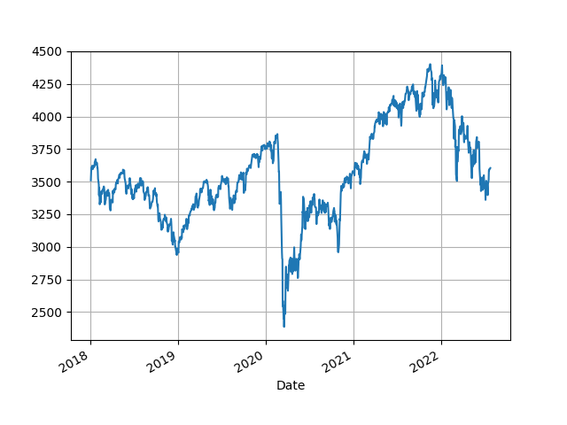

# Week 30 

A MOON-LANDING MOMENT 

Microsoft: "Hydrogen fuel cells could provide emission free backup
power at datacenters.. A round of applause and shouts of joy from
engineers at Plug, who built the fuel cell system... The moment was
the latest milestone on Microsoft’s quest to find a zero-carbon
emissions replacement for the backup diesel-powered generators that
support continuous operations in the event of power outages and other
service disruptions.

'What we just witnessed was, for the datacenter industry, a moon
landing moment,” said Sean James, Microsoft’s director of datacenter
research. “We have a generator that produces no emissions. It’s
mind-blowing.'"

---

Manchin FTW. Give credit where it's due.

Recharge: "US green hydrogen would become world's cheapest form of H2
under tax-credit plan in new Manchin-approved bill.. Producers would
receive up to $3 per kg — depending on level of lifecycle greenhouse
gas emissions and staff wages — if Inflation Reduction Act clears
Congress

The surprise breakthrough tax and climate bill agreed yesterday by
maverick coal-state Democratic senator Joe Manchin and Senate majority
leader Chuck Schumer includes generous tax credits that would make
green hydrogen cheaper to produce than grey in many parts of the US"

---

H2 Fuel News: "GenCell Energy, the leading provider of hydrogen and
ammonia to power fuel cell solutions.. announces entering a strategic
partnership with the ONEC pGrnoup, a mid-sized Canadian project
delivery company.. to Grow Presence in North America"

---

H2 Central: "GTT has been granted two Approvals in Principle (AIP1)
from the leading classification society DNV for the design of a
membrane type containment system for liquefied hydrogen (LH2) and for
the preliminary concept design of a LH2 carrier.

These approvals are part of the agreement with Shell, announced in
February 2022, and pave the way for the next stages of the project"

---

H2 Central: "ATOME Energy Signs Up FEED Contractor for Villeta
Project, 400MW Green Hydrogen and Ammonia Projects"

---

H2 Central: "Zara founder Amancio Ortega acquired a stake in Enagas
SA’s renewable energy unit as the textile billionaire bets on new
types of energy... Ortega’s family office Pontegadea bought 5% of the
Enagas Renovable unit for an undisclosed amount, Madrid-based Enagas
said in a press statement on Wednesday"

---

"The maximum hydrogen yield was 122 mL/g at 700 W..  the thermal
reduction process took only 4 min". Ok..

---

Microwave oven based thermochemical water splitting paper says "at 700
W, a temperature of 600 Celcius could be reached.. At this power, the
highest oxygen and hydrogen yields were [obtained]". 700 W is not a
crazy number.

[[-]](https://www.mdpi.com/1996-1073/15/9/3044/pdf)

---

Add to that the limited reserves of lithium, the problem with battery
electric approach becomes clearer.. This tech was nothing but a fad
triggered by few uninformed administrations, faux genius jackoff CEOs,
and mainstream media who is too fucking dumb to seperate the wheat
from the chaff. 

"@GregKable

We need to be talking about this

- Atacama salt flat (Chile) claimed to hold 27% of global lithium reserves

- IER report: 2.27 million litres of water required to extract 1 ton of lithium

- average annual rainfall: 2mm

- Atacama water table losing 1950 liters/second"

---

"@DWV_H2

'…. and taking into account that we have to import the vast majority
of #energy for #mobility, the real advantage of FCEVs becomes
apparent: higher efficiency, fast refueling, cheaper infrastructure,
security of supply 24/7!'"

[[-]](https://twitter.com/BioWouter/status/1552261590673760256)

---

"@JoSamps92

@DaimlerTruck continues to develop its hydrogen-based drives with an
announcement on July 27 revealing plans to test a Mercedes-Benz GenH2
Truck fuelled with liquid hydrogen"

---

\#apple \#fuelcell \#2020

[[-]](https://www.techradar.com/news/apple-patent-hydrogen-fuel-cell-macbook-ipad)

---

Big claim - great if true

"ThorCon generates reliable electric power cheaper than coal,
competitive with natural gas, cheaper than LNG, cheaper than
storage-buffered wind and solar"

[[-]](https://thorconpower.com/economics/)

---

"ThorCon is a molten salt fission reactor. Unlike all current nuclear
reactors, the fuel is in liquid form. It can be moved around with a
pump, and passively drained in the event of a casualty.ThorCon’s
reactor operates at about the same pressure as your garden
hose. Standard nuclear reactors operate at up to 160 bar (2300
psi). They require 9 inch thick pressure vessels and massive piping..
The pump takes liquid fuelsalt — a mixture of sodium, beryllium,
uranium and thorium fluorides"

[[-]](https://thorconpower.com/design/#fission-island)

---

Gasoline prices are falling

```
2022-07-25  4.440
```

---

Sharknado is the one where they arrive inside a hurricane 

---

Sharktopus

These are all real movies.. Eric Roberts played in this one

---

Sharkula.. Sharknado.. Sharkenstein

One day I'll sit down and watch all in order

---

Jurassic Shark! **Aqua**pocalypse 😂 

---

"@olexandr

geometric deep-learning that does fast molecular docking is the
biggest scam since Theranos"

---

For admin "R word" sounds bad.. For the FED one reason to play down
recession cld be not wanting to be pressured into lowering before
inflation goes lower.

---

Two GDP contractions in a row.. But let's not use the R word

```
2022-01-01   -1.573400
2022-04-01   -0.934183
```

---

2020 has been surpassed already

"@IrenaBuzarewicz

2022"

[[-]](https://twitter.com/IrenaBuzarewicz/status/1552518376844664835)

---

Not directly addressing UKR-RU issue here.. Theirs is a
multidimensional beef. But UKR arming itself before the war surely
bothered Russia.

Get arms fine obv as long as can deliver the ass-kicking that goes
along with it, but that didn't happen.

---

Customer churn analysis has these type of problems..  Tough to pin
down what churn is. Two months of non-activity considered churn? Maybe
the guy will be back after 65th day..? Maybe he was on vacation. One
approach I saw formulates the reverse (surv analysis), try to predict
how long 'not churn' will last. Then can ask the model for a
probability of certain 'not churn' period ahead, apply cutoff,
threshold on that.

---

How to prove that from data..? Data would have armament levels of both
sides over the years, plus whether they fought a war.. But how about
armaments which did *not* result in war..?

'Not war' is hard to pick from the data. If left out will introduce
(survivorship) bias. We see in data what we *can* see, not what is
actully happening.

"There is something called the security dilemma one side arming can
cause another to arm, we can prove it"

---

<blockquote class="twitter-tweet"><p lang="en" dir="ltr">Goodbye E-cars: BMW Wants to Mass-Produce Hydrogen Cars <a href="https://t.co/C6OnEFBilM">https://t.co/C6OnEFBilM</a></p>&mdash; Kevin Morgan (@KevinMo95499403) <a href="https://twitter.com/KevinMo95499403/status/1552561038775799809?ref_src=twsrc%5Etfw">July 28, 2022</a></blockquote> <script async src="https://platform.twitter.com/widgets.js" charset="utf-8"></script>

---

H2 Central: "World’s eyes on Whyalla [Oz] as 60 companies bid for
green hydrogen plant work. Whyalla’s $593 million green hydrogen plant
is putting the town on the global map"

---

H2 Central: "[SA] Minister of Energy..  met..  Monday with Thailand
Deputy Prime Minister and Minister of Energy..  and his accompanying
delegation. During the meeting, they discussed aspects of cooperation
between the two friendly countries in the fields of energy, including:
petroleum refining, renewable energy and clean hydrogen"

---

Electricity is partially suitable as the *last* step in the energy
chain, not the first nor the middle. It can be generated close to its
consumers, through fuel-cells.. But since its storage and transmisson
is too inefficient, its usage as the centerpiece of an energy system
is problematic.

---

👍 👍 👍 

"@SunHydrogenInc

SunHydrogen’s nanoparticle technology directly uses. sunlight to
generate hydrogen – no grid power or costly power electronics
required"

---

It's a matter of existing infrastructure, know-how. But go ahead,
electrolyze, or just as good, let's develop [thermochemical water splitting](../../2022/02/h2-thermo-chemical.html).
Especially [molten salt reactors](../../2022/02/h2-thermo-chemical.html#thorium)
have promise in this area (uses thorium, the waste product is better manageable).

"But there is already H atoms inside water? Why bother with hydrocarbons"

---

That could produce 3.5 GW equivalent of H2.. A big solar plant
level. From f-ing corn.. Hey, I'll take it.

---

Ethanol production is very little but highest in US compared to
some other countries.

```python
import util; util.country_bp("US")
```

```text
             Year
wind_twh     2021     1.654620
solar_twh    2021     0.713243
nuclear_twh  2021     3.533104
hydro_twh    2021     1.111511
oil_twh      2021    42.327231
gas_twh      2021    35.659344
coal_twh     2021    12.666405
biogeo_twh   2021     0.989210
ethanol_twh  2021     1.345333
dtype: float64

Production As Percentage of Consumption

     Perc Commodity
0  104.87       Oil
1  113.00       Gas
2  110.18      Coal

Total

2646.55 GW
```

---

- "CAPER achieves process intensified hydrogen production from ethanol.

- High-pressure H2 is electrochemically produced at low temperatures and voltages.

- CO2 is captured within the caustic electrolyte for a carbon-neutral process.

- 100% Faraday efficiency and pure H2 in the gas phase is achieved"

[Paper](https://www.sciencedirect.com/science/article/abs/pii/S0926860X22001703)

---

Ethanol is produced in US mostly from corn AFAIK

"CAPER .. [process] converts aqueous-phase ethanol into high-purity,
high-pressure hydrogen. This technique is sustainable because the
caustic electrolyte solution captures and processes any greenhouse gas
emissions"

---

H2 Central: "Romania Endorses Procurement of Twelve Hydrogen Trains"

---

Brian Bennet - Boogie Juice \#music

[[-]](https://youtu.be/V9HcjhfVKnU)

---

"@H2Europe

As a result of a collaboration among @SSAB, @LKABgroup &
@VattenfallGroup, the @hybrit_project represents a complete industrial
value chain for fossil-free hydrogen-based iron and steelmaking"

---

Some articles on crude oil gasification -
[paper](https://www.tandfonline.com/doi/abs/10.1080/10916466.2016.1255643),
[paper](https://www.researchgate.net/publication/328087957_Modeling_crude_oil_gasification),
[paper](https://www.researchgate.net/publication/320261146_Kinetic_modeling_of_crude_oil_gasification_for_hydrogen_production_with_in_situ_CO_2_capture).
This method is less widely used though compared to coal and natgas. Still,
for countries who want to pursue it, there it is. 

---

Politico: "Senate Majority Leader Chuck Schumer and Sen. Joe Manchin
salvaged a deal on Wednesday for a bill.. devoting hundreds of
billions of dollars to clean energy technologies...

The figure is roughly in line with funding levels discussed earlier in
July among Senate Democrats that called for about $300 billion in tax
credits for a slate of clean energy technologies, including solar and
wind power, energy storage, carbon capture, hydrogen and small-scale
nuclear power"

---

"@DanPriceSeattle

So a $700 billion bailout for the banks, an 80 billion bailout for the
auto industry, a 50 billion bailout for the airlines and a 3 trillion
dollar Fed bailout for the stock market are all "capitalism" but
unemployment checks are 'socialism?'"

---

Some could argue the existing system turned the world into a
basketcase, creating pollution, environment disasters, and encouraging
material extraction beyond the carrying capacity of Earth, while still
not being able to beat global poverty. 

"But the existing system brought us much dynamism"

---

Surely wage decrease sounds bad.. this is how the mechanism works
though - sadly.  That's the reason I advocate new money entering the
economy through people rather than businesses.

---

Certain MSM narrative is "if interest rates rise, spending decreases,
because people borrow to spend". That is not the primary driver of
price levels. The major transmission mechanism (though crude) is
through businesses borrowing and expanding less, so wages and spending
decrease, causing a decrease in prices.

---

"@QuincyInst

Good.

'Axios.com: Blinken to speak to Russia's Lavrov for first time since
Ukraine invasion'"

---

Can't we, like have another Twitter Revolution and fix all that? 😶

Al Monitor: "Tunisia has approved a new constitution that critics say
cements [the sitting President's] one-man rule and reverses hard-won
democratic gains in the country that birthed the Arab Spring"

---

Al Monitor: "Pro-Sadr protesters storm [the Iraqi] parliament.. Sadr's
bloc won 73 seats in.. 2021 election, making it the largest faction in
the 329-seat parliament. But since the vote, talks to form a new
government have stalled. The oil-rich country remains mired in a
political and a socioeconomic crisis, despite elevated global oil
prices"

---

H2 Fuel News: "Universal Hydrogen and Avmax announce hydrogen fuel
aircraft deal"

---

H2 Central: "Lower Saxony’s Environment Minister Olaf presented the
funding notification of €2.375 million for Uniper’s planned hydrogen
pilot project at the Krummhoern natural gas storage site [for reusing
it on H2]...

Uniper Energy Storage will test the construction and operation of a
new salt cavern specifically built for hydrogen storage on a large
scale and in a real-world environment at the natural gas storage
facility in Krummhoern, Northern Germany"

---

NTT is the third largest company of Japan in market cap.

H2 Central: "[Japanese] NTT.. announced a joint research and
development project to study safety measures for the mass
transportation of hydrogen through existing pipeline infrastructure.

---

"UK hydrogen pipeline project receives Government funding.. SPS has
revealed it plans to begin feasibility work with Smartflow Couplings
at SPS’ site in East Heslerton, North Yorkshire to support the switch
from natural gas to hydrogen"
     
---

"@KeithDPatch · Air Products.. new ESG goals include converting its
fleet of ≈2,000 trucks to hydrogen!"

---

H2 View: "South Australian Government announces global interest for
its A$593m hydrogen jobs plan"

---

Let's do green H2, sure, but priority IMO can be the more available
resource; natgas and coal.

---

EU usage nears US level; granted even a massive Russia pipeline cannot
take care all of that, but it still beats not having that input.

---

Total European energy usage

```python
_,_,tot = util.get_bp_country("Total Europe")
np.round(tot*1000 / (365*24),2),'GW'
```

```text
Out[1]: (2103.05, 'GW')
```

---

This electrification business is a complete racket. Fish bait for
idiots.

---

Lithium? You have to drive the electric car for two years before it
offsets the CO2 emitted while digging up, preparing its lithium. And
that's just the lithium. 

---

Natgas emissions 400 g CO2 / kWh. After 95% capture (which can
actually go even higher for natgas) the result is 20 g CO2 / kwh which
makes it nearly twice better than solar panels.

---

How to compare CO2 emissions from solar (yes there is some) vs fossil taking
into account the entire lifetime? [This paper](https://onlinelibrary.wiley.com/doi/pdf/10.1111/j.1530-9290.2011.00439.x)
puts that value at around 55 g / kwh thorughout the lifetime of a solar panel
(there is massive carbon emitted while producing the panel).

For coal that value is 1011 g CO2 / kWh. But once CCS is factored in,
assuming 95% is captured, lifetime emission of coal falls to 50 g /
kwh. Meaning, coal + CCS is cleaner than solar panels. 

---

Simulation is done with a software called Aspen Plus. Click and the
plant would calculate its internal parameters.. Fantastic.

I've seen a few books that use direct Python programming too which
obviously jives with my toolset.

---

[Link](twimg/FYnxj9BXgAI8kqb.png)

---

The professor I talked to on Coal-CCS sent me bunch of links, among
them is an industrial plant simulation file for blue hydrogen
production. The tech exists.

---

I bet this guy mixed up electricity with total energy like most of his
white-collar electric-loving dipshit brethren.

---

Norway's renewable energy comprises 50% of is consumption. But even if
they didn't have that, NW has huge oil and gas reserves.

---

He is full of shit

```python
import util; util.country_bp("Norway")
```

```text
             Year
wind_twh     2021     3.770902
solar_twh    2021     0.063139
nuclear_twh  2021     0.000000
hydro_twh    2021    45.855275
oil_twh      2021    33.651383
gas_twh      2021    13.727958
coal_twh     2021     2.931343
dtype: float64

Production As Percentage of Consumption

      Perc Commodity
0  1196.47       Oil
1  2668.60       Gas
2     0.00      Coal

Total

35.62 GW
```

---

I bet this guy is full of shit

"@ErikSolheim.. 

[Norway is] almost entirely powered by renewable energy"

---

Sad and hilarious in a way

Al Jazeera: "South Africa calls for Israel to be declared an ‘apartheid state’"

---

"@eidsuleman

Demolition of Palestinian house in Um Qusah"

[[-]](https://twitter.com/eidsuleman/status/1551537342032273417)

---

"@DalrympleWill

British wine wholesaler ‘leaves Brexitland for good’ over
paperwork.. Daniel Lambert, who supplies M&S, Waitrose and 300
independent retailers, to set up in France after £150,000 hole in
revenue"

---

I'm not sure why Ukraine MPs input matters, they are not part of NATO
(hence the pickle they are in). Right on a likely French veto.. If the
trouble triggered by UK/US meddling is any guide, a new head from an
outer alliance country would cause nothing but more trouble, would be
against the interests of Europe, France.

---

That would be hilarious..

"Boris Johnson tipped to become next secretary general of
Nato.. Ukrainian and Tory MPs support idea of PM being a possible
candidate, though sceptics suggest he would likely be greeted with a
French veto"

---

Euro News: "Taipei to stage street evacuation air raid dril"

---

Hopefully the RU debacle strengthens parties not antagonistic toward
Russia going forward... I remember in one German debate before last
election Janine Wissler from Die Linke said some supportive words in
that vein and boy, was she gazed upon as some kind of freak weirdo by
most others in that panel.

---

Davis: "[In Ukraine] Most Likely Scenario (Collapse of Western
Support).. Without remarkable levels of financial and military support
from Western countries, Russia might well have conquered far more
territory, and far faster, than it already has. Moscow might have even
forced an end-of-war settlement on Kyiv by now...

Most Western countries have a reflexive opposition to Russia. They
regard Moscow’s invasion of Ukraine with a combination of anger, fear,
and for some, hatred. All Western governments believe that Moscow’s
invasion was illegal and unjustified, and they want Putin to fail. But
each nation is also primarily concerned about its own national
security and interests. That self-interest balances their desire for
Russian failure. They do not want their support to cross a line and
draw them into conflict with Russia...

An additional and often overlooked factor is that some Western
governments view the threat of a conventional attack from Moscow to be
negligible. They have given minimal support – enough to be seen as
“doing something,” yet not enough to risk harming their own militaries
or their own economies, or to risk being dragged into the conflict
themselves...

Already the economies of the West are showing signs that a recession
is coming. In part as a result of massive sanctions levied on Russia,
gasoline prices have risen to historic highs, global food supplies
have risen to near crisis-levels (raising the price of nearly all
groceries), and inflation in the U.S. and UK remains at a four-decade
high. But the gas situation in Europe may prove to be the trigger for
a retrenchment of Western support to Ukraine..

The populations of Germany, Italy, France, Spain, and other Western
European nations, however, recognize there is effectively *no*
conventional threat to them from Moscow. Why, they will begin asking
with increasing stridency, should they sacrifice their own economic
security, struggle to put food on their tables, and scramble to heat
their homes during winter so that their governments can support
Ukraine in a war that is not necessary for European security?..

[[-]](https://www.19fortyfive.com/2022/07/the-ukraine-war-could-end-with-western-discontent/)

---

Actually according to analysis Russia did not structure its modern
military assuming it will always have air superiority, quite the
reverse. They watched Desert Storm, and other US, NATO interventions,
the lessons they learned from that was air superiority is not
guaranteed, hence the investment in air defense, the most notable
being the S-series SAM tech.

---

"ZeroAvia hydrogen aviation gains $30 million in additional
funding.. Investors include the International Airlines Group,
Barclays, NEOM and the AENU"

---

H2 Central: "Serbia, Hungary sign Memorandum of understanding [on
H2. Hungarian MP] said that the field for which the Memorandum was
signed today include.. issues such as production, storage and
transport of hydrogen, and that Hungary, which already has some
experience, is ready to share with Serbia its strategies, regulations,
investment plans and projects"

---

H2 Fuel News: "Johnson Matthey (JM) a sustainable technologies leader,
has announced that it will be building an £80 million hydrogen
gigafactory at the firm’s existing Royston, UK site... Earlier in
2022, JM announced a new strategy for the purpose of being the “market
leader in performance components for fuel cells and electrolysers,”
focusing on over £200 million sales in H2 tech by the close of the
2024/2025 fiscal year.

---

CNBC: "Toyota plans to roll out hydrogen fuel-cell trucks for the
Japanese market next year"

---

"@Fuelcellbus

Bratislava's public transport operator, @dpbratislava , will be the
first to operate a fleet of hydrogen-powered buses in Slovakia!"

---

Gasworld: "Air Products will spend or commit at least $4bn in
additional new capital to support the clean energy transition over the
next five years, bringing its total commitment to first-mover projects
to 15bn by 2027. The industrial gas company made the pledge as part of
its newly published ‘Third by 30’ carbon dioxide (CO2) emissions
intensity goal for Scope 3 emissions, an addition to its existing
Scope 1 and 2 goal to reach Net Zero from its operations by 2050.

In order to reach its ambitious targets, Air Products has identified
tangible transition plans for new investments and modifications of
existing company assets, including low- and zero- carbon hydrogen and
carbon capture technologies"

---

"@BallardPwr

A report by global engineering design and consulting firm Arcadis
shows that hydrogen is both cheaper and more efficient than using
diesel to power trains along the proposed Melbourne to Brisbane Inland
Rail route"

---

70kW \#hydrogen #fuelcell mobile generator on @netflix film set

<blockquote class="twitter-tweet"><p lang="fr" dir="ltr">🇨🇵 Avec <a href="https://twitter.com/hashtag/Netflix?src=hash&amp;ref_src=twsrc%5Etfw">#Netflix</a>, l&#39;<a href="https://twitter.com/hashtag/hydrog%C3%A8ne?src=hash&amp;ref_src=twsrc%5Etfw">#hydrogène</a> fait son cinéma.🎬 ⤵️<a href="https://t.co/fhJKEh4BDq">https://t.co/fhJKEh4BDq</a></p>&mdash; Corinne Bordry (@Corinne_Bordry) <a href="https://twitter.com/Corinne_Bordry/status/1551235940185686016?ref_src=twsrc%5Etfw">July 24, 2022</a></blockquote> <script async src="https://platform.twitter.com/widgets.js" charset="utf-8"></script>

---

That guy was an official in some government I didn't catch which. He
has wrong info. Sad.

---

Not true. **Over 90%** of energy produced is fossil based.

"2/3 of energy produced in the world is fossil-fuel based"

---

More is needed here.

IEA: "Currently, two large‑scale CCUS facilities operate in the power
sector, the Petra Nova Carbon Capture project and the Boundary Dam
Carbon Capture project"

---

Lessons are clear. Don't make movies cuck, don't mess with the story
for some bizarre agenda, have a good story and directing, and wait for
the cashier go ka-ching!

CNBC: "Top Gun: Maverick nears $1.3 billion worldwide"

---

Whatitdo Archive Group - Blood Chief \#music

[[-]](https://youtu.be/qCS4pEhEDEQ)

---

:) Wild

"[The computer game] Doom can now be played inside another copy of Doom"

[[-]](https://www.ruetir.com/2022/07/13/doom-can-now-be-played-inside-another-copy-of-doom/)

---

Reddit: "Shatner Says Star Trek Creator [Roddenberry] Would Be
Spinning in His Grave Over the Modern Franchise"

---

[Lumbeeeeer](../../2022/01/energstats.html#lumber)

---

Interesting.. I'll be watching

"@philrosenn

LUMBER prices are set for a shakeup as a new type of futures contracts
rolls out - and a top broker.. says trading volume could soar 10x📊"

---

Obviously energy is the other cruicial input to an economy.. Without
it nothing works.

---

De-globalize. De-electrify. Hate to be the bearer of "bad news".. but
MSM has been feeding people lies, faux dreams.

---

Take Germany. Their numerous *Mittelstand* the small-to-mid size
businesses represent the depth of that type of knowledge. There will
be one obscure guy producing some funky valve that noone in the world
produces. And guess what, he finds customers and can charge top dollar
(or euros). Further innovation builds on top of this diversity, if you
want to build a clean-fuel combustion engine, chances are you will
find the parts, the know-how associated with the subcomponents of that
engine.

Producing a piece, any piece of a "globalized supply chain" doesn't
necessarily get you there. Producing the cap of Coke bottles makes
country part of the supply chain but won't provide much deep
knowledge.

---

As [Hidalgo](../../0119/2017/08/economic-complexity-hidalgo.html) proved,
know-how is what makes economies tick and countries to advance (not
necessarily "education" which doesn't always translate into actionable
knowledge). Hidalgo measures this through the diversity of products a
country produces, which is a sign of the depth of a country's
actionable skillset.

---

If China has a crisis, it will hurt for sure, but afterwards they will
still have their know-how. They built up a lot of that over the years.

---

CNBC: "Natural gas hits highest level since 2008, on pace for best
month ever as Russia cuts supply"

---

NYT: "As Ukraine Signs Up Soldiers, Questions Arise About How It
Chooses.. Recruiters approach young men on the street, but the
standards are not always clear"

---

Davis: "It would take a country the size of Ukraine the better part of
a decade and a massive level of support from friendly nations to
recover from the devastation the Ukraine military has already
suffered. The idea that the UAF – or the armed forces of any nation on
earth – can recover from the level of destruction they’ve suffered to
date and rebuild the strength necessary to drive an invader out while
at the same time fighting an existential battle, is flatly
unrealistic.

Russia continues to take severe losses itself. Putin’s forces are not
immune to the consequences of losing trained and experienced
personnel, but as previously noted, Russia has millions more men from
which to draw new conscripts and hundreds of thousands of other active
troops that can be repurposed to ground combat. It is by no means
guaranteed that Russia would be able to achieve total victory over
Ukraine, but the fundamentals are present to give the idea some chance
of success. For Ukraine, however, there is minuscule chance of winning
and a higher probability of failure if they try to launch an
offensive.

An unemotional assessment of this war would lead to the conclusion
that the Ukrainian political leadership should seek the
best-negotiated settlement it could get now, while it still has
complete control of Kharkiv, Odesa, and most of Donetsk Oblast – and
before another significant city is turned to rubble and tens of
thousands more of its citizens killed or wounded"

[[-]](https://www.19fortyfive.com/2022/07/the-dark-scenario-ukraines-military-cant-beat-russia-and-collapses/)

---

Al Jazeera: "Hungary’s Orban says EU sanctions on Russia have
failed.. 'A new strategy is needed which should focus peace talks and
drafting a good peace proposal … instead of winning the war,' Orban
said in a speech in Romania on Saturday... Orban said this strategy
has failed as governments in Europe are collapsing 'like dominoes',
energy prices have surged and a new strategy was needed now. He said
Ukraine will never win the war this way 'quite simply because the
Russian army has assymetrical dominance'.

Orban called for Russia and the United States to hold negotiations to
bring about an end to the war... He said 'only Russian-US talks can
put an end to the conflict because Russia wants security guarantees'
only Washington can give"

[[-]](https://www.aljazeera.com/news/2022/7/23/hungarys-orban-says-eu-sanctions-on-russia-have-failed)

---

Building >100 solar farms in time..?  Or dozens of Fukushima level
nuclear plants? That is a tall order.

---

Europe could have 130 GW of power with the flick of a switch, instead
it will now have <15% GW.

---

The market is smelling blood in the water.. European Stock Market
Futures Eurostoxx is down since the start of the UKR-RU war.

```python
import util; df = util.get_yahoofin(2018, "^STOXX50E"); df.plot(grid=True);
```



---

F24: "Fresh Russian gas cuts threaten economic pain in
Europe.. Russian energy giant Gazprom on Monday said gas flows to
Germany through the Nord Stream 1 pipeline would fall to 33 million
cubic metres (MCM) per day from Wednesday, down from its full capacity
of more than 160 MCM per day"

---


Trump 🔥 🔥 🔥 

[[-]](ejagofftrump.jpeg)

---

FT: "In the US, the ‘real money’ is still betting on blue [H2]"

---

Silicon production, solar panels.

[[-]](../../2022/06/the-end-of-the-world-is-just-the-beginning-zeihan.html#silicon)

---

For countries, esp. developing, focusing on Coal-H2+CCS route makes
sense; most countries have coal, no problem securing supply. Can scale
output up and down wout being restricted by land availability,
panels. The rest would be perfecting the chemistry, optimizing
industrial processes.

---

CCUS, H2 generation, there are known processes for stuff. Coal is
plentiful. What's the holdup?

---

Post on Coal

[[-]](../../2022/02/h2-coal.html)

---

Collated info on carbon capture.

[[-]](../../2022/02/h2-co2-capture.html)

---

Asked a prof if coal-methane then H2 is doable, says coal-syngas is
easier.

"[T]hrough gasification (H2 + CO), then water gas shift
(H2O + CO --> H2 + CO2) so then what you have at the end is H2 + CO2.
You can either capture the CO2 with an amine leaving H2 with some CO2 in it,
or you use pressure swing adsorption to capture H2 at high purity, leaving
CO2 with H2 in it"

---

Holy Coal. China uses a lot of coal. The digging on those mines would
be at insane levels.


```python
import util; util.country_bp("China")
```

```text
             Year
wind_twh     2021     1.684796
solar_twh    2021     0.840342
nuclear_twh  2021     1.047215
hydro_twh    2021     3.340810
oil_twh      2021    21.842706
gas_twh      2021     9.731901
coal_twh     2021    61.512229
dtype: float64

Production As Percentage of Consumption

    Perc Commodity
0  29.16       Oil
1  55.25       Gas
2  98.81      Coal

Total

4442.09 GW
```
---

Let's remember the numbers, Nordstream is 65 GW each, Fukushima (was)
5 GW, the largest solar plant is 2.25GW, 1 GW is considered quite
large for solar, Ghawar oil field output is 269 GW.

---

China consumes a whopping 4998 GW, nearly twice as US does at this
point; makes sense for the world's manufacturer. India has a lot of
people. Japan's usage pretty low for a country its size, I'm guessing
due to energy savings... Germany is at 400 Gigawatts.

---

Energy (all energy) consumption per country (in GW)

Annual TWh consumption is divided by 365*24, gives wattage

[[-]](../../2022/01/energstats.html#primcountry)

---

This is what you get when u index writings of white-collar office
dwelling airbrains who only like their little electric toys and the
plug on the wall.. 

---

I search "coal consumption percentage of energy in germany" Google
answers "As of 2020, around 24% of the **electricity** in the country
is generated from coal." - Bold font is mine.

ELECTRICITY DOES NOT EQUAL ALL ENERGY 

---

Wind and solar is about 6% of their energy consumption. 

```python
import util; util.country_bp("Germany")
```

```text
             Year
wind_twh     2021     4.044645
solar_twh    2021     1.683837
nuclear_twh  2021     2.371118
hydro_twh    2021     0.656353
oil_twh      2021    39.939558
gas_twh      2021    31.109882
coal_twh     2021    20.194607
dtype: float64

Production As Percentage of Consumption

    Perc Commodity
0   0.00       Oil
1   5.01       Gas
2  54.50      Coal

Total

332.19 GW
```

---

I dont think that's true... Checking the BP file

"Germany generates half of its energy through renewables"

---

Producer can send clean fuel over pipes, if natgas is sent it is
converted at the receiving end.

Ammonia is sent via ship, if LNG is used, a plant at the port does the
conversion. #H2

---

In terms of clean energy transition (not necessarily exclusively
renewables based) priority-wise my vote is going gung-ho on blue
H2 + CCUS. Let's convert every bit of CH4 (natgas) into H2
whereever possible.

---

The new CEO is somewhat less for electrification (good), talks abt
e-fuels though that mechanism is tough to streamline.. E-fuels are
synthetic fuels which use carbon through budgeting schemes that makes
fuel 'carbon neutral' (car remains unchanged). 

Let's not forget how these muckers cheated with their emissions before.

---

Who has two middle fingers and happy to hear that news? This guy 🖕😊🖕 

---

😆 😆 😆 F--king Volkswagen

CNBC: "Volkswagen CEO Diess to depart; Porsche boss Blume will lead
the German auto giant"

---

"[03/2021] VW CEO [Diess] says fuel cell cars 'not the answer' to
emissions-free driving"

---

New Sinn Fein PM just said 'hydrogen' on the National Press Club \#Oz

---

"@chenna1985

Any government that doesn't offer free, or at least cheap, and
increased public transport is not serious about combating climate
change"

---

2021 fires increased by a whopping 40% compared to 2020

[[-]](../../2023/01/natdisaster.html#fires)

---

"@DrChrisCombs

WIND TURBINE STRUCK BY LIGHTNING IN TEXAS"

[[-]](https://twitter.com/DrChrisCombs/status/1550635062709964805)

---

The Black Keys - Wild Child \#music

[[-]](https://youtu.be/DbK6v0uSZcE)

---

I saw vids of chefs making the pizza and while they add the sauce they
only referenced the tomatoes, sometimes where they are from, but that
was it.

---

There

"Whereas the pizza sauce I lazily pick up from Trader Joe’s
refrigerator section [is..] loaded with spices, the pizzas in Italy
had very fresh tasting sauce, without much else in them. Could it
really as simple as using crushed tomatoes alone? After a bit more
research, I found that my suspicion was correct"

---

The sauce is only tomatoes IMO, nothing crazy.

---

Neapolitan pizza looks easy to make

---

Lula is looking fine in the polls.. Hopefully he wins and the left is
back in power in Brasil.

---

H2 Central: "[T]he Wyoming Energy Authority has released a roadmap
that outlines the path to building a hydrogen economy in the state...
'Hydrogen’s role as a decarbonized energy carrier with unprecedented
transportation and consumption utility makes this a truly
transformational opportunity for the entire state.'

Hydrogen can be produced from a wide variety of feedstocks – including
coal, natural gas, wind and even nuclear power – bringing the
potential to help sustain the wide variety of Wyoming’s abundant
natural reserves. In addition, hydrogen’s flexible structure can be
converted and transported in various ways, allowing Wyoming to utilize
its existing infrastructure, including an extensive natural gas
transmission system.

Hydrogen can also be added to existing raw low-value energy sources to
significantly increase the resiliency of Wyoming’s value chain and
provide processing opportunities within the state"

---

H2 Central: "While scaling up the production of electrolyser systems is paramount,
the importance of how green hydrogen will be transported cannot be
overstated...

For distances below 1,500km, transporting hydrogen as a gas via
pipeline is “generally the cheapest delivery option”; above 1,500km,
shipping hydrogen as ammonia or an LOHC may be more cost-effective, it
said, citing data from the International Energy Agency’s ‘The Future
of hydrogen – Seizing today’s opportunities’ report"

---

H2 Central: "Humboldt Transit Authority Awarded $38.7 Million Grant to
Buy Fleet of Hydrogen Powered Buses, Enhance Connectivity Across
Northern California"

---

<blockquote class="twitter-tweet"><p lang="en" dir="ltr">California is a global leader in energy innovation thanks to companies like <a href="https://twitter.com/Bloom_Energy?ref_src=twsrc%5Etfw">@Bloom_Energy</a> &amp; their new facility in Fremont is creating hundreds of jobs.<br><br>Our state’s clean and reliable energy future depends on the hard work and innovation of California-bred companies. <a href="https://t.co/edfUV0UhES">pic.twitter.com/edfUV0UhES</a></p>&mdash; Office of the Governor of California (@CAgovernor) <a href="https://twitter.com/CAgovernor/status/1549867050465562624?ref_src=twsrc%5Etfw">July 20, 2022</a></blockquote> <script async src="https://platform.twitter.com/widgets.js" charset="utf-8"></script>

---

The sky cld get even more pink if you smoked their product

Hindustan Times: "Sky turns pink in Australia town, locals think of
aliens. What actually happened.. Locals, fascinated by the phenomenon,
considered outworldly possibilities. But they were fairly disappointed
when it was found to be emerging from a cannabis plant"

---

US needs gun control for the police, and specifically for the
police. That would change their conduct, interactions with the
people.. Right now they are probably confronting every situation while
thinking abt when to pull out a gun.

"Denver police opened fire into a crowd, injuring 6 bystanders, while
going after a suspect who never fired a gun"

---

Baba Vanga predictions.. "a psycic seer" who died 1996.. Two of the
2022 predictions came true apparently, floods and drought. Now let's
assume this psycic truly had some skill, some wires crossed in the
"simulation" and information is leaking and that is what's being
reported...

But the predictions are still open to interpretation. Like one that
said "the Russian city of Kursk would be covered with water and the
whole world will weep over it".  Nothing happened to the city, but the
the Kursk *submarine* sank and 118 military personnel died. So a name
and a general nationality was right, the sinking, the scale is
completely off. How do we treat other predictions now? One mentions
alien invasion, does that simply mean alien signals being confirmed,
or outright invasion? We don't know.

---

"@EmmaMAshford

Hang on. Are we seriously considering precipitating an unnecessary
crisis on Taiwan, at the same time as we’re engaged in a major proxy
war in Europe, and facing down a potential nuclear crisis with Iran? 🤔"

---

Davis: "Bucking Basic (Western) Beliefs: Ukraine is in far worse shape
than portrayed – Ukrainian officials claim their forces are ready to
launch a “million-man offensive” against Russian forces next month,
while retired U.S. generals talk confidently about the war ending on
Ukraine’s terms by the end of this year. But an unemotional and
realistic assessment of the war’s most likely trajectory paints a
different picture...

Ukraine War Scenario Two: Russian Capture of Kharkiv & Odessa.. 

If Kharkiv falls, Ukraine will have even fewer troops left with which
to defend Odessa. If Russia were to mobilize enough men, it is
conceivable that they could invest Odessa even before Kharkiv was
completely captured. But whether simultaneously or sequentially, if
Russia moved on Odessa they would almost certainly employ the same
strategy they’ve used countless times already in this war, surround
the city, cut off its defenders, and then crush the city with
saturating firepower.

If Russia were to successfully take both Kharkiv and Odessa (after
having taken the Donbas before), then Russia would essentially be in
control of all of Ukraine east of the Dnieper River. .. Once the
fighting gets to that point, however, Ukraine will have effectively
lost the war. The chances of it ever regaining any lost territories
would be virtually nil"

[[-]](https://www.19fortyfive.com/2022/07/how-the-ukraine-war-could-end-stalemate-or-russia-captures-kharkiv-and-odessa/)

---
