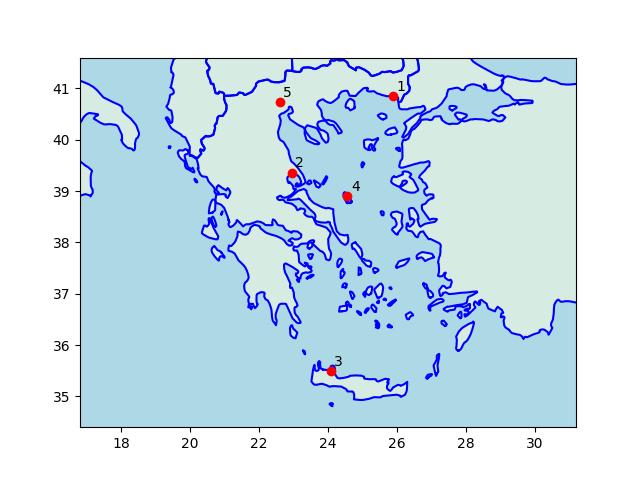

# Week 33 

Express: "Hydrogen will ‘effectively replace fossil fuels’.. according
to a new whitepaper [by H2Accelerate]"

---

Anatolians know the cheese as *tulum peyniri*; it is Romanian in
origin. But hey... what's the difference between Anatolian, Romanian,
Greek - amiright? Amiright? 

---

They bring bryndza cheese as appetizer along with *lavash* at kebab
houses in Anatolia; the cheese is heavy, dry, salty.. Thought can use
it on dried poultry as fat subtitute. Saw the making of this cheese,
they dry the hell out of it, all its water comes out.

---

Dude says we've no need for the dark energy hypothesis

[[-]](../../2022/08/dark-energy.html)

---

"@ISusmelj

.. A great example for how deep learning models struggle with
out-of-distribution data.  I wonder how many carriages the model has
seen during training 😅"

[[-]](https://twitter.com/ISusmelj/status/1558912252119482368)

---

"The rising cost of second-hand vehicles is a consequence of the
semiconductor chip shortage that's been hammering the motor industry
since Covid-19 lockdowns were first a thing. The short supply of chips
has bottlenecked car production, with outputs slumping by more than a
third as manufacturers struggle to get their hands on the much-needed
components. To put the scale of the problem into perspective,
approximately 40 chips of varying capabilities are needed for the
average family motor today, such is the substantial reliance of
electronics in the latest vehicles"

[[-]](https://www.thisismoney.co.uk/money/cars/article-10473767/The-second-hand-cars-soaring-price-cost-new-versions.html)

---

Rhodium Group: "In the central emissions case, the [IRA] bill
accelerates emissions reductions to 40% below 2005 levels in
2030.. Long-term tax credits for carbon capture, direct air capture,
clean hydrogen and clean fuels provide a launch pad for these key
technologies to scale and build on the investments of the IIJA hub and
demonstration programs"

---

*Day Shift*, *Ford vs Ferrari*, *Last Seen Alive*, *Outlaw King*.. all
fine works.

---

Politico: "Buried deep in a recent story about Arizona Republican
Senate candidate Blake Masters is a particularly revealing comment
from one of Masters’ supporters, posted on an exclusive Discord chat:
'How can one man be so based?'. The uninitiated reader might be
forgiven for asking: 'Based on what?'  The word, a slang term with
origins in hip-hop culture, has been adopted in recent years by the
extremely online far right to basically mean 'anything that owns the
libs'.. He and his mentor, Peter Thiel, are fixated on the far-right
pet project of 'dismantling the administrative state,'"

---

Based on grav pull and volume one can show Sun's density is
liquid-like... Then either the Sun is **not** made of plasma, or
everything people know about plasmas are wrong (I am betting on the
former).

Livescience: "Like gases, plasmas have no fixed shape or volume, and
are less dense than solids or liquids"

[[-]](../../2022/04/gaseous-sun.html)

---

This is the thorium based reactor - next gen fission. Build it
generate H2, pipe it.

"Canada-based nuclear reactor developer Terrestrial Energy and Invest
Alberta.. to support commercialisation of.. Generation IV integral
molten salt reactor (IMSR) in western Canada"

---

Lucky Chops NYC \#music

[[-]](https://youtu.be/c9MiGCQf1bY)

---

"@martin_casado

Ran into another startup using their own kit to cut down on cloud
[computing] costs. Their savings are ~40x (!!)"

---

H2 Central: "Hydrogen Technologies, a fully owned subsidiary of JEV,
has patented a breakthrough method for burning hydrogen and oxygen in
a vacuum chamber to create high-temperature water and/or steam with
zero greenhouse gases.. for commercial heating, hot water and
industrial steam boiler applications"

---

"@tom_wilks

Bohemian rhapsody for postdocs:

Is this a real job?

Or more like a PhD?

Caught in short contracts

No chance of stability 

Open your eyes

Look up to PIs and see

I'm just a postdoc 

I get no sympathy

Because I'm easy come, easy go

Stress is high

Pay is low"

---

"@EricHolthaus

The worst climate disaster in the world right now is in Eastern
Africa, where nearly 20,000,000 people are going hungry because of the
worst drought in a generation.. Four rainy seasons in a row have
failed. A fifth failure seems likely"

---

A small buthane canister will generate medium level flame continuously
for *5 hours*. 

---

I've never seen a camper with a battery stove. That tells you something.

---

Climate change causes other mishaps, different matter

---

30-35 C temp indoors is comfortable, not a big deal.. The problem is
outdoors, pavements, per below. Temp measurements are taken in the
shade. Where sun *falls* on pavement is at a higher / temperature,
higher than that day's temperature. This is the root of the hellish
experiences, especially in cities. And.. most of our cities are just
bloody pavement right?

---

Good point

"Shade doesn't actually make temperatures cooler. Rather, being in
direct sunlight and solar radiation makes the air feel 10 to 15
degrees warmer than it actually is, said.. a retired weather service
meteorologist. 'So, conversely, it would feel that much cooler in the
shade,' he said. Similarly, when the  ocean breeze comes up,
temperatures will feel 4 to 5 degrees cooler, particularly if you've
been sweating. And if you're looking for yet another means to buffer
the outside heat, find some grass. It will feel a few degrees cooler
than the heat rising off of pavement"

[[-]](https://www.sun-sentinel.com/news/fl-xpm-2013-07-07-fl-shady-breezy-temps-20130706-story.html)

---

Poultry production causes less greenhouse gases, it has less iron
(good) and just as nutrituous as beef - plus cheaper.

---

Subsidies are absolutely fine. Gov can guide econ towards the
production of that food. Free markets by themselves are not enough.

---

Gobble gobble gov subsidizing 75% of gobble gobble farms for capacity
over 7000? Interesting.. The bird grows in half a year, so 14,000
birds a year, markets sell a kilo for 6 USD, say farms sell it for 3
USD a piece, 7000 x 2 x 4 x 3 = 168000 USD per year, since costs are
mostly subsidized, cld leave over 120K USD after subtracting costs..
Not bad for a farmer.

---

"Mongolian way of cutting watermelon"

[[-]](https://imgur.com/k8SSQkh)

---

*12 Strong* 👍. The Afghani Gen Dostum character foretells what would
eventually follow with US in AFG.

---

Bloomberg: "Saudi Aramco plans to begin permanently storing carbon
dioxide from 2026 in one of the largest facilities of its kind, as the
state oil giant seeks to reach its goal of net-zero emissions by
2050...  The project is part of Aramco’s larger vision to become a
leader in producing hydrogen, a gas seen as key to the global energy
transition since it produces zero emissions when burned"

---

"[Karl John Friston] offers a heuristic proof (and simulations of a
primordial soup) suggesting that life—or biological
self-organization—is an inevitable and emergent property of any
(weakly mixing) random dynamical system that possesses a Markov
blanket"

[[-]](https://youtu.be/rmkjnfMvjv4?t=163)

---

"Science magazine has an article.. Ordinary computers can beat
Google’s quantum computer after all... The very short summary is that
by now classical algorithms are ten orders of magnitude faster than
those used in the Google paper and hence the [quantum comp] speed-up
is ten orders of magnitude lower than Google’s fantastic claims"

[[-]](https://gilkalai.wordpress.com/2022/08/06/ordinary-computers-can-beat-googles-quantum-computer-after-all/)

---

Professional identity..  They shouldn't have any.. self-guided
material plus video lectures can replace them.

The Mandarin: "Why a move to outsource lesson planning has [Oz] NSW
teachers hopping mad.. state’s education minister.. announced teachers
will be given curriculum lesson plans, texts and learning materials to
ease the pressure on their workloads.. This taps into existing
concerns about.. teachers having less autonomy over what to teach and
how to teach it. It also strikes at the heart of teachers’ core
professional identity"

---

When expecting a crisis people rush to safe assets like treasury bonds
raising their price and lowering its yield - which foretells an
environment when FED rate will be lower due to crisis. It's fitting
how that works out.

"@DiMartinoBooth

Mike Howell @crossbordercap gives explanations for low term premium on
10-yr Treasury:

* There’s a big recession coming (so people are desperate for safe assets).

* Shortage of collateral in the system (so people pay up for long bonds)"

---

Missiles:

Ballistic, after one an initial push, travels in an arc.

Cruise can propel itself with an engine throughout the whole trip, can
fly very close, parallel to the ground. Cruise would be harder to
detect and defend against.

---

3 km of pipeline material, as sealed off small pieces underground can
store 30 tonnes of H2 which equals to 12x3000x33.6/1e3 = 1206 MWh.
Easy to procure - manufactured already for regular gas networks. A
large, expensive battery installation is at 900 MWh made from lithium
whose mining destroys the environment and cannot easily be
recycled. There isn't even a comparison here.

---

One side of the East Med alliance is France, Greece, Israel, Cyprus,
Egypt, Saudi Arabia, the UAE and **US of A**. Quite a list.

---

Germany to sell 214's to Anatolia? France is building battleships for
Greece, DE is helping out TR. What is the EU policy?

---

Note: Greece already has this type of sub.

"[Greek FM Dendias].. expressed Athens’ concerns about the exports of
German armaments, especially that of the 214-type submarines, to
Turkey, stressing that these submarines risk changing the balance of
power in the Eastern Mediterranean"

---

```python
import util
cs = ['alexandroupoli','volos','souda','skyros','chalkidona']
util.sm_plot_cities(38,24,0.8,"greece",cs)
```



---

US blob never lets a rivalry go to waste, esp. if RU can be involved
somehow.. Greece was courted for US mil presence, there is now the
Alexandroupoli port deploy, right near Dardanelles, there is Volos,
Skyros, Chalkidona. US was already present in Souda (Crete), one
report says now there are plans for a second base. 'merica
everywhere. Like Coca-Cola.

---

Some left-over posts here.. the break continues

---
