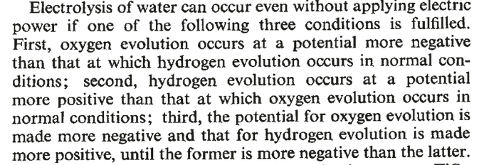

# Week 35 

Fortune: "Before ‘quiet quitting’ in the U.S., there was ‘lying flat’
in China. How the anti-work movement swept the world’s two largest
economies..

A world apart, 'lying flat' and 'quiet quitting' have sprouted
parallel passive resistance movements among young people in the
world’s top two economies, flouting assumptions that Gen Z will work
just as hard as previous generations.

Individual followers of the movements have their own motivations—from
pandemic-era burnout to existential dread—but a shared sense economic
defeatism is binding them together as they confront critics and defy
workaholic cultures in China and the U.S."

---

"@AssalRad

The US will give $1 billion to Israel for a possible war with Iran
that Americans don’t want. Meanwhile, Americans in Jackson,
Mississippi don’t have clean *water*"

---

At once both naive and shady.. those merry band of mucksuckers around
him are all the same way..

---

You just left the man high and dry, Focker? What kind of political
approach is this?

WaPo: "Mitch McConnell called Peter Thiel, the billionaire investor
who had pumped $15 million into a super PAC backing Vance, to
congratulate him but also to make a request: Since McConnell’s
resources were limited, the senator said, would Thiel continue to
finance Vance through the general election? Thiel demurred"

---

[Link](https://drive.google.com/uc?export=view&id=1AnRZ8_06oaRP-A2PjNLzUNXzzbEy2pLt)

---

Why did boomers retire early? Once covid hit they probably said "I'm
old, it's not worth risking it by increasing exposure by going to
work, so I'll just retire a few years early". 

---

CNN: "Zuck is betting the future of his half-a-trillion-dollar
company, Meta, on a vision of the future in which all of us spend more
time in a virtual space known as the metaverse.. The trouble is,
everything we've seen of that future so far looks lame as hell. 'It's
genuinely puzzling that Meta spent more than $10 billion on VR last
year and the graphics in its flagship app still look worse than a 2008
Wii game,' tweeted New York Times tech columnist Kevin Roose"

---

H2 Fuel News: "Why are fuel cell buses becoming so popular in public
transportation?.. For many routes, [HFC] buses have proven to have
considerable performance advantage over battery electrics, becoming
the top choice for the replacement of traditional diesel models. Among
the reasons for this included the advantages of zero-emission
operations without sacrificing schedules, routes or existing functions
at depots. H2 offers longer range and faster fueling than batteries"

---

Culture differences can rub the yankees the wrong way, the American is
full of dreams and ideas then the Brit goes 'interesting' 🧐 Major
downer.

---

Haha he got a little stiff upper lip there didn't he?

"David Lawrence Sackett is widely regarded as 'the father of evidence
based medicine,' which is arguably the most important movement in
medicine in the past 25 years... Sackett, although at one time a
professor in Oxford, had no pomposity whatsoever. Of Oxford he said,
'They have 20 ways of saying ‘interesting,’ all of them negative'"

---

Confirmation Pisky is gone

[[-]](https://twitter.com/JulianRoepcke/status/1565255689966157824)

---

Röpcke looks to be a legit journo, from the German *Bild*.

---

"@JulianRoepcke

It’s disappointing to see that many Ukrainian journalist would rather
defend each and every move of their government instead of critically
questioning its concrete actions to defend the nation.  But I guess
this is what war makes out of journalism during the threat of
extinction"

---

Ukrainian counter-offensive? I think they are getting their ass kicked.
It is sad to watch. 

---

Forbes:  "A new study has estimated that life expectancy in the United
States dropped sharply between 2019 and 2021, decreasing by three
years on average, the steepest decline in nearly 100 years...

A precise accounting of the causes of this devastating development
cannot yet be made, but Dr. Steven Woolf, a co-author of the study,
attributed it broadly to “the U.S. health disadvantage.” 

The United States is over-invested in war and preparation for war, and
under-invested in measures aimed at alleviating poverty and disease,
which kill more Americans than any current or recent global conflict,
by a wide margin"

---

H2 Central: "DOE Awards Clarkson University $535K to Advance Clean
Hydrogen Production.. “Metallic Membrane Reactors: An Intensified
Process to Transforming the Production of Carbon-Neutral Hydrogen,”
[project].. aims to develop a potentially transformational approach to
produce low-cost, carbon-neutral hydrogen from biomass gasification
using hydrogen-selective membrane-assisted water-gas shift reactors"

---

H2 Central: "Singapore – Keppel to Develop First Hydrogen Ready Power
Plant.. Running initially on natural gas as primary fuel, the Keppel
Sakra Cogen Plant is also designed to operate on fuels with 30%
hydrogen content and has the capability of shifting to run entirely on
hydrogen"

---

"@Ilhan [Omar]

The House just passed the Inflation Reduction Act! [08/12]. This bill
will combat the climate crisis, lower drug prices, and create millions
of good-paying jobs"

---

Palin was probably the first modern-day high-profile Rep to talk about
Russia without the obligatory animosity. "I can see Russia from
Alaska". She might have influenced the Trump narrative later on.. But
she was McCain's VP pick who was an extreme Russia hawk.. Strange.

---

Palin lost Alaska HoR election.. Cotton jumped to her defense

---

Al Monitor: "Saudi firm Alfanar to build green hydrogen plant in Egypt"

---

Got all of that right? Right? Ok.. Moving on 

---

Excerpt, F&H paper



---

"@ACSEnergyLett

[We celebrate] Fifty Years of Semiconductor assisted photocatalytic H2
generation. In 1972 Fujishima and Honda published a paper in
@Nature.. It remains a seminal paper in the photocatalysis field"

---

Dugina was his father's little girl wasn't she - repeated most of his
ideas.. Some of them pretty extreme, war-like. UKR probably tried to
have Dugin assasinated, they missed, got the daughter, it's sad but
these people were actively in the war in a way, through their propaganda.

---

Liz Cheney lost.. This is the third pol family Trump destroyed - Bush,
Clinton and now a Cheney. 

---

CNBC: "An Iran nuclear deal revival could dramatically alter oil
prices — if it happens.. “Under this scenario my model shows Brent
dipping to $65″ per barrel in the second half of 2023 [an expert]
said"
 
---

"@RepBowman

The Inflation Reduction Act - which every single Senate Republican
opposed - will directly improve lives and livelihoods in Westchester
County, The Bronx, and across the country"

---

That actually makes sense; if they cannot explain lift in
aerodynamics, they wont be able to explain surfing either... IMO both
acts utilize the same principle, airplane wings "surf" on air. Stone
skipping too same idea.

---

[facepalm]

"The physics of surfing is an enigma. In particular, it is unproven
how a surfboard accelerates across a wave, and how a surfboard can
grip the water with sufficient force to allow a surfer to stand at the
tip.. There is no proven or accepted explanation of surfing supported
by evidence and experimentation. Surfing has evolved by intuition,
trial, and error"

---

Even the most white-collar, pro-globalization pols started talking
about 'workers'. Such worries were previously confined to the realm of
immigrants (or slave labor working abroad), no need to give much lip
service to it, except the humanitarian angle and just generally 'being
nice to immigrants'. Now worker issues are centerstage, bcz it
involves natives, everyone talks about them, it's the stuff of
internal politics.

---

Greek debt was denominated in Euros right? I bet they are loving that
inflation right now.. They will be paying back the same amount but
with less valueable money.

---

"Euro zone inflation hits another record of 9.1% as food and energy prices soar"

---

Denzel playing NYC cop questioning victim, a Sikh, complains he is
harrassed all the time , "I get thrown out of a bank.. I go to the
airport. I can't go through security without a 'random' selection".
Denzel: "I bet you can get a cab, though". Guy is like, oh yeah

---

Gorbacev was the guy to end *their* involvement in [Afghanistan](../../2022/08/33-strategies.html#afg).

---

H2 View: "HAV Hydrogen.. is set to launch a deck-based containerised
hydrogen energy system for ships. Based on 200kW hydrogen fuel cell
modules, the containerised solution is a stand-alone, scalable power
supply integrating support and safety systems"

---

H2 View: "An ammonia-powered fuel cell generator has been tested at a
Vodafone mobile telecom tower site in Romania, offering a clean,
off-grid hydrogen-based power solution. In a collaboration with
[a].. plant solutions provider,.. GenCell Energy's.. low-temperature
alkaline fuel cell was tested over a six-week period. According to the
firms, initial test results indicate that the off-grid system operated
reliably, providing required power output throughout the entire test,
operated autonomously.. upon full results, Vodafone will showcase the
solution to its different business units"

---

Blockading Taiwan.. can that be sustained? Ignoring those pesky enemy
subs that will swim around like sharks, there is wheather situation to
worry about; Let's say blockade starts in October, one month in, it
gets windy, seven months in, foggy... July-September is the Typhoon
season, then the whole things repeats.. Rough.

---

Yahoo Finance: "Amazon, Plug Power stocks rise on green hydrogen deal"

---

CNBC: "The Inflation Reduction Act actually moves up our profitability
date to 2025, says [H2 electrolyser manufacturer] Plug Power CEO"

[[-]](https://www.cnbc.com/video/2022/08/29/the-inflation-reduction-act-actually-moves-up-our-profitability-date-to-2025-says-plug-power-ceo.html)

---

Beavis and Butthead movie - what stayed with me was the machine that
kicks nads, and Richard Wack

---

The pro driver with him says H2 engine generates probably 10% more
torque than gasoline version.

---

Look at it go - \#GRYarisH2

[[-]](https://youtu.be/O2pZeDhERyQ?t=20)

---

"@H2Europe

@ToyotaMotorCorp President \#AkioToyoda drove the \#GRYarisH2 (a
special \#hydrogen-engine version of the Toyota GR Yaris) in a demo
run during Rally Belgium. It's 1st time Toyota had shown an
under-development H2-engine vehicle on public roads outside Japan"

---

That 'little area' RU took so far is equivalent to half of UK in landmass, friend

---

"@business

Canada’s third best wheat harvest in records dating to 1908 may help
boost world supplies"

---

"@wowinteresting8

This bike moves when the rider walks on it"

[[-]](https://twitter.com/wowinteresting8/status/1564410571583148034)

---

"Cummins Inc. and Buhler Industries Inc., a leading tractor
manufacturer.. plans to integrate the Cummins 15-liter hydrogen
engines in Versatile’s equipment to lead the decarbonization of the
agriculture market... Hydrogen combustion engines will provide a cost
effective zero-carbon fueled solution... Key benefits of using this
technology include enabling a more-timely solution to reduce carbon
emissions without sacrificing productivity"

---

H2 Central: "Amazon contracts Plug Power to supply green
hydrogen.. The renewable liquid H2 will be used by the online
marketplace to fuel its thousands of forklifts"

---

Of course someone had to make that joke 

"Winter Is Coming And Russia Is Tightening The Gas Noose"

---

Mfkers dont know how to demo stress analysis, fracture mech.  Build
the math mod for a structure, make sure it is little funky, apply
stress, watch it break in an unexpected way; then compute model which
shows breakage in the same place. Now that's teaching...

---

*The Great Wall*, *Samaritan*, nice. The latter had interesting
political undertones... 

---

Janes Defense: "India advances import-substitution drive.. The Indian
Ministry of Defence (MoD) announced.. another list of products that it
wants local industry to produce"

---

WSJ: "Colombia Revives Relations With U.S. Foe Venezuela"

---

Janes Defense: "New Pakistan-bound [Chinese] J-10s carry
maritime-strike camouflage.. A new batch of J-10CE fighter jets being
manufactured by the Chengdu Aircraft Industry Group for the Pakistan
Air Force (PAF) have been seen with tactical camouflage"

---

Al Monitor: "Egypt to issue bonds in China’s currency yuan"

---

H2 Central: "Australia – The First Shipment of Renewable Hydrogen Sent
from a Tonsley Hydrogen Hub to The Whyalla Steelworks, Further Plans
for Blended Gas"

---

FCE's carbon capture *generates* energy? Awesome if true.

"FuelCell Energy’s platform can run on natural gas or biogas. Natural
gas and biogas both contain methane, a chemical compound with one
carbon atom and four hydrogen atoms (CH4). Fuel cells use an
electrochemical process to convert hydrogen-rich fuels into electrical
power and heat. Inside the fuel cell, methane is steam-reformed at 600
degrees Celsius and converted into hydrogen and CO2. The fuel cell
produces electricity, heat, water, and CO2, which can be exhausted or
captured...

[FCE] plants produce additional power rather than consume it during
the carbon capture process. By comparison, conventional carbon capture
technologies consume about 20 percent of a plant’s overall power
output"

[[-]](https://www.fuelcellenergy.com/basics-of-fuelcell-energy-carbon-capture-platform/)

---

H2 Central: "[US] FuelCell Energy, sees momentum in South Korea clean
energy drive.. [CEO].. said the company is intent on working with
local partners to make further inroads... [FCE] has proprietary
technologies using a carbonate fuel cell platform that can separate,
capture and concentrate carbon dioxide from industrial sources and
produce hydrogen"

---

Reshare on sub analysis by [Beckley](../../2021/03/unrivaled-beckley.md#sub).
In regional terms CH is on a more equal footing, but the other side(s) will
be full of surprises IMO, if things go that far. 

---

Do we know all the details of this incident? US wasn't performing
anti-sub exercise at the time. They might also have seen the sub but
kept it to themselves to hide their own detection capabilities.. 

"In 2006 A Chinese submarine came close to the USS Kitty Hawk carrier
group, slipping through its defense"

---

*Alienoid* trailer looked promising

---

This data is not curated, so likely not 100% reliable. I see a town
called Pisky occuring a few times in the file, all of them seemingly
under UA control... But latest news suggest RU has this town.

```
695980,Pisky-Richytski
695981,Pisky
695982,Pyaski
695983,Pisky
```

---

Major spike in \# of RU controlled towns

[[-]](twimg/FbQ7o53XoAceBuX.png)

---

H2 Central: "Cummins Fuel Cell Technology Powers New Hydrogen Powered,
Zero-Emissions Rail Fleet In Germany"

---

D. Davis on Afghanistan, from 2010. The Pakistan connection was key I
agree.. a prob never fixed; then Taliban came back

[[-]](https://web.archive.org/web/20140306031004/http://armedforcesjournal.com/war-on-the-brink-of-failure/)

---

The Canadian-German Hydrogen Alliance

[[-]](https://atlantichydrogen.ca/canada-germany-alliance)

---

<blockquote class="twitter-tweet"><p lang="en" dir="ltr">“The global market for green <a href="https://twitter.com/hashtag/hydrogen?src=hash&amp;ref_src=twsrc%5Etfw">#hydrogen</a> will grow by 50 percent each year over the next decade according to Transparency Market Research” <a href="https://t.co/0dGk2WLdoS">https://t.co/0dGk2WLdoS</a></p>&mdash; Graham Cooley (@DrGrahamCooley) <a href="https://twitter.com/DrGrahamCooley/status/1563805050849447936?ref_src=twsrc%5Etfw">August 28, 2022</a></blockquote> <script async src="https://platform.twitter.com/widgets.js" charset="utf-8"></script>

---

CNBC: "A key leader for Meta's metaverse software is leaving the company"

---

Where was their gun? If there isn't a good guy with a gun, how can one
stop a bad guy with a gun?

Arab News: "Dutch commandos wounded in shooting outside hotel in
gun-crazy US..  Three Dutch commandos in the United States for
training exercises were wounded in a shooting outside their hotel in
Indianapolis"

---

Al Monitor: "Israel pours energy into media blitz against looming Iran nuclear deal"

---

The Guardian: "Colombia’s leftwing government unveils tax-the-rich
plan to tackle poverty"

---

FBI raiding Maga Lago.. Dems either definitely want to run against
Trump or definitely don't want to. The attention can help DJT, in a
2015 redux.

---

Anti-semitism, critical of Israel.. what's the difference. People's
eyes will float, brains not registering anything past "anti-", but the
right corners will get the message.

---

Notice when they were hitting Corbyn with that how the narrative also
came coupled with a pro-Russia "accusation".  It may not have made
sense at first, such talk in a country who was "on the right side" of
WWII fighting against the Nazis being so enthusiastic to prove its
anti-Semitic credentials, but once we understand Israel's role in the
outer alliance (a frontier country) it all makes sense; Accusing
someone being pro-Russia and anti-Semitic is merely two sides of
the same coin.

Supportive statements are a secret handshake of sorts.. Instead of
saying 'I am wholeheartedly supportive of my country's long-running
strategy of containing the inner countries, block their access to the
high seas and position selves so we can choke off their trade at a
moment's notice" you just say "I dislike anti-Semitism and will repeat
that 100 more times just to make sure you get 😉 my 😉 meaning 😉".

---

Anti-semitism talk in UK politics doesn't have anything to do with
anti-semitism per se, it has everthing to do with signaling loyalty to
the interest of the outer alliance.

---

"Canada and Germany.. entered into an agreement to stimulate the
development of green hydrogen production in Canada for supply to
Germany at what is scheduled to be Canada’s first large-scale green
hydrogen facility... World Energy GH2 officially launched its project
to invest $12 billion in Newfoundland and Labrador to produce green
hydrogen to power world markets"

---

"[NY] Governor Hochul Announces Maine and Rhode Island Join
Multi-State Agreement to Propose a Regional Clean Hydrogen Hub"

---

"@ScienceInsider

BREAKING: White House issues new policy that will require, by 2026,
all federally-funded research results to be freely available to public
without delay, ending longstanding ability of journals to paywall
results for up to 1 year"

---

"@INTELPSF

Extreme floods continue this morning in Malakand division of #Swat,
\#Pakistan"

[Video](https://twitter.com/INTELPSF/status/1563075096289284097)

---

Admin is getting rid of Luigi..? That is good news. Probably will go
down history as the man who started covid.

---

Bad bad bad...

"Lithium salts in the battery are self-oxidizing, which means that
they can't be "starved out" like a traditional fire."

---

"@CostsOfWar

NEW: A year after the U.S. withdrew from Afghanistan, several key
indicators reveal that the country is not better off than it was
before the U.S. invasion in 2001"

[[-]](https://twitter.com/CostsOfWar/status/1563220879047176193)

---

I wonder if shadowy figures in US delibaretely targeted Greece post
2008 so they took on a ginormous debt; Goldman Sachs underwrote those
loans and they likely egged them on; as a result Greece was saddled
with an onerous contract, later US obtained military bases perhaps in
return for lenience, help? Who knows

---

Spying scandal in Greece

---

"French manufacturer of high-end hydrogen-powered sedans, reveals
today its concept car, Hopium Machina Vision, and offers for the first
time an immersion inside the cabin"

[[-]](https://www.multivu.com/players/uk/9058251-hopium-machina-vision-the-hydrogen-powered-sedan-unveils-its-interior/)

---

Scalia died shortly afterwards - historical note

---

A DDV classic

[[-]](twimg/D0-7dRpWoAAw_rr.jpg)

---

😆 

"@DannyDeVito

I’d rather fist a dog than be in a relationship. Piss my pants!"

---

Trains based on elecricity seem wasteful to me, based on crappy tech,
not to mention unsafe.. Extremely high-voltage is required to transmit
that power. Why bother when one car of a train can carry the fuel for
even multiple trips?

---

Yahoo Finance: "The first fully hydrogen-powered passenger train
service is now up and running. Coradia iLint trains built by Alstom
are running on the line in Lower Saxony, Germany."

---

That is not a typo.. it says FIVE HUNDRED **GIGA**WATTS. Huge.

H2 Central: "Green Hydrogen International announces.. green hydrogen
hub – a gigascale green hydrogen production and storage complex to be
built in Nova Scotia, Canada. Spirit of Scotia will be an integrated
green hydrogen production, storage, and transport project to be built
in phases up to a potential 500GW in size to supply a secure source of
green hydrogen to European and North American markets"

---

Quanta Magazine: "‘Post-Quantum’ Cryptography Scheme Is Cracked on a Laptop"

---

Financial Post: "Ballard Power Systems Inc., the Vancouver-based maker
of hydrogen fuel cells for use in trucks, trains and ships,... share
price jumped five per cent to $11.39, the highest point since early
May, extending a 33-per-cent surge since late July.. Investor
excitement appears.. connected to the U.S. Inflation Reduction Act,
which has a massive climate-change component that could allocate
billions of dollars to incentivize the construction of hydrogen
infrastructure...

Suddenly, in a major and largely unexpected shift, the bill has
positioned the United States to emerge as a major hydrogen economy and
a potentially lucrative market for Ballard products. 'It wasn’t too
long ago, maybe two years ago, where the U.S. market really was not a
high priority for us,' [CEO] told analysts.. 'In fact, we had really
characterized the U.S. market as a California market. That has clearly
changed.'"

---

"@PlugPowerInc

Plug is proud to announce a new agreement with longtime customer
@Amazon to supply 10,950 tons per year of liquid #greenhydrogen to
fuel Amazon operations. Green hydrogen is the key to helping Amazon
reach its goal of net-zero"

---

*War Dogs*, a more grounded *Lord of War*, hilarious at times. Loved it.

---
