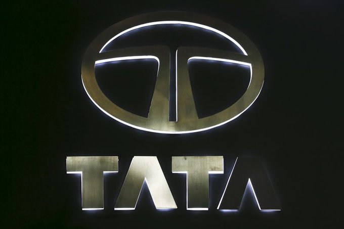
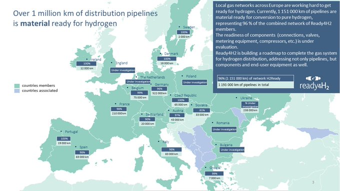
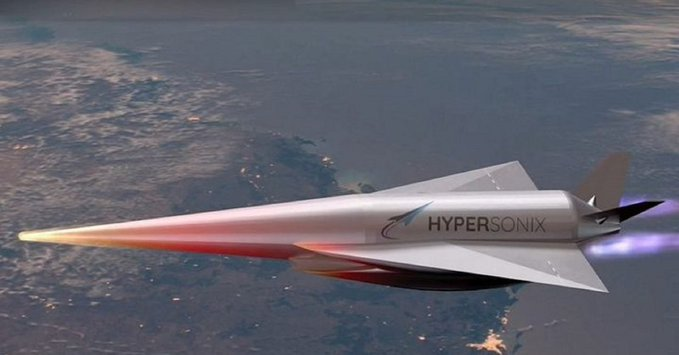
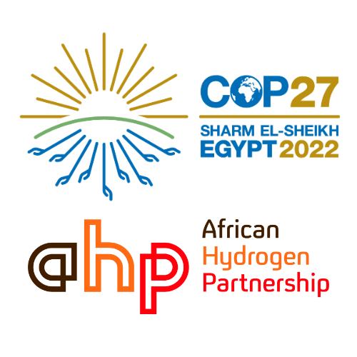

# Week 46 

Reuters: "South Korea, Saudi to boost ties on energy, defence; $30 bln
in deals signed.. [President] Yoon hoped to see South Korean
companies' participation in projects such as the NEOM smart city
project in Saudi Arabia and further cooperation in the defence
industry and future energy such as hydrogen, his office said in a
statement"

---

Glad the new guy embraced H2. South Korea has good know-how on the tech.

H2 Central: "South Korea unveils plan to lead the global hydrogen
industry.. The nation’s declared road map focuses on making Korea an
H2 industry powerhouse"

---

Conjunto Som 4 - Balanco Zona Sul \#music

[[-]](https://youtu.be/drtHyMeLFDk)

---

Bloomberg: "Biden Has ‘Almost Guaranteed’ Hydrogen’s Future..  The law
[IRA], which provides producers with tax credits of as much as $3 a
kilogram, 'almost guarantees that hydrogen will be an important energy
vector going forward,'.. [said] head of industrial transition and
clean fuels at Macquarie’s Green Investment Group"

---

H2 Fuel News: "Viking Cruise Lines has announced that it has received
its latest ocean cruise ship, which is fully equipped with hydrogen
fuel cells.. The new H2-powered marine vessel was built at shipbuilder
Fincantieri’s Ancona yard"

---

😂 

\#BTC \#Lightning

[[-]](https://twitter.com/ercwl/status/1592717155367550977)

---

'Unregistered securities'.. thats the thing - as far as law is
concerned, these ppl could be promoting snake oil. They are peddling
random bullshit vaporware that doesn't even exist in the books and
causing real harm.

WAPO: "The proposed class action alleges the celebrities promoted
unregistered securities and accuses them of violating Florida laws
protecting investors from fraud and deception. The suit was filed in
Florida because FTX has offices there. The company is based in the
Bahamas"

---

Bcz they've been "brand ambassadors" for the company right? 

Deadline: "Tom Brady, Giselle Bündchen, Larry David & Steph Curry
Caught In FTX Crypto Fallout With Class Action Suit"

---

The Toronto Sun: "The Ontario Teachers' Pension Plan says it invested
US$95 million into failing cryptocurrency exchange platform FTX"

---

The main problem is that the base tech is inferior.

Insurance Journal: "A Florida senator is calling for action from the
Transportation Department and automakers after a series of electric
vehicle fires tied to Hurricane Ian.. Sen. Rick Scott (R-Fla.) raised
concerns.. 'This emerging threat has forced local fire departments to
divert resources away from hurricane recovery to control and contain
these dangerous fires,' Scott said. 'Car fires from electric vehicles
have proven to be extremely dangerous and last for a prolonged period,
taking in many cases up to six hours to burn out.'"

---

The Monarchy \#JohnOliver

[[-]](https://youtu.be/KWterDbJKjY)

---

The Guardian: "Lula says 'Brazil is back' as he vows to reverse Amazon
deforestation"

---

Housing prices fell; rents will follow with a lag if research is correct

```python
u.rent_housing() # Uses CUUR0000SEHA, MSPUS from FRED
```

```text
             incrent  inchouse
DATE                          
2022-08-01  6.740728  9.526485
2022-09-01  7.206730  8.447235
2022-10-01  7.521848  7.389046
```

[[-]](twimg/FhoKfHRWQAU9dB-.png)

---

Much time was spent on that dish.. skillet, seperate, oven, then cook
the sauce again.. Dam

---

Poulet au Vinaigre.. Sauce looks good.. Oh yeaa

[[-]](https://youtu.be/jHSWvA2UlQk?t=340)

---

Polished Chrome - Deep Space \#music

[[-]](https://youtu.be/EJhM1EwIQs4)

---

\#FTX

[[-]](twimg/FhrLk1JWIAA_UOE.jpg)

---

GPPI: "Over the last decade, Russia has engaged in a concerted
campaign to gain influence on the African continent. Most recently,
Russian mercenaries drove out the French military presence in Mali"

---

James Gunn as the head of WB DC movies -  good news.

---

*Black Adam* - fun action, solid backstory.. 

---

Future water problems await \#AsiaMinor

[[-]](https://e360.yale.edu/features/as-the-climate-bakes-turkey-faces-a-future-without-water)

---

H2 Central: "Hydrogen Producing Solar Panels on Your Roof? KU Leuven
Scientists Take a Step Towards Industrial Production"

---

Walmart exceeded expectations

```python
u.yf_eps("WMT")
```

```text
Out[1]: 
              startdatetime  epsestimate  epsactual
6  2022-08-16T07:02:00.000Z         1.62       1.77
7  2022-05-17T07:02:00.000Z         1.48       1.30
8  2022-02-17T07:11:00.000Z         1.50       1.53
```
---

Davis: "Ukraine Got Its Miracle In Taking Kherson Without A Fight (But
Winter Is Coming).. By surrendering Kherson city without a fight and
blowing the bridges over the Dnipro, [RU General] Surovikin has
preserved 30,000 of his best-trained and experienced troops for use in
the coming offensive, sealed off the southern front from a risk of a
Ukrainian flanking action and will soon have a massive new force to
employ...

Once this force is ready to launch Putin’s winter offensive (likely in
late December/early January when the ground has sufficiently frozen),
it will likely be preceded by a massive new attack on the Ukrainian
energy infrastructure to plunge the country into darkness, cripple the
remainder of its electrified rail system, and significantly hamper the
government’s ability to supply its troops with basic needs"

[[-]](https://www.19fortyfive.com/2022/11/ukraine-got-its-miracle-in-taking-kherson-without-a-fight-but-winter-is-coming/)

---

Why Do the Chinese Use Chopsticks

[[-]](https://youtu.be/oqykk7xq8MI)

---

Example, 490 polled say candidate A, 470 say candidate B, out of 1000
percentages say A is ahead 49% vs 47%. Compute conf

```python
def d(k,n): m=k/n; return m,1.96*np.sqrt(m*(1-m)/n)

n = 1000.; a=490; b=470
m,t = d(a,n)
print (np.round([m-t,m+t],2))
m,t = d(b,n)
print (np.round([m-t,m+t],2))
```

```text
[0.46 0.52]
[0.44 0.5 ]
```

Intervals overlap. Can't be sure.

---

$X = X_1 + X_2 + .. + X_n $ approaches Normal due to CLT, standardize
w $Z = X - np / \sqrt{np(1-p)}$, create conf intervals.

---

Assume indiv poll results are distributed Bernoulli, then the sum via
CLT gives Gaussian approximation. Calculate conf interval from that,
for both candidates, if intervals overlap, the win ain't sure.

"How can you determine if a poll result 'too close to call'?"

---

"@wasserstoff@mastodon.world

[H2] from bio/waste costs.. 4ct/kWh.. with 900g CO2 reduction per kg
\#hydrogen should hardly be surpassed!"

[[-]](https://mastodon.ie/web/@wasserstoff@mastodon.world/109340699596071860)

---

The Guardian: "President Nayib Bukele bet on Bitcoin and its tumbling
value has put the Central American country in a financially precarious
spot"

---

DeSantis vs Trump? On culture war Trump is tough to beat; if abortion
comes up, he'll be like, well, I appointed the judges who helped
overturn Roe

---

DJT running again.. let the games begin

---

"@nytimes

In a breakthrough, the U.S. and China will restart climate talks that
have been frozen for months amid tensions over trade and Taiwan"

---

Electrification-tards feel that rocket burn on their butt cheeks right
now. The cleanest fuel on Earth is also the most powerful. That's why
the most powerful rocket runs on it.

---

[Link](https://drive.google.com/uc?export=view&id=1Zw7zHEXbtdsPsCj_xymVy3bCYTWhOqE-)

---

The most powerful rocket runs on ... which fuel? I give a hint -
starts with H

"Nasa’s Artemis 1, most powerful rocket in history, blasts off to moon"

---

Reuters: "Cummins, Tata Motors team up for hydrogen-powered engines"



---

H2 View: [The European Bank for Reconstruction and Development] loans
$80m to Egypt’s first green hydrogen facility and launches Corporate
Climate Governance Facility at COP27

---

The Mandarin: "Finland ends homelessness and provides shelter for all
in need.. Finland's 'Housing First' concept has seen a sharp fall in
homelessness and 4 out of 5 people affected by it return to a stable
life"

---

Attributing wins / loses due to this or that voter choice is a tough
task. My rule-of-thumb is the blurry-vision method (to understand how
voters see the world) and the dog in The Simpsons. Blah Blah Blah Blah

---

?? They won the Senate on it, but at the same time (likely) lost the
House, and bunch of governorships?? That doesn't make sense.

"Dems won the midterms on Roe"

---

TASS: "Hungary believes EU should abandon its sanctions policy, says
top diplomat"

---

TASS: "Supplies of Western weapons to Ukraine only prolongs conflict,
says French politician.. Marine Le Pen stressed that the Ukrainian
conflict can be settled only through talks"

---

AMZN employs over 1.5 mil afaik. Still a big number.

"Amazon reportedly plans to lay off about 10,000 employees starting this week"

---

H2 Fuel News: "Classic cars are being rebuilt as hydrogen-powered
vehicles.. A Ford Falcon Freebird has become the latest in a small but
growing trend of H2 rebuilds"

---

"@GRDecter

Here's where the FTX scandal gets really interesting (and scary): The
names and deposit amounts of every single FTX customer could become
public in the Chapter 11 bankruptcy filing"

---
 
<blockquote class="twitter-tweet"><p lang="en" dir="ltr">Today is <a href="https://twitter.com/hashtag/EnergyDay?src=hash&amp;ref_src=twsrc%5Etfw">#EnergyDay</a> at <a href="https://twitter.com/hashtag/COP27?src=hash&amp;ref_src=twsrc%5Etfw">#COP27</a> and the conversation is revolving around the aspects of energy and its impact on <a href="https://twitter.com/hashtag/ClimateChange?src=hash&amp;ref_src=twsrc%5Etfw">#ClimateChange</a>. The role of <a href="https://twitter.com/hashtag/hydrogen?src=hash&amp;ref_src=twsrc%5Etfw">#hydrogen</a> and its pathways in the energy system makes a faster and more cost-effective decarbonization across different sectors possible. ⚡ <a href="https://t.co/ZnnPfYyfll">pic.twitter.com/ZnnPfYyfll</a></p>&mdash; Hydrogen Council (@HydrogenCouncil) <a href="https://twitter.com/HydrogenCouncil/status/1592502834376937472?ref_src=twsrc%5Etfw">November 15, 2022</a></blockquote> <script async src="https://platform.twitter.com/widgets.js" charset="utf-8"></script>

---

My native homie is NATO, and I guarantee it many in Asia Minor would
not want to go to war with Russia for Ukraine.

---

Poland is NATO; now stuff can easily get out of hand, in unexpected ways.

WION: "Two die in explosion in Poland near Ukraine border, no
confirmation on use of Russian missiles"

---

NYT: "Poland Calls a Crisis Meeting After Grain Plant Explosion Near
Ukraine Border.. The plant lies just a few miles from the border with
Ukraine, and the explosion reported there came on the same day that
Russia launched a widespread missile attack on Ukraine"

---

TASS: "Two rockets hit grain dryers in Poland on border with Ukraine,
Polish radio claims"

---

Latest frontline, 11/15 (red line) compared to 10/2 (gray). Clear
gains for UA compared to previously, the worry is what comes next.

```python
geo = [[46.65638330, 32.61676838]] # kherson city
u.sm_plot_ukr2('ukrdata/alt1-1115.csv','ukrdata/alt1-1002.csv',geo)
```

[[-]](twimg/FhoGY7cXkAIWOaw.png)

---

US Dem shitlibs looove the war in Ukraine. Finally they have a good
guy against Russia they can identify with. During Syrian war allies on
their side were Al Qaida types, they had freaking beards, names like
Habib, Abdul.. F-ing Mostafa.. Nah.. That didn't work. But European
looking people as good guys, against Russia Russia Russia..?  Now
that's awesome! Hang the Ukranian flag and honk that horn baby!

---

NYT: "A disagreement has emerged at the highest levels of the United
States government over whether to press Ukraine to seek a diplomatic
end to its war with Russia, with America’s top general urging
negotiations while other advisers to President Biden argue that it is
too soon. Gen. Mark A. Milley, the chairman of the Joint Chiefs of
Staff, has made the case in internal meetings that the Ukrainians have
achieved about as much as they could reasonably expect on the
battlefield before winter sets in and so they should try to cement
their gains at the bargaining table"

---

"@blockchainchick

Crypto winter is my favorite time of the year. Scams/scammers get exposed.."

---

Bloomberg: "South Africa set its sights on attracting as much as $250
billion into its nascent green hydrogen industry by 2050"

---

H2 Fuel News: "Hydrogen fuel planes and power plants will be here
sooner than later.. Electrification isn’t the fastest decarbonization
strategy for aviation and other industries. Hydrogen fuel stock is
rising thanks to funding for regional hydrogen hubs and the expansion
of tax credits like the Inflation Reduction Act (IRA). More financial
support for H2 development and adoption means that costs can come
down, making it possible to decarbonize transportation industries that
are not easily electrified at a rapid pace, like long-haul trucks,
trains, and planes"

---

H2 Fuel News: "Clean hydrogen production breakthrough made by Israeli
Scientists.. Yochelis and.. Rothschild think they have discovered new
pathways using photoelectrochemistry.. that quicken the catalytic
process"

---

Lerner, 1992, *The Big Bang Never Happened*: "Overwhelming mass of
scientific evidence still contradicts the Big Bang, as this book
endeavors to show. As of this writing.. [BB] remains in just as deep
trouble as ever, with even wider divergence from observation than when
the first edition of this book was completed in late 1990... In the
year and a half since this book was written, the evidence against the
Big Bang has grown stronger, and the COBE results, far from 'proving'
the theory, have not in any way resolved the problems raised by other
discoveries. The key problem.. is that there are objects in the
universe— huge conglomerations of galaxies—that are simply too big to
have formed in the time since the Big Bang, objects whose age is
greater than the age Big Bang cosmologists assign to the universe
itself"

---

Wikipedia: "Eric Lerner.. rejects mainstream Big Bang cosmology, and
instead advances a non-standard plasma cosmology originally proposed
in the 1960s by Hannes Alfvén, the 1970 Nobel Prize recipient in
Physics"

---

*Poker Face*, now that's a 3... Not bad, not great - a solid 3.

---

Deo Prasad, UNSW Sydney: "You can make billions of dollars from
hydrogen storage"

---

AI Wout Context is basically all current "AI" right now.

[[-]](twimg/Fg-G-WhXoAUHBZB.jpg)

---

Marco Alvera: "A kilogram of gasoline holds 13 kilowatt-hours (kWh) of
energy; a kilogram of lithium-ion battery holds less than 0.3 kWh."

[[-]](../../2022/06/the-h2-revolution-alvera.html#lion)

---

With the right tech and culture around it crypto, or 'cybercurrencies',
could truly be decentralized / useful. Not there yet.

---

[Link](https://drive.google.com/uc?export=view&id=1GZG8HC-Y89mpCaNjQIrZ31RCJTrg2wAA)

---

Stating the obvious

"Brainard: It appears that cryptocurrency is not decentralised, but
rather extremely concentrated and interconnected"

---

"@Casey@masthead.social

News from Egypt and Kenya: green hydrogen to solve fuel + food issues
all at once.. The new green hydrogen plan for Ain Sokhna in Egypt is a
case in point... The Sovereign Fund of Egypt is behind the project,
dubbed Egypt Green. So is ADNOC, the Abu Dhabi National Oil
Company. Other partners are Scatec for the renewable energy side and
OCI for nitrogen. Fertiglobe (a branch of ADNOC and OCI) owns the
project and will operate it"

[[-]](https://mastodon.ie/web/@Casey@masthead.social/109331152156933750)

---

This show could degenerate into an NCIS, or Law and Order type ep
easily - fascist office show with occasional "knocking down doors"
scene. "Procedural". But the leaps takes the show into wildly
different settings, keeps things interesting. 

---

New episode of Quant. Leap character "leaped" into 1989 Loma Prieta
earthquake. Looked pretty bad. Wonder how accurate the depiction was.
People was scattering about like the Japanese in Godzilla movies.

---

H2 View: "Africa could produce 30-60 million tonnes of hydrogen
annually, with a 680bn to 1,300bn dollar price tag, according to a
joint report by Masdar and Abu Dhabi Sustainability Week"

---

CNBC: "Disney plans hiring freeze, layoffs and cost cuts, according to
a memo from CEO Bob Chapek"

---

France 24: "Mark Kelly wins Arizona Senate race, bringing Democrats
one seat away from majority"

---



---

"Alkaline Fuel Cell Power [AFCP] Targets Zero Carbon Economy With $50
MILLION Pipeline of Potential Contracts"

---

Many dunk on 538 for their past failures but they are making raw data
available through simple URLs, that is great. The site is useful for
me. 

---

That average is the result of an in-house recipe; gives weight to
individual polls according to recency, trustworthiness of the polling
company (why include them if they are not trustworthy), their
bias.. I've seen such approaches in analytics codes, they aren't
usually robust, I wanted to rock'n roll so went for the raw source
instead. Following indiv raw polls for race can expose trends, it can
give an idea.. It worked fine.

"Why did u look at individual polls rather than 538 average before midterms?"

---

The Standard: "HyNet North West Hydrogen Pipeline.. final statutory
consultation concluded on Thursday..  the consultation focused
on.. UK’s first 100 per cent hydrogen pipeline at scale and comprise
the construction, operation and maintenance of up to 125km of new
pipelines that would distribute hydrogen produced at Stanlow
Manufacturing Complex to several industrial gas customers across the
North West. The pipeline itself will be underground, with
approximately 10 'Hydrogen Above Ground Installations' (HAGIs)
required along the pipeline route"

---

Need to respect the cycle.. after low rates there needs to be a period
with higher rates.. Otherwise how will zombie companies go bust? There
are too many companies whose existence is questionable. Shopify, FTX,
Tesla, Carvana, Freshpet...

---

The Central Engine of an Active Galactic Nucleus

[[-]](../../2022/08/black-holes.html#centralengine)

---

<iframe width="340" src="https://www.youtube.com/embed/46y3FN4fKlE" title="E-Bikes, E-Scooters Injuries Multiplying" frameborder="0" allow="accelerometer; autoplay; clipboard-write; encrypted-media; gyroscope; picture-in-picture" allowfullscreen></iframe>

---

NBC News: "Fire officials warn e-bike riders of battery fires.. Highly
flammable lithium ion batteries sparked 188 fires in NYC"

---

H2 View: "Mining and hydrogen in the spotlight at COP27"

---

H2 View: "Joint venture launched with plans to establish giga-scale
electrolyser plant in India"

---

F24: "U.S. blocks more than 1,000 solar shipments from China over
slave labor"

---

Instead of making itself a target in a possible nuclear exchange gov
signaled nuclear neutrality - makes sense for them.

The Guardian: "While Australia was yet to actually join the Treaty on
the Prohibition of Nuclear Weapons, the shift in its voting position
to “abstain” after five years of “no” is seen by campaigners as a sign
of progress given the former Coalition government repeatedly sided
with the United States against it... [The treaty] imposes a blanket
ban on developing, testing, stockpiling, using or threatening to use
nuclear weapons – or helping other countries to carry out such
activities"

---

"@OdedRechavi

Impact factor

'@thetaoishway what is the opposite of wisdom?'"

---



H2 Fuel News: "Green hydrogen fuel powers innovative hypersonic spaceplane"

---

Good/bad acting aside I'm talking about being a fit. An actor is in
some ways a prop on a movie set... Certain base look, and a certain
range of acting makes the actor either a good prop or a bad prop for
certain movie. 19th century period piece needs 19th century props, a
flimsy person role can require a flimsy looking actor. Can Hugh Grant
play Jessup on *A Few Good Men*, or Christopher Walken Neo on *The
Matrix*?

---

The *Andor* lead is too bland for SW

---

\#MAGA now \#MAGBA 

[[-]](twimg/FhSBN51X0AAk-Le.jpg)

---

"@afr_h2_p

'The World cannot decarbonise without #GreenAfricanHydrogen. The fight
against Global Warming will be won or lost in \#Africa!', Siggi
Huegemann, initiator and Secretary General of the [African Hydrogen
Partnership]"



---
