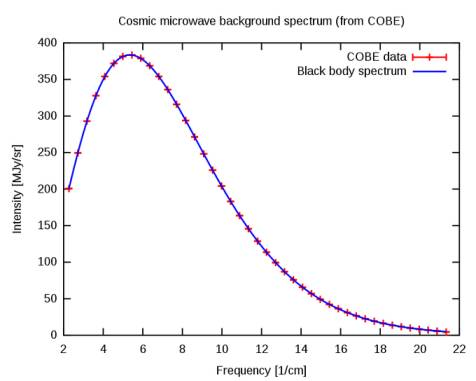
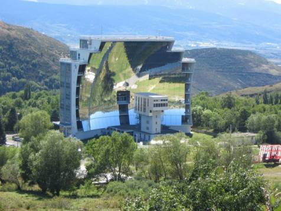

# Week 48 

"@Sustainable2050@mastodon.energy

First pipeline sections for a Rotterdam hydrogen network arrived by
train from Germany. 32 km, diameter 60 cm", construction will start
mid-2023"


---

Seriously the younger son even looks less inbred compared to the rest
of the royal fam

---

Well this sounds like a major PR problem.. the fix would be Charles
abdicating, and then the son married to a non-white becomes Kang. PR
problem solved. It has been *foretold by the prophecy*.

TDB: "Removing One Royal Racist Is Nothing. We Need to Abolish the
Monarchy.. The shock and horror professed by so many white people at
the latest royal racism controversy is not shared by many Black
people. For us, there is only a sense of weariness because we have
heard it all before. Its significance is just to show how utterly
impossible it is for the royal family to ever move beyond racism"

---

NPR: "A member of the Buckingham Palace household resigns after racial comments"

---

Jane's Defense: "Russia-China moving towards closer bomber
co-operation.. In an unprecedented boost to interoperability,
long-range Chinese and Russian bombers landed in each other's airbases
for the first time, as part of a joint air patrol"

---

"@jmtixhon@mastodon.world

Germany Plans 1,800 Km Hydrogen Pipeline Network: Draft Government
Paper"

[[-]](https://masto.ai/@jmtixhon@mastodon.world/109444852216914665)

---

The issue of "connectedness" again - ppl are unable or unwilling to
judge a person's work instead they gauge wortiness by looking at their
connections. Not a good way for judging scientific output.

"@helenajambor@vis.social

\#ReferenceLetters for jobs are the biggest gate-keeper in #academia

My week was rough - I skipped applying to an interesting job that
would have needed 3 references.

What is wrong with the system:

1. References create a system of life-long dependencies with supervisors  

2. They exclude those who are shy about asking for favors 

3. Referees have STRONG biases and they play out 

4. switching fields is bad

@Odedrechavi wrote about abolishing - I fully agree!"

---

The Guardian: "Brexit added nearly £6bn to UK food bills in two years,
research finds"

---

CNN: "Global 4-day week pilot was a huge success, organizers say
.. After six months, most of the 33 companies and 903 workers trialing
the schedule, with no reduction in pay, are unlikely ever to go back
to a standard working week, according to the organizers of the global
pilot program"

---

Addition to post on the record-breaking H2 Alstom train.

[[-]](../../2022/02/h2-end-use.html#alstom)

---

The funny thing is when people get the techy money that is supposed to
do away with the middleman, they go straight to a middlemen and dump their
shiny new money on them.

---

"@ercwl

Every time Sam brings up 'FTX was a margin exchange' he is
intentionally trying to spin the narrative into a risk management
failure when the insolvency came from the embezzlement of the
”mislabeled fiat stub account” of $8bn and other things"

---

Reuters: "Spain's Cepsa to invest 3 bln euros in green hydrogen
project..The project will produce 300,000 tons of hydrogen a year,
which will be used to power the company’s refineries as well as local
heavy shipping and haulage.. [and] consist of two electrolysers
totalling 2 gigawatts (GW) in the port cities of Huelva and Algeciras"

---

EU-Africa-Asia as a contiguous block of landmass will likely become a
superpower, and one day, through ports in West Africa, will invade United
States of America.

---

Express train from China to Germany - get a load of that shit

"[Germany] Duisport celebrated the arrival of the first trans-Eurasian
freight train to reach its facility in western Germany that had
followed a fixed timetable on November 7. The train from Xi’an, China,
completed the 9908km journey in just 10 days"

[[-]](https://www.railjournal.com/freight/china-europe-express-train-reaches-germany-in-10-days/)

---

EU-China relationship makes sense; inners unite.

---

The papers on measuring state capacity empirically have good gems in
them... The polsci comes through clearer because it needs to be used
to create an empirical measure. The paper below was a good read;
absolutely right on Guevera and Bolivia.

[[-]](https://papers.ssrn.com/sol3/papers.cfm?abstract_id=1450586)

---

New research: Desalination and electrolysis at the same time \#China

[[-]](https://arstechnica.com/science/2022/11/waterproof-clothing-concept-used-to-make-hydrogen-from-seawater/)

---

"@KadriSimson@respublicae.eu

Historic day for \#EU- \#Japan energy partnership: we signed w/
Minister Nishimura a Memorandum of Cooperation on #hydrogen, to boost
innovation & help create a market for this fuel of the future"


---

You axed and you shall receive homie

[[-]](../../2022/02/h2-end-use.html)

---

What are the application areas for H2? :)

---

Brother Hakeem has good backing.. the major one being from "South
Carolina", from you-know-who

WION: "Rep. Hakeem Jeffries has been elected to succeed Nancy Pelosi
as leader of the Democrats in the House next year"

---

Al Monitor: "Saudi Arabia announces new natural gas discoveries"

---

H2 Fuel News: "First hydrogen freight train to be used by Nestlé
Waters France"

---

Tesla Battery Swap Fraud

[[-]](https://gotmusked.com/content/tesla-battery-swap-fraud/)

---

"@CoinDesk

Maersk and IBM will wind down their global shipping blockchain
TradeLens after deeming the project a commercial failure"

---

Green tech suffers from the same problem, the problem of connectedness
pull a herd towards them. A single WH admin makes a mistake betting on
battery shit tech, a wave of morons rush in as if the tech is a viable
option. They rush in wout checking, without due diligence, without an
iota of former thought. This is how tech fashions occur in America -
the land of, yes genuine enterpreneurship, but also a lot of snake
oil.

---

Drill baby drill

"The U.S.-based energy company seeks to unlock geothermal energy on a
global scale with its millimeter wave drilling, and is developing a
drilling rig designed to reach 10 miles (16 km) underground"

---

Snake oil salesman everywhere

Not Even Wrong: "This morning Quanta Magazine informs us that
Physicists Create a Wormhole Using a Quantum Computer..  The two
senior physicists behind this, Joe Lykken and Maria Spiropulu, have
histories that go way back of successfully promoting to the press
nonsense about exotic space-time structures appearing in experiments
that have nothing to do with them... The claim that “Physicists Create
a Wormhole” is just complete bullshit, with the huge campaign to
mislead the public about this a disgrace, highly unhelpful for the
credibility of physics research in particular and science in general"

---

BTW gaseous plasmas cannot produce a Planck spectrum either, but we
see one for the Sun, so the Sun cannot be gaseous plasma. Cannot be
compressed, therefore cannot collapse into a black hole.

---

Penrose says when you plot CMB intensity against each frequency you
get Planck blackbody curve that means early universe must have had
thermal equilibrium. But thermal equilibrium means by definition
maximum random state... Wasn't the universe supposed to go *toward*
disorder, and not start from one?



---

This kid had an interview with Cuck Todd being treated like finance
genius. How did that happen?

---

It was the same issue with Theranos, the board was stuffed with
connected people, outsiders assumed there is something good going
there.. Then bust. A few people in the circle failed to see, more
people rushed in. SBF father is a Stanford law professor, that weirdo
chick Ellison's parents were MIT econ connected to Gary Gennsler (of
SEC). People assumed FTX was legit because of its connections. They
assumed wrong.

---

For failure of detecting FTX fail look no further than "connectedness".  

---

Still zero-covid cannot go on forever; with vax help CH shld be
able to gradually get out of it, right?

First Post: "President Xi Jinping fears that a relaxed policy will
lead to more fatalities among [the rural folk].. Close to 20% of
China’s population is over 60, and the percentage is higher in rural
areas where health services are poor"

---

IRA is about to trigger a trade-war with the EU?

---

Arab News: "Leading media outlets urge US to end prosecution of Julian Assange"

---

If voters were so smart, voted on policy and had a 20/20 vision into a
politician's ability, endorsements wouldn't have mattered. But they
do. If a popular politician is standing next to another politician the
popularity rubs off. That means [you](../2021/you.png) the voter
cannot truly be in charge.

---

H2 Central: "Countries rich in hydrocarbons are among those that have
the greatest potential for meeting global clean hydrogen demand due to
existing infrastructure, says a new [McKinsey study](https://www.mckinsey.com/industries/oil-and-gas/our-insights/the-clean-hydrogen-opportunity-for-hydrocarbon-rich-countries)"

---

H2 Central: "Northwest Europe Ammonia to Hydrogen Production Costs
Fall Below €10/Kg of Hydrogen"

---

"New Sulfur-Based Solar Reactor Makes Cheap Green Hydrogen.. Extracting
hydrogen from sulfuric acid with solar uses much less energy than
water electrolysis.. This SO2-depolarised electrolyzer only requires
about a seventh of the electrical energy of conventional water
electrolysis, so this method can produce about 50% more hydrogen with
the same solar input"

[[-]](https://www.solarpaces.org/solar-hydrogen-sulfuric-acid-copper-market/)

---

"@ApolloEngineer

We are delighted to announce a major contract award to provide
feasibility engineering to a proposed hydrogen pipeline from Pembroke
to the Swansea Bay area"

---

I never understood the itching for war mentality on the Ukranian side
vis-a-vis Russia. "The other side" of that potential conflict (which
became real) had an apparatus that readied itself for decades to go
toe-to-toe with another superpower. Even with reduced capacity
Russia's weapons manufacturing, supply lines, preparedness,
stockpiles, the whole thing would be at levels for much greater
conflict and all that preparedness would be dumped *on your head* if
you went to war with them, which is what Ukraine did.

---

"@EnergyNews_Biz

Manchester Airport plans direct hydrogen fuel pipeline connection"

---

"@EngNewsZA

South Africa unveils R300bn green-hydrogen pipeline as its states
ambition to be ‘destination of choice’"

[[-]](http://ow.ly/JFFZ50LPUP5)

---

Great.. yes these are all major nodes in the drug smuggling [network](../../2023/01/drugs.html),
especially Spain (due to its geo)

F24: "Police bust cocaine 'super-cartel' in Europe and Dubai.. The
international operation.. seized 30 tonnes of the drug and led to
arrests in Belgium, France, the Netherlands and Spain, the European
Union's police agency said in a statement"

---

H2 View: "Leading bus manufacturer Wrightbus’s fleet of hydrogen
fuel-cell buses have travelled a staggering 1.5 million miles since
first entering service....  'We are immensely proud to be one of the
country’s leaders in the UK’s hydrogen industry - and our StreetDeck
Hydroliner is the world’s first hydrogen powered double deck bus, so
this hydrogen milestone is particularly pleasing for us'"

---

"@davidzipper@mastodon.social

Oversized EVs waste energy (bc of giant batteries) and also endanger
other road users.

To address EV car bloat, Norwegian officials have proposed a
weight-based fee of NOK 12 ($1.10)/kilo over 500 kilos"

---

H2 Fuel News: "Australia moves ahead with 'super' renewable H2 hub"

---

Jay Leno got burned by gasoline fire..? Gasoline is flammable, not as
bad as lion batteries but still dangerous.

[[-]](../../2022/02/h2-safety.html)

---

♪ Satyam ♬ Shivam ♬ sundaram...

---

Thievery Corporation - Satyam Shivam Sundaram (Featuring Gunjan) \#music

[[-]](https://youtu.be/yO9ULEVR-kc)

---

H-Tec Systems presents scalable Hydrogen Cube System..The company
H-Tec Systems from Augsburg presented the Hydrogen Cube System, HCS
for short, to a wider specialist audience at the Hanover Fair 2022...

The Cubes are available both as a closed container solution for
outdoor installation and open for indoor installation. They are
equipped with 18 PEM stacks S450 and integrated process water
treatment and power supply...


Several 2 MW cubes of this system can be combined to form a
multi-megawatt system. A system that is intended to achieve 50 MW in
the long term can also be designed in this way. According to H-Tec
Systems, the cubes achieve a system efficiency of 74 percent. They are
equipped with an integrated process water treatment and power
supply. An HCS system with five units, i.e. with an electrolysis
capacity of 10 MW, can therefore produce 4,500 kg of H 2 per day. That
makes 40 to 50 tank fillings for trucks or buses.

[[-]](https://www.hzwei.info/blog/2022/11/27/h-tec-systems-stellt-skalierbares-hydrogen-cube-system-vor/)

---

Hechu'ghos!

---

Anything can be string-pickled 🐍 For coding `base64.encodestring` on
`pickle.dumps`. For other direction `loads(base64.decodestring..)`.
`zlib` for compression.  There are some other details, but this is
the gist.

---

Simple scalable NoSQL DB: N servers, on client calc i = (mod N) on
key, go to host i. Simple load disribution. REST can provide CRUD API,
serialize requests inside one server, storage can be lite sql,
seperate db for each host, objects are encoded via 'pickle" into
string. Lists are on sep table, list name is on one column obj
references on another as key. Easy as Py.

---

"@jcrabapple@dmv.community

World's first test run of a \#hydrogen jet engine is a success" via The Verge

[[-]](https://masto.ai/@jcrabapple@dmv.community/109432649450454795)

---

The Bell: "Unmasking Russia’s influential pro-war ‘Rybar’ Telegram
channel.. Although Rybar is openly pro-Russian, it works hard to
maintain a sense of its own impartiality... Rybar’s founder is a
31-year-old military translator, Mikhail Zvinchuk. He is a former
employee of the Defense Ministry’s press service. Born in Vladivostok,
he studied at a military university in Moscow, specializing in
Arabic"

---

Makes sense; if Columbia wants to export clean fuel they would need
tech like LOHC.

"@hydrogenLOHC

Colombia was our guest in [Hydrogenious headquarters] Erlangen"

---

"@TransportOnline@mastodon.nl

[RR and] EasyJet conducts first test with hydrogen-powered aircraft engine"


[[-]](https://www.transport-online.nl/site/147912/easyjet-performs-first-test-with-aero-engine-on-hydrogen/)

---

Reuters: "Rolls-Royce successfully tests hydrogen-powered jet engine..
Britain's Rolls-Royce (RR.L) said it has successfully run an aircraft
engine on hydrogen, a world aviation first that marks a major step
towards proving the gas could be key to decarbonising air travel. The
ground test, using a converted Rolls-Royce AE 2100-A regional aircraft
engine, used green hydrogen created by wind and tidal power, the
British company said on Monday. Rolls and its testing programme
partner easyJet are seeking to prove that hydrogen can safely and
efficiently deliver power for civil aero engines"

---

Yahoo Finance: "Global power leader Cummins Inc. will design and
manufacture [an] electrolyzer system for the first 20-megawatt green
hydrogen facility in the Canadian province of Ontario"

---

That looks massive. Is there anything CSP folks can learn from? They
structured the whole thing differently, basically an entire building
became a reflector.

3K Celcius is a good chunk of energy to generate clean fuel with.

Wiki: "The solar furnace of Uzbekistan was built in 1981, and is
located 45 kilometers away from Tashkent city. The furnace is the
largest in Asia. It uses a curved mirror, or an array of mirrors,
acting as a parabolic reflector, which can reach temperatures of up to
3,000 degrees Celsius.  The place for the solar furnace of Uzbekistan
was chosen carefully, because the sun shines there for 270 days a
year"



---

H2 View: "Loop Energy reports record fuel cell orders and revenues"

---

"@garrygolden

BEVs = bloated weight/cost

H2 Fuel Cells = less cost to mass. Anyone reading industry news knows
batteries are losing perceived advantages to fuel cell based EVs from
trucks to ships to rail and yes passenger cars"

---

WION: "Chevron to resume 'limited' energy production in Venezuela
after years of sanctions"

---

Animated film *Superman: The Red Son*, also known as "the Soviet
Superman", not bad for an anime... There's some (US) propaganda but
not excessive. A good story overall. They had him speaking with a
Russian accent that was amusing.

---

"@DAlperovitch

Ukraine is firing 2-4k 155mm shells per day or 60-120k per month

US can produce ~30k shells per month"

---

TASS: "Majority of NATO countries exhausted possibilities of arms
supply to Ukraine"

---

"Tokyo Governor Yuriko Koike announced plans to build a hydrogen supply
network of pipelines in the capital as an energy resource to cut down
on greenhouse gas emissions. Koike made the pitch Nov. 8 at a meeting
on “green hydrogen” during the COP27 summit in Egypt"

---

"@H2Standard

Toyota and Kawasaki are putting their minds together to find
alternative ways to reduce carbon emissions.. they're developing an
internal combustion engine that burns H2 as fuel"


[[-]](http://bit.ly/2X5Jje3)

---

Upstream: "Sinopec to back multi-billion dollar green hydrogen project
harnessing wind power in northern China"

---

"@Hypx@mastodon.social

MTA to pilot \#hydrogen-powered buses in the Bronx"

---

"@claesdevreese@mastodon.social

Leading by example? The 🇪🇺is going full #mastodon.  Own instance for
all institutions"

---

MD report, with code ref

[[-]](../../2022/10/mastodon.html)

---

Or 4.74 to be exact

[[-]](https://www.cbsnews.com/news/six-degrees-of-separation-facebook-says-more-like-474/)

---

Crawl is done; I count 4601 servers and 7,824,386 users. 3 hops were
enough, maybe we should have Three Degrees of Kevin Bacon.

---

Just kidding it wasn't a wise man

---

Wise man said 'if one's code is not CPU bound one can start more
processes than cores'

---

Traversal wld be breadth-first, check double visit of nodes.. Iteration
count..? Probably [six is fine](twimg/FijVyYTXoAArlYU.jpg).

---

You could write a simple "crawler" probably that can hit all MD servers
and get their info, collect it.

---

```python
response = requests.get(url) # details on specific host
res = json.loads(response.text)
res['stats'] 
```

```text
Out[1]: {'user_count': 880513, 'status_count': 43334732, 'domain_count': 35389}
```

---

All MD servers know about related servers, code below fetched that
for one machine displayed few results.

---

```python
import requests, json
url = "https://mastodon.social/api/v1/instance"
response = requests.get(url + "/peers") 
json.loads(response.text)[:4]
```

```text
Out[1]: 
['smgle.com',
 'mstdn.nielniel.net',
 'testdon00001.mamemo.online',
 'lazybear.io']
```

---

Mastodon servers have REST APIs - easy to get info... Nice.

---


"@gregeganSF@mathstodon.xyz

'Research at Royal Perth Hospital has found that 90 per cent of people
who believe they are allergic to penicillin are not.'"

---

Arab News: "British aid worth hundreds of millions of pounds went
toward funding police corruption in Afghanistan, according to a
report"

---

Politico.eu: "Furious EU countries rage over gas price cap proposal"

---

The psyop has a rich white guy who was culturally Protestan (as most Americans are),
to be seen as first Irish-Catholic President, read: a minority who was
"representing", "taken from us much too early". Dems are made to
weep after this symbol of diversity, follow its flashy image at the
same time ensuring its centrist, rich guy policies are followed. [This photo](billclintonjfk1.jpg)
has the worst and second worst US presidents of modern times in a
single frame, and that is by design. 

---

".. ask what you can do for your country" translates to "dont ask for services
from gov" (as Markey brilliantly [used](https://youtu.be/86-3yuzn5UU?t=156) in MA
Senate race), "the rising tide lifts all boats" sounds like trickle-down economics
(in fact some of the WH advisors at the time were actual [proponents](https://www.thedailystar.net/news-detail-126725)
of the approach). JFK escalated the war in Vietnam, f--ked it all
up in Cuba, and somehow shifted the blame *to the media* with another
statemanly sounding proclamation. It all sounded aw so eloquent
that the retro air is what people remember fondly, rather than
the empty content of the statement itself.

---

Dems are better off wout the adulation, staning for the Kennedys, it
is holding them back. The soundbytes sound fine enough, but when you
dissect 'the legacy', there isn't much there.

---

TASS: "Odessa authorities approve demolition of monument to city's
founder Catherine the Great"

---

Anwar finally gets his chance.. Man it took a long time for this guy

Al Jazeera: "Malaysia's Anwar gets to work.. Southeast Asian nation's
new prime minister says he will govern for all"

---

Politico.eu: "After six years of chaos and recrimination since Britons
voted to leave the European Union, there are signs the country is
showing an unexpected outbreak of common sense in its approach to the
bloc.

In his first weeks in office, Prime Minister Rishi Sunak -a Brexiteer
himself- has sent clear signals that he wants a more constructive
relationship with Brussels and Paris, and to avoid a trade war with
Britain's biggest economic partner"

---

Al Monitor: "Amazon to open online grocery store in UAE"

---

"@hydrogenLOHC

\#Delegation Trip to Austria and Italy! Here are the main take-aways

1) When it comes to decarbonization, the new language is “hydrogen”
(besides \#renewableenergy) 💙

2) \#Hydrogen will partly be transported via pipelines (e.g. European
Hydrogen Backbone Initiative \#EHB) – so we must take the right steps
and find the right partners now 

3) The \#energytransition is a joint goal ➡️ only achievable through
international cooperation – hydrogen is a perfect example!

4) Our \#LOHC technology = a great solution for transporting
\#greenhydrogen via ship to Italy, where the hydrogen could be injected
into pipelines💪 

And: \#Hydrogen will come from all over the world, so we need all
transport options and act in a #technology-open manner!"

---

<blockquote class="twitter-tweet"><p lang="en" dir="ltr">Hyper:Fuel Mobile Stations™ the power of the stars.<br><br>Hydrogen is the most abundant element in our universe. It fuels each star in our galaxy and every NASA rocket to date.. <br><br>Now it can power your car!<a href="https://twitter.com/hashtag/hydrogen?src=hash&amp;ref_src=twsrc%5Etfw">#hydrogen</a> <a href="https://twitter.com/hashtag/refuel?src=hash&amp;ref_src=twsrc%5Etfw">#refuel</a> <a href="https://twitter.com/hashtag/recharge?src=hash&amp;ref_src=twsrc%5Etfw">#recharge</a> <a href="https://twitter.com/hashtag/NASA?src=hash&amp;ref_src=twsrc%5Etfw">#NASA</a> <a href="https://twitter.com/hashtag/starpower?src=hash&amp;ref_src=twsrc%5Etfw">#starpower</a> <a href="https://twitter.com/hashtag/losangelesautoshow?src=hash&amp;ref_src=twsrc%5Etfw">#losangelesautoshow</a> <a href="https://t.co/4Gl7rCdz1g">pic.twitter.com/4Gl7rCdz1g</a></p>&mdash; Hyperion Motors, Inc (@hyperionmotor) <a href="https://twitter.com/hyperionmotor/status/1595587623783141376?ref_src=twsrc%5Etfw">November 24, 2022</a></blockquote> <script async src="https://platform.twitter.com/widgets.js" charset="utf-8"></script>

---

For two teams we can look at their past K games, within that calc goal
avg, passes per minute, bad passes per minute, fouls per minute,
number of completed passes per minute in the attacking 30%/20% of the
field (see how detailed it is), it goes on... Taking such stats for
two teams even eyeballing one can probably gauge a winner. "AI" just
automates that, adds another layer of (let's be honest here) extremely
simple linear regression, and reports a result.

[[-]](https://github.com/GoogleCloudPlatform/ipython-soccer-predictions/blob/master/predict/wc-final.ipynb)

---

A lot of soccer games can be predictable. If you feed in gazillion of
base data points through "feature engineering" than even simple stupid
logistic regression will predict something. There are companies
providing such raw, so-called touch-by-touch data. See
[Opta](https://www.statsperform.com/opta-event-definitions/).

---

"Ronaldo makes history.. he becomes the first.. to score in five
different FIFA World Cups"

---

"England draws 0-0 with the USA" \#Qatar

---

😂 US-England \#worldcup

[[-]](https://twitter.com/griffin_dahl/status/1596219000761245696)

---

RFK was ok on some left issues, but fell short... Supported the war in
Vietnam in the beginning, and promised to send 50 fighter jets to
Israel if elected president. That's why that Palestenian assassin was
radicalized and shot him literally one year after the Six-Day War.
Why support the civil right movement but be ok with Palestenians
getting bombed go bits?? Half-assed left - the perennial problem of
America. That is why RFK is dead.

---

