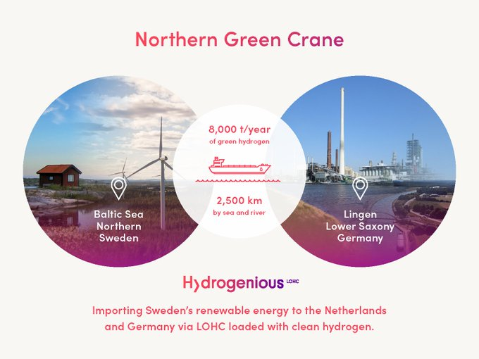

# Week 49 

Al Monitor: "Oil prices have fallen to a yearly low, despite a recent
production cut supported by Saudi Arabia and Russia... 'The drop
reflects market anxieties about the prospect of a recession' [said
expert]"

---

Per state. The prices vary wildly across states

```text
  state  price
0    CA  5.173
1    TX  3.065
2    FL  3.497
3    NY  3.874
```

---

US gasoline price down 

```
2022-12-05  3.504
```

---

ICIS: "France will have an updated national hydrogen strategy by the
end of the first half of next year as the Minister for Energy
Transition and the Minister Delegate for Industry are to formulate a
joint work program.. France originally launched its hydrogen plan in
2018 and then its national hydrogen strategy in 2020, however,
“following the remarkable development of the projects carried out by
the sector since 2020, an update was necessary,” a press release from
the French government said"

---

The Local: "Spain, France and Portugal on Friday unveil details of
their ambitious plan for an underwater pipeline to bring green
hydrogen from the Iberian Peninsula to the rest of Europe"

---

H2 View: "H2Med hydrogen pipeline can build 'a European hydrogen backbone'"

---

The Spain-France H2 pipeline plan is huge news.

---

"@eunews@mstodon.eu

Spain and France are dropping plans to transport natural gas via an
undersea pipeline between the two countries and will instead dedicate
it only to hydrogen in a bid to secure the 'maximum' possible EU
funding for the project" via [FT](https://www.ft.com/content/b0fbbaaf-3c21-4ba2-836c-fc2998048654)

---

My guess on why the gained ground, Russia goes in with the essentials - 
guns, grain, protection detail for the leader (it's key) while US
condemns for violation of this or that. The West (and China) have the
money and some turn their nose at military relations and support but
it clearly makes a difference. Plus with the war in UA grain is more
valuable.

---

It does look like Chad is surrounded.

Will update this map with more info

---

[Link](../../2022/12/ru-africa.html)

---

US has been losing ground in Africa? 

This calls for a timeline and a map. 

---

TFI Global: "Pro-US Chad has been surrounded by pro-Russia nations,
and its surrender is inevitable"

---

BBC: "Russia is cheering on the Burkina Faso coup"

---

CNBC: "Russia's Ukraine onslaught shows zero signs of a winter lull as
conflict rages"

---

TASS: "France bought 153 tons of enriched uranium from Russia in 2022"

---

*Shot Caller* - gruesome at times but worth it..

---

Geek Wire: "Seattle-based First Mode and the Anglo American mining
company have signed a binding agreement to combine First Mode with
Anglo American’s nuGen effort to develop a [H2 based] zero-emission
system for hauling ore. The transaction, which is expected to close
next month, values the newly combined business at around $1.5 billion
and includes a 200 million equity injection from Anglo American...

First Mode is an engineering company that initially focused on
providing expertise for space projects such as NASA’s Perseverance
rover mission and the Psyche mission to a metal-rich asteroid. But in
recent years, it’s devoted increasing attention to carbon-reduction
technologies for heavy industry. The company provided the
hydrogen-fueled hybrid power plant for Anglo American’s nuGen mining
truck, which made its debut in South Africa this year as the world’s
largest zero-emission vehicle."

---

This show went broke.

```python
u.rottentomatoes("The Lord of the Rings The Rings of Power",tv=True)
```

```text
Out[1]: {'tomatometer score': '86%', 'audience score': '39%'}
```

---

TASS: "Putin acknowledges Russia’s war in Ukraine could be a long one"

---

TASS: "US-Russian prisoner swap took place thanks to Saudi-Emirati mediation"

---

"@PlugPowerInc

Plug’s California plant joins the company’s growing national network
that will supply 500 tons of liquid green hydrogen by 2025"

---

"@FranceHydrogene

Dr Uwe Remme (@IEA) underlines that the demand for #hydrogen will be
multiplied by 5 by 2050, according to the 'Net Zero Emission' scenario
of the International Energy Agency"

---

<blockquote class="twitter-tweet"><p lang="en" dir="ltr">Recent legislation “may prove to be the single most important event in the history of green hydrogen to date.” We applaud this development as we continue to pursue <a href="https://twitter.com/hashtag/greenhydrogen?src=hash&amp;ref_src=twsrc%5Etfw">#greenhydrogen</a> with projects like the [H2] Innovation Experience and Angeles Link.<a href="https://t.co/WOA3AgoGCL">https://t.co/WOA3AgoGCL</a></p>&mdash; SoCalGas (@socalgas) <a href="https://twitter.com/socalgas/status/1600292907986010113?ref_src=twsrc%5Etfw">December 7, 2022</a></blockquote> <script async src="https://platform.twitter.com/widgets.js" charset="utf-8"></script>

---

"Putin fell down the stairs"? Was it the real Putin or the
body-double?  How do they know? They get most of this stuff from
anti-Kremlin Telegram channels, the media has zero ability to check
the validity of the news. They are merely shuffling hearsay.

---

Canadian Greens need a little disrupting. They are copying 2010s Dem
playbook - being audacious on hopeful sounding shit. If it audacious
it's a sign you must grind it. The more fundamentally retarded, the
better - that makes that path more audacious. Sprinkle a little
'grassroots imploration' to cover your ass, you are done.  Politics of
the future my friend.

"@wyldcdn

Seriously Canada!!!! 60+ companies working on hydrogen in Canada.  One
of them is basically the company that kickstarted this. They are all
as good as it gets.  What do our 'greens' push for?  Dirty foreign
batteries and even dirtier infrastructure"

---

"@hydrogenLOHC

Follow our \#LOHC-based #hydrogen supply chain for the Northern Green
Crane project! #Sweden will be our country of choice for importing up
to 8,000 tonnes of \#greenhydrogen per [trip] to the \#Netherlands and
\#Germany"



---

"@intelwire@mastodon.social

The Turing Test poisoned the minds of generations of AI enthusiasts,
because its criteria is producing text that persuades observers it was
written by a human.

The result? Generative AI text products designed to 'appear real'
rather than produce accurate or ethical outputs.

It *should* be obvious why it's problematic to create a piece of
software that excels at persuasion without concern for accuracy,
honesty or ethics. But apparently it's not"

---

H2 Central: "Jordan and Norway Set up Cooperation Agreement on Green
Hydrogen, Renewables"

---

First Post: "Russia shipped over 50% of seaborne Urals oil to India in
November"

---

H2 Central "Airbus announces hydrogen fuel cell plane.. The aircraft
company will be testing H2 on the largest commercial airplane ever to
fly...  According to [Airbus] it intends to mount the new hydrogen
fuel cell engine between a modified A380 superjumbo plane’s wings and
tail"

---

Fundamental research has seen giants in its past; Gauss could ask a
graduate student to "go formalize some stuff on geometry", and dude
would go off and *invent topology* (this is Riemann fyi). Or Hilbert,
whose mere questions would spur deep research and continue to do so to
this day. Who is the equivalent figure here? Edward Witten?  Guy got
sucked into the quicksand of string theory now is so stuck that when
asked about what else is there promising other than string theory in
an interview he'll flatly respond "there is nothing else" 😶 -
imagine that, says this despite the field not having produced
anything of significance for the past 40+ years. Grand fail.

---

After WWII US became the center of science; they were supposed to be
the stewards of fundamental research. But at least from physics point
of view they've done a piss poor job of it. The fruitless avenues
scientists are stuck at now remind me how bizarre gismos that are
constantly "invented" there, the same mentality seems to have been
applied to fundamental science. The problem is gismos go away if they
can't find traction, but the bizarre avenues linger until the lost
muckers stuck in them are dead or their funding is cut. Rube Goldberg
approach doesn't work for fundamentals.

---

Fox News: "Toyota is working on something even more exciting. It is
collaborating with Yamaha on a hydrogen-burning 5.0-liter V8 engine
that could potentially be used in full-size trucks and sports cars.


---

Fox News: "Toyota unveils hydrogen-powered pickup and SUV"

---

Dennis Coffey - 7th Galaxy \#music

[[-]](https://youtu.be/r2Js8J0PCmg)

---

Small win IMO; electricity consumption is only 15-20% of all energy
consumption. You could reach the "biggest" number by producing 51% of
15%, which still puts you less than 8% of all energy.

"Renewable to become biggest source of electricity" 

---

"@moorsevnews@masto.ai

\#Morocco 🇲🇦 launches Mega Project to Boost Green, Low-Carbon
Economy. The investment plan totals $13 billion..  over the 2023-2027
period and covers investments in renewables, #green \#hydrogen, as
well as support programs for SMEs"

---

Blue Origin [uses](../../2022/02/h2-end-use.html#space) the magic molecule;
why wouldn't they? It is an efficient fuel.

---

I'd say at this juncture in geo pol, this guy could come in handy for
Russia. How crazy would it be Bout arranges purchasing of stolen
US arms from Ukraine for Russia?

From book *Merchant of Death*, "Bout cultivated close business and
social ties with some of the Third World’s.. strongmen. He dealt
directly with Charles Taylor in Liberia, Mubuto Sese Seko in Zaire,
Paul Kagame in Rwanda, and rebel leaders Jonas Savimbi in Angola,
Jean-Pierre Bemba in the DRC, and Sam 'Mosquito' Bockarie in Sierra
Leone. Bout armed and hunted with Ahmad Shah Massoud, the resistance
fighter and Northern Alliance leader who became an Afghan hero but who
was also accused of massacring his foes. Bout’s organization then
nimbly switched sides in Afghanistan, covertly aiding the despotic
Taliban regime, secretly providing the Islamic militants with their
own fleet of cargo planes and flying in weapons and supplies that
aided both the mullahs and their al Qaeda financiers"

---

Hah.. small world.. I knew Cengic's son.. During the civil war he sent
the kid to Stanpoli, where we were at. Tough son a bitch, we'd figured
the father was probably the muscle in their gov.

Wiki: "Supposedly, Bout had been involved with arms dealings during
the Yugoslav Wars, especially with the Bosnian government forces
during its uprising against the Milosevic government in
Yugoslavia. Hasan Cengic, who was the former Deputy Prime Minister and
Defense Minister of the Federation of Bosnia and Herzegovina is
allegedly one of his former contacts"

---

Read a little about his bio, thought this sounds like the character in
*Lord of War*, and voila, the movie was partly based on him.

---

US traded arms dealer Viktor Bout for Griner? 

---

H2 Fuel News: "NAMX HUV vehicle with changeable hydrogen bottles
unveiled.. According to NAMX, there will initially be two trim levels
offered from the 2025 rollout of the HUV with the changeable hydrogen
bottles. The first of the trim levels will be entry-level with
rear-wheel drive and 296 horsepower. It will be able to reach 62 miles
per hour in 6.5 seconds and will be able to accelerate to 124 miles
per hour"

---

*Die Hard 2* - Beepers, faxes, it's full-blown 90s. But a proper
action movie - it gets a 4.

---

Where is Jack Dorsey's alternative social media solution? Pie in the
sky, something like that..?

---

Reuters: "BP chief executive.. is betting on hydrogen to power future
low-carbon businesses as the governments of major economies stump up
cash to develop the fuel to decarbonise"

---

She was a hot Vulcan \#RIP \#KirstieAlley

[[-]](twimg/FjUgvCwWYAE6lzn.jpg)

---

"@NoContextBrits

Being British is wanting to move to America as a child then thinking
'fuck that' as an adult"

---

The Fragile States Index (FSI). I plotted two variables; there are
some other interesting ones, E3: Human Flight and Brain Drain, C1:
Security Apparatus, C2: Factionalized Elites.

[[-]](../../0119/2015/09/democracy-status.html#fsi)

---

RT: "Off the record, the French admit they can’t give more weapons to
Ukraine due to the state of their own supplies"

---

Al Jazeera: "Ukrainian refugees in US ‘have nowhere to return’"

---

H2 Fuel News: "Caterpillar collabs with Microsoft and Ballard.. The
project will use hydrogen fuel cell (HFC) tech for backup power at a
Microsoft data center" 

---

CNBC: "Jamie Dimon slams cryptocurrencies as ‘pet rocks’, says they’re
‘not a real market’"

---

Reuters: "China's Xi starts 'epoch-making' Saudi visit.. [CH]
delegation is expected to sign deals this week worth $30 billion with
Riyadh, Saudi state news agency SPA said... China, the world's biggest
energy consumer, is a major trade partner of Gulf oil and gas
producers. Saudi Arabia is its top oil supplier and state-run Saudi
Aramco has annual supply deals with half a dozen Chinese refiners"

---

Hindustan Times World: "China pivots from ‘zero-Covid’ policy, eases
more curbs"

---

Manchin and Sinema are now irrelevant? Not if they were merely the
visible part, representatives of a larger group of Dems

---

Senate GA win - it was a tough one

---

CNBC: "Amazon's cloud unit faces cost-sensitive customers as economic
fears mount"

---

TASS: "Russian armed forces successfully advance near Artyomovsk"

---

"@DrFunkySpoon@qoto.org

Our new paper: Venus Life Finder Habitability Mission: Motivation,
Science Objectives, and Instrumentation"

[[-]](https://qoto.org/@DrFunkySpoon/109388314093865044)

---

Figure 3 is interesting

[[-]](twimg/FjMOvPOaYAc96zk.jpg)

---

*The Disruption of the Cow*

"Rethinking Food and Agriculture 2020-2030k.. The Second Domestication
of Plants and Animals, the Disruption of the Cow, and the Collapse of
Industrial Livestock Farming"

[PDF](https://static1.squarespace.com/static/585c3439be65942f022bbf9b/t/5d7fe0e83d119516bfc0017e/1568661791363/RethinkX+Food+and+Agriculture+Report.pdf)

---

Minority culture does not even last [one generation](../../2014/06/the-culture-code.html#heritage).
Immigrant parents need to be aware of this. You will always be the foreign
jagoff to your kids. They will never be like you.

---

UK "where are you really from?" incident.. it reminds me of [this](../2020/michsass.jpg)
post. 

---

Ankalaev is Russian. Blachowicz is Polish. Little intl rivalry
translating into the ring? 

---

Memorable Blachowicz knockout.. dude was counting stars. Oppo didn't
go down immediately, he sort of slid sideways it looked funny

[[-]](https://drive.google.com/uc?export=view&id=1xFafrTOjjI4C5-EWeJG89Wi7gqeGcRpo)

---

Blachowicz vs Ankalaev? Both are good.. 

---

"Distributed Denial of Secrets is the single most trusted leak
organization on the planet and is constantly publishing new
submissions from whistleblowers, activist groups and others to bring
truth to light. .. DDoSecrets has published over 250 datasets from
more than 50 countries, adding up to nearly 100 terabytes. Our library
reveals the inner workings of oligarchs’ finances, fascist
organizations, shell companies, tax havens and banks as well as law
enforcement, military, and political groups from all over the world"

[[-]](https://ddosecrets.charity/)

---

Since he is about to become homie, below are some excerpts from
Rifkin's 2003 book. Mentions Veziroglu in 1973 who kickstarted some of
the early activity around the clean fuel.

[[-]](../../2022/12/h2-economy-rifkin.html)

---

Expert (ABC AU): "B-21 is designed to reach deep inside enemy's
territory.. to threathen that enemy with nuclear weapons. The
conventional strike capability is secondary"

---

Bloomberg: "China Seals One of the Biggest LNG Deals Ever With
Qatar.. [who will] send Sinopec 4 million tons of LNG a year from 2026
[worth $60 billion].. The deal will last for 27 years, making it
China’s longest LNG supply agreement to date"

---

Jacobin: "By Forcing a Contract on Railworkers, Joe Biden Is Betraying
Workers Everywhere.. In the foreground of the dispute is the issue of
paid sick time. More than one hundred thousand workers employed at
America’s railways do not currently receive paid sick days and face
strict and punitive attendance policies that leave many with no
weekends and little time off"

---

H2 Central: "Spain – Government Approves the First 250 Million Aid for
Green Hydrogen"

---

H2 Central: "Development Starts on Prototype Hydrogen Fuel Cell Toyota Hilux"

---

H2 Central: "POSCO Group to Invest US$40bn in Australia by 2040,
Including Hydrogen for Steel Making"

---

"@business

The lawyer who represented Bernie Madoff has some advice for Sam
Bankman-Fried: shut up"

---

Vegetable oils considered harmful. Note the historical mention of
cotton seed oil \#PradipJamnadas

[[-]](https://youtu.be/Yo-IL-LH5FQ?t=713)

---

PNP.de: "BMW officially starts building hydrogen cars"

---

H2 View: "Nikola Phoenix Hydrogen Hub enters second phase for $1.3bn
hydrogen production loan.. Nikola Corporation has announced that the
Department of Energy Loan Program Office (LPO) has invited its Phoenix
Hydrogen Hub project loan application into Part II of its application
process"

---

Biden was elected President while running against single-payer
healthcare. That doesn't mean people would not like SP if passed.

---

We should not expect people to vote in policies that are beneficial,
they are too policy-stupid for that. It takes leadership to enact change,
if popular (ppl have to see it to believe it) than you reap the benefits
as a leader.

"@modacitylife@mastodon.world

Here’s why politicians around the world should be watching Paris:

When she first started challenging car dominance, Mayor Anne Hidalgo
was ridiculed, threatened and sued.

But these measures are working, and proving incredibly popular, as she
was comfortably re-elected in 2020"

---

"computerfact@botsin.space

We were so worried about 'malware' (software that deliberately spreads
and causes harm) that we forgot to protect against 'mallware'
(software that transforms every single computing experience into a
shopping mall) and it took over the world oops"

---

I thought I was done but I is not done - Sun as gaseous plasma, added
to junk science.

[[-]](2022/04/gaseous-sun.html)

---

Recommending *Master Z: Ip Man Legacy*

---

H2 Fuel News: "US-made green hydrogen is profitable at scale due to
Inflation Reduction Act.. Goldman Sachs has announced that the IRA has
brought a “turning point” for clean energy"

---

Metal hydrides are promising tech. There are actual products using
them, Lavo is my favorite.

[[-]](2022/02/h2-metal-hydrides.html#metalhyd)

---

"@Noevanhulst@mastodon.social

Good news: private capital flowing into \#hydrogen economy is breaking
records"

[[-]](https://mastodon.social/@Noevanhulst/109454778340955425)

---

TASS: "Ukrainian conflict affects US less than EU, European Council
head [Charles Michel] says"

---

Al Monitor: "The Saudi agriculture technology company Mowreq and
YesHealth Group, another agrotech firm based in Taiwan, established a
joint venture today to develop a network of vertical farms throughout
Saudi Arabia. They will start by building a vertical farm in the
capital, Riyadh. The venture, named Vertical Farms Company, aims for
the farm to be operational by the fourth quarter of 2023, they said in
a press release"

---

KPMG Global Automotive Executive Survey

[[-]](https://s3.masto.ai/cache/media_attachments/files/109/456/206/688/208/143/original/ef5ba691ff1c65c9.png)

---

China Hydrogen Bulletin: "Sinopec will invest 20 billion Rmb ($2.8
billion) to build a 400 km hydrogen transportation pipeline which will
connect Wulanchabu, Inner Mongolia to Yanshan Petrochemical in Beijing
with a capacity of 100,000 ton hydrogen annually"

---

Cybercurrencies are a natural fit for a "distributed federated social
network". Modify Nano with expanding money base, money as UBI, release
on the social net.

---

AP News: "Serbia names pro-Russian politician new spy chief"

---

A list of journalists who went to MD

[[-]](https://docs.google.com/spreadsheets/d/13No4yxY-oFrN8PigC2jBWXreFCHWwVRTftwP6HcREtA/htmlview?resourcekey=undefined&pru=AAABhH2W2zA*V1PG7hJSTbifNCcDu40zLA#gid=1320898902)

---

That means H2 support is in the cards. 👍

Duvar English: "Earlier this week, [Anatolia oppo leader] Kılıçdaroğlu
appointed renowned economists as his advisors. Among the names are
American economist Jeremy Rifkin"

---

The whole Brexit thing started partly due to immigration 'worries' and
it ended up with a non-white PM. RS is culturally Brit but still, it's
kinda funny.

---

EU has its own Mastodon servers. Companies with big user bases,
Microsoft (LinkedIn), Google, Apple, can do the same, join "the
federation", and provide seamless login feature into their servers
connecting their users to the larger network.

---

TASS: "Future European security architecture must include guarantees
for Russia — Macron"

---

H2 View: "BMW Group starts production of iX5 Hydrogen model"

---

Forbes: "Why are so many semiconductor chips used in cars?.. For
automobiles, the huge push for improvements in fuel economy after the
1973 oil crisis led to the rapid increase in the use of electronics in
engine controls. While electronic ignitions had started to appear in
the late 1960s, the use of microcontroller chips for engine controls
demonstrated what was possible with a digital approach. Using sensors
to monitor things like temperature, crankshaft position, mass air
flow, throttle position, and concentration of oxygen in the exhaust
gases, automakers were able to dramatically improve the fuel economy
and emissions profiles of their vehicles. The controller chips did
on-the-fly calculations to optimize engine performance, something that
was impossible to do with mechanical sensors and linkages"

---
