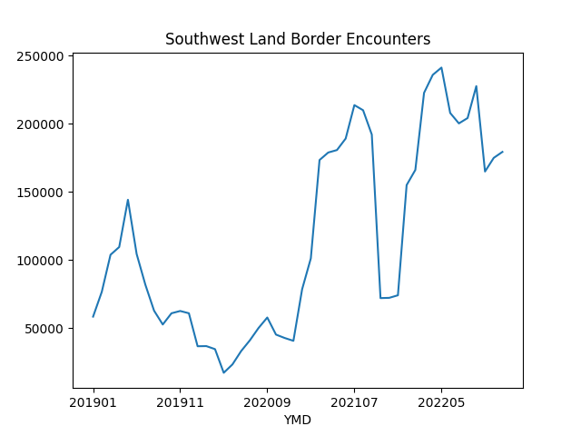
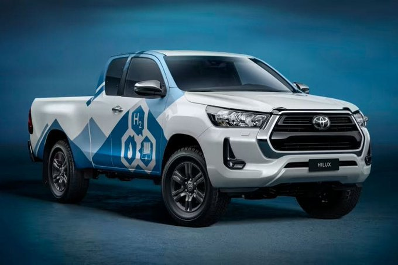
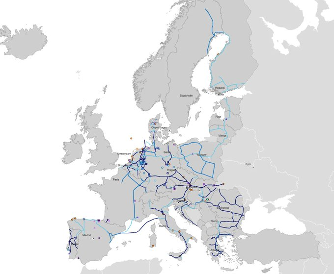
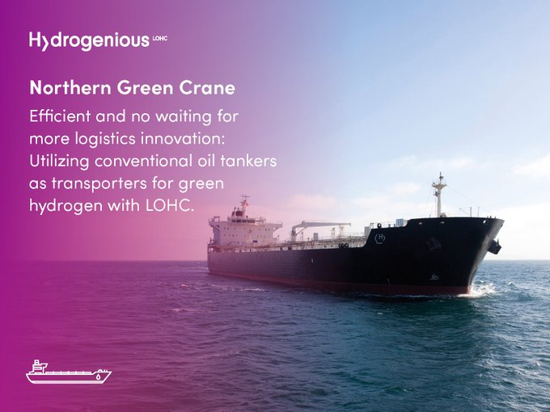

# Week 50 

NDTV: "Peru's leftist president Pedro Castillo was ousted by
lawmakers..

Mexican President Andres Manuel Lopez Obrador, one of Castillo's
staunchest allies, blamed 'economic and political elites' for a
hostile environment since the beginning of his 'legitimate
presidency.'

The government of Gustavo Petro, Colombia's first left-wing president,
called for dialogue involving 'all political actors,' adding that
'democracy requires the recognition of the popular will expressed both
in the elections for president and for Congress.'

Brazil was more critical of Castillo's actions, calling his attempt to
dissolve Congress a 'violation' of democracy and the rule of law"

---

Rewriting the Mastad code should be fine, as long as the protocol is
adhered to, communication between servers would work.. Don't like Ruby
(the current code)?  Rewrite it in, what's the hot lang these days,
Rust?  Go? Have at it..

---


"@DJGould94

Can an American please explain to me why Northwestern University is in
the northeast"

---

Hindustan Times: "Russia's intercontinental missile [was loaded into a
silo launcher] after US' patriot promise to Ukraine"

---

That guy is getting ready to get back in the saddle

TASS: "Viktor Bout says he wants to visit Donbass when opportunity arises"

---

H2 Fuel News: "First mega-scale green hydrogen production plant to be
built in Texas.. The renewable power to hydrogen project includes an
estimated 1.4 GW of wind and solar power generation, and an
electrolyzer capacity capable of producing more than 200 metric tons
of green hydrogen daily. This will make it the biggest green hydrogen
production facility in the US"

---

F24: "Mystery illness afflicts France players at World Cup"

---

H2 Fuel News: "Toyota has recently unveiled a new prototype hydrogen
combustion engine car called the Corolla Cross H2 Concept... The
vehicle is based on the GR Corolla equipped with a 1.6l 3-cylinder
turbo engine"

---

H2 Fuel News: "U.S. researchers [from UofSC and FSU] created hydrogen
fuel by mimicking [a process that is referred to as the Z-Scheme in
natural photosynthesis].. In their study, the scientists combined two
molecules. One was a photoredox catalyst, for instance a catalyst that
can move electrons with light. The other was naphthol, which is a
fluorescent organic compound.. These combined molecules were exposed
to light and each molecule absorbed a photon and then worked together
to produce hydrogen fuel."

---

"bp has invested $20 million in Australian solar innovator 5B.. The bp
funding will also open up big opportunities with Lightsource bp, which
is jointly owned by bp and has emerged as one of the biggest solar
project developers in Australia, and the world, with a goal of
deploying 25GW of utility scale solar by 2025"

---

H2 Central: "A Pathway to Help Make Scotland a World Leader in
Hydrogen Production has Been Published, to Produce 25 GW By 2045"

---

Kevin O'Conned getting tasty on FTX.. I wonder if he's scared a
little, if celebs can be sued for promoting this shit, why not any
other businessman for suggesting it to others?

---

"The glasses became half empty and not half full"

---

Investor: "A whole generation has forgotten about the late 1990s, and
so a lot of people who are buying these stocks or the Bitcoin
craziness never saw these things go down 90 or 99 percent like my
generation did. We saw a bull market phenomenon in the late 90s, and
when the market turned down and the glasses became half empty and not
half full, the access to capital dried up overnight. If you have
positive cash flow you can survive, but if your burn rate is really
high and capital markets shut down for six months, you’re dead"

---

H2 Central: "Matheson wins Large Hydrogen Business in
India... Matheson will invest in, and establish a large, multi-feed
hydrogen plant to supply up to 132 kNm3/hr (285 Tons/day) to NRL’s
refinery units at Numaligarh in Assam, India"

---

Science News: "Earth’s purported ‘nearest black hole’ isn’t a black hole"

---

"@PCMag@mastodon.social

Microsoft is banning cryptocurrency mining over its Azure data centers
unless the customer asks and receives permission to do so first"

---

H2 Central: "Project Launched to Create Hydrogen Highway from Scotland
to Rotterdam.. The LHyTS project seeks to demonstrate that LOHC, in
the form of methylcyclohexane (MCH), can be successfully transported
at scale, providing an export route to the Port of Rotterdam and other
European destinations"

---

Rule of Threes

Wiki: "You can survive three minutes without breathable air
(unconsciousness), or in icy water. You can survive three hours in a
harsh environment (extreme heat or cold). You can survive three days
without drinkable water. You can survive three weeks without food"

---

RSS is awesome. I wrote a simple 🐍 newsreader based on this
technology alone - it is amazing how many sites offer it... 

---

\#RSS \#Internet

[[-]](https://aus.social/@attacus/109499740512576514)

---

Eco Watch: "UK Could Require All New Boilers to Be ‘Hydrogen Ready’ by
2026"

---

👍 This would further demonstrate H2 can be used for anything. The magic molecule is
especially useful [for heating](../../2022/02/h2-end-use.html#heating).

H2 View: "UK Government backs hydrogen BECCS with £25m and opens for
consultation on mandating hydrogen-ready boilers"

---

H2 View: "Fortescue Future Industries (FFI) and Puget Sound Energy
(PSE) has signed a MoU to accelerate the clean energy transition in
North America"

---

It makes sense; Zack left bunch of disjointed stuff behind, and ppl
were piling more things on that.. unnecessary drama surrounding both
the scripts and the actors.. The new mgmt now doesn't have to deal
with it. This guy is the grand designer, worked with ensembles, can
make a character out of a freaking tree.  I'm psyched to see what he
does with it all.

---

James Gunn is wiping the slate clean. No more Snyderverse time for Gunnverse

---

For some months counts are over two hundred *thousand*. Massive

---

Major spike in people rushing towards the US southern border. Data from
[CBP](https://www.cbp.gov/document/stats/southwest-land-border-encounters).

```python
u.sw_border_encounter('2022-Oct/sbo-encounters-fy19-fy22.csv')
```



---

The German government is on MD too. That's great. 

[[-]](https://social.bund.de/explore)

---

"@mastodonmigration@mastodon.online

@TexasObserver @TucsonSentinel @restofworld Create Mastodon
Instances.. We've entered a new stage in the evolution of Mastodon
social media. Trailblazing media organizations are creating their own
instances–something impossible on other social media platforms...

'We wanted to create an authoritative presence in the fediverse, so
there was no doubt about who we are,' says Kit O’Connell @oconnell of
@TexasObserver"

---

Former Madoff lawyer, \#CNBC \#FTX. 

[[-]](https://youtu.be/pLmRwCmFFSw?t=11)

---

"Mathematical Models of Continua"

---

NeftegazRU: "Russia's own bid to become carbon neutral by 2060 is
expected to require major shifts in its energy strategy from oil & gas
to increases in nuclear and hydrogen production"

---

The draft might have played a role; >2 mil was drafted into Vietnam,
1% of population, that means more money was spent on people. Now
population of >300 mil has mil active personnel less than 1.5 mil. Gov
still deficit spends but if it all goes to Reytheon, Lockheed, from
there to some offshore haven, then to stawks, no inflation.

---

There is strong correlation with gov spending and inflation, but also
between growth and unemployment which makes sense, wages are major
contribution to inflation.

Doc mentions gov spending wasn't entirely for the war; LBJ did some
social spending (money went to ppl direct).

Inflation wasn't too high pre-73. Starting 73 it was but oil shortages
started then, and bunch of other stuff. Glad LBJ spent on social programs.

---

See [doc](https://www.thebalancemoney.com/vietnam-war-facts-definition-costs-and-timeline-4154921)
here. I took data below from it, shifted source vars one year ahead
to see causal effects better. 

```python
import pandas as pd, io

s = """
YEAR    DEFICIT GROWTH  INFLATION  UNEMPLOYMENT
1965    $1B     6.5%    1.9%       4.0%
1966    $4B     6.6%    3.5%       3.8%
1967    $9B     2.7%    3.0%       3.8%
1968    $25B    4.9%    4.7%       3.4%
1969    -$3B    3.1%    6.2%       3.5%
1970    $3B     0.2%    5.6%       6.1%
1971    $23B    3.3%    3.3%       6.0%
1972    $23B    5.2%    3.4%       5.2%
1973    $15B    5.6%    8.7%       4.9%
"""
s = s.replace("%","").replace("$","").replace("B","")
df = pd.read_csv(io.StringIO(s),sep='\s*').set_index("YEAR")
df['GROWTH'] = df.GROWTH.shift(1)
df['UNEMPLOYMENT'] = df.UNEMPLOYMENT.shift(1)
df['DEFICIT'] = df.DEFICIT.shift(1)
df.corr()
```

```text
               DEFICIT    GROWTH  INFLATION  UNEMPLOYMENT
DEFICIT       1.000000  0.123867   0.490311      0.264804
GROWTH        0.123867  1.000000   0.138173     -0.504883
INFLATION     0.490311  0.138173   1.000000     -0.138800
UNEMPLOYMENT  0.264804 -0.504883  -0.138800      1.000000
```

---

Not all gov spending causes inflation. Not all gov spending was
for the war.

"The government spending for the Vietnam war caused inflation"

---

"@isabelzawtun@mstdn.social

Gary Numan is 13 days older than Gary Oldman. I don't even know what
to believe any more"

---

Reuters: "Egypt approves $5.5 bln green hydrogen project in Ain
Sokhna"

---

Zigwheels: "Hydrogen-powered Toyota Hilux in the works.. Toyota’s UK
arm has recently received funding from the UK Government to develop
the prototype of the hydrogen-powered Toyota Hilux"



---

I still see links to that Quanta article - "wormhole created in the
lab". What they missed; it was all computer simulation. Hey I could create
entire cities in the lab; see [here](https://youtu.be/wjxVci-fWj4?t=85).

---

Barron's: "Buy Plug Power Stock, UBS Says. It Could Lead a Potential
$10 Trillion Hydrogen Market"

---

This stuff isn't outside the mainstream anymore, hitjobs will be
harder to execute. Better watch out

---

Andy Marsh's H2 company (Plug Power) picked up on it. [Here is](https://www.linkedin.com/posts/plug-power_plug-ceo-andy-marsh-was-honored-to-be-invited-activity-6976203348068704256-1a6S)
Marsh. 

---

*Glass Onion* - total hitjob. Talking down H2. Do these people want to
destroy the world? If one is against clean fuels, one is either
misinformed, ill-intentioned or a moron. There isn't a fourth option.

---

[There he is](ejagoffthiel2.jpeg), with his best friend

---

Merry band of corksuckers around Peter Thiel - that group is like a
knitting circle, they blabber on, visit each others 'podcasts', give
each other blowjobs.. They aren't contrarian in the least. There is a
clique, the clique has certain business interests, whatever is
suitable for those interests becomes the contrarian viewpoint.

---

H2 View: "Uniper, Shell announce contracts for blue hydrogen plans in Humber, UK"

---

"@hiveenergy

Hive [Energy's] renewable energy pipeline is over 23 GW! 

We have upcoming projects in 20 countries including Zambia, Spain, New
Zealand, Greece, and Croatia.

Not only are we working on solar projects, but we have wind, green
hydrogen, and green ammonia undertakings"

---

"By using high-frequency vibrations to 'divide and conquer''
individual water molecules during electrolysis, the team managed to
split the water molecules to release 14 times more hydrogen compared
with standard electrolysis techniques"

[[-]](https://mastodon.social/@sflorg/109506278652880699)

---

Arab News: "Indian, Chinese troops clash at border in fresh faceoff"

---

Arab News: "Australia, India deploy integrated combat formations in bilateral drill"

---

ALL OPTIONS ON THE TABLE. Talk is cheap.

Arab News: "US, allies vow all options on table against North Korea"

---

For its next-gen fighter plane Japan did not go with US, but went with
Italy (and UK) instead.. No to apple pie but yes to gabagool. Japan is
flirting with the inners? Or it's the other way around, Italy flirting
with the deep seafarers?

---

It looks swell.

Politico.eu: "Vision of the future: European [hydrogen infrastructure map](https://www.h2inframap.eu/#map)"



---

Are they interested? JD just called crypto "pet rocks"

"@twobitidiot

I wouldn't be surprised to see Coinbase as a hostile takeover target
by a big bank in 2023... with the debt at 15% yield and the decline
below $10 billion in market cap, it would cost Jamie Dimon ~5% of JPM
stock to buy the market leader outright"

---

15.6 GW is massive - that's a quarter of a Nordstream pipeline.

---

H2 LOHC Tech: One VLCC ship can carry up to 350,000 DWT which would be
equivalent to 17,000 tons H2. One train in Europe can pull up to 35
wagons which would be equivalent to 59 tons of H2.

A quick calculation shows the amount of energy that can be carried
across Atlantic by a fleet of 20 ships using LOHC techology,

```python
trip = 17000*1000*33.6 / (365*24*1e3)
print ("One trip, single ship %0.1f MW" % (trip))
print ("Fleet %0.1f GW" % (one_trip*12*20 / 1e3))
```

```text
One trip, single ship 65.2 MW
Fleet 15.6 GW
```

[PDF](https://www.hydrogen.energy.gov/pdfs/07-Schmidt-Liquid%20Organic%20Hydrogen Carriers.pdf)

---



---

Mastodon did not do anything revolutionary, it merely created a
protocol for different servers to communicate, and simple software to
manage the content. Now bigger companies (esp ones with existing user
base) can have their servers running a social net protocol, users can
communicate through it.

---

E-mail works via disparete servers too; GMail has its own servers,
Yahoo has theirs, they communicate through a protocol called SMTP. I
don't have to be on Yahoo system to email someone at Yahoo. Facebook,
Twitter work on a backward, suboptimal 'monolith' mechanism.. The
problem is, as usual, over-commercialization of a platform.

---

NBC: "New FTX CEO: This isn't sophisticated, this is just plain old
embezzlement"

---

CNBC: "Sam Bankman-Fried criminal charges unsealed: Conspiracy to
defraud the U.S., wire fraud, securities fraud, and money laundering"

---

Solid action out of Europe - it is welcome

Bloomberg: "Apple to Allow Outside App Stores in Overhaul Spurred by EU Laws"

---

The Verge: "[2022/6] USB-C will be mandatory for phones sold in the EU"

---

Added Morocco, Lesotho, Swaziland, Namibia, Mozambique, United
Republic of Tanzania on the map - mostly pro RU.

[[-]](../../2022/12/ru-africa.html)

---

Press Release: "Honda To Begin U.S. Production of Fuel Cell Electric Vehicles in 2024"

[[-]](https://hondanews.com/en-US/honda-corporate/releases/release-907c81858bdfe231c1cc3d0f701d89da-honda-to-begin-us-production-of-fuel-cell-electric-vehicles-in-2024)

---

The Jerusalem Post: "[A] test took place at an outdoor test facility
at a British military air base, using a converted Rolls-Royce AE
2100-A regional aircraft engine.. In the fight against climate change,
Rolls-Royce and easyJet have found a way to successfully test-run
hydrogen as an alternative to jet fuel.

---

"@shacker@zirk.us

Any machine is a smoke machine if you use it wrong enough"

---

"@kissane@mstdn.social

So Google search is increasingly vibing late-90s Alta Vista in a
casino, Facebook has melted into MySpace + Second Life, Twitter is
dogpaddling as hard as it can toward early 4chan but probably isn't
going to make it, people are making blogs again, and everyone wants to
talk to the ELIZA

Is the whole internet swimming back home to spawn and die, what is
happening"

---

H2 Central: "Could a Future Mustang Run on Hydrogen – Ford Patents
Turbocharged Hydrogen Combustion Engine"


---

I hear the argument but AMZN might be trying to adapt to a new environment
that requires cost cutting.

"Loss Leaders.. Why shuttering Amazon's Devices group may be a mistake"

[[-]](https://amazonchronicles.ghost.io/loss-leaders/)

---

Clean Technica: "More Hydrogen Fuel Cell EVs Are Coming.. With its new
test fleet of ix5 Hydrogen fuel cell EVs, BMW joins a growing list of
automakers that hold a torch for hydrogen-powered personal mobility"

---

I'm glad those muckers do not join

"@Mrfunkedude@mastodon.social

Someone told me that they would never join Mastodon because they can’t
buy followers for it"

---

\#OnePan \#OnePot

[Link](twimg/FjuQ1NmX0AAyBwn.jpg)

---

Fusion: finally obtained more energy than put in? The fusion expert on
Al Jazeera was nonplussed about it... Sounds like proper fusion is
still 30 years away. In the meantime clean fuel-based energy
transition needs to advance, fusion or no fusion.

---

Inflation down

```
2022-10-01  7.745427
2022-11-01  7.110323
```

---

"@jaredkalt@mastodon.social

Good analysis here of the internal ramifications of the Associated
Press' erroneous report of Russian missiles hitting Poland.  The
reporter was fired Monday [11/21], but internal communications suggest
a more complicated story"

[[-]](https://mastodon.social/@jaredkalt/109390745006067651)

---

Gerhard Narholz - Open Game \#music

[[-]](https://youtu.be/Is614XSOnxo)

---

There are these naive buffoonish O.G. purists who keep claiming their
shit O.G. coin (Bitcoin) is not the problem, it's those other stuff
around crypto that just keep failing. Not true.. BTC too is a problem.

---

WION: "Sam Bankman-Fried, ex-CEO of now-defunct crypto exchange FTX,
arrested in Bahamas"

---

Bloomberg: "[Max Reyes] Over the last year have had more events than
FTX. We've had the blow up of the Tera Luna ecosystem that led to the
collapse of Three Arrows Capital, the collapse of Celsius. With the
exposure to crypto, Silvergate, other companies with names like Micro
Strategy that just hold coins on the balance sheet have taken a
beating over the last year because of the anxiety. The blowup of FTX
accelerated and worsened the impact"

---

We have Tom Brady, Matt Damon on one hand pushing the stuff like a
dumbass, McKenzie on the other. More McKs will be good..

NYT: "Ben McKenzie Would Like a Word With the Crypto Bros.. The actor,
best known for his starring role in “The O.C.,” has become an
outspoken critic of a volatile market driven by speculation.. [A]s
A-list celebrities have shilled for digital currencies and NFTs,
Mr. McKenzie.. has written critically about the \#ad for little-known
coins that Kim Kardashian posted on Instagram and earnestly asked
Reese Witherspoon to stop proselytizing about the metaverse"

---

"An Open Letter from Editors and Publishers: Publishing is Not a
Crime..  The U.S. government should end its prosecution of Julian
Assange for publishing secrets"

[[-]](https://www.nytco.com/press/an-open-letter-from-editors-and-publishers-publishing-is-not-a-crime/)

---

"Why do lithium-ion batteries catch fire?"

[[-]](https://www.moneycontrol.com/news/automobile/ola-incident-why-do-lithium-ion-batteries-catch-fire-8291641.html)

---

Libs are mad the e-jagoff now but remember Obama created this cunt.
Jagoff was executing on that 'audacity of hope' business, being
audacious on hopeful sounding shit

---

🤣 🤣 🤣 

[[-]](ejagoffob.jpeg)

---

Name-dropped shit-company right in the SOTU speech. Hah

State of the Union 2015: "[T]here are also millions of Americans who
work in jobs that didn’t even exist 10 or 20 years ago -- jobs at
companies like Google, and eBay, and Tesla... Pushing out into the
solar system not just to visit, but to stay.. [we] will send American
astronauts to Mars"

---

"Toyota is getting ready to test its hydrogen combustion engine on the
streets..  The flexibility to utilize current internal combustion
engine technologies, rapid refueling times, and a pronounced decrease
in the use and requirement of materials with finite supplies like
lithium and nickel are some of the main advantages of hydrogen
combustion. Hydrogen combustion could result in broad, affordable
carbon-reduction solutions more quickly by modifying current
technologies and maximizing current investments"

via @Masa@indieweb.social

[[-]](https://interestingengineering.com/transportation/toyota-tests-hydrogen-combustion-engine-streets)

---

Al Jazeera: "Italy, Japan and UK to merge projects to develop new
fighter jet.. The deal aims to put an advanced front-line fighter
aircraft into operation by 2035, by combining the UK-led Future Combat
Air System project, also known as Tempest, with Japan’s F-X programme,
the three countries said in a joint statement on Friday"

---

Nikkei Asia: "Japan shuns U.S. to sign next-gen fighter plan with U.K., Italy"

---

Can't have it both ways - protect ISR from any repercussions and still
expect them to behave differently. 

Al Monitor: "[US is pressing UN] not to update a blacklist of
companies doing business in Israeli settlements, despite Washington's
calls on its ally to stop expansion in occupied Palestinian territory"

---

That's a lot of energy.. great to have that purchasing commitment
that will spur producers to innovate.

```python
"%0.1f Gigawatt" % (20*1e6*1e3*33.6/(365*24*1e6))
```

```text
Out[1]: '76.7 Gigawatt'
```

EU: "The REPowerEU plan's ambition is to produce 10 million tonnes and
import 10 million tonnes of renewable hydrogen in the EU by 2030"

---

F24: "The pipeline between Barcelona and Marseille -- also known as
BarMar -- will carry two million tonnes of hydrogen per year, or 10
percent of European consumption, once it goes online, said Spanish
Prime Minister Pedro Sanchez.

'It is going to be the first major hydrogen corridor in the European
Union,' Sanchez said.

The project will cost around 2.5 billion euros ($2.6 billion), he said
at a joint press conference with French President Emmanuel Macron and
Portuguese Prime Minister Antonio Costa.

The three leaders formally signed off on the plans in the presence of
EU Commission chief Ursula Von der Leyen on the sidelines of a
regional EU summit"

---

Reuters: "New Iberian pipeline to France will be exclusively for green
hydrogen, Portugal says"

---

<blockquote class="twitter-tweet"><p lang="en" dir="ltr">A new pipeline between Iberia and France will be able to transport up to 2m tonnes of green hydrogen per year and would start operations by 2030, Spain’s prime minister, Pedro Sanchez, said on Friday.<a href="https://t.co/K142vSDNHQ">https://t.co/K142vSDNHQ</a><a href="https://twitter.com/hashtag/H2?src=hash&amp;ref_src=twsrc%5Etfw">#H2</a> <a href="https://twitter.com/hashtag/hydrogen?src=hash&amp;ref_src=twsrc%5Etfw">#hydrogen</a> <a href="https://twitter.com/hashtag/gas?src=hash&amp;ref_src=twsrc%5Etfw">#gas</a> <a href="https://twitter.com/hashtag/energy?src=hash&amp;ref_src=twsrc%5Etfw">#energy</a> <a href="https://t.co/AtggeP0NEE">pic.twitter.com/AtggeP0NEE</a></p>&mdash; Montel News (@montelnews) <a href="https://twitter.com/montelnews/status/1601225426520752128?ref_src=twsrc%5Etfw">December 9, 2022</a></blockquote> <script async src="https://platform.twitter.com/widgets.js" charset="utf-8"></script>

---

H2 Central: "[Colombia’s majority state-owned oil company Ecopetrol]
to Invest up to $6.2 Bln in 2023n Focusing on Energy Transition,
Hydrogen Included"

---

Tesla books additional capex as "non-cash investing"? They basically
admit that they juice up their free cash flow. Noone records capex as
a non-cash investment. Fraud.

---

Merkel comments reveal NATO + Ukraine were "loading for bear" ever
since 2014 and were using Minsk only as a cover for their
buildup. They weren't interested in peace, but even more significant,
they ignored the larger strategic environment, the power balance, and
failed in their governance duties.

---

"@wilf@social.coop

Americans are tipping less, and service workers are bearing the brunt of it"

---

Al Monitor: "China and Saudi Arabia shy away from defense deals during Xi's visit"

---

Al Monitor: "Saudi Arabia, China sign over 40 deals during Xi's visit"

---

The Guardian: "Heatwave sweeps South America as Argentina hits 43C"

---

H2 Central: "Rio Tinto and Fortescue in talks on green hydrogen to
replace fossil fuels... Rio Tinto chief executive Jakob Stausholm has
contacted Fortescue Metals Group chairman Andrew Forrest to see if the
two mining heavyweights can find common ground on green hydrogen and
its potential to replace fossil fuels"

---

Financial Review: "[After the $4 billion acquisition of CWP
Renewables] Andrew Forrest .. through private interests.. immediately
becomes Australia’s largest owner of renewable energy assets, with 2.4
gigawatts of wind, solar and firming projects either operating or in
the late stages of construction, and a 20 gigawatt pipeline of
long-term projects, including CWP’s near-to-medium development
pipeline of 5 gigawatts"

---

Tesla Warranty Fraud

[[-]](https://gotmusked.com/content/warranty-fraud/)

---

*13 Hours* - fine Michael Bay work. Intl rel, military, based on true
story - my favorite kind of movie these days.

---

The Independent: "Russia still set on 'liberating' annexed portions of
Ukraine, says Kremlin"

---

Better to transmit clean fuels - [efficient](../../2022/01/wirespipes.html) and clean.

NPR: "Keystone pipeline spills in Kansas, dirtying creek .. Mill Creek
flows into the Little Blue River, which flows into the Big Blue
River. That, in turn, feeds Tuttle Creek Reservoir near Manhattan and
ultimately, the Kansas River"

---

Africa, US, RU map - added Angola, Togo, Nigeria.

[[-]](../../2022/12/ru-africa.html)

---

They lived in the Basque countryside? Of course they did. TN readers
would understand why.

"[Rod Whitaker, whose pen-name was Trevanian] married the former Diane
Brandon, and they had four children: sons Lance and Christian, and
daughters Alexandra and Tomasin. They lived for years in the Basque
countryside of France"

---

Wow.. Mutti dropped a bombshell here

"Merkel: Minsk agreements were meant to 'give Ukraine time'.. German
ex-Chancellor Angela Merkel reveals that in 2014, the Minsk agreements
aimed to give Ukraine time to get stronger and for NATO to increase
its support to the country in the face of Russia"

[[-]](https://english.almayadeen.net/news/politics/merkel:-minsk-agreement-attempted-to-give-ukraine-time)

---
