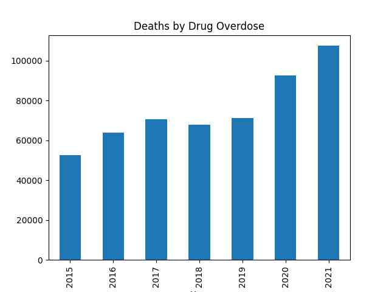
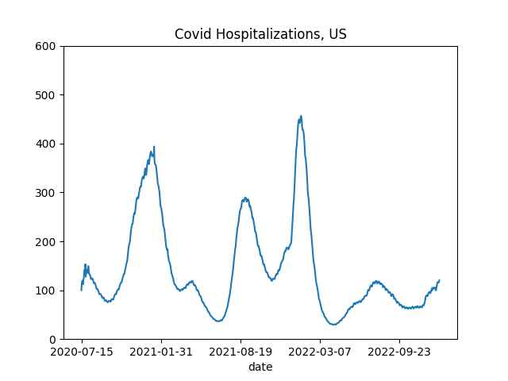

# Week 2

"@TheEuropeanNetwork@mstdn.social

The EU and Japan have registered the largest amounts of
hydrogen-related patents in the past decade, although the US is not
far behind, analysis by the European patent office shows"

---

Bloomberg: "China Has Set It Sights on Cornering Another Green Energy
Market: Hydrogen"

---

December inflation down,

```
2022-11-01  7.110323
2022-12-01  6.454401
```

---

```python
u.drug_overdose_deaths()
```



Data from [CDC](https://www.cdc.gov/nchs/nvss/vsrr/drug-overdose-data.htm)

---

A key founder of a TR nationalist party was of Jewish ancestry, born
in Greece, converted to Islam and considered Turk. This is the "Young
Turks" the Western media publicized back then (yes same ppl who were
the perpetrators of much crime later on - 'allegedly').

[[-]](../../2021/06/eternal-dawn-kemal.html#cavid)

---

Religion-Nationality is hiding deep categorization errors. Past
milenia saw many peoples around Asia Minor converting to Islam
including original Turks.. But 1920s TR nation recategorized all
Muslims as Turks. So then.. not everyone is a real Turk, is it, as in
from Central Asia riding a donkey arriving to Anatolia "bringing
civilization" there (basically Greek music, Greek food, Mediterrenian
customs, "brought culture" wink wink). 10% of Asiatic genes says it
all - the *latest* official identity of Asia Minor is patently false.

---

Notice how religion was used as national identity. Not many realize
but the 20s Turkification also took religion as the basis (but then
deemphasized the religion itself, later reemphasized after 80s
-confused yet?-).

"[T]he 1923 Treaty of Lausanne was drawn up in the peace
settlement.. both Greece and Turkey agreed to a mutual exchange of
populations, irrespective of those populations' wishes.  Greece
expelled approximately 600,000... while [TR..]  expelled about 750,000
Anatolian Greeks... (some were allowed to stay in Istanbul).  These
figures differ, depending on the source. In deciding ethnicity, the
criterion used was religion. A Turkish-speaking Orthodox Christian in
Turkey was thus considered Greek, and expelled to Greece, while a
Greek-speaking Muslim who knew no Turkish was considered Turkish and
expelled to Turkey"

[[-]](../../2021/07/lycian-history.html)

---

If minority culture does not even last [one generation](../../0119/2014/06/the-culture-code.html#heritage),
how could it last for millenia, across continents, varied host cultures?
That is the claim of the so-called Turks.

---

FCEVs need less metals, minerals especially rare ones. BEV tech is
suboptimal, unfit for wide adoption.

"@Hypx@mastodon.social

'Looming copper shortage shifts attention to alternative supply
solutions'. BEVs will exacerbate the copper problem"

---

Atlantic Council: "The exact volumes of gas currently lying deep
underneath the Black Sea are not yet known. Rough estimates predict
that the Ukrainian shelf may contain more than two trillion cubic
meters of gas"

---

CEO: "Medium embraces Mastodon.. The fediverse is a breath of fresh
air for writers and social media. Today, Medium is launching a
Mastodon instance at `me.dm` to help our authors, publications and
readers find a home in the fediverse. Mastodon is an emerging force
for good in social media and we are excited to join this community"

---

They are using [compressed](../../2022/02/h2-compressed.html) H2 cylinders
for storage. Lavo uses [metal hydrides](../../2022/02/h2-metal-hydrides.html).
There are many options in the H2 world.

PV Europe: "[2018] This March, Home Power Solutions (HPS) from Berlin
is rolling out its new fuel cells for home energy supply.. Picea can
generate both electricity and air heating.. [Their] PEM fuel cell
system runs on hydrogen. The gas is produced in the summer by
electrolysis when excess solar power is available. A certified
hydrogen tank stores the gas for the months when there is only little
sunshine"

---

Home Power Solutions: "Your solar electricity can be used as green
hydrogen all year round.. The energy centre is located in the basement
or utility room. Everything you need to provide a year-round solar
power supply fits into 1.5 m² of space"

---

[Link](https://drive.google.com/uc?export=view&id=1otuHBcDGHQmSAm0DUzDX71v0eNQN85vY)

---

How do I sum up this blog's stance in a single word? Bollocks

---

"@TheBapa@mstdn.social

A story not mine:- 'Last weekend my kids asked me what it was like
growing up in the '80s.  So, I took their phones and tablets off them,
locked them outside and told them not to come back till the street
lamps came on 😂'"

---

Forget FIFA games - this is the match I want to see

The Guardian: "Cristiano Ronaldo could face Lionel Messi for first
game in Saudi Arabia"

---

"@rifter@mastodon.social

.. 'I need a reverse Shark Tank where US oligarchs explain why they
deserve billions of dollars while standing in front of 5 people living
in poverty who work for them'"

---

Sundries: "[US] will launch the nation’s first passenger train powered
by hydrogen fuel cells. San Bernardino County (California) has already
signed a corresponding agreement. The first trains will start running
on the state’s railways in 2024. At the same time, the authorities are
ready to buy 25 more trains in the future"

---

Living in the Future's Past - Documentary, Jeff Bridges 

[[-]](https://youtu.be/ZJV0Kx7oGxU)

---

Verification for the "new social media" will be easy - governments run
their own MD servers, whoever they give usernames to are automatically
verified. For celebrities, or other notable characters for-profit servers
can offer a similar service.

---

Break-even point for Avatar 2 was 1.4 billion.. What was the budget?
🤔 Can reverse engineer it from profit estimation; Profit P, Gross G,
Budget B, Marketing M, $ P = G - (B + M + 0.4 \cdot G) $ breakeven
means the $P=0$, marketing half the budget as before, $ 0 = G - (B +
\frac{B}{2} + 0.4 G)$ rearrange $0.4 G = B$, G=1400, then budget could
be ~560 million.

*Lota* money.. the GDP of a small island nation.

Hey people love the movie and it is generating sales. Awesome.

---

You couldn't even help the country switch [to
cotton](../../2023/01/little-america-chandrasekaran.html#cotton) instead of
poppy seeds how else could you improve anything else? The point is
moot. You should be glad for getting ass kicked and finally leaving.

"But if we stayed longer in Afghanistan girls could go to school"

---

Five stars for *Pixels*, *Paul*, *Danger Close*.

---

HALO jump with oxygen masks? That has to be a 4 km jump at least.

*Act of Valor* - realistic, fine action.

---

Tesla Battery Mileage Fraud

[[-]](https://gotmusked.com/content/fudging-evs-battery-mileage/)

---

Top Speed: "Toyota’s Hydrogen Combustion Engine Has The Potential To
Make EVs Obsolete.. Toyota is taking a diversified approach to achieve
carbon neutrality and it could be a winning formula for the Japanese
automaker"

---

But the intent to repeal created deeper inter-party ideological
divisions on an economic issue, created less overall
unity.. great. One side is for the rich, the other side is, hopefully,
for the poor. Better to have arguments around econ rather than
everyone getting worked up over marginal secondaries, like gay-trans,
vaginas, or an ass crack.

---

The bill was a crowd pleaser act to show, practice some internal unity - 
that's all. WH will surely veto even if it magically passed the Senate.

Quartz: "Republicans’ first bill makes tax fraud easier for high earners"

---

Railway Gazette: "[China's] CRRC has unveiled a hydrogen fuel cell
powered train"

"@Andy_Scollick@mastodon.green

---

"Plans to establish a [€4 billion] \#GreenSteel plant with an integrated
\#hydrogen production facility in Inkoo, Finland, were announced by
Norwegian company Blastr Green Steel on Tuesday"

---

Bloomberg: "How Changing Diets Leave Us Exposed to War, Extreme
Weather and Market Turbulence.. The convergence of global diets means
just three crops provide 50% of the world’s calories... A combination
of rising incomes, the impact of Western culture and industrial
farming focused on specific crops means we are all eating increasingly
alike. And that means more of us than ever depend on imported
food. Wheat, now an integral part of most diets, is produced
predominantly by just a handful of countries. When Russia’s invasion
of Ukraine disrupted trade, global prices spiked almost 40%...Of the
6,000 plant species humans have eaten over time, the world now mostly
eats nine, of which just three — rice, wheat and maize — provide 50%
of all calories"

---

SP Langley: "[the scientific community is] a pack of hounds.. where
the louder-voiced bring many to follow them nearly as often in a wrong
path as in a right one, where the entire pack even has been known to
move off bodily on a false scent"

---

"@peterdeppisch@mstdn.ca

Germany and Norway reach #BlueHydrogen agreement.. 'Germany's RWE and
Norway's Equinor have agreed to supply Germany with #low-emissions
\#hydrogen fuel. The long-term plan is to provide 100% cleanly sourced
green hydrogen'"

---

Creating chaos in Ethiopia, Somalia.. Bring on the freedom 

Nasdaq: "Somalia rejected.. what it called an 'illegal claim' by
[UK's] Genel Energy GENL.L to oil exploration and exploitation rights
in the country's northern breakaway region of Somaliland"

---

Foreign Policy: "[2021-12] A one-sided U.S. approach provided
political cover to the [Ethiopian] TPLF insurgency...  Many Ethiopians
even fear that Washington actively backs the insurgency and is seeking
a Libya-Iraq-Somalia-style intervention to shatter Ethiopia and the
new efforts for regional peace that Abiy, for many, has come to
represent"

---

H2 Insight: "Prepare for lift-off | Why 2023 will be the year that
green hydrogen moves from idea to reality around the
world.. Government subsidy schemes are due to begin this year in the
US, EU, UK, Germany, and probably Canada, India and Portugal, all but
guaranteeing profitability for renewable H2 projects"

[[-]](https://www.hydrogeninsight.com/production/prepare-for-lift-off-why-2023-will-be-the-year-that-green-hydrogen-moves-from-idea-to-reality-around-the-world/2-1-1382245)

---

Hear hear the gaseous Sun crowd; how could two atoms be pressing
eachother if not for a solid/liquid backdrop? 

"What forces are involved that cause hydrogen nuclei to fuse? The
Sun's gravitational force confines the positively-charged hydrogen
nuclei.. to fuse to form the heavier helium"

---

Self-propelled howitzers and tank difference? On the surface they
might look similar but SPH is basically artillery on wheels. Tank
physically moves in an active battlefield heavily armored, heavily
armed, and ready for direct fire. SPH isn't as heavily armored as
tank, but can carry out indirect fire missions on targets that are not
in direct sight.

---

Janes: "[2022] Indonesia conducts loading trials of 155 mm howitzers"

---

Alex Cortiz - Return of the Funky Babies \#music

[[-]](https://youtu.be/jGgU3YGO11c)

---

H2 View: "[Dutch-based tank storage firm] Vopak and Hydrogenious LOHC
Technologies have revealed plans to launch a joint venture in a bid to
establish the first industrial-scale hydrogen supply chain using
liquid organic hydrogen carriers (LOHC)"

---

H2 View: "Indian state-owned power company, NTPC announced it had
started blending green hydrogen into a piped natural gas (PNG) network
at Kawas in Surat, Gujarat"

---

Posted about these guys two weeks ago via Bloomberg - now they are dead

Capitol Trades: "Silvergate Capital Crashes As FTX Collapse Fuels Bank Run"

---

Great analysis on the correlation between the mood in society and
scientific research culture of an era \#Lerner

[[-]](../../2023/01/the-big-bang-never-happened-lerner.html#era)

---

The clapping for Karzai photo shared previously was not a dig in admin
for quitting on an ally. It was about US invading and staying giving
ppl false hope against entrenched forces, and not helping a country
properly when they could.

---

*War Machine* paints the screw up that was the US involvement in AFG
well. The McMahon-Karzai scene; the general is just another US
official meddling.. US did not help the country, institutionally was
not capable. Another scene, general asks someone about growing an
alternate crop to poppy seed, the response was cotton is suitable, but
Congress will not let USAID help grow a product that will compete with
US farmers.

I searched for that exact quote in *The Operators*, movie's source
material, not there, but there is the story around few brave officials
[in this book](../../2023/01/little-america-chandrasekaran.html#cotton) who
tried to push cotton to supplant poppy in Afghanistan, and failing
thanks to USAID torpedoing the idea.

---

"@suramya@mastodon.social

India Approves $2.3 Billion Plan To Become Global Hub for Green
Hydrogen by 2030" via [TIME](https://time.com/6244782/india-2-billion-green-hydrogen)

---

"@opensciencedaily@mastodon.online

India approves national green hydrogen mission, adding 125GW of
renewables by 2030"

---

```python
df = u.covid_hospitalization() # per million ppl
```

```python
dfu = df[df.country == 'United States']['Daily hospital occupancy per million']
dfu.plot(title='Covid Hospitalizations, US', ylim=[0,600])
```



```python
dff = df[df.country == 'France']['Daily hospital occupancy per million']
dff.plot(title='Covid Hospitalizations, France', ylim=[0,600])
```


---

Did covid hospitalizations in the rest of the world increase due to CH
opening up? Data,

[[-]](https://github.com/owid/covid-19-data/tree/master/public/data/hospitalizations)

---

A German Pope trying to mend relations with Russians (their church)?
No no no.. That is a no-go my friend... Europe had to be *fighting*
Russians, not mend relations. Then Benedict resigned. 🤨

Newsweek: "At the start of Benedict's tenure in 2007, the
newly-installed pope met with Putin for what was considered at the
time to be the highest-level Kremlin-Vatican talks in more than three
years, with the pair focused on easing tension between Roman Catholics
and Orthodox Christians in the country"

---

Zucman: "As Roosevelt’s message to Congress expresses clearly, the
quasi-confiscatory top marginal income tax rates championed by the
United States were designed to reduce inequality, not to collect
revenue"

[[-]](https://forgeorganizing.org/article/triumph-injustice-boston-richmond)

---

All this stuff needs enforcement

[NYT](https://www.nytimes.com/2021/06/12/business/private-equity-taxes.html):
"Private Inequity: How a Powerful Industry Conquered the Tax
System The I.R.S. almost never audits private equity firms, even as
whistle-blowers have filed claims alleging illegal tax avoidance"

[Market Watch](https://www.marketwatch.com/story/irs-misses-substantial-tax-evasion-by-the-wealthiest-americans-this-study-calculates-just-how-much-11616502277):
"IRS misses ‘substantial’ tax evasion by the wealthiest Americans — far
more than the average worker"

[Bloomberg](https://www.bloomberg.com/news/features/2021-09-15/peter-thiel-gamed-silicon-valley-tech-trump-taxes-and-politics):
"According to IRS rules, if a Roth IRA account holder engages in a
prohibited transaction—like using the money to invest in a company you
legally control—then that person loses the tax break for the entirety
of the portfolio’s value. In Thiel’s case that would mean he could be
on the hook for a tax bill in the billions"

---

Not good... The repeal will serve the ultra-rich

McC: "Our very first bill will repeal Biden's 87,000 new IRS agents"

---

McCarthy SOTH speech: the key is what was left out - not a single
mention of Russia, Ukraine, but early mention of competition with
China.

---

TASS: "Ukraine’s economy and military potential are currently fully
dependent on the Western support while time is not on the side of
Ukraine, ex-US Secretary of State Condoleeza Rice.. and former US
Secretary of Defense Robert Gates.. said in a joint opinion piece
published by the Washington Post on its website on Saturday"

---
