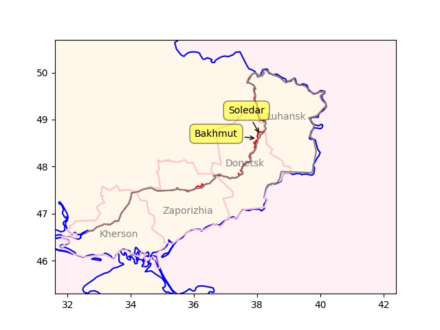

# Week 3

Construct the math, formulate concepts and code instead of shoving
data into a black box. This is the way.

TU Munchen: "Researchers.. have developed a model that enables a robot
to serve tea and coffee faster and more safely than humans – with no
sloshing... They based their mathematics on a Moroccan tea tray that
applies the principle of a spherical pendulum.. embed[ding] the
dynamics of a spherical pendulum into the robot’s control
software. That also means that the robot’s movements are limited by
the basic principles of geometry. With his team, he also integrates
the correct angles, speeds and accelerations into the model"

---

"@missy_lynn@mastodon.world

told my daughter to watch her attitude. she said for complaints about
her attitude, contact the manufacturer"

---

"@repepo@mathstodon.xyz

'Nature, to be commanded, must be obeyed.' - Francis Bacon"

---

TASS: "US takes agricultural commodities out of sanctions against
Russia — Treasury"

---

David Gold championed this idea and he was proven right. He was also
against the Big Bang theory.

---

Calcium carbonate is sedimentary rock, iron oxide is a component of
igneous rock. Water can certainly seep down from ocean floor, and
combine with the rest.

---

This means there is no need for 'fossils' for the production of
hydrocarbons, simple compounds present in the mantle at high pressure
/ temparature will do.

"[2004] We present in situ observations of hydrocarbon formation via
carbonate reduction at upper mantle pressures and
temperatures. Methane was formed from FeO, CaCO3-calcite, and water at
pressures between 5 and 11 GPa and temperatures ranging from 500°C to
1,500°C... The study demonstrates the existence of abiogenic pathways
for the formation of hydrocarbons in the Earth's interior and suggests
that the hydrocarbon budget of the bulk Earth may be larger than
conventionally assumed"

[[-]](https://www.pnas.org/doi/10.1073/pnas.0405930101)

---

TASS: "Ukraine redeploying troops from Zaporozhye region to Donbass"

---

"@ShekinahCanCook@universeodon.com

If you live in Kentucky, please send the state legislature a message
of support for House Bill 21, which makes it easier for homeless
people to get state IDs so they can register for the help they qualify
to receive but aren't [due to Rep shenanigans]"

---

MLK: "We have fought hard and long for integration.. and I know we
will win, but I have come to believe that we are integrating into a
burning house... I’m afraid that even as we integrate, we are walking
into a place that does not understand that this nation needs to be
deeply concerned with the plight of the poor and disenfranchised"

---

"@TheRaDR@mstdn.social

[MLK] "When machines and computers, profit motives and property rights
are considered more important than people, the giant triplets of
racism, extreme materialism and militarism are incapable of being
conquered'"

---

"@BrentToderian@mastodon.online

'Someone with a 1-hr car commute needs to earn 40% more to be as happy
as someone with a short walk to work'" via Fast Company

---

H2 Central: "The Albanese Government is turbocharging Australia’s
green hydrogen industry, with a $70 million investment to support the
development of a hydrogen industry in North Queensland"

---

H2 Central: "Larsen & Toubro, an Indian multi-national engaged in EPC
Projects, Hi-Tech Manufacturing, and Services, announced the signing
of a Memorandum of Understanding (MoU) with the Norway-based H2Carrier
(H2C) to co-operate towards developing floating green ammonia projects
for industrial-scale applications"

---

Reuters: "India OKs $2 bln incentive plan for green hydrogen industry"

---

H2 Fuel News: "Porsche hydrogen engine prototype outperforms
8-cylinder gasoline engine"

---

Russia was being shelled in Kherson City, they pulled out, Ukraine
moved in, now they are being shelled by Russian forces \\(ツ)/ eyyy
(medi shrug). The river line proved to be defensible. UA
counteroffensive there stalled.

---

BKM is major strat point; Ukraine sacrificed much to hold on to it..
One could even argue the counteroffensive last year was done partly to
shift the focus elsewhere when the battle there was not going well.

But things are now back to where they were; RU shored up the South, 
and now moving ahead with plans taking the rest of Donetsk.

---

Latest frontline in Ukraine (in red), compared to 2022/11
(gray). Gains in Soledar, also south of Bakhmut. RU will surely
attempt to encircle BKM. Some gains in Zaporizhia too?  The start of
something from there perhaps, with plans of pushing towards the north.

```python
geo = [['Soledar',48.68207521, 38.0896357,(5,20)],
       ['Bakhmut',48.59681687, 37.9957181,(-20,0)]]
u.sm_plot_ukr1('ukrdata/fl-0116.csv','ukrdata/fl-221115.csv',geo)
```



---

Al Jazeera: "China reports almost 60,000 COVID-related deaths in past
month"

---

H2 Central: "Masdar Signs Agreement to Explore Exporting Green
Hydrogen from Abu Dhabi to Europe"

---

TASS: "Kazakh companies purchase Russian sovereign bonds worth $1.4
bln — Bloomberg"

---

Automative World: "Cummins: hydrogen ICE to take off from 2024..The
engine specialist shares its outlook for hydrogen-powered internal
combustion engines in heavy trucking... it falls to Jim Nebergall as
General Manager of the Hydrogen Engine Business to steer its global
efforts in commercialising hydrogen-fuelled ICE specifically. 'There
is interest here because the technology is low cost in nature and
represents a zero-carbon option,' he says. 'On the whole, it offers a
significant boost for the decarbonisation of commercial vehicles with
a technology that customers understand.'"

---

Disney's overwhelming slew of cuck repertoire surely is not helping
matters - spending too much gaining too little.

---

2.48 billion in debt payments son.. The shareholder was already
strapped for earnings, that payment killed them. That would piss a man
off

```python
u.biz_cash("DIS")['totalCashFromFinancingActivities'] / 1e9
```

```text
Out[1]: 
2022-01-01   -0.292
2022-04-02   -1.817
2022-07-02   -0.150
2022-10-01   -2.482
```

---

A lot of debt, due to Fox deal likely.

```python
u.biz_balance("DIS")['longTermDebt'] / 1e9 # in billions
```

```text
Out[1]: 
2022-01-01    47.349
2022-04-02    46.624
2022-07-02    46.022
2022-10-01    45.299
Name: longTermDebt, dtype: float64
```

---

He is right DIS earnings went to shit. 0.09? This is a joke.


```python
u.biz_eps("DIS")
```

```text
Out[1]: 
2022-01-01    0.605399
2022-04-02    0.257733
2022-07-02    0.772652
2022-10-01    0.088836
```

---

CNBC: "Disney is facing a proxy fight as Nelson Peltz’s activist firm
Trian Fund Management pushes for a seat on its board... Peltz.. raised
issues with Disney’s $71 billion acquisition of Fox in 2019 and how
the company’s shareholder value has eroded in recent years"

---

H2 Fuel News: "In New Orleans, the technicians at NASA’s Michoud
Assembly Facility have taken the next step forward in the production
of the liquid hydrogen tank for the Artemis III mission"

---

H2 Central: "Report: UK Risks Losing Hydrogen Innovation Race, with EU
And Japan Pulling Ahead"

---

Cory Doctorow: "As I type these words, a mass exodus is underway from
Twitter and Facebook... [T]he long-delayed MySpacing of Facebook and
Beboizing of Twitter began"

---

*The Eagle*, there was enough criticism of imperialism, of Rome that
one can mentally skip over opression of distant locals (Brits!), and
the Roman "heroes". The movie can be seen as being about brothers in
arms, ppl fighting together, for something, even if that something was
Rome, an expansionist band of feudal cobsuckers.

Well written, directed, acted - five stars without a doubt.

---

Hand crafted code could have its own issues, but NN based approaches
are especially fragile, they are too dependent on data - data that is
curated for a specific purpose.

---

Yes BD control code is hand-crafted. Preferable than neural net based
"AI", at least they are trying to formulate an approach from ground
up, thinking about the problem, not blindly showing in data into a
black box.

Quora: "How does Boston Dynamics use AI/machine learning? For the most
part, it doesn't. Boston Dynamic's secret sauce is a “stack” of very
carefully hand-designed classic control laws... It's good because
classic control theory provides strong mathematical guarantees of
stability and performance, and this does not require *any*
'training'. It just works, right out of the box, assuming you get the
control design right.. Nobody has yet figured out how to apply machine
learning to robotic motor control in a practical way. Machine learning
takes far too much data, typically hundreds of thousands to millions
of trials. You can't collect that much data on a real robot. And
simulation isn't good enough, yet, for simulated data to transfer
without change onto real robotic hardware"

---

Bad smells coming out of Sweden; the "Nobel" Econ Prize is funded by
their Riksbank BTW, and the last one went to people who ardently
argued for "saving the banks".

---


H2 Central: "India Sets Targets for Green Hydrogen Use by Some Industries"

---

Why Not Mars

[[-]](https://idlewords.com/2023/1/why_not_mars.htm)

---

The head of the oil company, Al Jaber, supports blue H2
	
"The United Arab Emirates has picked the head of its national oil
company as president of this year's COP28 climate talks"

---

Al Monitor: "Brazil’s Lula fires Israel ambassador as part of
pro-Palestine shift..Former President.. Bolsonaro was a strong
supporter of Israel and friend of Prime Minister Benjamin Netanyahu"

---

TASS: "Taking Soledar under control makes it possible to advance
toward Slavyansk and Kramatorsk and paves the way for [taking all of]
Donetsk"

---

TASS: "Ukraine lost about 25000 people in struggle for Soledar"

---

TASS: "Russian troops complete liberation of Soledar, top brass
reports"

---
