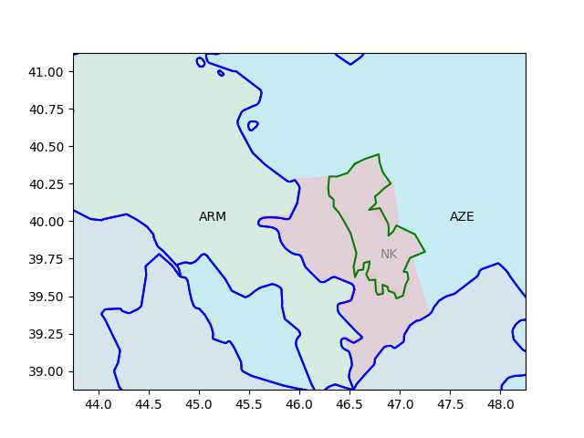
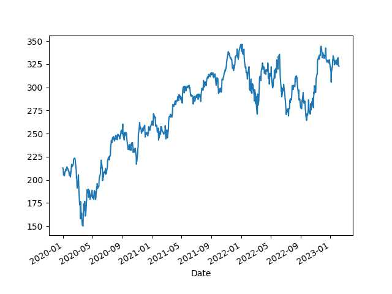
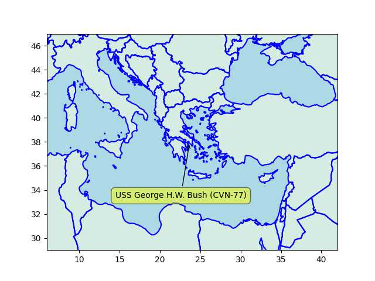

# Week 6

Sad \#OpenGraph

[[-]](https://mastodon.social/@MikeBlazer/109828086651109401)

---

"@raito@nixos.paris

Presented without comments"

[[-]](https://nixos.paris/system/media_attachments/files/109/807/131/196/194/594/original/b451cc8794dda6cb.png)

---

Electrification mantra was foolish an idea marketed as a new solution
simply bcz it sounded contrarian. Fuels were always the optimal
solution, we merely needed a clean one \#H2 \#NH3

---

Still the total projected cost of F-35 project is at $1.7 trillion.
That's a lot of money... I suspect price-performance ratio of this
project is pretty high.

---

There've been some pushback against this view recently coupled with
better numbers at dogfighting, but, interesting ..  Smoke coming out
of a fire, or just smoke.. as in somebody's blowing it

TDB: "[2015] Air Force Admits: Our New Stealth Fighter Can’t
Fight.. The F-35 Joint Strike Fighter is supposed to replace almost 90
percent of America’s tactical aviation fleet. Too bad it ‘wasn’t
optimized for dogfighting,’ according to the Air Force"

---

"@carnage4life@mas.to

180,000 users have paid for blue checks in the past two months which
will generate under $25M/year for Twitter. This is a drop in the
bucket for their revenue goals and less than 0.5% of pre-acquisition
revenue.

Also revenue is down -40% since acquisition"

---

Right now there is a running server at `router.project-osrm.org` with
all of OSM's data. After the apocalypse you'll be running that
locally. It's easy.

---

Driving from Boston to Wyoming..? For f sake

```python
import requests, json, polyline, folium

lat1,lon1 = (42.36880059119,-71.141522762)
lat2,lon2 = (41.125673090,-104.835825219)
url = f'http://router.project-osrm.org/route/v1/driving/' + \
      f'{lon1},{lat1};{lon2},{lat2}?alternatives=false&steps=false'
response = requests.get(url, verify=False)
resp = json.loads(response.text)
decoded = polyline.decode(resp["routes"][0]['geometry'])
map = folium.Map(location=(lat1,lon1),zoom_start=5,control_scale=True)
folium.PolyLine(locations=decoded, color="blue").add_to(map)
```

[Directions](bos_wyo_dir1.html)

---

For mobile Unix computing A Raspberry Pi will do - power it up with
solar, run micro web server on it access thru local wifi / smartphone
hotspot, view pages served from Pi on the phone's browser.

---

OSM data is produced by volunteer contributors. Freely available,
anyone can contribute.

---

Getting stuck with paper maps after the Zombie Apocalypse? C'mon. To
get ready for that aftermath, need a recent copy of all the files
[here](http://download.geofabrik.de/). There is open source software
that can read those files, it can extract the road network, compute
driving directions, report on POIs from it.. The files aren't too
sizeable, compared to the value they can provide.

---

<iframe width="340" src="https://www.youtube.com/embed/bP5dkR6QQj8?start=169&end=325" title="Jimmy Dore Brings ANTI-WAR Message To Fox News" frameborder="0" allow="accelerometer; autoplay; clipboard-write; encrypted-media; gyroscope; picture-in-picture; web-share" allowfullscreen></iframe>

---

E&E News: "Census: Disasters displaced more than 3M Americans in 2022"

---

FT: "Alphabet shares fall sharply after Google's AI chatbot debut stumbles"

---

H2 Central: "PowerCell has joined the Newborn project, part of EU’s
Clean Aviation Joint Undertaking, that aims to develop environmentally
sustainable aviation... The EU´s Clean Aviation Joint Undertaking
encompasses a total of 20 projects with a budget exceeding EUR 700
million and aims to support the EU Green Deal."

---

He's here

 

---

When region geo points are not available, what do we do? Reverse-eng
from images, as in pictures of that area... Custom UI displays img,
captures clicks on it, trace area on that manually, get pixel data, w/
two pixel-geo ref points reverse-engineer geo coordinates. Easy as Py.

---

The Azeris had some  help from the poodle, and the poodle's poodle.

---

After the 2020 war they lost all the surrounding areas and some of NK,
now down to the yellow area, Russkie peacekeepers are all around that
region plus guarding the Lachin crossing (red line).

```python
u.sm_plot_azearm3()
```

[[-]](azearm3.jpg)

---

ARM had areas around NK too (in pink). 

```python
u.sm_plot_azearm2()
```

 

---

2020 AZE-ARM fighting was pretty bad - over Nagarn-Karabakh. NK is
outlined below.

```python
u.sm_plot_azearm1()
```

[[-]](azearm1.jpg)

---

Have to pick dried vegs carefully; beet root, dried mangold.. Carrots
are good for eyesight, but its high potassium will create tiredness,
beets are perfect. Spinach is fine, but too high on iron.. mangold is
bland, just as rich in vita.

---

Left Voice: "Everything You Need to Know About Sahra Wagenknecht’s
'Left Conservatism'.. Die Linke has a program calling for 'open
borders.'  Wagenknecht became convinced that this — and this alone —
was why her party was losing support in the East, where it was once a
Volkspartei, a mass party.. [Her book] is a 345-page diatribe against
what she calls 'identity politics' [that] 'amounts to focusing on ever
smaller and ever more bizarre minorities, each of which finds an
identity in some quirk which distinguishes it from the majority of
society, and from which it derives the claim to victimhood'"

---

"Die Linke politician [Wagenknecht].. is rumoured to be planning a
breakaway party.. In her bestselling book [.. she] accused Die Linke
of having neglected 'ordinary people' in favour of what she refers to
as a city-dwelling 'academic clientele'. She says its preoccupation
with issues such as 'gender-conscious language and pricey organic
products' rather than bread-and-butter issues such as 'fighting low
pay' has made it a stranger to its grassroots working-class support
base... Polls show her chances of succeeding as head of a new party to
be good... Among [right-wing] AfD voters the interest was a staggering
68%"

---

[Link](../../2023/02/keiser-unrigged.html)

---

Bloomberg: "[2018] Russia Supports Political Role for Qaddafi's Wanted
Son in Libya"

---

That's a good catch by WION, AK came to power on the back of public
discontent around the earlier 99 earthquake.. They mention the AK era
construction craze, also accurate.

---

TR earthquakes - who is to blame? \#WION

[[-]](https://youtu.be/dA4LIcRpavQ?t=73)

---

"@carnage4life@mas.to

Did a half empty plot of commercial real estate write this?"

[[-]](https://media.mas.to/masto-public/media_attachments/files/109/810/150/434/890/652/original/9f5d93fa3aec10c5.jpeg)

---

"@eunews@mstodon.eu

Africa is likely to be Europe's most important partner as it looks to
increase its renewable energy supply and switch to green hydrogen, EU
climate chief Frans Timmermans told EURACTIV in an exclusive
interview"

---

:) "The energy in the room felt vaguely like the end of a Zoom meeting"

---

H2 Central: "Mitsubishi Shipbuilding and INPEX Complete Conceptual
Study for Ammonia Bunkering Vessel"

---

```python
u.biz_stock_plot(2020,"LIN")
```

 

---

H2 View: "Linde to supply hydrogen to OCI’s blue ammonia plant in
Texas, investing $1.8bn"

---

"Linde to Increase Green Hydrogen Production in California"

---

"@Hypx@mastodon.social

John Cockerill Records India’s Largest 140MW Electrolysers Order from
Greenko for the First Indian Green Ammonia Plant"

---

CNBC: "[2019] Sen Marco Rubio takes aim at stock buybacks"

[[-]](https://www.cnbc.com/2019/02/12/rubio-backs-new-proposal-to-tackle-stock-buybacks.html)

---

Market Watch: "Biden on Tuesday night will call for quadrupling the
tax on corporate stock buybacks, the White House said Monday"

---

Why ChatGPT won't kill journalism - Media Watch

[[-]](https://youtu.be/--rFxctTLrg?t=549)

---

Euractiv: "Nine EU countries want low-carbon hydrogen included in
bloc's renewables goals"

---

Reuters: "France leads push for EU to boost nuclear-produced hydrogen"

---

Renew Economy: "South Australian government.. intends to build a 250MW
hydrogen electrolyser – 10 times bigger than any other operating plant
in the world – to feed into a 200MW hydrogen power plant, which would
also be the biggest in the world.

The man in charge of this ambitious project is Sam Crafter, the CEO of
the Office of Hydrogen Power in South Australia"

---

I thought Ardern was ok.. had child mid term prob got stressed out due
to work-life, quit to spend time w kid, there is no shame in
that. Served, and now out; but she's young might come back who knows..

---

Prev PM was careful around this issue too

TASS: "New Zealand not to participate in AUKUS partnership, [new] PM
Hipkins reaffirms"

---

*Plane* with G. Butler, M. Colter - great movie.

---

A Richter 7.5 and 7.8 within a day???

---

Earthquake \#TR

```python
df = u.eq_at(lat=38,lon=39,radius=300,ago=10)
df = df[df.mag > 6.0]
u.sm_plot_list1(38, 39, 0.5, np.array(df[['mag','lat','lon']]))
plt.text(37.355759, 37.05983787,'Gaziantep')
plt.text(37.170340, 36.19170861,'Aleppo')
```


---

WaPo: "The Big Tech companies that won dominance of the internet
brought in billions of dollars a year, spending it on eye-popping
salaries, gleaming offices and constant acquisition of smaller
companies.

But the past year of rising interest rates and falling stock prices
has shaken the industry, along with the San Francisco Bay region it
dominates. Now, tens of thousands of layoffs from Google, Microsoft,
Amazon, Facebook and dozens of other companies have made it clear: The
golden age is over. Speeches about austerity have replaced the
free-flowing stock grants and free sushi lunches"

---

ABC News: "Honda is expanding the use of hydrogen to trucks and
construction equipment, electricity for buildings and even in outer
space, not just cars on roads..  [The company] plans a new fuel cell
vehicle for sale next year, packed with a fuel cell stack developed
with General Motors Co. of the U.S., its general manager, Testsuya
Hasebe, told reporters..  That will lower the cost of the fuel cell
stack to a third of what it is now, he said"

---

This new age of durability can help prev shared poultry mix to last
longer... good

---

Yogurt used to go bad, now it doesn't. Seriously it'll stay for weeeks
and still good esp certain brands.. Read some of the processing they
do, heat, cool, add yeast, heat, cool, goes on and on.. I guess
whatever bacteria is in there gets smacked around really bad. Mfkers
are like f.. this Im outa here.

---

Phys.org: "[Adelaide Professors Shizhang Qiao Yao Zheng] 'We have
split natural seawater into oxygen and hydrogen with nearly 100
percent efficiency, to produce green hydrogen by electrolysis, using a
non-precious and cheap catalyst in a commercial electrolyzer'. A
typical non-precious catalyst is cobalt oxide with chromium oxide on
its surface"

---

TASS: "Lithuanian imports of Russian LPG rise 8.5-fold in 2022"

---

 

---

"[A]s of 2023, open source really has won. There are more Unix-like
OSes than ever, and some very un-Unix-like OSes which are highly
compatible with it, but the official line [about Unix's death] is, to
all intents and purposes, dead and gone. All the proprietary,
commercial Unixes are now on life support: they will get essential bug
fixes and security updates, but we won't be seeing any major new
releases.

Send flowers. ®"

[[-]](https://www.theregister.com/2023/01/17/unix_is_dead/)

---

"@digiconomist@mastodon.nl

.. Yesterday Bitcoin mining company Luxor mined the largest block ever,
containing almost exactly 4MB of data. Only 63 transactions could fit
into the block, as the NFT used up the rest of the available space

The carbon footprint: ~888 metric tons of CO2, equivalent to the per
passenger carbon footprint of taking a flight from New York to Tokyo
and back - 466 times"

---

But overall a lot of hardware is parked stateside and Japan, not a war-time
mobilization.

[[-]](../../2023/01/usmil.html#navy)

---

One carrier is at a Greek port

```python
df = u.usnavy(); u.sm_plot_list1(38, 24, 2.0, np.array(df[['name','lat','lon']]))
```

 

---

Some groups in TR are in a tizzy on US warships - one docked in Stanpoli?

---

<iframe width="340" src="https://www.youtube.com/embed/38fC172MTEk" title="The race to find clean fuel: Ammonia-powered transportation" frameborder="0" allow="accelerometer; autoplay; clipboard-write; encrypted-media; gyroscope; picture-in-picture; web-share" allowfullscreen></iframe>

---

The Guardian: "Six states in the western United States that rely on
water from the Colorado River have agreed on a model to dramatically
cut water use in the basin.. [the] river [is] stressed by drought and
overuse"

---

H2 Fuel News: "GP JOULE ordering over 100 Nikola hydrogen trucks"

---

H2 Fuel News: "BP considering German hydrogen hub"

---

There's been no treaty after Cold War.. Treaty after Thirty Years'
War, treaty after WWI, treaty after WWII, nothing after the Cold War?
Forget Europe, Japan and Russia are still at war today - legally
speaking. Same for North and South Korea.

---

Whatever SOTA is, e-jagoff's company is surely below it. 

Insider: "Mercedes-Benz 'Drive Pilot' surpasses Tesla's autonomous driving system"

---

Mercedes-Benz: "At the time of this publishing, Drive Pilot's ODD
[Operational Design Domain] is limited to fully access-controlled
highways (commonly called 'freeways') up to a specific maximum
speed. (A fully access-controlled highway is defined as a divided
highway with at least two lanes of traffic in each direction that has
no intersections – only on-ramps and off-ramps.).. ODD is further
restricted according to the presence or absence of certain road
features and/or conditions, such as:

• Machine-detectable lane markings

• The absence of tunnels, toll booths and traffic control devices
(stop signs, traffic lights, etc.)

• Applicable legal requirements

The resulting ODD boundaries (including available routes) are defined
within a precise, high-definition map.  These boundaries comprise the
“geo-fence” for the area of operation of Drive Pilot; it will not
allow the driver to engage the feature, nor will the feature operate
the vehicle, outside of these boundaries"

[PDF](https://group.mercedes-benz.com/documents/innovation/other/2019-02-20-vssa-mercedes-benz-drive-pilot-a.pdf)

---

Mercedes self-driving reached Level 3 - one of the highest right now,
but even its abilities are pretty limited.

---

"@drewharwell@mastodon.social

New: Memphis spent $10 million installing thousands of 24/7
police-linked surveillance cameras, called SkyCops, on the promise
they'd deter crime. But crime's only gone up. And even the cops who
beat Tyre Nichols to death weren't deterred" via WaPo

---

2022 police shootings data is now all in. Data file location changed,
its content too somewhat.. The increase of 'Other' category for 2021
was [higher](../../2023/01/allshoot1.png) previously which I'd interpreted
as they were simply not recording the race, fudging the numbers.

But an increase of overall killings for 2022 is clearly visible. 

[[-]](../../2023/01/us-crime.html#allshoot)

---

H2 Central: "The H2 retrofit kit proposed by SAFRA, registered under
the brand name H2-PACK®, and supported by ADEME, the French Agency for
Ecological Transition, is a real technical achievement which enables
the transformation of a diesel coach into a Zero Emission vehicle
running on hydrogen"

---

Putin's gonna Putin. Opposing leader's job is to make sure things did
not escalate to this situation... I won't sit here and repeat the
"evil Putin" mantra just to cover up someone else's fuck up

---

Why won't Russia follow the rules-based-order? They won't follow your
rules if they are not part of the order. In fact, it looks like the
order was built to freeze them out... Which lead to Ukraine.

---
