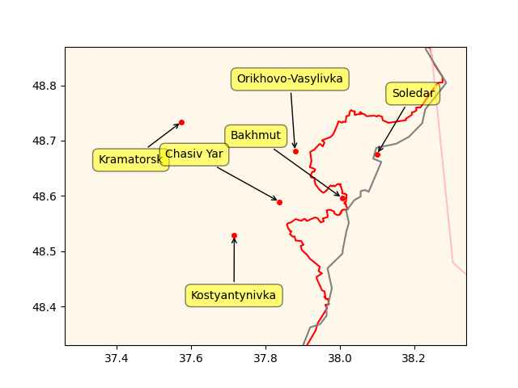
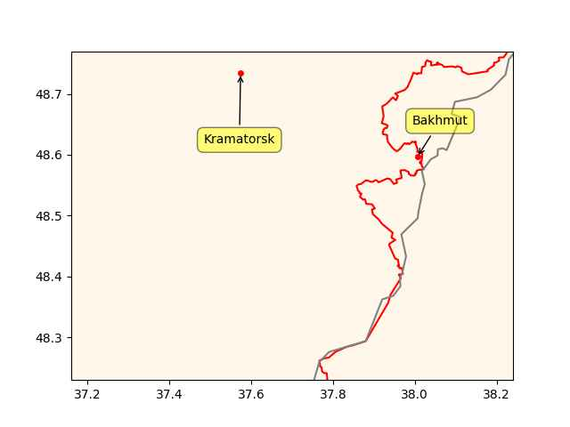

# Week 10


In regular business ppl compete, excesses can be handled at the
courts.. Guy stepping over your IP, sue. But drug cartels are by
definition outside the law; so conflicts are handled by the gun. In
Tijuana they fight over access to trade routes, supply, manpower..
It's business. Regular people are caught in the crossfire.

---

Right across the border from Tijuana is San Diego; US has demand,
money, Mexico has product. Narcotics is an extremely [high-margin](0119/2017/07/the-next-decade-friedman.html#drugs)
business, product is easy to produce, and not fragile like electronics,
once certain hurdles are overcome, u could even catapult it over the wall
from Tijuana to San Diego. So high demand check, ease of production check,
-physically speaking- easy to transport check.

Then the product is made illegal. How could this backdrop not lead to
rampant violence?

---

Media calls the new police chief in Tijuana "Mexico's Rambo"... They
like these catchy phrases.. But the general environment is not
favorable for the chief.

---

Euractiv: "[The EU] Commission moves towards halting emergency use of
all banned pesticides"

---

"@Jake_Vig@mastodon.online

SCIENTISTS, PLEASE STOP, WE GET IT, YOU CAN DO ALL SORTS OF THINGS..

'CNN: Scientists have revived a 'zombie' virus that spent 48,500 years frozen'"

---

"@keubiko

SIVB CEO is clearly an incompetent clown.  Not only did he buy long
duration asset for almost no incremental yield pickup, but he uttered
the words 'stay calm', which is Banker Speak for 'run for your lives,
muthfucka!'"

---

Investor's Business Daily: "SVB Financial Fails; Many Bank Stocks Still Reeling"

---

Al Monitor: "The United Nations has bought a ship to remove oil and
avoid a potentially catastrophic spill from a tanker decaying for
years off the coast of war-ravaged Yemen"

---

The scheme is also open for cheating; companies can take their carbon
from anywhere do some shady biz just like Volkswagen in 2009-2015. And
guess which company is pushing for e-fuels the most.

Reuters: "E-fuels are made using CO2 captured from the atmosphere and
hydrogen extracted with renewable electricity, and can be used in any
conventional combustion engine. While they do release CO2 from the
tailpipe, it's just releasing what was captured in creating them,
hence the claim to carbon neutrality.. [But] carbon offsetting won't
do anything to reduce the pollution and health effects caused by
tailpipe emissions"

---

"@caseynewton@mastodon.social

NEW: Meta is building a decentralized, text-based social network that
will support ActivityPub. The company confirmed that it is in the
early stages of the project to Platformer exclusively"

---

H2 Central: "[Trudeau] announced that Ottawa has signed a new hydrogen
agreement with the European Union"

---

😆 😆 😆  Steering wheel just came off? It is tragically hilarious..
but I have to say, not too surprising.

LA Times: "U.S. investigates Tesla for steering wheels that can fall off"

---

Seymour Hersh: "[W]hy did much of the secret planning and training for
the [Nord Stream sabotage] operation take place in Norway?  And why
were highly skilled seamen and technicians from the Norwegian Navy
involved? The simple answer is that the Norwegian Navy has a long and
murky history of cooperation with American intelligence"

[[-]](https://seymourhersh.substack.com/p/from-the-gulf-of-tonkin-to-the-baltic)

---

NWG folk have a little chip on their shoulder don't they? Beaten down
by neighboring nations in the past, maybe this is how they 'stand out'
now, by being a jagoff. Plus, per the Nordstream sabotage (which
allegedly they took a major part in), they had an economic interests
in Russian gas flow to Europe being disrupted.

---

These Norwegieans are shady muckers - could even be worse than the
Swedes

Janes: "UK establishes new military base in Northern Norway"

---

Good news.. Major win for the region and China. US deep state was
benefiting from the rivalry, they have a loss, Middle East is better
for it.

AP News: "Iran, Saudi Arabia agree to resume ties, with China’s
help.. The major diplomatic breakthrough negotiated with China lowers
the chance of armed conflict between the Mideast rivals — both
directly and in proxy conflicts around the region"

---

That is right about stews, an efficient way to increase nutrient intake

[[-]](../../2023/03/the-horse-the-wheel-steppes-anthony.html#stew)

---

@atomicpoet@mastodon.social

Microsoft’s official @dotnet sent its first Mastodon post today.

 

---

\#Covid \#Redfield

[[-]](https://youtu.be/QPEIm4v8QXU?t=4283)

----

Freight Waves: "The first day of the [the annual energy conference]
CERAWeek.. meeting in Houston, which has an attendance of a staggering
7,500 delegates, featured hydrogen talk across numerous
presentations. And the consistent theme throughout the day Monday was
that the Inflation Reduction Act (IRA), signed last August by
President Biden, has placed the hydrogen industry in the U.S. in a
warp speed gear"

---

I'd say Disney needs a shake-up but who would do that, the new boss?
The new boss, same as the old boss, who was .. actually the exact same
old boss.

---

Lost money bitch - meaning, not so great


```python
u.mov_profit(budget=200, gross=420)
```

```text
Out[1]: -48.0
```
---

```python
u.boxofficemojo("Ant Man 3")
```

```text
Out[1]: 
{'Domestic Opening': '$106,109,650',
 'Domestic': '$187,137,871',
 'International': '$233,123,785',
 'Worldwide Total': '$420,261,656',
 'Release Date': 'February 15, 2023'}
```

---

*Ant Man 3* is great says he

---

Yahoo News: "Zelensky warned in an interview with CNN what could
happen if Bakhmut falls to Russian forces. 'We understand that after
Bakhmut, (Russian forces) could go further' and attack nearby cities
in the Donetsk region. 'They could go to Kramatorsk, they could go to
Sloviansk, it would be an open road for the Russians after Bakhmut to
other towns in Ukraine, in the Donetsk direction,' Zelensky said in an
interview"

---

RU could be aiming for the bigger cauldron, not just the Bakhmut one,
there is movement towards Chasiv Yar, and the claim is
Orikhovo-Vasylivka is also under attack or taken. UA keeps sending
reinforcements to the area so they can end up with a huge number of
people trapped in that larger cauldron.

```python
ps = ["Kramatorsk","Bakhmut","Chasiv Yar","Soledar","Kostyantynivka","Orikhovo-Vasylivka"]
u.sm_plot_ukr1('ukrdata/fl-0304.csv','ukrdata/fl-221115.csv', ps,clat=48.6,clon=37.8,zoom=0.06)
```

 

---

Al Jazeera: "Russia takes east Bakhmut as Ukraine builds up forces"

---

Yahoo News: "NATO chief warns Bakhmut may fall 'in coming days'"

---

Created a mirror of the blog as a backup. If problems occur here, can
visit there.. Also linked under Browse section below.

[[-]](https://muratk5n.codeberg.page/en/)

---

"Hypx@Hypx@mastodon.social

Hydrogen engines to be mass produced by Hyundai by 2025"

---

17-21GW.. Great news

Hydrogen Insight: "Germany to build 17-21GW of new hydrogen-ready
gas-fired power plants, says Chancellor"

[[-]](https://www.hydrogeninsight.com/power/germany-to-build-17-21gw-of-new-hydrogen-ready-gas-fired-power-plants-says-chancellor/2-1-1415040)

---

Redtenbacher's Funkestra - Busted \#music

[[-]](https://youtu.be/riosln2b-xk)

---

The Japan Times: "Japan-U.S. joint military exercise simulates
defending and recapturing remote islands"

---

The Japan Times: "China defense spending to rise 7.2%, fastest pace since 2019"

---

The Japan Times: "China warns U.S. risks catastrophe with moves to
‘contain’ Beijing"

---

\#Monopoly \#Capitalism

via @laserlotus@mastodon.social

[[-]](https://files.mastodon.social/media_attachments/files/109/699/220/968/134/423/original/503f2a77c2508295.png)

---

What a f-ing joke this tech.. catches fire easily, relies on metal
that is rare, cannot be charged fully, charges slow, if charged too
fast degrades, or degrades anyway with even regular use... Which
blithering idiot thought this tech could ever be the route for clean
energy?

[[-]](2022/11/battery-electric.html)

---

[Link](hexadic_facepalm.jpg)

---

"Most EV's built now have a buffer so you can't charge to a true 100%"

---

Don't charge to 100%?

DON'T NOT CHARGE TO 100%???

"JimG@toot.cat

First, you need to know that for most EV's in the US, charging to 100%
stresses the battery and should not be done routinely"

[[-]](https://mastodon.social/@JimG@toot.cat/109946177063636386)

---

Reuters: "At right-wing CPAC forum, Trump shows why he'll be tough to
topple.. Reminders of former U.S. President Donald Trump’s towering
influence over the Republican Party were everywhere at the annual
Conservative Political Action Conference this weekend near Washington.
There were kiosks hawking Trump hats and shirts, attendees sporting
'Make America Great Again' stickers and even a mock Oval Office where
attendees could be photographed next to Trump’s picture. The three-day
conference illustrated the iron grip he holds over the right-wing,
grassroots base of his party and how hard it could be for a challenger
to deny Trump the Republican presidential nomination in 2024"

---

"@nixCraft@mastodon.social

how to exit vim"

[[-]](https://files.mastodon.social/media_attachments/files/109/959/882/153/012/346/original/ef61141d2fc00c99.png)

---

The Mandalorian S03 started well.. this is how you do Star Wars. 

---

Alan Hawkshaw - Powerboat \#music

[[-]](https://youtu.be/rDqnc32guYg)

---

WaPo: "Battery fire on Spirit flight to Florida sends 10 to hospital..
Due to a risk of overheating, the FAA says spare lithium metal and
lithium-ion batteries, including external battery packs and cellphone
charging cases, must be placed in carry-on bags only. The agency
reported that there were 62 aviation-related incidents involving
lithium batteries carried as cargo or luggage last year"

---

State-owned devices, fine, not for blanket ban. 

ABC 27: "A Pennsylvania State Senate committee advanced a bill Monday
that would ban TikTok from state-owned devices and networks"

---

"@maxleibman@mastodon.social

What do I do for a living? Like many of you, my primary occupation is
entering passwords and two-factor codes into a variety of apps and
websites all day long"

---

Informed Comment: "250,000 Israelis Rally against Netanyahu, Warn of
Dictatorship and ‘No Liberty in an Occupation State’"

---

Al Jazeera: "Israel boycott bans are threatening our First Amendment
rights. Democrats shouldn't look the other way as efforts to shield
Israel from accountability erode our fundamental rights"

---

Trump: "World War III has never been closer" 

---

"@VTOLsociety@mastodon.world

Congrats to \#universalhydrogen for flying a 40-passenger regional
airliner on \#hydrogen \#fuelcell propulsion. Hear CEO Paul Eremenko
give a keynote talk at the @VTOLsociety's 2nd Annual #H2aero
Symposium!"

---

Lou Stein - Running Fire \#music

[[-]](https://youtu.be/vB1ylrtdhhA)

---

🔥 🔥 🔥 

"@gaberivera@mastodon.xyz

👍 Some "communities" are rather well-represented here [on
Mastodon]... basically every notable blogger from the year 2005 is
here!.. 😂 Meanwhile, it's kinda funny how crypto people are entirely
absent in the Fediverse, given their professed love of
decentralization. (Perhaps they were not not so much into
decentralization but rather recentralization of wealth around
themselves!)"


Renew Economy: "NSW [AU] funds two new electrolysers as part of $1.5bn
plan to slash cost of green hydrogen"

---

H2 Central: "JET H2 Energy Plans to Build Ten Hydrogen Filling
Stations in Germany and Denmark"

---

What is it with French politicians and German cleaning product names?
Sarkozy used to say he would clean out immigrant neighborhoods "a la
Kärcher". And this op was named Persil.

---

African country Guinea wanted to leave it in 50s and was *destroyed*
as a result, through overt and covert means. See [Opération Persil](https://en.wikipedia.org/wiki/Op%C3%A9ration_Persil)

---

French-African money CFA.. looks like a big deal. Still used in many
FR former colonies?

---

Macron Africa speech from 2017 references Thomas Sankara. 

---

Bakhmut is in trouble, gray line is old frontline, red line is new

```python
u.sm_plot_ukr1('ukrdata/fl-0304.csv','ukrdata/fl-221115.csv',["Kramatorsk","Bakhmut"],clat=48.5,clon=37.7,zoom=0.06)
```

 

---

Hindustan Times: "After years of talks, UN states agree 'historic'
deal to protect high seas.. "The ship has reached the shore,"
conference chair Rena Lee announced at the UN headquarters in New
York.. The treaty is seen as essential to conserving 30 percent of the
world's land and ocean by 2030, as agreed by world governments in a
historic accord signed in Montreal in December"

---

Good good.. let bygones be bygones.. water under the bridge, camel
around the sand dune, or something 

Al Monitor: "Qatar-UAE 'fraternal' meetings offer sign of growing rapprochement"

---

\#Chomsky \#NotApartheid

[[-]](https://youtu.be/tMp3LyOTcEU?t=62)

---

Netan went sour on that remark

The Times of Israel: "[Grossi] Any military attack on a nuclear
facility is illegal.. [he] was initially referring to Ukraine’s
Zaporizhzhia plant, which has come under repeated attack amid the
Russian invasion, with Moscow receiving increasing military backing
from Tehran. However, asked about threats by Israel and the United
States to target Iran’s nuclear sites, Grossi said that the principle
stood for all nuclear facilities around the world"

---

Al Monitor: "The UN human rights chief on Friday denounced the
'unfathomable' call by an Israeli minister for a flashpoint
Palestinian town to be 'wiped out'"

---

NYT: "Netanyahu’s Grip Loosens Amid Israel Turmoil"

---

GPM is a useful measure for long-term investors, Buffett likes it, no?
I can see why, the measure shows the fundamentals, what it takes to
generate revenue. Above certain threshold, a clear up-trend can
indicate a rosy future; the indirect stuff can be dealt with as
needed.

---

The high GPM is typical of a software company with a commanding lead
in the market place as GPM shows direct costs for creating a product.
Software companies don't typically spend too much to produce,
especially once the core product / platform is mature, likely the case
for SF by now. But if there are a lot of extra, indirect spending,
fluff investments it can hurt OPM, PM.

---

All margins except gross are shit. Some up-move in EPS though.. 

```python
u.biz_income("CRM")[['grossProfitMargin','profitMargin','operatingProfitMargin','basicEPS']]
```

```text
Out[1]: 
            grossProfitMargin  profitMargin  operatingProfitMargin  basicEPS
2022-01-31          72.508873     -0.382200              -2.402402     -0.03
2022-04-30          72.405883      0.377817               0.269869      0.03
2022-07-31          72.448187      0.880829               2.500000      0.07
2022-10-31          72.687661      0.917673               1.640589      0.21
```

---

Guidance for op profit margin was for ~10% and the stock soared?
Buyers must have seen some hope in Salesforce (great stock ticker
name, "CRM")

Yahoo Finance: "Salesforce Inc. surged by the most in almost three
years after raising its forecast for profit margins.. At least five
activist investors, including Elliott and Starboard Value, are pushing
the company to cut costs following a half-decade of aggressive hiring
and large acquisitions.

---

H2 Central: "There’s Hydrogen In Them There Hills: The Trailblazers
Mining for ‘Gold Hydrogen’..  The cost of extracting hydrogen from the
ground is potentially very cheap compared with existing methods. One
deposit in Mali, which is at a relatively shallow depth and produces
nearly pure hydrogen, could be tapped for 50 U.S. cents per kg"

---

[Link](https://drive.google.com/uc?export=view&id=1vULsgToiielHCiVF1kJqD0_oQ7sWSyez)

---

It's mostly useless stuff anyway

ABC 27: "A Pennsylvania State Senate committee advanced a bill Monday
that would ban TikTok from state-owned devices and networks"

---

H2 Central: "China Record-Breaking Green Hydrogen Project is Just The
Beginning.. The largest currently under construction is Ordos, a 390
MW system being built by China’s state-owned oil refining
giant.. Sinopec describes Ordos as a demonstration project and has
said it plans to make 60% of its hydrogen green by 2025, which would
equate to 2.1 million tonnes of green hydrogen a year"

---

Russian is in the Indo-European family

---

It's crazy, the homeland includes all the regions being fought over
right now, an area that is the origin of a part of the Eastern and
Western Eurasian culture.

---

Apparently the geo origin of Indo-European languages was an open
question - recently answered, confirming the earlier share with
Kristiansen.

[[-]](../../2023/03/the-horse-the-wheel-steppes-anthony.html)

---
