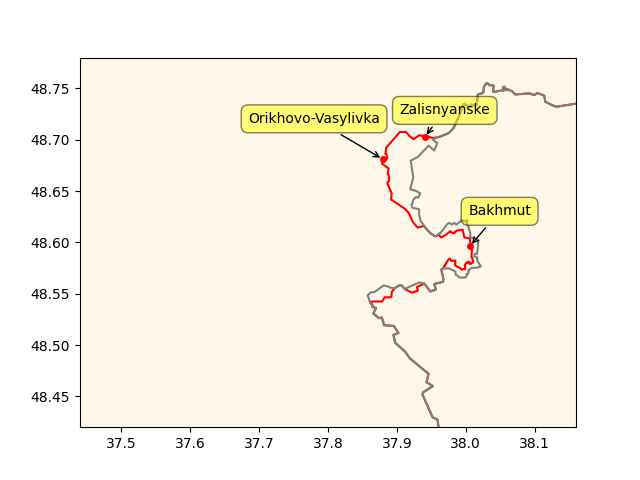
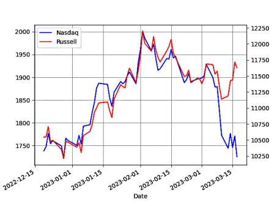

# Week 12


WSJ: "Saudi Arabia, Syria Close to Resuming Ties in Russia-Brokered
Talks"

---

News 10: "Officials say hydrogen fuel vehicles are coming soon to New York"

---

GlobeNewsWire: "Hydrogen Generation Market Size to Reach $263.5
Billion by 2027 from 160.0 Billion in 2022"

---

"Hydrofuel.. has now entered into an exclusive manufacturing and sales
agreement with Technocarb Equipment.. for the manufacture and sale of
H2 and NH3 fuel kits and conversions of hydrocarbon-fueled generators,
engines, tractors and grain driers, etc"

---

H2 Central: "Bill supporting the expansion of the H2 fueling network
have been reintroduced... The Hydrogen for Trucks Act is one of four
bills in a newly introduced legislation package and would support the
demonstration of hydrogen fuel cell vehicles and the development of an
H2 fueling station network.. reintroduced by Senators.. [Coons,
Cornyn, Murkowski, Cassidy, Hickenlooper, Heinrich]"

---

That is likely - see [here](0119/2016/03/arrival-of-the-fittest.html)

"Ryugu asteroid samples suggest ingredients for life came from space"

---

Adani Groups's fundamentals are strong. My guess is the investors
behind Hind are "retarded ESG" types, pushing for bizarro green tech,
not the good kind, they are likely stuck with certain bad investments
and now using Hindenb to take out potential competitors.

---

There is something fishy about those guys.. Their Adani work looked
like a hit job with an ulterior motive.

"Marc Cohodes alleged that Hindenburg sources information from large
funds, serving as a front for their short trades"

---

Business Insider: "Marc Cohodes who famously predicted the collapse of
FTX and Silvergate Capital Corporation has more stocks to call
out.. The mainstream media is lazy and could be co-conspirators in the
Sam Bankman-Fried, FTX and Silvergate downfalls, the short seller
said"

---

*Gunfight at Rio Bravo* - a Western movie with a Russian guy as the
hero. Historicaly a Russki soldier, Ivan Turchin did exist, dude
emigrated to US and even fought in the Civil War. Lincoln made him a
general! Fascinating history.

---

Bloomberg: "[9/2022] Europe Optimal Market for Senegal’s Gas, [says]
President.. Poland, Germany keen to buy liquefied natural gas from
Senegal.. West African nation is set to become LNG exporter next year"

---

ECP: "[10/2021] A number of world-class oil and gas discoveries took
place in Senegal between 2014 and 2017. Oil and gas reserves worth
more than 1 [GBOE..] have been unlocked in Senegal"

---

"At par" is the key word, par is the original value of the asset when
it was bought, the market price is the latest price. At par SVB assets
were fine, in "mark to market" sense they were not. BTFP loans assume
original price, the loan still needs to paid back, but it's a way of
shifting around of risk.

FED: "[12/03] The additional funding will be made available through
the creation of a new Bank Term Funding Program (BTFP), offering loans
of up to one year in length to banks, savings associations, credit
unions, and other eligible depository institutions pledging
U.S. Treasuries, agency debt and mortgage-backed securities, and other
qualifying assets as collateral. These assets will be valued at par"

---

H2 Central: "Verde Hydrogen, a new US based Hydrogen Technology
company has announced that the VERDE-1000, a 5MW Single Stack
Containerized Hydrogen Production System has passed a 3rd party test
and certification to validate its best-in-class energy efficiency and
performance"

The fully commercialized VERDE-1000 Hydrogen Electrolyzer, with its
modular and containerized design, is the largest 5MW, single stack,
alkaline type water electrolysis system in the world"

---

RU,CH overseas military bases

[[-]](2023/01/formil.html)

---

John Hawksworth - Flash Barrier \#music

[[-]](https://youtu.be/icC3G0xaCQI)

---

Fox Business: "[Rick Scott said] we pay for 77,000 federal buildings
that are empty every year. Why are we doing that? Would you do that
with your money?  We have almost a half a trillion dollars of programs
– that were never authorized – that the executive branch is spending
money on."

---

"@EUAgri@respublicae.eu

\#HorizonEU call for proposals on hydrogen fuel cell technology for
agricultural machinery. Proposals are expected to increase the
knowledge of \#hydrogen FC technology and demonstrate systems in
specific non-road applications"

---

Focker's [best friend](ejagoffmaxwell2.jpg)'s family ran an
emerald mine in apartheid SA didn't they? Making money of off
stolen land... It is a sound system - if you are white.

---

JL Haims: "One day I heard a rumor that [Peter Thiel] defended
apartheid (which was then still the law of the land in South Africa),
which I found morally repugnant.. I wanted to give Peter the benefit
of the doubt.. He said, with no facial affect, that apartheid was a
sound economic system working efficiently, and moral issues were
irrelevant"

[[-]](https://medium.com/indian-thoughts/my-conversation-with-peter-thiel-about-apartheid-and-its-aftermath-3fdf4249b08d)

---

"It’s curious to some that the bank run somehow started before SVB’s
public announcements on March 9. It’s almost as if a number of very
lucky folk knew a great deal about what was going on before Joe Public
did. And the same depositors who withdrew their funds had contractual
agreements, which required them to keep their deposits at the bank or
face severe penalties. Somehow, these depositors were so desperate to
yank their deposits that they willingly violated those agreements and
sustained the penalties. I am not sure what information these
depositors learned that caused them to act so hastily without regard
to their agreement and breach consequences. Call me cynical but I am
also guessing that a number of those in the know were probably selling
a boatload of SVB stock between February 28 and the evening of March 9."

[[-]](https://thesecinaction.com/)

---

Green Car Congress: "Hynfra, a Polish company, has signed a framework
cooperation agreement with Amarenco MENA, a major developer of
renewable energy projects in the Middle East and North Africa and part
of Amarenco Group. The strategic partnership is aimed at building
infrastructure for the production of hydrogen and its derivatives,
primarily ammonia, using electrolysis powered by clean energy
resources"

---

H2 Central: "Ports of LA, Long Beach Join State Bid to be Federal
Hydrogen Fuel Hub"

---

RU advances compared to three weeks ago

```python
ps = ["Zalisnyanske","Orikhovo-Vasylivka","Bakhmut"]
u.sm_plot_ukr1('ukrdata/fl-0322.csv','ukrdata/fl-0304.csv', ps,clat=48.6,clon=37.8,zoom=0.04)
```

 

---

The show had advanced AI but at that time that could be possible;
science would've moved beyond retarded neural nets by then (which is
the current fashion).

---

*Battlestar Galactica* was good scifi - it brought more realism to the
genre. It did away with "beam weapons", the ships were shooting
physical objects at eachother.. Ships were powered by a fuel,
something substantial, not "charged". The fuel, "tylium", had to be
mined (when they ran low attempting to get more was two-ep long
adventure).

---

Yahoo News: "Man dramatically escapes burning home after sudden e-bike
explosion.. A house in Sydney's east went up in flames on Sunday night
when an e-bike exploded in the garage, forcing one man to jump from
the second-storey balcony to escape"

---

A previous share on the movie *Cobra* made a paralel to the "Scorpion
Unit" of Memphis, to that special team, outsider, specialized cop
mentality, "the heroes who do what others cannot", so forth..
Not picking on Stallone or that particular work, others from that era
had similar movies, here's an Ahnuld one, tough guy [tearing it up](https://drive.google.com/uc?export=view&id=1j6A1QsiCkng1TupKnVUaiFghrS1R8wmM),
there are drugged out people.. Very Reaganesque. 

---

US pro wrestling resembles stunt work.. it's like bunch of stunt
actors wanting to be movie stars. The fighting is likely how stunt
actors fight except there are no camera tricks to gloss over the
make-play parts - punch that doesn't connect, fall that doesn't look
real.. Then wrestling is like theater form of Holywood movie action.

---

Docker software allows packaging of code that needs run together in a
neat package, all code, utilities, even the OS itself. From AWS: "
Similar to how a virtual machine virtualizes (removes the need to
directly manage) server hardware, containers virtualize the operating
system of a server"

---

OSS Programmer: "Docker is deleting Open Source organisations..
Yesterday, Docker sent an email to any Docker Hub user
who had created an "organisation", telling them their account will be
deleted including all images, if they do not upgrade to a paid team
plan...

Docker was born in Open Source. We the community were their king
makers, and now that they're turning over significant revenue, they
are only too ready to forget their roots"

---

Smitsonian Magazine: "[In Europe] Germany started testing the world’s
first hydrogen-powered passenger trains in 2018, going on to roll out
a fleet in 2022. The German Coradia iLint trains, also made by Alstom,
can reach speeds of 140 miles per hour. A single tank of hydrogen can
last for more that 600 miles. Germany’s trains are a 'model for the
rest of the world' and 'a milestone on the road to climate neutrality
in the transport sector,' said Stephan Weil, president of Lower
Saxony"

---

Smitsonian Magazine: "This summer, North America’s first zero-emission
train will start running in Canada. The hydrogen-powered Train de
Charlevoix will run a 90-minute route between ​​Parc de la
Chute-Montmorency, the site of an almost 300-foot waterfall located
just outside of Québec City"

---

PSG was bought in 2011 apparently when Qatar was feelin' good, on top
of the world, before it got bitchslapped back to its place, woke up to
reality started smelling coffee... Reality bites: you can't be a
leader with tiny-ass landmass, little population, and no symbolic
presence in the Islamic world to speak of (a "museum" designed by
I.M. Pei doesn't count).

---

Yo the French team was *on their ass*, even with all that dubious shit
they still could've taken the Cup.

---

Aah it makes even more sense now; Messi's pro team PSG is owned by
Qatar, that could be another reason why FIFA/Qatar cheated in the
final WC game to have Argentina win with Messi its captain.

---

H2 View: "Air Products and ENOWA to develop a hydrogen refuelling
station in NEOM"

---

H2 View: "Viridis Bulk Carriers receives Approval in Principle for
ammonia-powered vessel"

---

Brzezinski as in Mika Brzezinski, yes, his daughter - who Trump called
"was bleeding from the facelift" during 2016 campaign. She is married
to "Psycho Joe" (also per Trump) Scarborough, they have a little
shitlib talk show on MSDNC. Both are of course ardent supporters of
endless war in Ukraine until the last Ukranian dies.  Mika's dad
would've been proud.

---

Carter is one tough son of a bitch.. he is still alive isn't he
(medically at least)?  Sturdy mother.

---

A quick glance at a Zybybgybdy Brzezinski book reveals three words
that are obviously key for US policymakers - Eurasia, Eurasia,
Eurasia. ZB is the architect of US help to Afghan mujaheddin against
the Soviets during the 80s, and was the NatSec advisor to Carter.

[[-]](../../2023/03/grand-chessboard-brzezinski.html)

---

Al Jazeera: "Russia overtakes Saudi Arabia as China’s top oil supplier"

---

TASS: "NATO seeking to split Eurasia to contain Russia and China but
will fail — Putin"

---

They'll do whatever your deep state requires.

New York Post: "ISIS could hit US, West from Afghanistan in ‘under 6
months’ [CENTCOM commander Genera Kurilla]"

---

First Post: "US continues to use Islamic State terrorists to carry out
attacks in Syria, claims Russia"

---

You get into conflict with US, and Daesh attacks you.. Strange

Al Monitor: "The Taliban governor of Afghanistan's Balkh province,
known for fighting against Islamic State jihadists, was killed in a
suicide attack"

---

Green Car Congress: "JCB publicly unveiled its new port fuel injected,
4.8L inline-four hydrogen combustion [engine](https://bioage.typepad.com/.a/6a00d8341c4fbe53ef02b7519b8300200c-pi)
.. the company’s zero-carbon emissions solution for construction and
agricultural equipment—at the Conexpo 2023 show in Las Vegas ... JCB
is investing £100 million in the project to produce super-efficient
hydrogen engines. A team of 150 engineers is working on the
initiative and more than 50 prototypes have already been manufactured
at JCB’s UK engine plant"

---

"@andrewdessler@mastodon.world

From the new IPCC report. This plot seems inconsistent with the
oft-made claim that we're on track for 2.5°C of warming this century"

[[-]](https://s3.eu-central-2.wasabisys.com/mastodonworld/media_attachments/files/110/056/362/965/895/379/small/6f07ee4f64cdf80d.png)

---

"@gregpak@mastodon.social

This is no longer the Digital Age or even the Information Age.

This is the Bullshit Age"

---

Can't be mum on people that are on one side, always complain about
leaders on the other side. If institutions of the "Rules-Based Order"
are seen as taking sides, not being impartial, they'll become
irrelevant.

---

And nothing on Netanyahu..? 

The Guardian: "ICC judges issue arrest warrant for Vladimir Putin over
alleged war crimes"

---

CNBC: "Fed poised to approve quarter-point rate hike next week,
despite market turmoil"

---

"@Energy4Europe@respublicae.eu

The \#HydrogenBank aims to unlock private investments in #hydrogen
value chains, domestically + in 3rd countries, by connecting
\#renewableenergy supply to EU demand & addressing the initial
investment challenges, offering growth opportunities and jobs!"

---

Techdirt: "Yes, The US Government Threatening To Block TikTok Violates
The 1st Amendment"

---

Wunc.org: "North Carolina's Republican U.S. Senators have joined a
bipartisan group that supports building a hub for hydrogen energy in
the southeast... Southeastern utilities — including Duke Energy,
Southern Company, and Dominion Energy — have formed a coalition to
attract one of the hubs to the southeast"

---

"@Hypx@mastodon.social

BMW to make hydrogen-fuelled cars as it admits EVs won’t work for everyone"

---

Maybe another reason US estab doesn't like Medicare-for-All is it
would hamper military recruitment for their endless wars. Who would
sign up for the military as a grunt if everyone had enough money to
live on and a proper health insurance?

---

On another video he says "I joined the military because I was poor".
Military gives you a salary, food, shelter, healthcare (it puts u in
situations that might be bad for health but anyway), why wouldn't he
join?

---

Isiah James is speaking some truth

[[-]](../../2023/03/isiah-james-iraq.html)

---

Iraq War 20th year anniversary...  Yippee-Ki-Yay mo--f--kas.

---

Comment: "[Referring to [news](https://s3.masto.ai/cache/media_attachments/files/110/047/783/364/412/018/original/c6c3b68843095dba.jpg)]
The group of banks proposes that those banks that chose to
participate in the increased deposit insurance program should pay for
that expanded insurance themselves, through an increased
deposit-insurance assessment—this is a winning proposal"

---

Sustainable Bus: "TPER Bologna has published a tender for 127 fuel
cell buses (with option for further 140)"

---

Forbes: "Speaker McCarthy Threatens Federal Probe If Trump Arrested"

---

They are right

BBC: "Prosecuting Donald Trump would be politically motivated, say Republicans"

---

Green Car Congress: "Cummins’ Accelera showcases Gen 4 fuel cell
system.. At Con Expo, Accelera, the new brand for Cummins’ New Power
business segment, showcased its fourth-generation fuel cell engine,
which provides improved power density, efficiency and durability while
delivering zero greenhouse gas and zero criteria air emissions"

---

"Union dues and typically hover around 1-2%. The most common structure
sets dues as a percentage of gross earnings. If dues are 1%, workers
pay $1 for every 100 dollar earned"

---

Investopedia: "In 27 U.S. states, 'right to work' laws allow non-union
members to obtain the benefits of collective bargaining by unions
without paying union dues. The laws serve to undermine union financing
and organizing"

---

Democrats doing lefty things..? Hell has frozen over 😶

Yahoo News: "Democratic lawmakers in the upper chamber of the Michigan
Legislature voted to repeal the state’s 2012 'right-to-work' law,
which prohibits public and private unions from requiring that nonunion
employees pay union dues.. it is expected to be signed into law"

---

F24: "Push for carbon-free hydrogen accelerates in US.. A source of
renewable and storable energy, hydrogen is experiencing a breakthrough
in the United States after years of sluggish growth as Biden
administration climate policies spark major investments. 'America came
from nowhere and now they're in the lead,' Mark Hutchinson, CEO of
Fortescue Future Industries, said of America's ascent in renewable
energy in general and hydrogen more specifically, at last week's
CERAWeek energy conference in Houston, Texas"

---

I guess 'some city officials' wanted to maximize the amount of bribes
they were earning, they opened up every possible square centimeter of
the city to construction.

---

City green spaces as percentage of land (data [source](http://www.worldcitiescultureforum.com/data/of-public-green-space-parks-and-gardens)),

```python
import pandas as pd
df = pd.read_csv('city_green.csv',sep='\t',index_col=['City'])
df = df.sort_values('Figure')
df['Figure'].to_csv('green-out.txt')
```

[Output](green-out.txt)

Stanpoli is not doing good. 

---

Future Meat, The world of meat substitutes, \#DW

[[-]](https://youtu.be/5Vq03gYWiXE?t=1273)

---

H2 storage in carbon nanotubes

[[-]](../../2022/02/h2-carbon-nanotubes.html)

---

Energy & Sustainable World: "[T]here are innovations on the horizon
that will make large-scale production of hydrogen much more
feasible. One such innovation is called Nanotubes. These tiny tubes
can store large amounts of hydrogen gas at room temperature...

Another innovation involves attaching some nanoparticles (i.e., tiny
particles) to some plastics; this makes them hydrophobic, which means
they won't absorb any water or moisture. When these hydrophobic
plastics are in contact with water, they release their stored hydrogen
gas (H2) and then change back into their hydrophilic state"

---

The stock market is still overvalued, Wilshire above 190. Levels of
around 100 would be normal. High FED rates can help get there. Same
for housing prices. Housing is a huge part of CPI and PCE.

[[-]](../../2021/01/stats.html#wilshire)

---

Nasdaq and Russell have parted ways..

The Russell tracks small companies, Nasdaq is tech heavy. Tech
companies are hurting likely due to contagion fears from SVIB, SB.

 

---
