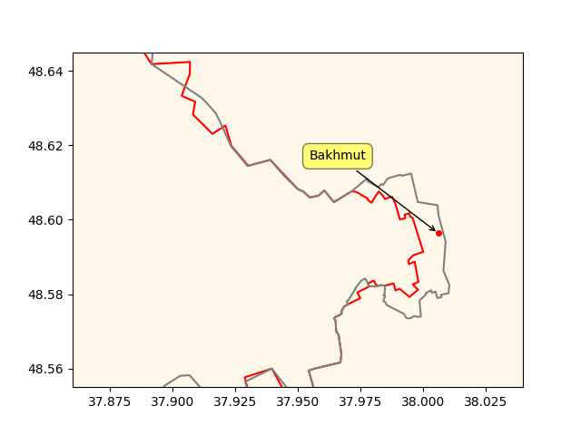

# Week 14


Reuters: "India plans to give green hydrogen fuel producers incentives
worth at least 10% of their costs under a $2 billion scheme set to
begin before the end of June, a top government official said.
Reporting by Sarita Chaganti Singh; Editing by Alexander Smith and
Christian Schmollinger "

---

TT News: "[The North American Council for Freight Efficiency] Says
Trucking’s Future Is With Hydrogen.. Group Notes It's Best Option to
Reach Long-Term Goals"

---

Nebraska Examiner: "Nebraska, two partner states bid to be ‘hydrogen
hub’ that could bring $1 billion in federal funds"

---

Offshore Energy: "China’s first hydrogen fuel cell powered boat, Three
Gorges Hydrogen Boat No. 1, was successfully launched in Guangdong in
mid-March"

---

Buttafuoco went all in w crypto and got burned

Bloomberg: "SkyBridge Capital Was Spiraling, and Then Came FTX.. The
hedge fund’s bad crypto bets—and a reputational hit from its
partnership with Sam Bankman-Fried—have investors looking for the
exit"

---

How it's going

Woody Allen: "Those who can't do, teach. And those who can't teach,
teach gym"

---

How it started

Aristotle: "Those that know, do. Those that understand, teach."

---

The aim of the fraud is likely to qualify for tax credits that work on
the basis of range

Reuters: "[01/2023] South Korea fines Tesla $2.2 mln for exaggerating
driving range of EVs.. antitrust regulator said it would impose
a.. fine on Tesla for failing to tell its customers about the shorter
driving range of its electric vehicles (EVs) in low temperatures"

---

Russia Today: "West didn’t allow time for peace in Ukraine [said
Lula].. The US and the EU should have given diplomacy a chance before
rushing into war, the Brazilian president has claimed"

---

Ukrainska Pravda: "Brazilian president proposes Ukraine cede Crimea to
Russia to stop the war"

---

H2 View: "European Commission approves €450m scheme to support Italian
renewable hydrogen"

---

H2 Central: "Multi-Billion Dollar Clean Ammonia Manufacturing
Investment Advancing in Southern WV"

---

G/E: The global de-dollarization campaign is gaining momentum, as
countries around the world seek alternatives to the hegemony of the US
dollar. China, Russia, Brazil, India, ASEAN nations, Kenya, Saudi
Arabia, and the UAE are now using local currencies in trade..

China and Russia are trading in their own currencies.

Beijing and Brazil have also dropped the dollar in bilateral trade.

The UAE is selling China its gas in yuan, through a French company.

Southeast Asian nations in ASEAN are de-dollarizing their trade,
promoting local payment systems.

Kenya is buying Persian Gulf oil with its own currency.

Even the Financial Times newspaper has acknowledged that a “multipolar
currency world” is emerging"

---

"@EPPGroup@respublicae.eu

\#RED3 agreement sets a new course for green #hydrogen in Europe. 

Requirements have become more practical and the EU will focus on
import strategies to meet the energy transition demands.

The EPP Group has reduced bureaucratic barriers! 

A big step for clean energy"

 

---

"@EPPGroup@respublicae.eu

The future is looking brighter for #hydrogen production as Europe
targets 42% #renewable hydrogen by 2030!"

---

H2 Central: "Yara Clean Ammonia.. and Enbridge Inc. announce the
signing of a letter of intent to jointly develop and construct a world
scale low-carbon blue ammonia production facility as equal
partners. The proposed facility, which includes autothermal reforming
with carbon capture, will be located.. near Corpus Christi, Texas...

Once operational, the production facility will be capable of supplying
low-carbon ammonia to meet growing global demand, with an expected
capacity of 1.2–1.4 million tons per annum. Approximately 95 percent
of the carbon dioxide (CO2) generated from the production process is
anticipated to be captured and transported to nearby permanent
geologic storage"

---

Reuters: "TikTok faces €1.12 billion lawsuits in Portugal"

---

There is no "curse" - they are all --ing morons, likely due to this
weird condition, whatever it is. 

---

The Kennedy family - I think these people have a genetic condition,
that compels them towards stupidity. One of them *ran into a tree* at
full speed while skiing killing himself. Another flied a plane without
much experience and died like his jackass father. The father himself
died because of jackass entanglements with Cuba, likely bcz he tried
to assasinate Castro but got assasinated himself.

---

Euractiv: "Czech coal mining regions want to be ‘hydrogen
valleys’.. Three coal mining regions in the Czech Republic want to
become Central European leaders in hydrogen technologies, the joint
memorandum signed by the three regions’ governors in Prague on Tuesday
reads"

---

First Post: "A Japanese military [Black Hawk] helicopter ..  with 10
people on board disappeared from radar on Thursday near Miyakojima,
part of its southwest Okinawa island chain, according to an army
spokesperson and media reports"

---

😂 😂 

AP News: "Anti-vaccine activist RFK Jr. challenging Biden in 2024"

---

Arab News: "Afghan Taliban raid kills 6 members of Daesh group"

---

F24: "Iran names envoy to UAE after nearly eight-year absence"

---

Fried chicken, or pan-fried chicken, is a traditional Southern meal,
it's not "African".

---

If you are an Estonian immigrant your child born in US won't be 80%,
50% or even 10% Estonian - s/he will be 100% American. Majority local,
regional culture rules all. Heritage means nothing.

---

Al Jazeera: "US progressives galvanised by victory in Chicago mayoral
race.. Once seen as a long-shot candidate, the progressive Johnson
advanced to a run-off election against Paul Vallas, a conservative
Democrat who pushed an aggressive message on crime and touted the
endorsement of law enforcement groups"

---

WSJ: "Progressives had a banner day in the Midwest Tuesday, with
victories for Chicago mayor and a swing seat on Wisconsin’s Supreme
Court"

---

"World's first liquid hydrogen-powered ferry gets operational.. The
82.4-meter-long MF Hydra, which was delivered in 2021, can carry up to
300 passengers and 80 vehicles. It will be able to travel at a speed
of 9 knots thanks to its two 200 kW fuel cells, two 440 kW generators,
and two Shottel thrusters"

---

Red Hulk? Why not Kluh (name is Hulk in reverse). That is the baddest
Hulk.

---

IDW: "Ammonia is known to be a good hydrogen carrier. [Researchers]
show that ammonia can not only be used to carry hydrogen but also for
the direct reduction of iron"

[[-]](https://idw-online.de/en/news811876)

---

Sounds like rabid interventionism to me. What a jackass

JFK: "[1961] Let every nation know..  that we shall pay any price,
bear any burden, meet any hardship, support any friend, oppose any foe
to assure the survival and the success of liberty"

---

Apparently SB and its Signet allowed the hyper growth of FTX, without
it they would have remained much smaller. Crypto ppl talk big game
about upending the system but they needed a connection to the
backbone, to the existing system through a bank. They found a few
gullable ones, used them, esp SB with its fast Signet along with money
launderers, criminals. 

Yahoo Finance: "A class-action lawsuit was filed against Signature
Bank in February, alleging the bank knew about – and facilitated – the
'now infamous FTX fraud.' Specifically, the suit accuses Signature
Bank of having knowledge of and permitting 'the commingling of [the
FTX exchange's] customer funds within its proprietary,
blockchain-based payments network, Signet'"

---

Artemis - Second Sight \#music

[[-]](https://youtu.be/zeNwptYkYG8)

---

If a near-future version of Trek is done, I'd want an Android there
called "Meme" instead of "Data". This character would be a clownish,
overly creative twat, all he does, all day long is generating memes;
just spouts one meme after another. TNG's Data was smart with
human-like strong AI, strived to learn art.. Meme has art but is
extremely dumb just like the modern "AI" algorithms today, but tries
to become smart. Meme acquiring an iota of intelligence in each
episode will be his character arc. At the end of 10 seasons he'll be
able to read text, summarize it, and drive a car.

---

Barry Adamson - Cinematic Soul \#music

[[-]](https://youtu.be/WGYc40UivOs?t=61)

---

Emacs in *Tron Legacy*

[[-]](https://i0.wp.com/craphound.com/images/TRON_GFX_BR_08.JPG?w=970)

---

Reuters: "Saudi Arabia to invite Syrian president Assad for Arab
leaders summit"

---

Yahoo News: "McCarthy vows to hold Bragg ‘and his unprecedented abuse
of power to account’"

---

Politico: "With an ‘arraignment party,’ Trump jolts his campaign.. The
ex-president chose a familiar defiance in his speech following his
arrest. His fellow Republicans say it suits him well"

---

The comments on this topic keep getting better and better. Even Yann
LeCun is up in arms. 

---

"@Hypx@mastodon.social

Ford Is Getting Serious About Hydrogen Fuel Cell Technology For Super
Duty Trucks"

---

Reuters: "Japan is to revise its hydrogen strategy by the end of May
with an ambitious target to boost annual supply to 12 million tonnes
by 2040, the industry ministry said on Tuesday, as competition
increases in the global market for the fuel"

---

Politico: "[I]n 1792, Congress passed the Post Office Act. Publishers
would be charged 1 cent for most newspapers and 1.5 cents for those
traveling more than 100 miles. This amounted to an enormous
subsidy. Rates for regular letters ranged from 6 cents to 25 cents,
depending on the distance. The postmaster in 1794 estimated that
newspapers constituted 70 percent of the mail while kicking in about 4
percent of the revenue. Postage paid by publishers defrayed no more
than 12-14 percent of costs, concluded Richard Kielbowicz in News in
the Mail. Scholar Robert McChesney has estimated that 'if the
U.S. government subsidized journalism today at the same level of GDP
that it did in the 1840s, the government would have to spend in the
neighborhood of $30-35 billion annually.' That’s about the size of
NASA’s budget"

---

"@shreyan@mstdn.social

[Large Language Models] are not intelligent. They cannot make good
decisions on their own. They are a tool which it is up to you to use
properly"

---

CBC: "[Canada] B.C. to introduce house-flipping tax and expand
secondary suites under new multi-billion dollar housing plan"

---

RU advance in the past two weeks

```python
u.sm_plot_ukr1('ukrdata/fl-0404.csv','ukrdata/fl-0322.csv',["Bakhmut"],
               clat=48.6,clon=37.95,zoom=0.01)
```

 

---

Dr. Ekberg: "I don't see any reason to ever buy store-bought juice
because it has to be pasteurized in order to be sold in a store and
now you're destroying most of the benefits.  Most of the enzymes.. the
phyto-factors, polyphenols and whatever else might be in that juice
you're destroying it with that pasteurization, so when you put a big
red X on that because all you're really getting now is sugar water.

Yeah it's a little bit better than Coca-Cola, but not a whole lot.
Orange juice is about 8% sugar.  Apple juices about 10% sugar. So if
you have a cup you're already getting about 25 grams of
sugar. Absolutely not a good idea for any of these protocols no matter
what your goal is for weight loss or reducing insulin resistance stay
away from store-bought juice"

---

The Guardian: "[Australian] Labor agrees to absolute cap on emissions
to secure Greens backing for safeguard mechanism climate bill"

---

F24: "Paris votes on banning self-service e-scooters.. Self-service
e-scooters have become commonplace on the streets of Paris since they
were first introduced five years ago, but irresponsible use and a
rising accident toll have hardened city hall’s attitude towards the
popular mode of transport"

---

\#StarWars #Meme

via @Jimijamflimflam@mstdn.social

[[-]](https://media.mstdn.social/media_attachments/files/110/126/178/882/910/680/original/3519d0b6720c3b7a.jpeg)

---

They call asafoetida "Indian MSG"

---

BTW can enough carbon be captured from the air for all efuel needs? If
they cut bunch of trees burn them to obtain "neutral carbon" (trees
took it from the air, putting it back is sort of "neutral") then
that's not a good path. Hopefully pure H2 usage is encouraged more.

Euractiv: "EU eyes CO2-hydrogen combination to make synthetic fuels"

---

Science: "[N]atural hydrogen is always being made afresh, when
underground water reacts with iron minerals at elevated temperatures
and pressures. In the decade since boreholes began to tap hydrogen in
Mali, flows have not diminished, says [expert]"

[[-]](https://www.science.org/content/article/hidden-hydrogen-earth-may-hold-vast-stores-renewable-carbon-free-fuel)

---

Backpedaled on the spot.. LOL

Politico: "A bipartisan Senate bill that would rein in the
Chinese-owned app [Tiktok] is facing its first real headwinds... this
week saw a significant backlash to RESTRICT... The furor soon reached
Fox News — on Wednesday, host Jesse Watters called RESTRICT “garbage”
and suggested it would curtail personal freedoms... Watters demanded
an explanation from Sen. Lindsey Graham, a sponsor..  who had joined
him on the program. But Graham said he was unaware that he had signed
onto the bill — and suggested that if it was as bad as Watters said,
he may need to retool"

---

I liked Creed III, sort of like Rocky III but stands on its own. Fine
universe additional stories can still be told in it.

---

Recommending *World's End*, *Blackhat*. 

---

[Link](https://drive.google.com/uc?export=view&id=1ltZotkczUbnk-g30q-wBVOtR-gQitNgR)

---

China speaka the language of geostrat just fine

---

China said fucka me fucka you

---

In US' backyard..

AP: "Honduras follows in the footsteps of Nicaragua, El Salvador, the
Dominican Republic, Panama and Costa Rica in ditching Taiwan [and
supporting China]"

---

Japan Times: "Long-range missiles highly likely to be deployed to
Nansei [Ryuku] Islands"

---

Palestenian rocket firings by date and count, fired mostly from
Gaza. Obviously WB is key in strat terms but to what lengths will ISR
go to take it? Can anyone truly be safe from anything? Is Belgium safe
from Luxemburg? It's "right there" after all..

[[-]](https://www.jewishvirtuallibrary.org/palestinian-rocket-and-mortar-attacks-against-israel#2023)

---

West Bank is indeed more mountainous compared to rest of Israel. 

```python
ps = [["West Bank",32.01211, 35.2883120],["Jerusalem",31.7737760, 35.206223]]
u.sm_plot_list1(32, 35, 0.3, ps, elev=[100,200,300,500,800])
```

[[-]](isr1.jpg)

---

Oded Yinon: "Judea, Samaria and the Galilee are our sole guarantee for
national existence, and if we do not become the majority in the
mountain areas, we shall not rule in the country and we shall be like
the Crusaders, who lost this country which was not theirs anyhow, and
in which they were foreigners to begin with"

[[-]](../../2023/04/strategy-for-israel-yinon.html)

---

"@johl@mastodon.xyz

I wish more people understood that 'I want the computer to generate a
natural language text that sounds like a plausible answer to a
question about x' and 'I want the computer to answer a question about
x' are two very different problems"

---

<iframe width="340" src="https://www.youtube.com/embed/ro130m-f_yk?start=1&end=1083" title="A.I. is B.S." frameborder="0" allow="accelerometer; autoplay; clipboard-write; encrypted-media; gyroscope; picture-in-picture; web-share" allowfullscreen></iframe>

---

