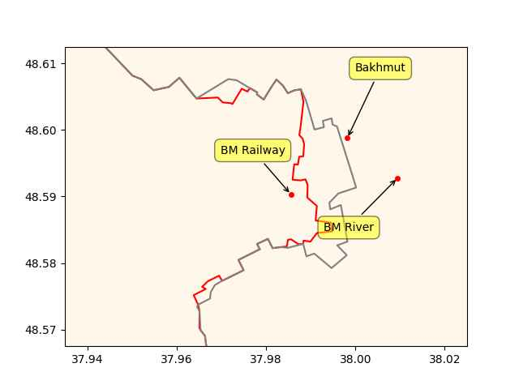
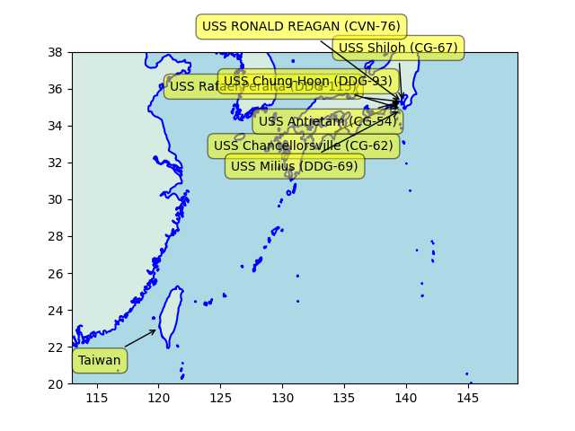
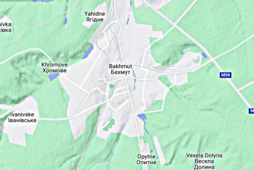

# Week 15

H2 Fuel News: "MIT and DMI to develop first open-source hydrogen fuel
cell powered motorcycle.. The MIT EVT hopes that the hydrogen fuel
cell motorcycle development will help to overcome a range of
challenges associated with BEVs while addressing concerns regarding
shortages and environmental issues associated with lithium mining

---

H2 View: "US multinational Honeywell announced its new Liquid Organic
Hydrogen Carrier (LOHC) solution to enable the long-distance
transportation of clean hydrogen. The Global Hydrogen Flows report
predicted that of the 660 million tonnes of hydrogen needed to meet
global Net Zero by 2050, 400 million are expected to be transported
over long-distances, with 190 million tonnes set to cross
international borders"

---

Culture does not care about how it is labeled.. it will be transmited
via osmosis, people-to-people, one-on-one through the land and its
people no matter what. Cannot change your culture by labeling it
differently, or by wearing funky hats, telling stories or following
rituals. The duty of an intelligentia is to pinpoint this fact, argue
around the true source of culture, lest be responsible for generating
neurotic behavior in their students.

---

Herodotus was eating yoghurt in 800 BC; he didn't need some punk from
Asia riding in on a donkey to teach him about it (who hadn't even
arrived by then, that would be a thousand years later). 

---

Turks arriving into Anatolia were assimilated, they melted away
culturally and genetically. 1920s TR nationalization, "Turkification"
merely performed a labeling trick. The founders wanted to create
historical amnesia so they picked an exotic, irrelevant ethnicity
(somewhat innocuous meaning simply Muslim as most founders were from
the Balkans), and everyone in Anatolia were rebranded. Muslims were
transitioned, history was rewritten so that all culture before "the
arrival" was made to look like was brought by that irrelevant group,
not pre-existing before their arrival. This is how Byzantian music
became 'Turkish art music", Greek/Balkan/Arab food became "Turkish
food", and Yemenese coffee became "Turkish coffee".

---

Therein lies the fallacy of the "we need more younger workers to
support older population" argument.. Would more "young people" going
into soft drink industry generate value, real benefits, in the long
run? The problem is money creation is too tied to businesses (as
credit), it needs to be tied in large part to salaries (which can
later become credit).

---

Money, credit generated for this business segment is for useless
production. Zero benefit for the humankind.

---

Statista: "Revenue in the Soft Drinks segment amounts to US$0.85tn in 2023"

---

Unemployment falling

```text
            UNRATE  U6RATE  REAL_UNRATE  REAL_UNEMP_LEVEL
DATE                                                     
2023-02-01     3.6     6.8     7.863111           13072.5
2023-03-01     3.5     6.7     7.686033           12815.0
```

---

Inflation 

```
2023-02-01  6.035613
2023-03-01  4.984974
```

---

"EU Hydrogen Bank could bring renewable hydrogen costs below
€1/kg... ICIS data shows that renewable hydrogen could be sold for
below €1/kg ($1.09/kg) if a producer obtains the maximum support
provided by the European Hydrogen Bank"

---

H2 View: "UK delivers £23bn in low carbon investment in 2022.. The UK
invested £23bn in new low carbon investment in 2022 encompassing
hydrogen, renewables, carbon capture and storage"

---

Oil Price: "Sinopec Has Big Plans For Green Hydrogen.. Sinopec is set
to build China's first 'West to East' green hydrogen transmission line
to transfer hydrogen from renewable energy projects in Inner
Mongolia's Ulanqab to Beijing. The company aims to produce 100,000 to
200,000 tonnes of green hydrogen annually, helping China transition
towards renewable energy"

---

TFI Global: "US sidelined as Iran and Brazil forge a lasting
alliance.. Lula, is back in the news again for stirring up controversy
by setting up a direct shipping route with Iran"

---

CNBC: "Fed expects banking crisis to cause a recession this year,
minutes show"

---

The Guardian: "Swimming pools of the rich driving city water crises,
study says"

---

H2 Central: "1000-km Range Liquid Hydrogen Storage System Unveiled by
Weishi Energy.. The company launched its 'gas hydrogen + liquid
hydrogen' dual technology route in the field of hydrogen storage,
along with its vehicle-mounted liquid hydrogen storage system called
“Jupiter,” which has a mass hydrogen storage density of ≥8wt% and a
cruising range exceeding 1000 km"

---

Crowd Wisdom works only for subjects the crowd has an expertise in eg
gauging the general acceptability of politician as leader, or guessing
the weight of an ox. That sort of judgement is likely ingrained;
averaging can lead to better results. But even that fails sometimes,
remember 1960 or 2000.

[[-]](../../2020/07/crowd-wisdom.html)

---

H2 Insight: "An Anglo-Spanish company says it could produce naturally
occurring hydrogen from a giant underground reservoir in the foothills
of the Pyrenees for €0.75 ($0.82) per kilogram — about half the
current cost of producing grey H2 from unabated fossil gas"

---

Job growth slowing cld indicate less growth less growth in wages will
imply less inflation, meaning less risk for bonds, so they buy bonds,
their price rises, yields fall. Simple.

"Treasury yields fall after data shows U.S. job growth slowed in March"

---

The Geopolitica: "The United Arab Emirates, Egypt, and Germany Will
Invest $34 billion In a Green Hydrogen Project in Mauritania.. [A]
German investment company, Conjuncta, along with the United Arab
Emirates renewable energy firm Masdar, and Egypt’s renewable energy
firm Infinity have signed an agreement with the Mauritanian government
to build a 34 billion green hydrogen plant with an electrolyzer
capacity of up to 10 gigawatts near the Mauritanian capital,
Nouakchott. Every year, the green hydrogen plant will produce 8
million tonnes of ammonia or other hydrogen-based products along with
green hydrogen. The plant’s first phase will be going to be completed
by 2028 with a planned capacity of 400 megawatts"

---

"@Hypx@mastodon.social

Strasbourg orders 60 hydrogen buses from CaetanoBus"

---

Modern system is not built for direct democracy. Half-assed attempt to
coexist within the current system will make things worse.  Good
leadership has better chance for improv rather than crowd wisdom (!)
at policy level.

WSJ: "Direct Democracy Dies in California.. Progressives want to stop
voters from challenging state laws via referendum"

---

H2 Fuel News: "BAE Systems to provide Rochester’s first hydrogen buses
with drive systems"

---

Clean fuel hitjob movie got plastered. With a budget of 40 mil, it
lost money. I love it.

---

😂 😂 😂 

```python
u.boxofficemojo("Glass Onion: A Knives Out Mystery")
```

```text
Out[1]: 
{'Domestic Opening': '$9,400,000',
 'Domestic': '$13,280,000',
 'International': '$13,280,000',
 'Worldwide Total': '$13,280,000',
 'Release Date': 'November 23, 2022'}
```

---

Keynes' idea for a world currency [Bancor](../../0119/2019/06/bancor.html)
did not use gold either.

---

Some news suggest the new BRICS currency could be backed by gold; if
true gold would be there to provide convertibility assurance to
non-BRICS currencies. A global, dominant currency does not need gold -
Nixon's petrodollar did not need it, he was like I have my military
and an agreement with the top oil producer to keep it legit.

---

Kubrick apparently used Arthur C. Clarke's story as a front to get
funding, but visually hid / encoded a less rosy picture about the
future in it.

"2001: A Space Odyssey - How Kubrick fooled us all"

[[-]](https://youtu.be/wxiB3qtMRHc?t=418)

---

Story has down days, up days, ends up in the same place.. -10 plus +10
equals zero. But all kinds of drama in between, that surely benefits
some.

NBC News: "The Nashville Metropolitan Council voted Monday to return
Justin Jones to the state Legislature after he was removed last week
by Republicans for protesting gun violence on the House floor"

---

If the abortion issue was so important Dems could've codified Roe in
law with 2009-10 supermajority. They didn't because it was better to
exploit the issue firing up the donor base taking their money rather
than solving the problem. It's still the Dick Morris [plan](../../2021/10/all-too-human.html#triangulation),
on major issues it is uniparty, for others manufactured heated "debates",
schisms, abt "5G" issues - Guns Gays Gender God Green.

---

Let's not forget about the self-reinforcing effect of inflation,
excess wage increases is not the only culprit.

[[-]](../../2021/01/inflation.html#autocorr)

---

FONOP (Freedom of Navigation Op) in South China Sea count, 6 by Obama 11 by Trump.

---

RU advance, last 7 days

```python
cs = ["Bakhmut","BM Railway","BM River"]
u.sm_plot_ukr1('ukrdata/fl-0411.csv','ukrdata/fl-0404.csv',cs,clat=48.59,clon=37.98,zoom=0.005)
```

 

---

That ship was last spotted at a Japanese base; major firepower piled
up over there BTW, occasionally a ship from the base takes a little
trip, does a little moonwalk up and down someone else's backyard, goes
back to port.

```python
sh = np.vstack([np.array(u.usnavy()[['name','lat','lon']]), ['Taiwan',23,120]])
u.sm_plot_list1(29, 131, 2.0, sh)
```

 

---

TASS: "'On April 10, the USS Milius guided-missile destroyer illegally
entered the waters around the Meiji Reef near China’s Nansha islands
without the approval of the Chinese government,' China Central
Television [said]"

---

Chomsky: "[NYT Opinion] The False Promise of ChatGPT.. OpenAI’s
ChatGPT, Google’s Bard and Microsoft’s Sydney..  have been hailed as
the first glimmers on the horizon of artificial general intelligence —
that long-prophesied moment when mechanical minds surpass human
brains.. That day may come, but its dawn is not yet breaking.. [as
long as] machine learning programs like ChatGPT continue to dominate
the field of A.I...

The human mind is not, like ChatGPT and its ilk, a lumbering
statistical engine for pattern matching, gorging on hundreds of
terabytes of data and extrapolating the most likely conversational
response or most probable answer to a scientific question. On the
contrary, the human mind is a surprisingly efficient and even elegant
system that operates with small amounts of information; it seeks not
to infer brute correlations among data points but to create
explanations..

It summarizes the standard arguments in the literature by a kind of
super-autocomplete.. In short, ChatGPT and its brethren are
constitutionally unable to balance creativity with constraint. They
either overgenerate (producing both truths and falsehoods, endorsing
ethical and unethical decisions alike) or undergenerate (exhibiting
noncommitment to any decisions and indifference to
consequences). Given the amorality, faux science and linguistic
incompetence of these systems, we can only laugh or cry at their
popularity"

[[-]](https://www.nytimes.com/2023/03/08/opinion/noam-chomsky-chatgpt-ai.html)

---

Al Monitor: "Saudi delegation in Yemen for peace talks with
rebels.. The delegation's arrival comes roughly a month after China
helped broker a surprise rapprochement between Saudi Arabia and Iran"

---

Bloomberg: "China Energy Investment Corporation signed an agreement
with French state utility Electricite de France SA to construct an
offshore green hydrogen facility for energy storage, according to a
statement posted on the Chinese company’s website"

---

NYT: "French Visit Undercuts U.S. Efforts to Control China"

---

Bakhmut became strategically key, both due to its location (at a
gateway to the rest of Donbas), also bcz Ukraine decided to take a
stand there and *make* it important. Looking at its topo I can see why - 
has two funky mountain systems going into it from South, and another
ranging along its West. Surely UA exploited that structure to set up
staggered defense lines, and delayed RU for as long as they could. But
it looks like the game is nearing its end.



---

A lot of ignorant people are commenting on things they don't fully understand.

"@timnitGebru@dair-community.social

Because we were looking for more things to do when these clowns
decided to write 'the letter,' [about so-called 'AI pause'] and cite
our \#StochasticParrots paper while saying the opposite of what we
write, we.. [wrote](https://www.dair-institute.org/blog/letter-statement-March2023)
a statement in response.. It is dangerous to distract ourselves with a fantasized
AI-enabled utopia or apocalypse which promises either a 'flourishing' or
'potentially catastrophic' future. Such language that inflates the capabilities
of automated systems and anthropomorphizes them, as we note in [Stochastic Parrots](https://dl.acm.org/doi/abs/10.1145/3442188.3445922), 
deceives people into thinking that there is a sentient being behind the
synthetic media. This not only lures people into uncritically trusting
the outputs of systems like ChatGPT, but also misattributes agency"

---

NATO was useful for Asia Minor for a while but the Western alliance
has not been doing well - it is mostly the instigator of chaos now,
creating much damage offering little in return.

---

[Link](https://drive.google.com/uc?export=view&id=1ZNibTZyjEWqYTS8qeFW3Kw4siw_GOMnA)

---

It will all be fine. NATO is just great.

Reuters: "Finland joins NATO in historic shift"

---

The Sound Stylistics - Soul Dynamite \#music

[[-]](https://youtu.be/l5L2dyMGbUU)

---

At least WH is owning up to a good decision to pull out from AFG when
it did. But it is possible WH was way too embarrassed about the
situation earlier, and went cowboy with Ukraine to offset it, to "show
strength", also trying to deter "certain countries" who might get
funky ideas later. That did not work too well for Ukraine.

PBS: "U.S. report on Afghanistan evacuation blames intelligence
failures, Trump administration"

---

Quick reminder on which countries are responsible for CO2 emissions

[[-]](../../2021/01/historical-carbon-emissions.html#alltime)

---

NL could turn into a "seasteading nation" by then, as in most houses
will be floating.

---

Checked flooding levels using tool [here](https://coastal.climatecentral.org/).
Below is the result of simulated 7m rise. Red parts will be regions
under water.

[Map 1](searise1.jpg),
[Map 2](searise2.jpg),
[Map 3](searise3.jpg),
[Map 4](searise4.jpg),
[Map 5](searise5.jpg).

NYC, South Florida, Venice, Shangai, Netherlands are in trouble.

---

DK was the Chief Scientific Adviser to the UK Government 2000-07.

David King: "Once the ice on Greenland is gone, global sea levels will
be up to 7.4 metres higher"

---

Informed Comment: "The last time there was this much CO2, there were
Sabertooth Tigers, California Monsoons and an Undersea Florida"

---

WGRZ: "[University of Buffolo] is part of New York State's team —
along with 6 other Northeast states — to seek $1.6 billion in federal
tax dollars for a 'hydrogen hub'"

---

H2 Fuel News: "Conversions from diesel to hydrogen trucks are drawing
interest.. Researchers from the University of New South Wales have
developed a system that converts up to 90% of diesel operations, with
an efficiency boost of 26%. This system does not require high-purity
hydrogen fuel, as it uses a stratification technique to form pockets
of higher and lower H2 concentrations, reducing nitrous oxide
emissions"

---

Informed Comment: "Netanyahu Brought Israeli Extremists to Power and
Seeks more Arab Recognition; He can’t have Both"

---

WION: "Coronavirus led to brain damage in two infants infected during
pregnancy: Study"

---

When it was on, the game was great. You could even do variations; you
could say "Democrats and Republicans need to come together" even when
the schisms they experienced were manufactured and subpar, but the uniter
narrative offered some brownie points.. You could pretend to [hate the game](https://drive.google.com/uc?export=view&id=1r8wAGwhOmflPy0vCbbSEM0mSb16Ua7qF), 
while being a much loved player in it (at least for one side).. 

---

The gun issue *became* deadly of course due to neglect, in a sane
political discourse it could have been solved. Now it is hot-button
material, untouchable, member on each side need to be fanatical about it
to affirm their party allegiance. 

---

The establishment is dying to go back to that narrative (great for
ratings, makes politicians look like they are actually discussing
something, albeit second-rate, usually agreeable stuff). At the same
time both sides offer bipartisan support to a war that could be ended
in a day, letting a legit journalist rot in jail and healthcare issue
kept MIA. The guy who says he signed up to military to fight in
[useless wars](../../2023/03/isiah-james-iraq.html) because he was poor and
had no healthcare gets no traction. That shit is just too real - not
part of the plan.

---

[Link](../2022/billclintonjfk1.jpg)

---

Ah the good ol' gun issue is back, with racial overtones this time
\#Tennesee. Culture war, the next phase. Throw in some abortion, "trans
issues", with little toxic masculunity on the side the picture would
be complete. Continuing on the [Dick Morris](../../2021/10/all-too-human.html#triangulation)
plan.

---

[Link](https://drive.google.com/uc?export=view&id=1rH7FA_oixN4sZ2hbZeYxPP8H1pHWfmPs)

---

"We go to the moon because I'm haaahd"

---

NYT: "China to Do Military Drills Around Taiwan"

---

The Japan Times: "U.S. deploys nuclear submarine in Mideast amid Iran
tension.. The USS Florida — capable of carrying as many as 154
Tomahawk land-attack cruise missiles — began transiting the Suez Canal
from the Mediterranean Sea"

---
