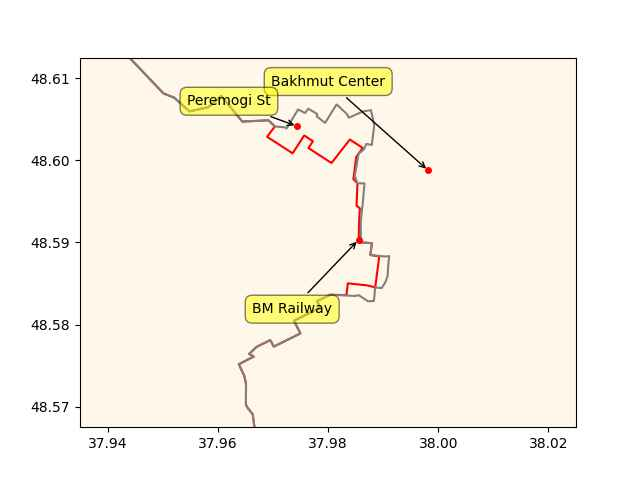

# Week 16

H2 View: "St. Charles Clean Fuels, a development company jointly owned
by Copenhagen Infrastructure Partners and Sustainable Fuels Group, is
exploring the feasibility of building a $4.6bn ammonia production and
export facility in St. Charles Parish, Louisiana"

---

Al-Monitor: "Syria’s Kurds make their own pitch as Arab states court
Assad.. Syrian Kurds.. now seek a new peace with the Syrian
government"

---

[BigThink](https://bigthink.com/hard-science/how-to-colonize-venus/):
"While [Venus and Mars] may not seem alike at first blush,
Venus is quite similar to Earth compared to other planets in our solar
system. So much so, the Morning Star is sometimes called Earth’s
'sister planet'. Its gravity is 90% as strong as Earth’s, compared to
Mars’ ~38%, meaning that our muscles won’t atrophy, and our bones
won’t decalcify as they do in low-gravity environments"

---

[Link](ejagoffspace.jpg)

---

CBS News: "SpaceX Starship rocket launch ends in midair explosion
minutes after liftoff"

---

H2 View: "The UK’s gas networks are ready to deliver hydrogen
infrastructure in a country-wide, coordinated way in the coming
decades, according to A hydrogen vision for the UK report published by
the Energy Networks Association"

---

Euractiv: "German government adopts fossil boiler ban, starting 2024"

---

H2 Central: "New Mexico Puts in Bid for $1,25 Billion Hydrogen Grant"

---

Global Fleet: "China is becoming the grandmaster in hydrogen
power.. China plans to produce up to 200,000 tons of green hydrogen by
2025, produced 100% from renewable energies, and market demand to hit
90 m metric tons by 2060"

---

TASS: "Mexico is open to talks with Russia on the rollout of Mir
payment system cards in the country, Ambassador to Russia [says]"

---

TASS: "Hungary views Russia as partner, US as friend, says government
official"

---

H2 View: "Australia’s Provaris Energy has launched a floating gaseous
hydrogen storage solution, designed to hold 300 to 600 tonnes of
hydrogen at a fraction of the cost of onshore infrastructure.. Dubbed
H2Leo, the solution has already received an Approval in Principle
(AiP) from the American Bureau of Shipping (ABS) and is hoped to
provide the global hydrogen industry with an energy efficient and
cost-effective storage solution. Targeted to cost 0.2-0.3m per tonne
of hydrogen (200-300 dollar/kg hydrogen) Provaris says H2Leo will make
the storage system “significantly cheaper than onshore solutions.”

---

"Azerbaijan well placed to provide green hydrogen to
Europe.. Azerbaijan is uniquely equipped to successfully develop a
green hydrogen industry and may soon supply the EU with the
climate-friendly fuel"

---

Latest RU advances in the western BM

```python
cs = ['Bakhmut Center','BM Railway','Peremogi St']
u.sm_plot_ukr1('ukrdata/fl-0420.csv', 'ukrdata/fl-0416.csv',cs,clat=48.59,clon=37.98,zoom=0.005)
```

 

---

China Daily: "Chinese industrial giant CRRC Corp Ltd, in partnership
with Chengdu Rail Transit, introduced a new zero-emissions passenger
train powered by hydrogen in February. The new train offers a travel
range of 600 kilometers and is the fastest to date, with a top speed
of 160 kilometers per hour... As part of the nation's efforts to
achieve the dual carbon goals, China aims to have 1 million hydrogen
fuel cell vehicles and 1,000 hydrogen refueling stations by 2030"

---

First-World Problems? ;\|

Vlogger David Wen: "During lunch my friend mentioned her son had an
allergic reaction, went to the emergency room, luckily he was fine but
they received a bill for 20,000 dollars and then my other friend tells
me about the time he fainted got transported to the ER and was handed
a 10,000 dollar bill"

---

Of course the culprit is modern tech, and people

WION: "Why do whales commit suicide? Answer may be sonar.. [H]ow could
the ocean's most accomplished deep-sea diver wind up with nitrogen
bubbles poisoning its veins..  'In the presence of sonar they are
stressed and swim vigorously away from the sound source, changing
their diving pattern.. which makes the animals accumulate nitrogen'
[says expert]..

Starting around 1960, ships began emitting underwater signals in a
range of about 5 kilohertz (kHz). That is when the mass beaching of
beaked whales, especially in the Mediterranean, began... The most
deadly episode, in 2002, saw 14 stranded over a 36-hour period in the
Canary Islands during a NATO naval exercise"

---

Beached whales - sad.

---

H2 View: "Rolls-Royce reveals green hydrogen production and fuel cell
plans.. Rolls-Royce plans to produce green hydrogen at is
Friedrichshafen headquarters and test its mtu hydrogen engines and
fuel cell systems"

---

"@danwentzel@urbanists.social

'My hot take on '15 minute cities' is if you can get to the coffee
shop within fifteen minutes, but the barrista who makes your drink
can’t afford to live closer than a half-hour away, then you live in a
theme park.”

---

No shite

FAO: "The average water content of cabbage is about 90 percent"

---

Science Daily: "A solar hydrogen system that co-generates heat and
oxygen... EPFL researchers have built a pilot-scale solar reactor that
produces usable heat and oxygen, in addition to generating hydrogen
with unprecedented efficiency for its size"

[[-]](https://www.sciencedaily.com/releases/2023/04/230417142442.htm)

---

This is direct solar-to-H2 wout electricity

Paper: "Here we present the successful scaling of a thermally
integrated photoelectrochemical device—utilizing concentrated solar
irradiation—to a kW-scale pilot plant capable of co-generation of
hydrogen and heat. A solar-to-hydrogen device-level efficiency of
greater than 20% at an H2 production rate of >2.0 kW (>0.8 g min−1) is
achieved"

[[-]](https://www.researchgate.net/publication/369924141_Kilowatt-scale_solar_hydrogen_production_system_using_a_concentrated_integrated_photoelectrochemical_device)

---

I wonder how much damages the shitlib media would have to pay if tried
and convicted for their Russiagate lies.. If properly priced the
incurred damages would probably reach nearly 100 billion dollars.

---

First Post: "India, Russia trade exceeds target of $30 billion before
2025, may increase, says [FM] Jaishankar"

---

Al Jazeera: "India and China snap up Russian oil in April above 'price cap'"

---

That equals a radius of abt 90 meters. Reports suggest a red mushroom
cloud was visible after one explosion.

AOAV: "According to Russian claims, the blast [area] from a single
[FAB-500] warhead is 25,000 square metres"

---

The Eastern Herald: "In the Bakhmut.. region, the Russian air force
used FAB-500 bombs.. one [bombing] was recorded near the fortified
area of ​​the 241st Territorial Defense Brigade between Khromov and the
motocross track, the second – in the area of ​​​​the intersection near the
eighth Pond west of the city, where the armed forces of Ukraine are
trying to transfer ammunition to Bakhmut"

---

Fueler: "BMW is presenting international media representatives with
the first vehicles in a pilot fleet of Hydrogen powered iX5s... You
fill your vehicle with Hydrogen at a fuel station like a petrol or
diesel vehicle. It is clean and straightforward and avoids any need
for charging, which is currently costing more and more... I believe
more manufacturers will look at Hydrogen as a source to power
vehicles, so looking at the BMW trial is exciting"

[Pic 1](https://fueler.ca/wp-content/uploads/2023/04/P90494382-highRes-1200x800.jpg),
[Pic 2](https://fueler.ca/wp-content/uploads/2023/04/P90494342-highRes-1200x798.jpg),
[Pic 3](https://fueler.ca/wp-content/uploads/2023/04/P90494460-highRes-1200x798.jpg)

---

Melenchon fell out of favor, Francois Ruffin is the rising star of the
French left?

---

Infighting in Sudan, two militaries are fighting; one is the official,
the other, RSF, is a paramilitary group started in 2000s. Much is said
about the RSF leader Hemeti but I heard one speech, he was saying "I'm
a simple Bedouin man who grew up on the sidelines of Sudan and did not
get anything from my country except violence". Life probably wasn't
too easy for him and his people... Generally though having two armies
neither of which feels too attached to civilian rule is not good. It's
like some next level IR joke..  building on the Paki version,
countries have a militaries, PK military has a country, in Sudan, two
militaries have the same country.

---

H2 Central: "U.S. Secretary of Energy Jennifer Granholm said that
Washington could export hydrogen to Japan as part of larger bilateral
energy cooperation"

---

[Link](https://drive.google.com/uc?export=view&id=1HSGJAFJ5bsISresSL5rLc-XGmW1iFvuC)

---

Al-Monitor: "Son of Iran’s shah Pahlavi arrives in Israel on controversial visit"

---

Al-Monitor: "Saudi-Israeli normalization drifts further away as Riyadh courts Iran"

---

Want

H2 Central: "First Hydrogen Corp.  releases its vision for a
zero-emission Recreational Vehicle (RV) as it explores the
applications for alternative fuels across different vehicle
classes. Designed to have spacious living quarters, a large front
windshield and good ground clearance, the campervan concept
prioritises driver comfort and experience"

 

---

NJ Spotlight News: "New Jersey is joining six other states in seeking
$1.25 billion in federal funds to explore the potential of clean
hydrogen as a way to reduce global warming emissions and spur economic
growth"

---

Here is Lerner on TBB; he says many recent 'fairy dust' cosmological
explanations are there as duct tape, to keep the underlying theory
seemingly functional, but the core is too broken.

[[-]](../../2023/04/ex-post-facto-lerner.html)

---

Michio Kaku: "All of a sudden we realize we may have to rewrite all
the textbooks about the beginning of the universe"

---

🍌 🍌 🍌 😂 😂 😂 

CBS News: "'It's bananas': University of Colorado researchers use
James Webb telescope to find ancient galaxies that shouldn't exist"

---

Yahoo News: "Newfound Super-Bright Neutron Star Baffles Scientists And
Should Not Exist"

---

'Do not fully understand' is right, as in, *it never happened*.

National Geographic: "A star cluster some 80,000 light-years from
Earth looks mysteriously deficient in [rare earth which] suggests that
astrophysicists either don't fully understand the big bang, they
suggest, or else don't fully understand the way that stars work"

---

Gizmodo: "[2012] Hubble has spotted an ancient galaxy that shouldn't
exist.. This galaxy is so large, so fully-formed, astronomers say it
shouldn't exist at all. It's called a "grand-design" spiral galaxy,
and unlike most galaxies of its kind, this one is old"

---

"@Hypx@mastodon.social

Wärtsilä, Höegh LNG and partners receive funding of €5.9M to develop
ammonia as hydrogen carrier"

---

Pak has an half-assed democratic system; either have unelected
bureucrats call the shots like in China, or elected civilians are in
control, bureucrats take the backseat. Can't have both.

WSJ: "Imran Khan Fights the Army for Control of Nuclear-Armed
Pakistan.. The popular former prime minister goes head to head with
the powerful military chief"

---

H2 Central: "States Form Coalition to Pursue Hydrogen Grants.. The
proposed Mid-Continent Clean Hydrogen Hub (MCH2) – a partnership
between Iowa, Nebraska and Missouri – would be competing with other
regional proposals for $7 billion available to establish six to 10
green hydrogen hubs"

---

<iframe width="340"  src="https://www.youtube.com/embed/T8BOKPvxGL4" title="Future of Hydrogen Air Travel" frameborder="0" allow="accelerometer; autoplay; clipboard-write; encrypted-media; gyroscope; picture-in-picture; web-share" allowfullscreen></iframe>

---

H2 Central: "Biggest hydrogen fuel plane flies for first time..
Universal Hydrogen has successfully completed the first test flight of
its hydrogen fuel plane, currently the largest of its kind. The
company has been modifying the De Havilland Canada Dash 8-300
aircraft... The plane has two hydrogen tanks with a capacity of 30
kilograms of fuel"

---

CCJ: "China continues fuel cell lead over U.S."

---

UA took a stand at Bakhmut but that did not stop RU to advance in
areas to the North and South of it; see landmass taken past four
months, Krasnopolivka, Blahodatne are gone, RU is now approaching
Serebryanka.

```python
ps = ['Bakhmut','Serebryanka','Krasnopolivka','Blahodatne']
u.sm_plot_ukr1('ukrdata/fl-0416.csv','ukrdata/fl-221115.csv',ps,clat=48,clon=37,zoom=0.1)
```

[[-]](ukr-9.jpg)

---

Russia now has the Bakhmut railway

```python
ps = ['Bakhmut Center','BM Railway']
u.sm_plot_ukr1('ukrdata/fl-0416.csv','ukrdata/fl-0411.csv',ps,clat=48.59,clon=37.98,zoom=0.05)
```

[[-]](ukr-8.jpg)

---

hah

"@eichkat3r@hessen.social

french is a bit like java

you could actually omit half but somehow don't"

---

NL Times: "The Dutch government has issued 91 waivers from sanctions
against Russia since the country invaded Ukraine late in February, RTL
Nieuws reports after talking to the Ministries"

---

H2 Central: "Enagás, Hive Energy And The JCCM Come Together to Develop
in Albacete 'The Largest Green Hydrogen Hub in Europe'"

---

The Iraq Study Group Report

[PDF](https://www.govinfo.gov/content/pkg/GPO-IRAQSTUDYGROUP/pdf/GPO-IRAQSTUDYGROUP.pdf)

---

The Doran article details how WH stuck to its Iran policy; and likely
forces both internal and external actively tried to undermine this
thawing of relations, and the conflict in ME became more complicated,
and deadly because of it. Secret intel sharing would complicate things
further and obviously help Assad.  

---

Russia Russia Russia

---

Michael Doran: "When [Obama] arrived in Washington in 2006, he
absorbed a set of ideas that had incubated on Capitol Hill during the
previous three years—ideas that had received widespread attention
thanks to the final report of the Iraq Study Group, a bipartisan
congressional commission whose co-chairs, former secretary of state
James Baker and former Indiana congressman Lee Hamilton, interpreted
their mission broadly, offering advice on all key aspects of Middle
East policy.. The report, published in December 2006, urged
then-President Bush to take four major steps: withdraw American troops
from Iraq; surge American troops in Afghanistan; reinvigorate the
Arab-Israeli 'peace process'; and, last but far from least, launch a
diplomatic engagement of the Islamic Republic of Iran and its junior
partner, the Assad regime in Syria. Baker and Hamilton believed that
Bush stood in thrall to Israel and was therefore insufficiently alive
to the benefits of cooperating with Iran and Syria. Those two regimes,
supposedly, shared with Washington the twin goals of stabilizing Iraq
and defeating al-Qaeda and other Sunni jihadi groups. In turn, this
shared interest would provide a foundation for building a concert
system of states—a club of stable powers that could work together to
contain the worst pathologies of the Middle East and lead the way to a
sunnier future.

Expressing the ethos of an influential segment of the foreign-policy
elite, the Baker-Hamilton report became the blueprint for the foreign
policy of the Obama administration, and its spirit continues to
pervade Obama’s inner circle. Denis McDonough, now the president’s
chief of staff, once worked as an aide to Lee Hamilton; so did
Benjamin Rhodes, who helped write the Iraq Study Group’s report. Obama
not only adopted the blueprint but took it one step further,
recruiting Vladimir Putin’s Russia as another candidate for membership
in the new club. The administration’s early 'reset' with Russia and
its policy of reaching out to Iran and Syria formed two parts of a
single vision"

[[-]](https://www.hudson.org/foreign-policy/obama-s-secret-iran-strategy)

---

It's not too far fetched post 2013 admin helped Assad through
backchannels, closer rels with Iran, Syria, Russia were part of their
plan.

---

Politico: "'Republicans were a party known for starting wars overseas,
cutting Social Security and Medicare at home, and pushing mass amnesty
for illegal aliens,' Trump told donors during the closed-door
gathering.. Declaring that the 'old Republican Party is gone, and it
is never coming back,' Trump in Nashville urged Republican donors to
help put him back in the White House"

---

WION: "'Time is not right...': Trump ally Mike Pompeo drops out of 2024
presidential race"

---

Al Jazeera: "Pence booed at NRA meeting in US as he tries to outflank
Trump"

---

Euractiv: "On China visit, Lula says US should stop ‘encouraging’ war
in Ukraine"

---

First Post: "Russian oil exports hit near three-year high in March
despite sanctions in wake of Ukraine war: IEA"

---

Hindustan Times: "World Bank President Malpass praises India for
empowering women, mentions PM Modi"

---

Zambia goes to US column

[[-]](../../2022/12/ru-africa.html)

---

The Hydrogen Stream: "Global pipeline projects to surge by 2035, says
Rystad.. Rystad Energy said hydrogen pipeline projects could expand by
as much as 700% over the next 12 years. It said that more than 4,300
km of pipelines already transport hydrogen, with more than 90% of them
in Europe and North America. It estimates that there are about 91
planned pipeline projects throughout the world, with 30,300 kilometers
set to go online by around 2035. 'Spain, France, and Germany are among
the countries committed or considering cross-border pipelines to
facilitate energy flows, while the UK with its extensive gas grid
finds itself in a fantastic position to switch from natural gas to
hydrogen,' it noted"

---

The media guy Maxwell was in it, Ghishalashalaylay's father..
[This lady](ejagoffmaxwell2.jpg). He was portrayed as a
connected, scheming jerkoff, based on his biz history portrayal
looks correct.

---

It takes place pre-Perestroika, one gov official's line was the best
"it’s just a video game.. to you, yes, but to the men in power, it is
a slippery slope from selling one game to selling all of Russia to the
highest bidder".

And Russia was nearly sold to the highest bidder during the 90s,
wasn't it? That's how the world ended up with Putin.

---

*Tetris* was a fine movie

---

Bertrand Russell: "Although this may seem a paradox, all exact science
is dominated by the idea of approximation. When a man tells you that
he knows the exact truth about anything, you are safe in inferring
that he is an inexact man"

---

According to Hersh Germans were instrumental in passing the intel to
Syria, in its fight against al Nusra and ISIS.

---

It may be possible WH knew..  The 2008-2016 Iran (Syrian friend)
raproachement efforts are well known; Let's also remember the
backtracking on the "red line" ultimatum.

---

They went behind Bama's back to give Assad intel on the opposition?
Quite a claim. 

Hersh, *The Killing of Osama bin Laden*: "The administration’s policy
was contradictory. They wanted Assad to go but the opposition was
dominated by extremists. So who was going to replace him?  To say
Assad’s got to go is fine, but if you follow that through—therefore
anyone is better. It’s the ‘anybody else is better’ issue that the JCS
had with Obama’s policy... The Joint Chiefs felt that a direct
challenge to Obama’s policy would have 'had a zero chance of success.'
So in the autumn of 2013 they decided to take steps against the
extremists without going through political channels, by providing US
intelligence to the militaries of other nations, on the understanding
that it would be passed on to the Syrian army and used against the
common enemy, Jabhat al-Nusra and Islamic State... 'Obama didn’t know,
but Obama doesn’t know what the JCS does in every circumstance, and
that’s true of all presidents' [an official said].

---
