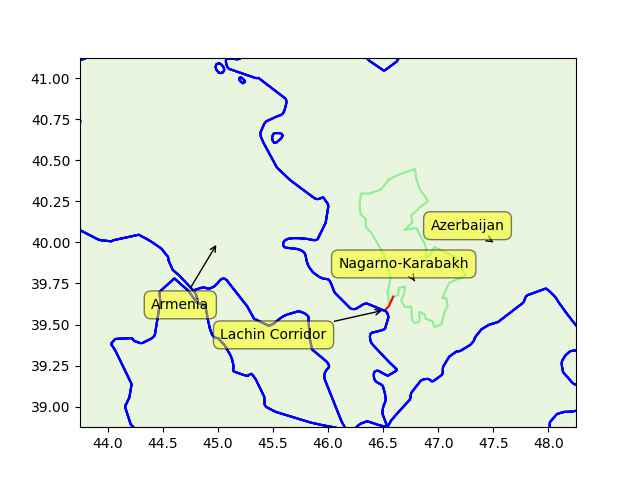
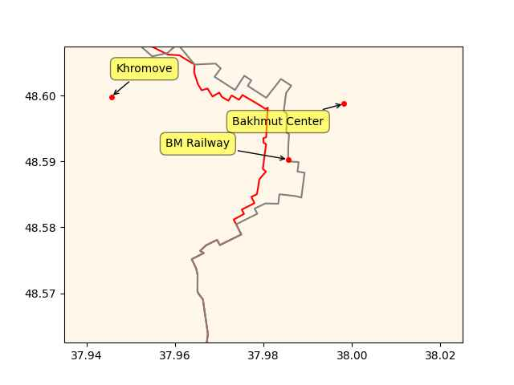

# Week 17

Euractiv: "France asks [Azerbaijan] to restore ‘unhindered’ movement on vital corridor"

---

But of course they do

Al-Monitor: "[2023/03] Israel exports arms to Azerbaijan as tensions
soar with Armenia"

---

Where is the good ol' genocide victim symphaty when you need it eh?
Israel gets it, forgiveness in all kinds of world affairs, why not
Armenia?

Aw darn - they have relations with Russia, that's the problem. In that
case your victimization counts less.. Israel's matters more because
they are on the *right side*, the tip of the spear for "Anglo designs"
in the region. We hyperventilate about theirs, not about Armenia bcz
they are not US', Britain's bitch.

---

```python
u.sm_plot_azearm4(['Armenia','Azerbaijan','Lachin Corridor','Nagarno-Karabakh'])
```

 

---

It was at the Lachin Corridor

Reuters: "Azerbaijan said it had established a checkpoint on the road
leading to Karabakh, a step it said was essential due to what it cast
as Armenia's use of the road to transport weapons"

---

A lot of ppl in analytics do not seem to have mastered the dark arts
of incremental processing; Do not bring *da entire* input file in
memory, keep *da entire* output in memory before writing it to file,
read piecemeal, write piecemeal, while keeping only the bare minimum,
bare essentials in RAM. A lot of algorithms can be coded this way.

---

"@yogthos@mas.to

I can't wait till people start crafting clever prompts to get these
things to divulge corporate secrets :)"

---

"@yogthos@mas.to

deploying LLMs to production be like"

[[-]](https://media.mas.to/masto-public/media_attachments/files/110/248/459/433/803/260/original/e5d7d728aa68ed27.png)

---

"@QasimRashid@mastodon.social

A quick history lesson. From 1940-1980:

•Wealthiest paid 70-94% marginal tax

•0 of them went broke from taxation

•0 of them left USA

•All remained exceedingly wealthy

•Manufacturing boomed

•The middle class was 62% of US economy (It's now 40% post 'trickle
 down scamenomics)"

---

"A new dawn for hydrogen mobility in Europe.. With the EU’s commitment
to hydrogen stations every 200km on major roads, the industry now sees
a positive sign to push forward with the development of a hydrogen
mobility ecosystem"

---

The best things in life are free

Data Scientist: "My custom [code] uses high resolution radar data
collected in 2000 by the Space Shuttle Endeavor. For about 18GB of
hard drive space, the SRTM GL3 dataset covers nearly 120M square
kilometers of Earth’s landmass in 90m increments... It is interesting
to note that Google currently charges $5 per 1000 requests to their
Elevation API, but thanks to NASA and a few lines of code, we can get
the same high-quality results, free of charge"

---

Teenage kid made a sailboat voyage around the world, the logistics:
had Internet, sat phone, a ton of food tinned, 500+ chocolates, 200+
Easy Food vacuum cooked ready meals, lamb chops - as in full-blown
meals. Then save for the occasional physical labor required to direct
the ship it's mostly being rocked and it's mostly enjoying the view
and sometimes being bored. It's like a teenager room on the move, wout
the parents. And later she goes on to become a bleeping management
consultant, and her former sail buddy boyfriend dies on her? Sad.

---

H2 Central: "Greek company Mytilineos invests in hydrogen sector in
Australia. Mytilineos announced the acquisition of a 15% equity stake
in Clara Energy’s Rosedale Green Hydrogen project in Australia"

---

Reuters: "Seven companies in Germany's energy sector said on Tuesday
that they had formed an alliance to bring clean hydrogen from the
seashore to centres of industrial consumption"

---

Sound From The Ground - Waves \#music

[[-]](https://youtu.be/TVNm6XvHG_k)

---

Not much news about helium-cooled nuke plants of Japan lately, what
happened? They were supposed to be 100% safe, use a fission fuel tech
named TRISO have better waste management capabilities, and will be
generating H2 efficiently. Is the tech still being pursued?

---

WION: "Japan, EU say US plans to ban all exports to Russia 'simply not
doable'.. United State's proposal for the Group of Seven (G7)
countries to ban all exports to Russia was met with resistance, ahead
of a summit of the bloc"

---

*The Precariat*: "In the 1970s, a group of ideologically inspired
economists captured the ears and minds of politicians. The central
plank of their ‘neo-liberal’ model was that growth and development
depended on market competitiveness; everything should be done to
maximise competition and competitiveness, and to allow market
principles to permeate all aspects of life.

One theme was that countries should increase labour market
flexibility, which came to mean an agenda for transferring risks and
insecurity onto workers and their families. The result has been the
creation of a global ‘precariat’, consisting of many millions around
the world without an anchor of stability. They are becoming a new
dangerous class. They are prone to listen to ugly voices, and to use
their votes and money to give those voices a political platform of
increasing influence. The very success of the ‘neo-liberal’ agenda,
embraced to a greater or lesser extent by governments of all
complexions, has created an incipient political monster. Action is
needed before that monster comes to life"

---

<iframe width="340" src="https://www.youtube.com/embed/SraQi_BXsJc?end=1110" title="Will universal basic income become mainstream? | The Stream" frameborder="0" allow="accelerometer; autoplay; clipboard-write; encrypted-media; gyroscope; picture-in-picture; web-share" allowfullscreen></iframe>

---

Wired: "Forget Cars, Green Hydrogen Will Supercharge Crops.. Renewable
generation projects are set to make this future fuel widely
available. And it’s much more versatile than you think"

---

The COVID national emergency was ended in Apr 11, could've been to
stave off \#RK attacks on that issue. Is the Biden team worried?

---

\#RFKj is clearly a Trump-inspired Kennedy.

These people come out of the woodwork.. there is a Kennedy for every
kind of political situation, any shape, size; there is a tall Kennedy,
a short Kennedy, I'm sure if the situation called for it there is a
midget Kennedy somewhere. Biden made a mistake building up the
family's image, the myth, hoping to gain legitimacy by displaying a
connection to it, but then the genuine item can show up and gobble up
your shit. Now \#RK says in an interview "Biden has my father's bust
behind him in every WH picture" so you handed a Kennedy an advantage -
why bother with the guy merely standing in front of the bust when
there is the actual son in the running? 

---

Renew Economy: "Fortescue produces its first Australian made hydrogen
electrolyser prototype"

---

"@Hypx@mastodon.social

India's Tata Steel begins hydrogen gas injection trial in blast furnace"

---

Note the aim of this fraud is to qualify for tax credits in US and
abroad, which essentially means stealing taxpayers' money.

Reuters: "[01/2023] South Korea fines Tesla $2.2 mln for exaggerating
driving range of EVs.. antitrust regulator said it would impose
a.. fine on Tesla for failing to tell its customers about the shorter
driving range of its electric vehicles (EVs) in low temperatures"

---

Hindustan Times: "8-year-old girl dies after mobile phone explodes in
hand.. According to police, overheating of the battery could be the
reason for the explosion"

---

RU frontline changes in the past 6 days

```python
cs = ['Bakhmut Center','BM Railway','Khromove']
u.sm_plot_ukr1('ukrdata/fl-0426.csv','ukrdata/fl-0420.csv',cs,clat=48.585,clon=37.98,zoom=0.005)
```

 

---

teleSUR: "Colombian President Gustavo Petro sent to Congress a labor
reform bill that will reduce working week hours from 48 to 42 and
increase wages for working on Sundays and holidays by 100 percent...
'Being the most unproductive country in the [OECD] and, at the same
time, having the longest working day in the world is useless,' Petro
said, urgent to promote job stability so that the country can
industrialize"

---

Multiculturalism is a nice word but it never works - in one generation
the migrant assimilates. Why bother with mumbling stupid shit shaking
lanterns with smoke coming out whatever. State psyop likes this biz
bcz it is in their interest to keep people seperate, disconnected -
it's a variation of divide-and-rule.

---

Every immigrant, minority brings some changes into the larger soc they
are in, in proportion to their population. 10% can effect 10%. But
subsequent generations get the whole thing, not just the 10%. "The
unblemished, unchanged migrant, minority" fallacy dictates minority
only learns its own minority culture not the whole. This is a foolish
fantasy. Do not raise your children this way, you will fail to effect
their culture anyway, and you can make them neurotic.

---

DroneDj: "DroneUp, the drone delivery company that Walmart is using,
says it plans to test new hydrogen fuel cell technology that has the
potential to increase a drone’s flight time to two to five hours.

This fuel cell technology has been developed by South Korea’s Doosan
Mobility Innovation (DMI), which is also building one of the
first-ever open-source, hydrogen-fuel-cell powered motorcycles in
collaboration with [MIT]..

Compared to conventional lithium battery-powered drones, DMI’s
hydrogen fuel cell technology yields 3-to-1 energy density
characteristics. So, with this tech, a small drone can fly anywhere
between two to five hours, depending on factors such as payload weight
and weather"

[[-]](https://dronedj.com/2023/04/17/droneup-doosan-hydrogen-cell-drones/)

---

A haha aha that is so funny doggone it

[[-]](bill1.jpg)

---

😂 😂 The hipster column is always at the ready to show up
at anything 'happening', hot, and techy.

NYT: "Mr. Bankman-Fried was presiding over the first edition of the
Crypto Bahamas conference, a showcase for FTX and a vivid
demonstration of his growing celebrity and influence...  One
afternoon, Mr. Bankman-Fried led a panel with Tony Blair and Bill
Clinton"

---

<iframe width="340" src="https://www.youtube.com/embed/o7zazuy_UfI" title="Cryptocurrencies II: Last Week Tonight with John Oliver (HBO)" frameborder="0" allow="accelerometer; autoplay; clipboard-write; encrypted-media; gyroscope; picture-in-picture; web-share" allowfullscreen></iframe>

---

The RU animosity thing was mostly overblown too IMO, during Mao and
Xiaoping. They were playing you.

---

Now they are sufficiently developed, they can build their own tech,
for the rest can trade with Germany, Europe, whomever. They don't need
you anymore.

"China was entusiastic to show friendship to US during 1979 attacking
Vietnam to get tech / investment. Why are they giving cold shoulder to
us America now?"

---

[Strategery](../../0119/2017/07/the-next-decade-friedman.html#australia)

---

Happy Anzac Day bitchez! (Apparently it's on April 25th)

---

Current Oz Labor gov is continuing the nuke sub deal AUKUS. A former
Labor leader [criticized](https://www.theguardian.com/australia-news/2023/mar/15/paul-keating-labels-aukus-submarine-pact-worst-deal-in-all-history-in-attack-on-albanese-government)
the decision as "the 'worst deal in all history', because [the same money] could
buy 40 to 50 conventional submarines instead". He says, correctly,
conv subs are more than sufficient to defend Australia from attacking
navies. But of course that's not the point of the nuke sub deal. Nuke
subs are needed for attacking China, in their turf, and that's the point,
AUKUS isn't about direct homeland defense, it is about offense. You are
going Galipoli again, in return for a superpower help, just like during WWI,
1915 when you attacked a people with whom "you never had an angry word with".

---

The deaths of those soldiers did mean something, in strategic terms,
not in the way regular people understand war. Galipoli wasn't a case
of "I was attacked now I defend myself" it was a case of "I must
invade A who is part of alliance B because I need the protection of C
against some way distant future possibly invasion of X".

---

Anzac support was due to a security / neutrality trade-off for Oz; you
offer your services, in location, in human lives, to a superpower
(Britain then, US now) to get "protection" in return. The reason for
the Anzac rememberence rituals are kept alive today is to remind
people a similar sacrifice might be asked of them again.

---

When his Galipoli movie came out, Russell Crowe gave an interview, the
responses from people were interesting. Some were like 'Wut'? That is
a national narrative at work, they reside in subconcious, sit there as
unquestioned, banal conclusions. When questioned ppl are shocked.

[[-]](https://youtu.be/4BDk0FceZgk?t=7)

---

There were New Zealanders in Anzac; the word is is an acronym for the
**A**ustralian and **N**ew **Z**ealand **A**rmy **C**orps. This piece
of history interests me obviously bcz Anzac were sent by Brits to
Galipoli attacking my hood.

---

H2 View: "A first shipment of independently-certified low-carbon
ammonia has been shipped from Saudi Arabia to Japan for use as fuel in
power generation.

 

The ammonia was produced by SABIC Agri-Nutrients (SABIC AN) with
feedstock from Aramco, and sold by Aramco Trading Company to the Fuji
Oil Company (FOC). Mitsui O.S.K. Lines (MOL) was tasked with shipping
the liquid to Japan, then the low-carbon ammonia was transported to
the Sodegaura Refinery for use in co-fired power generation, with
technical support provided by Japan Oil Engineering Co (JOE).

The ammonia is categorised as low-carbon because carbon dioxide (CO2)
from the associated manufacturing process was captured and utilised in
downstream applications"

---

Politico "[Responding with] ‘What?!’ Orbán throws cold water on
Ukraine’s NATO hopes"

---

Tucker leaves Fox? Too bad - anti-war voices were getting good screen
time on his show. 

---

Munee mo munee

Janes: "The US Congress will have to markedly increase unconstrained
shipbuilding funding if it wants the US Navy (USN) to reach the stated
355-ship force by the middle of this century, according to the USN
Report to Congress"

---

The place is called "Stoned and Toned". 

The Holywood Reporter: "Exercising While Stoned: I Tried a Cannabis
Workout Class"

---

Modern US liberalism can get delusional; it always had a subjective,
un-scientific bent, bizarre ideas about the self. Truly mambo-jambo
stuff, "new age", like "believing you can be, at an instant, however
you label yourself to be". How the flap can you will yourself to be a
man, or woman when you aren't? In own head fine but why inflict that
delusion on others?

---

Good law.

CBS News: "The Republican-led House passed a bill Thursday that would
bar schools and colleges that receive federal money from allowing
transgender athletes whose biological sex assigned at birth was male
to compete on girls or women's sports teams or athletic events"

---

H2 View: "Chinese-based Hydrexia Energy Technology has launched a
Metal Hydride Trailer (MH-100T) for hydrogen storage and
distribution. The 40-foot first-generation trailer is a
‘first-of-its-kind’ MHx solid-state hydrogen storage and distribution
product and features magnesium-based alloy.

 

Hydrexia claims it can significantly enhance transportation safety and
distance, while reducing transportation cost. It has a large
solid-state hydrogen storage capacity of one tonne and hydrogen
storage density of 6.4%.

It offers low operating pressures of under 12 bar and high hydrogen
purity at 99.999% along with a lifetime of 3,000 cycles without
performance reduction"

---

JFK wasn't buttonholed into anything for the Bay of Pigs; he modified
parts of the plan (badly), and kept managing it (badly) all the way
through its miserable end. Noone likes their uncle to be an
incompetent dumbass, sadly, this was the case.

[[-]](../../2021/08/nuclear-folly-plokhy.html#bayofpigs)

---

CH attack was likely to entice US for econ help. Xiao wanted to give
Vietnam a visible spanking, a country which had only six years ago
managed to repel the Americans, to show that "see I'm hitting your
former enemy, also containing your Cold War opposition, therefore I'm
your friend".

---

*Deng Xiaoping's Long War*: "[Most scholars] do not elucidate why Deng
[Xiaoping] was so eager to inform the Carter administration of
Beijing’s decision to attack Vietnam, something that normally would
only have happened between two closely allied countries..

Deng staked the success of economic reform on Western technology and
foreign investment, particularly from America. Deng’s acceptance of
U.S. terms during the establishment of diplomatic relations between
the two countries in mid-­December 1978 was crucial in achieving these
two strategic objectives both externally and internally... China’s
decision to launch a punitive war against Vietnam was intended to
display Beijing’s usefulness in countering Soviet expansionism. In
Deng’s own words, China was 'a reliable friend,' and it therefore
deserved Western economic and technological assistance"

---

Most know about US Vietnam War, ended in 1973. Not paid attn to
however is China starting a war with Vietnam in 1979.

---

I was watching a docu, an RFK granddaugter was on, looked her up
apparently one spring got on a canoe, pulled into some turbulence, was
sucked in - bitch died. It's like a joke.

---

But with a Kennedy you never know - he could just fall off the chair
one day, hit his head and die

---

Watched the \#JFKJr speech, sounded almost cogent, not bad for a
Kennedy. Except for the lockdown stuff the rest was ok on regulatory
capture, corporations, Ukraine, food stamp cuts, hits the right
notes. Can be a viable threat for JB. After Trump, lewd scandal stuff
matters less, he can make a play for the working class, Reps through
that vax business, and by being an "irregular politician".

---

Macron: "[04/13] Europeans cannot resolve the crisis in Ukraine; how
can we credibly say on Taiwan, watch out, if you do something wrong,
we will be there?"

---

Macron: "[04/13] Europe cannot blindly follow the United States’ lead
and should avoid getting dragged into crises that are not our own."

---

NYT: "[04/12] AS US Tries to Isolate China, German Companies Move Closer"

---

