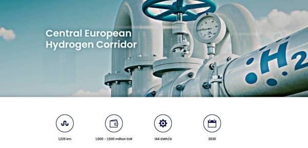
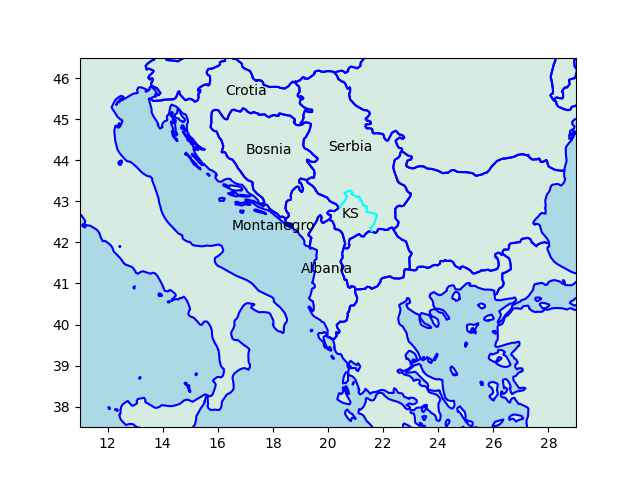
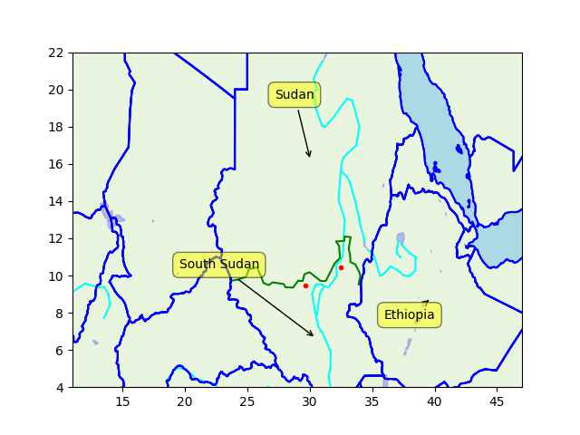

# Week 22

CNBC: "Firms are bringing production back home because of the Ukraine
war, China's slowdown — and TikTok"

---

Al-Monitor: "UAE announces over $1.6B in industrial projects including
hydrogen plant"

---

Holy shit! But they nearly succeeded! We need more US involvement in the region!

Jane's: "North Korea fails to launch reconnaissance satellite"

---

Euractiv: "Macron woos Europe’s East but stays vague on Ukraine
security guarantees"

---

"Government should spend less to avert inflation". That is trickery to
deflect attention away from the private sector to the government. Gov
has been spending for decades before covid and there's been no
inflation. Credit for private firms however, is more likely to be the
cause of rises in prices. Right-wing looves credit for businesses,
they don't want it to end. It's their baby milk. They need to be fed
with it constantly.

---

A major divide in US revolves around who to be wary againts; the
government or private sector? Governments can make war, an awesome
power, but their war machine is ultimately tied to the needs of the
private sector, and the needs of private finance. I'd be warier
against the private sector. The government did not pollute the Hudson
River, or derail your trains in Ohio. Through action, and inaction the
private sector did.

---

You don't need regulation to protect against machines that are too
smart, you need it to protect against morons who keep promoting this
shit when it is not ready, and is nowhere near a semblance of an AI.

---

The Jerusalem Post: "Russia's Medvedev says UK is in a 'de-facto war'
with Russia"

---

"The Central European Hydrogen Corridor (CEHC) initiative was launched
in 2021..  by the vision to develop a hydrogen 'highway' through
Central Europe. The initiative explores the feasibility of creating a
hydrogen pipeline corridor in Central Europe for transporting hydrogen
from major hydrogen supply areas in Ukraine via Slovakia and the Czech
Republic to hydrogen demand areas in Germany"

 

---

Current strait has too many constraints on it, TR does the gobble
gobble others do the wobble wobble if you know what I mean.. A new
strait could bypass all those troubles, give the host country more
leverage.

---

So how about that Stanpoli Canal project? [This is](trcanal1.jpg)
the planned path for it, yes? If a new city is built in the area,
could it have more public spaces compared to the rest of the city this time,
or is that too much to ask?

---

"@Gargron@mastodon.social

Mastodon featured on the App Store 🙂"

[[-]](https://apps.apple.com/us/story/id1668483560)

---

Huawei is definitely a-noid

Quora: "[Huawei was] forced to develop Harmony OS because the US
government banned American companies from working with Huawei
(particularly Google). Huawei saw it coming early on and was secretly
working on an operating system of their own called Harmony OS. They
eventually had to switch over from Android to Harmony OS and now it's
being used"

---

"@mikestevens@aus.social

So, I picked up a #Huawei Watch Fit 2 this morning for $150 at
JB.. It's not #Android, bc Huawei was kicked out of [US] so they've
been building out #HarmonyOS (a fork of AOSP..)"

---

"You are a droid, I am a noid" - good one \#TNG

---

Had to remove some defunct soft components.. `diskdict`, sigh pie
`gaussian_filter`, weird document indexer code, gone. `sqlitedict`,
home-cooked 2D smoother, and sqlite3 `fts3` are in.

---

Mmm hmm little `split-window-right` action right there `M-x shell`,
file on the right side, yyiieeaa

---

I'd be damned.. full blown Unix on a Droid tablet, finally worked. Almost
all open source tools are now available. 

[[-]](termux1.jpg)

---

The Independent: "Brics summit mulls expansion and new currency in bid
to rival dollar and escape sanctions.. Bloc of developing countries
calls for new ‘multipolar’ world order and a shift from Western
balance of power"

---

Al Monitor: "Iran, Saudi Arabia, UAE attend BRICS meeting in South
Africa, as bloc mulls expansion"

---

TASS: "Proponents of peace clear minority in EU — Hungarian prime
minister.. Viktor Orban remains convinced that there can be no winners
in the Ukrainian conflict, but only losers"

---

TASS: "West running out of weapons for Kiev regime — UK defense chief"

---

 

---

ABC AU: "The story of Elizabeth Holmes is supposed to be a cautionary
tale. A culture of faking it until you make it is endemic in Silicon
Valley. And today the tech bosses in the US will have a clear message
from authorities: 'push the boundaries and you may end up behind
bars'"

---

BBC: "Disgraced Theranos founder Elizabeth Holmes has reported to the
federal prison where she will serve an 11-year sentence"

---

"@Hypx@mastodon.social

Saudi Arabia Will Have Hydrogen Buses Running In 2024"

---

H2 Central: "Dutch shipping company Future Proof Shipping (FPS)
officially launched the first hydrogen-powered zero-emissions inland
container ship, H2 Barge 1, in Rotterdam, the Netherlands. Earlier in
the week, Nike introduced the H2 Barge 1 at its European Logistics
Campus in Laakdal, Belgium"

---

Now they blame Putin of course for doing something they themselves
would have done *ten times over* had the situation been reversed, if
not preemptively. Forget Soviets around Cuba in 1962, how did US
handle the French in Mexico in 1861? That's right - not well, not with
open arms.

---

The Bosnian situation in the 90s was bad no doubt, and at that stage
the sides weren't that clear cut either, Iran sent fighters to fight
in Bosnia against the Serbs. But we don't know how things reached that
stage. Muckers muck it up, we saw how what they did in Ukraine.. CIA
stirs shit up what do we have 10 years later? And that is a country
with only two groups which are ethnically, religiously, culturally
similar. Imagine what they could do in a country that has many groups
with major religious, ethnics differences.

---

Unsurprisingly US is for Kosovo indep, Russia, China against. Just saw
a CH spox talking about "the territorial integrity of Serbia" by which
they mean Kosovo being part of Serbia. Kosovo is mostly ethnically
Albanian, 90%. Serbs 5%.

---

Serbia is a long-time Russia ally. It looks as if the current map was
created to cut off Serbia from the Adriatic. Serbia and Montanegro
were united before, but Montanegro broke up in 2006. Kosovo declared
independence in 2008 (which Serbia doesn't recognize). Pieces of them
got chopped off, year after year. They got cucked.

```python
u.sm_plot_yugo1()
```

 

---

Djokovic is hard-core.. 

Reuters: "Novak Djokovic risked stirring up a political controversy at
the French Open on Monday, after writing a message about Kosovo on a
camera lens following his first-round victory.. 'Kosovo is the heart
of Serbia. Stop the violence,' 22-time Grand Slam champion Djokovic
wrote in Serbian"

---

Barron's: "French President Emmanuel Macron says Kosovo officials bear
'responsibility' for the deterioration of the situation there"

---

"In a statement to the Washington Examiner, Gaetz said he has 'no
plans' to try and remove McCarthy 'barring some dramatic, unexpected
turn of events.' 'You don't remove someone simply because you disagree
with them. By that standard, no speaker would last a single day'"

---

H2 Central: "Daimler Truck, Mitsubishi Fuso, Hino and Toyota Conclude
an Mou on Accelerating Development of Advanced Technologies and
Merging Mitsubishi Fuso and Hino Motors"

---

Reuters: "Plug Power plans $6 bln hydrogen projects in Finland"

---

You dont need `cdist` from Sigh Pie; that code is a one-liner, works
even for vector -> matrix distances.

---

There; 3D interpolation via Quad Trees. It only depends on "Num Pie".

---

Interesting take from Al Monitor. They paint Burhan not in a strong
position, but Hemeti with access to resources he can buy loyalty with.

[[-]](https://www.al-monitor.com/originals/2023/05/sudan-army-chief-under-pressure-islamist-backers-analysts)

---

WSJ: "Company Insiders Made Billions Before SPAC Bust. Executives and
early investors sold shares worth $22 billion.. At their peak, SPACs
accounted for 70% of all IPOs. But now, the market has dried up and
shares of companies that did SPAC deals have crashed"

---

*Pompeii* was ok.. rivalry between Rome and Pompeii..? It was tough to
sell Keifer Sutherland as a goombah, but I think overall it
worked. Good guys - Celts, slave gladiators, citizens of Pompeii. Bad
guys - Romans. Lovely.

---

Simple algo; find closest points to new point in existing data,
compute distances to each, use that as weights to average their z
values.

---

"Sigh Pie" dependencies... Not usable on every platform. Major pain in
the neck. 3D interpolation should not require this much external code.

---

It wouldn't be as punishment for Darfur, or even the current crisis
that is displacing many.. Sudan is looking like a failed state but US
wld be more worried about a Red Sea Russian base.

---

Uh-oh.. George Clooney news segments are back in circulation, when he
was trying to "raise awareness on Darfur". Psyop in the works laying
the groundwork for a Sudan intervention?

---

South China Morning Post: "G7 countries have 'failed' to address
worldwide hunger, aid .. They can find untold billions to fight the
war [in Ukraine] but can't even provide half of what is needed by the
UN for the most critical humanitarian crises"

---

"England has the only privatised Water in Europe and the most water
pollution and most expensive water.

The UK has the only fully privatised energy, and the most expensive:

The UK has privatised rail, the slowest, least reliable and of course
most expensive in Europe"

---

A new inventive scheme could involve the government more, guiding the
printing towards more investments, and with a portion diverted to
direct payment to citizens.

---

Good points in the documentary *Debt Machine*; money is created out of
thin air for credit, it can be created for useful production instead
of speculation.

[[-]](../../2023/05/debt-machine-video.html)

---

They cld probably design the engines as well, aren't the J-20 engines
built in-house? R&D cost must not have made economic sense.

Al Jazeera: "China’s first home-built passenger jet makes inaugural
flight.. The C919 commercial plane flew from Shanghai to Beijing as
China seeks to compete with Airbus and Boeing... C919 [..has] Western
components, including engines and avionics from firms such as General
Electric Co, Safran SA and Honeywell International Inc"

---

Xinhua: "[Iranian official] said images taken by Iranian satellites
have shown that the Taliban is storing the river's water behind its
dams, such as the Kamal Khan Dam, when Iran's southeastern Sistan and
Baluchestan province bordering Afghanistan was hit by drought.. He
urged the Taliban to respect Iran's water rights from the Helmand
River under a 1973 treaty between the two countries, which entitles
Iran to receive 820 million cubic meters of water from the river per
year.

He added that in addition to the dams built along the Helmand River in
the past, the Taliban has constructed new ones to 'prevent the river's
water from running into Iran.'. The Iranian Space Agency spokesman
said last week satellite photos showed that the Taliban have altered
the river's route in order to prevent it from reaching Iran"

---

WION: "Taliban, Iran exchange heavy gunfire on Afghan border; water
rights issue escalates"

---

Politico: "The White House has a simple message to Democrats skeptical
of the debt ceiling agreement the president cut with Speaker Kevin
McCarthy: Don’t judge us by what’s included but what we kept out...

Progressives have expressed frustration over new work requirements in
two government assistance programs — TANF and SNAP — along with the
spending caps"

---

WSJ: "Finally, Can We Ask Who Really Colluded With Russia? If the
crime is promoting distrust in institutions, the evidence is strongest
against the FBI and media"

---

Reuters: "Singapore’s Keppel Signs Deals to Ramp up Green Hydrogen,
Ammonia Output"

---

Doesn't automatically mean the movie is bad (as in Woke). If the
script is written well, it can work out \#TheFlash

---

*Meg 2*, *The Creator*, *Dune 2* trailers look great. Curious about
*The Flash*. They have a Superchica?

---

First Post: "Netflix' plan backfires, users start cancelling
subscriptions after password-sharing crackdown"

---

"Freedom of the Press Foundation will soon launch the “Daniel Ellsberg
Chair on Government Secrecy.” This full-time staff position will be
dedicated to what Ellsberg has spent a large portion of his life
highlighting the need for: massive reform of the secrecy
infrastructure in the United States. In the coming months, we’ll seek
funds to fully endow this chair position so that it can live in
perpetuity, and be free from changes in any fiscal or political
climate"

[[-]](https://freedom.press/news/in-honor-of-a-whistleblowing-legend-announcing-the-daniel-ellsberg-chair-on-government-secrecy/)

---

In the end, the vote is a referandum on the incumbent; voters
primarily vote on their well-being, pocketbook, and tend to reelect
the incumbent. The incumbency advantage should wear off as time goes
on but in tigger case IMO frequent "outside interventions" constantly
renewed the incumbency advantage for Tayyeap, the last one being in
2016 (likely attempted by fools partly egged on by gov itself but
anyway). Polls suggest the undecideds overwhelmingly went for the
incumbent in the eleventh hour, that suggest the incumbency advantage
persists.

---

Candidate-wise; the current Stanpoli mayor from the opposition could
fare a little better, but he made an ass of himself by associating
with elitist/neolib scum types near election prep, leaving himself
open to attacks - one came in the form of a court case that put his
candidacy in question.

---

TR opposition loses again but their PR work was better this time
around. Assuming the election was legit (some claim there is 2-3%
potential for gov to 'create' votes), they likely fell short on
immigration, and in the last stretch leaned on too heavily on
nationalism judging the third guy with 5% took that share because of
nat rhetoric. That was a mistake. Plus the anti-Russki narrative was
unnecessary, RU was already supportive of current gov, but the added
antagonism would not help, made opposition look like a undiplomatic
neophytes.

It looks like Putin provided direct aid in the form of natgas payments
for the election (residential natgas bill for entire month of May was
zero), and the grain deal renewal gave a PR win for the gov, announced
right after the first round.

---

Politico: "There is little to no accurate information about exactly
what chemicals are used in fracking, or how harmful they may be to
humans or the planet.. The heavy explosives used to create the holes
and fissures also create instability in the earth, leading to erosion
and even earthquakes, like the twelve 2011 earthquakes that rocked the
area around a fracking site in Youngstown, Ohio - a region that had
not ever experienced a quake since such activity was observed and
recorded, beginning in 1776"

---

The *real* Moby Dick story eh?

"The plot of *In the Heart of the Sea* is very reminiscent of *Moby
Dick*.. That said [the movie] is not officially inspired by or adapted
from Melville's *Moby Dick*. It is, however, adapted from another
book, Nathaniel Philbrick's *In the Heart of the Sea: The Tragedy of
the Whaleship Essex*, originally published in 2000, which recounts the
true story of the Essex"

---

*In the Heart of the Sea* was a good movie. I hate to say it I found myself
rooting for the whale.

---

Likely due to us shitting into their environment, they are getting angry

NBC News: "Killer whale attacks on the rise, baffling researchers"

---

H2 Central: "While many carbon capture technologies target a 90-96%
capture rate, the 8RH2 oxy-combustion process will eliminate virtually
all direct CO2 emissions. Unlike standard hydrogen production, 8RH2
uses natural gas and pure oxygen and then utilizes the CO2 produced in
the combustion process as a heat transfer medium in a proprietary
reformer before sequestering the CO2. 8RH2‘s advanced process
eliminates the need for costly amine or cryogenic-based CO2 separation
processes that are normally required to capture CO2, as carbon
separation is inherent to the process itself"

---

"Work requirement" for federal help - sounds like more wage supression.

---

Another case of that population - growth bullshit; it is all about
letting more people in so they create competition for wages which
fall, bosses are happy, they contribute money to politicians who made
it happen.

---

On migration most in the US right-wing are two-faced; they say they
are against it, but actually want the cheap labor it provides for the
bosses who pay for them, so they secretly aim to allow it.

---

The Ethiopian dam GERD final capacity will be >6 GW. It's six nuclear
power plant equivalent. Not bad. 

---

South Sudan border, and the oil fields, the big ones were in the
south.


```python
u.sm_plot_nile2()
```

 

---

Euractiv: "Employment commissioner favours EU-wide four-day work"

---

I remember one year '13 they finished a month early. like had so many
consecutive wins and enough points that even if they played no games
for weeks they'd still be the champion.

---

Bayern Munich wins again? How many has it been already? >10 times?

---

RU also has fifth gen aircraft tech

Politico: "F-16s won’t be a ‘magic weapon’ for Ukraine, Milley
warns.. 'The Russians have 1,000 fourth-generation fighters,' Joint
Chiefs Chair.. told reporters at the Pentagon"

---

Janes: "Inflatable Leopard 2A4 tank decoys are being supplied to
Ukraine, Janes learnt at the International Defence and Security
Technology Fair (IDET)"

---

TASS: "Brazil views BRICS bank as alternative to traditional financial
institutions — president [Lula]"

---

