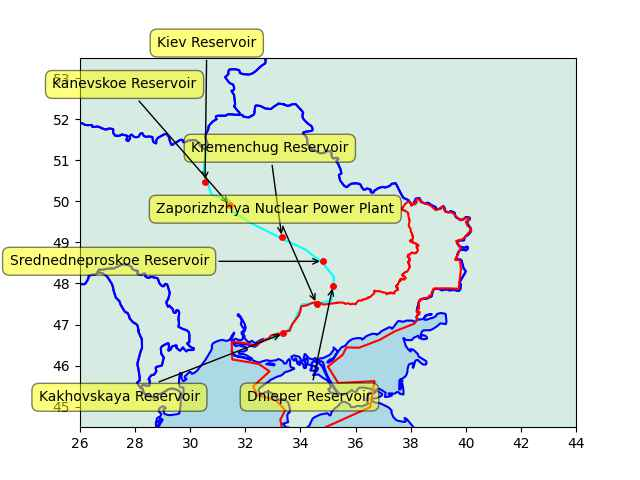
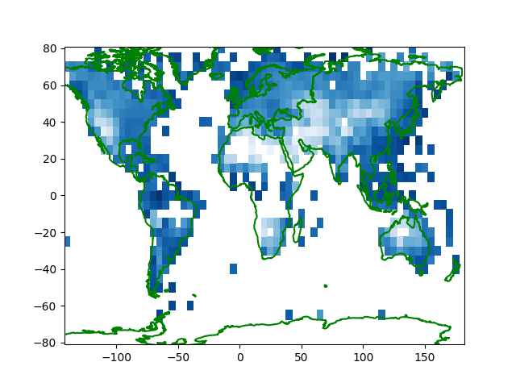
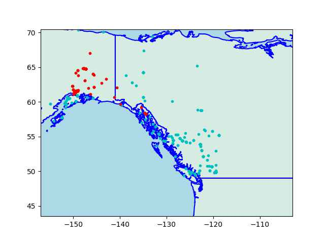

# Week 23

H2 Central: "Mercedes-Benz and H2 Green Steel announce agreements in
both Europe and North America"

---

"@r000t@fosstodon.org

It's the ten year anniversary of the Snowden leaks.

But for some reason, some strange, strange reason.... No news about
it.

Plenty of articles about the super harvest wolf spider blood moon w/
cheese tho"

---

"The Minister for Environment and Water Tanya Plibersek has vowed to
take action on sustainability in the fashion industry.. 'It's actually
a quarter of a million tonnes of clothing going into landfill every
year - it's pretty hard to conceptualize how big an amount that
is... And of course, there's the waste. There's the economic waste of
using something a few times and sticking it in the landfill. But
there's also the huge environmental impact of doing that'

Alongside waste, Plibersek said some clothes that break down release
microplastics into the soil, which end up in water streams. 'The
average Australians is ingesting a credit card's worth of
microplastics every week, through the food we consume as it gets into
our food cycle, through the water we drink'"

---

First Post: "Even America's biggest bank [JP Morgan] says
de-dollarisation is a trend here to persist"

---

"Electric cars are powered by gigantic batteries, and they are all fun
and games until it gets cold. Then many owners find that their range
can fall even with a full charge, similary when the weather gets too
hot. [BEVs] are at their peak performance at 21 C, anything above or
below that will result in performance loss.

But a far bigger problem is battery degradation. For example the Tesla
Model S has an annual degradation rate of 2.3% according to a Geotab
article, then around year 4 of ownership you are already down to 90%.
This is a big issue in terms of car's reusability and the second hand
market. If you buy a 10 year old used electric car you have to pay
both for the car and a new battery which costs thousands, potentially
tens of thousands dollars extra, not to mention who will process the
millions of discarded batteries each year should EVs get popular
enough?

But even a bigger problem is [BEV being a fire hazard]. Electric car
batteries are technically safe unless you keep them at suboptimum
conditions, meaning in areas where the temparature isn't at 21 C and
the roads aren't perfectly smooth - which tends to happen around the
globe. If you run an EV in, say, hot climate, on bumpy roads that
shake the battery around for years there is a higher chance that it
will spontaneously combust"

[[-]](https://youtu.be/V1kOLhhSjl8?t=260)

---

Yep. CO levels through the roof \#nyc

```python
u.pollution(40.749893520045966, -73.98838650248017)
```

```text
Out[1]: 
({'aqi': 5},
 {'co': 700.95,
  'no': 1.87,
  'no2': 16.45,
  'o3': 180.24,
  'so2': 10.73,
  'pm2_5': 60.1,
  'pm10': 61.7,
  'nh3': 5.83})
```

---

\#smoke

[[-]](https://files.mastodon.social/media_attachments/files/110/507/298/633/352/009/original/d74939c0b90acab5.jpg)

---

"@mikestevens@aus.social

This is the future you wanted"

[[-]](https://pbs.twimg.com/media/FyFJhONWwAAT7zp?format=png&name=small)

---

"@to3k@tomaszdunia.pl

\#PESA – Poland’s largest rolling stock manufacturer – has introduced
the first certified hydrogen shunting locomotive to be approved for
the European market"

---

BH theory rests on presence of singularities.. But as the author
suggests whereever u look in the sky and take a measurement you always
get a number, never a "singularity measurement". It doesn't mean the
field equations are wrong, they are just incomplete.

Paper: "Naked singularities were disliked from the beginning of BH
history, in particular by Penrose.. So far, no spot in the sky has
ever looked to me like containing a naked singularity. With sufficient
care, all our maps have always allowed interpretations by nonsingular
condensations of matter, not too dissimilar from our solar system"

[[-]](https://www.hindawi.com/journals/amp/2015/617128/)

---

LeBlanc: "We emphasize again the totally inconsistent physical basis
of Black Hole Thermodynamics (BHTD) and its spinoff theories, the
Holographic Principle (HP) and Emergent Gravity (EG). A thermal
description simply does not exist for systems with negative heat
capacity. No such thermally equilibrated systems are to be found
anywhere in nature. As is universally known, positivity of the heat
capacity is the necessary mathematical requirement for the thermal
equilibrium ensemble description to exist. Claims to the contrary is
phony physics"

[[-]](https://www.researchgate.net/publication/314574978_Fake_Physics_Black_Hole_Thermodynamics_The_Holographic_Principle_and_Emergent_Gravity)

---

The Holographic Principle, 3D universe being a representation of a 2D
flatworld.. these are interesting ideas, inspired by what was learned
from "black holes", but none of this stuff including black holes are
exactly proven by measurements.

---

Saw a segment on this guy; he was saying there is a car road network,
why not another network for hikers, exclusively for pedestrians?

"McKenrick.. walks everywhere.. for the past two-and-a-half years, has
dedicated his life to his latest thru-hike expedition—the scouting,
route-planning and establishment of the new American Perimeter
Trail. It’s something McKenrick has dreamed of creating for years—a
massive thru hike established not just for recreation, but as a means
of conserving the land for generations to come. 'I’m not creating the
next great thru hike, I’m creating America’s next biggest volunteer
and conservation project through this thru hiking' McKenrick said""

[[-]](https://bendmagazine.com/hiking-for-a-purpose/)

---

F24: "Several children injured in mass stabbing in French Alps"

---

NHK: "France reluctant to opening NATO liaison office in Japan"

---

\#nyc \#smoke 

[[-]](https://preview.redd.it/welcome-to-hell-new-york-v0-x2iibkcson4b1.jpg?width=640&crop=smart&auto=webp&s=d025f0124b3862d014c27ecbe76fbd9cd1907b01)

---

\#nyc \#smoke

@cjammet@mastodon.online

[[-]](https://files.mastodon.online/media_attachments/files/110/504/526/898/280/854/small/30919a1cfc09fa52.png)

---

Zaporizhia NPP and Kakhovskaya dam are right on the frontline,
no wonder they became hotspots.

---

Other dams on the Dnieper river

```
u.sm_plot_ukr3()
```

 

---

Also note that RU has Ukraine on the ropes by merely spending 3% of
its GDP.

Politico: "The West isn’t ready to give Ukraine the security pledges
it wants"

---

Al-Monitor: "US Vice President Kamala Harris on Tuesday renewed calls
for Israel to ensure independence of its judiciary, after major
protests against changes pushed by Prime Minister Benjamin Netanyahu"

----

Zooming in.. Anatolia is less humid than Europe, dry areas around
Iran, Iraq.

[[-]](humid2.jpg)

---

Humidity plot.. Parts of Russia, "the Stans" look good. There are
comfortable regions in Africa, west of US.


 

---

Article says South-East Asia is humid -true-, how about the rest 
I 1der. Data time.

---

The Conversation: "Why 40°C is bearable in a desert but lethal in the
tropics..  heatwaves of similar magnitudes can have very different
impacts depending on factors like humidity.. Our bodies gain heat from
the air around us, from the sun, or from our own internal processes
such as digestion and exercise. In response to this, our bodies must
lose some heat. Some of this we lose directly to the air around
us.. But most heat is lost through sweating,.. higher humidity means
that the rate of evaporation from our skin will decrease.. Underlying
health conditions and other personal circumstances can lead to some
people being more vulnerable to heat stress"

---

Country-wide osm road networks in plain csv files.. time for little
geo data mining.. find walk paths that are more likely to be in
nature.. Simply looking at a walkable flag doesnt work, there are many
pedestrian paths right next car lanes.  Need to consider distance btw
a path and all roads in that region. If closest road is far enough
walk path is likely to be scenic.

---

CBC: "Last week, for the first time ever, Cubans appeared alongside
Russians fighting in Ukraine, both in the Russian Army and in the
Wagner Group"

---

On related note massive water is needed to cool the old style nuclear
plants. HTGR tech uses helium, so they are not constrained to be
near huge bodies of water.

[[-]](2022/02/h2-thermo-chemical.html#htgr)

---

Ultimately it was NATO's eastward expansion that caused the collapse
of that dam \#Kakhovka

---

VP play? Tim Scott has better chance on that than CC

---

Crisp Crispy says he will attack DJT directly. How is that different
from 2016 primary, and Trump still won?

---

NBC: "The Biden administration on Monday announced a goal to produce
50 million metric tons of clean hydrogen fuel by 2050 – an ambitious
roadmap that, if successful, would cut around 10% of the country's
planet-warming pollution by the same date"

---

WION: "Robert Hanssen, the FBI agent who spied for Russia was found
dead in a top-security prison in the US on Monday"

---

Everyone is now talking about artillery!

---

Janes: "Sweden rebuilding artillery from scratch" #FutureArtilleryConf

---

Janes: "Italy modernises artillery" #FutureArtilleryConf

---

"Belgium investigating whether its weapons were used inside Russia"

---

"Iran set to reopen embassy in Saudi Arabia after 7 years of closure"

---

Fire! \#BEV

[[-]](https://youtu.be/V1kOLhhSjl8?t=251)

---

H2 Central: "OCOchem Wins $2,5M US Department of Energy Award to
Advance Clean Hydrogen Technologies"

---

Sailfish has accessible Unix

Nokiamob: "A subsidiary of the Russian state company Rostec called
Smartecosystem.. produced the AYYA T1 smartphone... OS.. is based on
Jolla’s Sailfish"

---

Euractiv: "Head of the European Parliament Committee on Environment,
Public Health and Food Safety (ENVI), Pascal Canfin,  wxants to hold a
hearing with agrochemical giants Bayer and Syngenta after researchers
accused them of withholding information on the brain toxicity risk of
pesticides."

---

That is excellent news. 

The Guardian: "Cornel West announces US presidential campaign with the
People’s party.. West, a professor of philosophy and Christian
practice at the Union Theological Seminary and former professor at
Harvard University, has been a prominent academic figure and
commentator for decades. He has repeatedly criticized what he
describes as a neoliberal establishment that dominates politics, and
described himself as a democratic socialist"

---

Informed Comment: "I worry every time Max Boot vents enthusiastically
about a prospective military action. Whenever that Washington
Post columnist professes optimism about some upcoming bloodletting,
misfortune tends to follow..

The gung-ho American journalists summoning Ukrainians to punch holes
in enemy lines might better serve their readers by reflecting on the
larger pattern of American interventionism that began several decades
ago..Punching holes is a poor substitute for strategy. I make no
pretense to be able to divine the thinking that prevails within senior
Ukrainian military circles, but the basic math does them no
favors. Russia’s population is roughly four times greater than
Ukraine’s, its economy 10 times larger"

---

H2 Central: "The First Hydrogen-Powered Vessels Set Sail.. Powered by
Ballard’s fuel cell modules, the first vessels to embark on their
maiden voyages were Norled’s MF Hydra – the world’s first liquid
hydrogen-powered ferry – operating in Norway; FPS Waal, a retrofitted
cargo vessel expected in service on the Rhine River in Holland later
this year; and Zulu06, the first inland cargo transport vessel,
launching on the river Seine in Paris in the second half of 2023"

 

---

TASS: "Saudi trade with BRICS topped $160 bln last year — Saudi
minister"

---

Tiktok runs collaborative filtering as well, which works on user - movie
similarities, but that doesn't require any complex algorithms either,
it's just basic linear algebra.

---

Facebook has "the other Godfather of AI" working for them but Tiktok
has been eating their lunch by simply recommending most popular
videos.

---

Bloomberg: "Billion-Dollar ‘Pink Hydrogen’ Plan on Hold as US Weighs
Rules"

---

Reuters: "Hyphen and Namibia agree next phase of $10 billion green
hydrogen project"

---

Whatever alarms these muckers sound good somehow

"Israel alarmed by IAEA report, possible US backchannel diplomacy with
Iran... The so far elusive package — known as “less for less” — is
expected to include some form of sanctions relief, short of the JCPOA,
and unfreezing as much as $7 billion in South Koran funds owed to
Iran, in return for Tehran implementing a cap on its enrichment
activities to prevent it from making further progress toward a
potential nuclear weapon"

---

Forbes: "At the expo, Bosch showcased its industrial prowess by
demonstrating not only its ability to manufacture the fuel cell stack
itself but also a plethora of related components. This comprehensive
range includes pressure and safety hardware for hydrogen tanks,
hydrogen flow control systems, air compressors, cooling systems, power
control and inverters, electric motors, and one of the most
challenging elements—the control and interface software. Vehicle
developers could approach Bosch and virtually find everything they
need to transition to hydrogen.

According to Matt Thorington, 'The biggest thing for Bosch is we're
all in on hydrogen. It's not just a technology for the next 10 years;
we firmly believe that its time is now. We are industrializing the
components and systems for markets in Europe, the US, and China'"

---

```python
from pygeodesy.sphericalNvector import LatLon
import pandas as pd

alaska = LatLon(71.3523639355, -156.8902618143), # Utqiagvik \
         LatLon(61.2156587607, -149.9961202934), # Anchorage \
         LatLon(58.2841500903, -134.3658221788)  # Juneau

box = LatLon(40.920145037, -157.44286897), LatLon(49.681668976, -119.43107343), LatLon(74.504662641, -112.24847310), LatLon(63.043026402, 173.142850255)

df =  pd.read_csv('/opt/Downloads/ufo/scrubbed.csv')
df['alaska'] = df.apply(lambda x: LatLon(float(x['latitude']),float(x['longitude'])).isenclosedBy(alaska), axis=1).astype(int)
df['box'] = df.apply(lambda x: LatLon(float(x['latitude']),float(x['longitude'])).isenclosedBy(box), axis=1).astype(int)
df = df[df.box == 1]
```

That is all UFO sightings in a larger box including this triangle. Now plot both,
the triangle sightings are in red,


```python
u.get_sm().plot_countries(57, -130,zoom=3.0)
dfa = df[df['box'] == 1]; plt.plot(dfa['longitude'],dfa['latitude'],'c.')
dfa = df[df['alaska'] == 1]; plt.plot(dfa['longitude'],dfa['latitude'],'r.')
```

 

Do these look like have a seperate pattern? The lower left corner of
the triangle is part of the sighting density in that small region,
same is true for lower right.

If there is a "triangle" why not a "rectangle" around 50,-135? 🤨

This is retarded.

---

LET'S LOOK AT THE DATA

[Data](../../0119/2015/08/ufo.html)

---

This "triangle" corners are Utqiagvik, Anchorage, and Juneau, right? Ok...

---

Another magical spot where "abductions" happen 🤦‍♂️

---

The Alaska Triangle? 

---

Fox News: "Speakers at NASA's UFO meeting said there are unusual
incidents that should be investigated further, but there's nothing
definitive to say whether there is extraterrestrial life.

NASA said during Wednesday's meeting many UFO sightings are still
likely unreported, and the available data has been inconclusive when
put through the "rigorous" scientific test because of the poor quality
of data, grainy images and blurry videos.

These were the final deliberations before NASA's independent study
team, which includes 16 experts across diverse areas on relevant UFO
matters, before the U.S. space agency releases its final report that's
expected by the end of July"

---

Imagine the foolishness of teaching a machine addition by feeding it
bunch of numbers that are the result of simple addition. 2 + 2 = 4, 4
+ 5 = 9.. Have you learned addition yet boy? Have you? No?
Ok.. here's some more.. 

---

They had to create a whole seperate kind of structure for arithmetic.
Wasn't this stuff supposed to be a universal approach for
intelligence? 

---

Paper: "Neural networks can approximate complex functions, but they
struggle to perform exact arithmetic operations over real
numbers.. When studying intelligence, insects, reptiles, and humans
have been found to possess neurons with the capacity to hold integers,
real numbers, and perform arithmetic operations.. In our quest to
mimic intelligence, we have put much faith in neural
networks.. However.. to solve simple arithmetic problems, such as
counting, multiplication, or comparison, they systematically fail to
extrapolate onto unseen ranges"

---

Noone should have any doubt TR gov has mostly been pro-Anglo, and
Britain's little helper. But through their blend of weasel maneuvers
they managed to work with the Russians as well, which made them
preferable over the opposition in the past election. RU must have been
so used to being frozen out in its TR relations that someone who
worked with them at least half the time still became preferable over
someone who probably wouldn't. Reportedly the Russian commentariat
consensus was / is overwhelmingly pro incumbent before the election.
Not sure it will work out for them, but hey your choice, tovarish.

---

Janes: "On 30 May the US Government Accountability Office (GAO)
released a report about the Lockheed Martin F-35, finding that the
programme has not adequately explained a cost increase of USD13.4
billion since 2019, that the upgraded Block 4 version has run into
technical snags and a USD1 billion cost increase, and that the US
Department of Defense (DoD) has not fully defined requirements for an
engine cooling system upgrade"

---

Business Insider: "Direct war spending, according to the report, is
estimated to be about 3% of Russia's GDP.. During World War II, the
Soviet Union, for example, spent about 61% of GDP on combat
efforts. The US put about 50% of its GDP toward war near the same
time"

---
