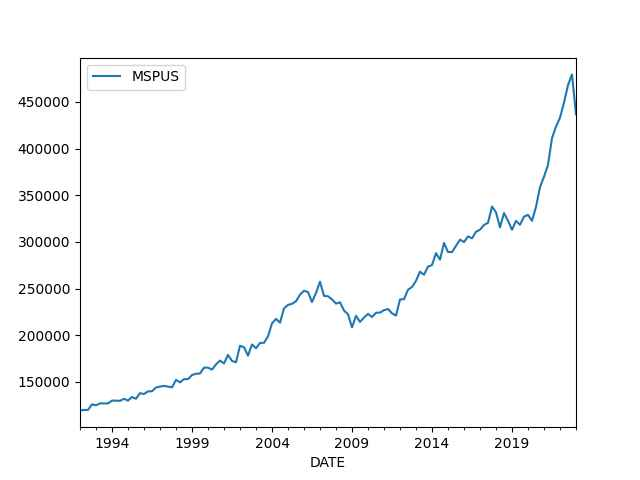

# Week 25

TechXplore: "Experts from the University of Adelaide [improved he
efficiency of iridium-based catalysts].. 'We have found that a
lattice-water-assisted mechanism—a way of arranging water molecules in
a specific pattern—boosts the efficiency of an iridium oxide catalyst
by 5–12% resulting in higher energy output while consuming less
energy'"

---

Big military costs too much money, why would UK need it? Russia isn't
really a threat unless one has gone mad w Russofobia, EU is not either
and was a close partner not long ago will likely be again soon, China
is too far away and a chapter with them has closed after turnover of
Hong Kong. A de-globalized Britain on which the sun does set on a
specific f-ing hour can do wout a big commitment in its armed forces,
right?

Daily Express: "Shrinking military threatens UK's NATO influence,
deputy commander warns"

---

Giordano Bruno: “If the first button of one’s coat is wrongly
buttoned, all the rest will be crooked.”

---

The Epoch Times: [2022/09] Incidents of electric vehicles (EVs)
catching fire after being submerged in saltwater are not uncommon, a
federal traffic safety authority said. 'We are tracking Florida EV
fires through news reports, fire department social media sites, and
other sources, and we can confirm your experience in North Collier
with reignition is not an isolated event,' the [NHTSA] wrote in a
letter to Jimmy Patronis, the chief financial officer of Florida
Department of Financial Services. NHTSA made the statement in response
to a letter from Patronis. Patronis mentioned in his letter to the
traffic safety agency an incident in North Collier, Florida, where an
EV ignited and kept re-igniting after Hurricane Ian. 'I joined North
Collier Fire Rescue to assess response activities related to Hurricane
Ian and saw with my own eyes an EV continuously ignite, and
continually reignite, as fireteams doused the vehicle with
tens-of-thousands of gallons of water,' he wrote. 'I was informed by
the fire department that the vehicle, once again reignited when it was
loaded onto the tow truck.'  'I am very concerned that we may have a
ticking time bomb on our hands,' he added. NHTSA said it first
observed EV fires after a hurricane in October 2012 in Newark, New
Jersey. The fires—which are caused by the lithium-ion battery—can
happen right after the vehicle was submerged in saltwater or 'several
weeks' after being submerged"

---

SCMP: "Inspired by photosynthetic bacteria, international team
develops material that uses light to convert water into hydrogen for
fuel cells.. It can be used in fresh and salt water under ambient
conditions, potentially increasing efficiency and decreasing costs of
process"

---

The Greek town name Kalamata on the news... Kalamata as the olive?  Of
course the olives are named after the town. Good stuff.

---

An event for the programmable board Raspberry Pi called "Raspberry
Pint". Good name

---

Daily Kos: "The International Brotherhood of Electrical Workers (IBEW)
Railroad Department has announced that its members at four of the
nation’s largest freight carriers finally have paid sick days.. [IBEW
said] 'We’re thankful that the Biden administration played the long
game on sick days and stuck with us for months after Congress imposed
our updated national agreement,'.. Bernie Sanders was also singled out
for his efforts"

---

"8 Rivers proudly announces.. technology that will revolutionize the
production of ultra-low carbon hydrogen and ammonia"

[[-]](https://8rivers.com/8rh2-ultra-low-carbon-hydrogen-release-2/)

---

CleanTechnica: "HydGene has come up with a biocatalyst for producing
green hydrogen through fermentation. The process is analogous to beer
making, only instead of hops and grains, HydGene is looking to other
sources, with an initial focus on upcycling waste biomass.

'Using Synthetic biology, we have engineered a next generation
biocatalyst that is able to convert carbohydrates extracted from
biomass into hydrogen at unprecedented rates and yields. Our
biocatalyst is extremely robust and tolerant to compounds that are
typically toxic to microorganisms,' HydGene explains.

HydGene can also deploy its biocatalyst to draw green hydrogen from
other sources, including wastewater and purpose-grown energy crops,
which the company refers to as “designated energy crops.”

---

"Be@be@floss.social

Climate doomerism is capitalist realism"

---

You can take a William Shatner anywhere

---

You can't even take a Leonardo di Caprio at that depth you'd be
crushed. Your di Caprio might survive though. 

---

Sea depth where Titanic wreckage is located

```python
u.elev_at(41.72571568986003, -49.94691220725848)
```

```text
Out[1]: -3783
```

3.7 kilometers deep! Dam!

---

Pine Bluff Arkansas, not looking good

[[-]](https://youtu.be/Hpkrd5pB4fY?t=91)

---

"Michael@therightarticle@mas.to

.. International media and journalists need to stop labelling Israeli
violence on Palestinians ‘clashes’. Doing so gives the false
impression that it’s an equal fight"

---

What really scared these freedom defenders during covid was that you
would not "freely" buy your Coca Cola as much as they liked. Freedom
matters insofar you buy the product, they would freely pollute a river
impede on others' freedom for a buck without giving it a second
thought. They whine about the government but then ask for a bailout
too the moment things get rough. Whiners. Wankers. 

---

The "freedom scare" around the issue of covid - another
smokescreen. Ultra free market nuts use it to shift focus from the
private sector towards the government, painting them as a sole source
of negativity, rather than unregulated business of whom you should be
scared of more, as they are actively killing you.

---

Annual US deaths from the flu at max 50,000.

US covid deaths in 2021 = over 350,000.

---

Railway Gazette: "A collaboration to convert diesel locomotives to
hydrogen fuel cell power has been announced by Canadian Pacific Kansas
City and CSX"

---

The Morning Call: "Bilel Hamzaoui, Air Products' global manager of
hydrogen energy systems, gives U.S. Sen. Bob Casey, D-Pa., a test
drive in a hydrogen fuel cell vehicle..  at Air Products headquarters
in Upper Macungie Township. Casey highlighted how the Inflation
Reduction Act will invest in domestic clean energy manufacturing,
promote sustainability..

U.S. Sen. Bob Casey, a passenger in the hydrogen cell-powered car, was
delighted by the prospects of the Upper Macungie Township company
producing the energy to make these cars go. The senator came to the
Lehigh Valley to promote the Inflation Reduction Act, which offers
funding, programs and incentives to accelerate clean energy
development. Air Products has invested billions into hydrogen
production in recent years...

 

The U.S. lags behind other countries, most notably South Korea,
because of a lack of hydrogen fueling stations, the study says, though
it has been picking up in places such as California. Another study, by
Market Research Future, expects the U.S. hydrogen fuel cell market to
increase by more then 68% to $46.8 billion by 2030. Casey said tax
credits from the Inflation Reduction Act will help the U.S. catch up
as it fights climate change"

---

In perspective it looks like RU was playing the economic influence
game (little carrot, little stick), and succeeding. Fair game. But USG
was like "nah we'll just stir shit up over there, fair shmair, who
cares?".

---

Smith, *The Permanent Coup*: "In 2010 Yanukovych was again elected
president.. [T]he Ukrainian leader [was advised] to sign the
association agreement offered by the European Union. It was little
more than a trade deal that dumped European, especially German, goods
into the Ukrainian and, more important, Russian, markets. There were
hints the agreement was a first step toward EU accession, but that was
fanciful.  Ukraine is the poorest country in Europe, and Berlin was
not looking to float another economic basket case after bailing out
Greece.

Putin saw the association agreement as a threat to Russia’s economic
stability and therefore his power. Late in 2013 he gave Yanukovych a
choice between crippling economic measures and a $15 billion aid
package. When Yanukovych withdrew from the EU deal, the streets filled
with [.. protestors] demonstrating for EU membership that would allow
them to flee their beloved homeland in search of a future
elsewhere. On November 21, 2013, the arrival of protestors at Kiev’s
Maidan Nezalezhnosti (Independence Square) marked the birth of the
Maidan Revolution, or Euromaidan"

---

Changes in the past 7 days. RU losses around Makarivka, gains around
Robotyne... fighting around Marinka.


```python
geo = [['Main'],['Bakhmut'],['Vuhledar','Velyka Novosilka'],
       ['Marinka'],['Lobkove'],['Orikhiv', 'Robotyne', 'Malaya Tokmachka'],
       ['Krasnohorivka'],['Blahodatne','Makarivka'],['Kreminna']]
u.sm_plot_ukr4('ukrdata/fl-0621.csv','ukrdata/fl-0613.csv',geo,3,3,zoom=0.03,fsize=(12,12))
```

[[-]](https://pbs.twimg.com/media/FzLENJSWAAEpoXq?format=jpg&name=medium)

---

Euractiv: "Steinmeier breaks ground for German business in
Kazakhstan.. A 50-billion euro plant to produce green hydrogen is
among the many investments announced on the occasion of the visit of
German President Frank-Walter Steinmeier to Kazakhstan on 19-21 June"

---

H2 Central: "The German Government will allocate €1.3 million through
the German Development Bank to support introduction of green hydrogen
technology in Georgia, the Georgian Ministry of Economy announced"

---

SCMP: "China has built what it says is the world’s most powerful
hydrogen-powered locomotive, rolling stock that state media suggests
has potential to replace most fossil fuel engines in service... The
'Ningdong', China’s first hydrogen locomotive converted from an
internal combustion engine, rolled off the line at the Datong
subsidiary of state-owned manufacturer China Railway Rolling Stock
Corporation (CRRC) on Thursday"

---

CNBC: "Powell expects more Fed rate hikes ahead as inflation fight
'has a long way to go'"

---

Aviation Week: "A dual-fuel combustor designed to enable
current-generation single-aisle airliners to operate on both
sustainable aviation fuel (SAF) and hydrogen is being proposed by
UK-based aerospace technology developer Derwent Technologies"

---

"@eff@mastodon.social

The mobile duopoly strong-arms news publishers into using their
payment processing services, and paying 30% for the privilege. Regular
payment processing comes in at less than 5%. App store choice would
give news publishers a huge boost to their revenue"

---

EFF: "To Save the News, We Must Open Up App Stores"

---

H2 Central: "Toyota Says Next-Gen Fuel Cell will Be 50 Percent Cheaper
by 2026 – CarBuzz"

---

Coast Guard spox keeps refering to ppl stuck in that sub as "the
crew". I guess he wants to use a palatable word instead of "bunch of
rich people doing rich people shit".

---

The Guardian: "Billionaires and the Titanic: the allure of extreme
expeditions"

---

H2 Central: "Labour Pledges 'British Jobs Bonus' as it Sets Out Green
Energy Strategy, Party to Offer £500m, Hydrogen Included"

---

H2 Central: "POSCO -Led Consortium Wins $6.7 Bn Green Hydrogen Deal From Oman"

---

[Banq](https://cdn.masto.host/indiewebsocial/media_attachments/files/110/577/825/241/369/470/original/d84a18f6dcedaa66.png)

---

\#batteries \#fire \#ebike 

[[-]](https://youtu.be/jlYd05X-G3g?t=1015)

---

"HeavenlyPossum@kolektiva.social

.. It’s apparently not very cost effective to make all sorts of
different [headphone] models. But then how do you justify selling
headphones at different prices? Why would someone pay hundreds more
for the same headphones?

Why, just make one version *shittier.* Turns out Sennheiser was
inserting a piece of foam into some of its headphones, to deliberately
lower the sound quality, in order to sell the same headphones at
different prices to different people.

Once you recognize sabotage for what it is, you can’t help but start
to see it in every aspect of your life: a deliberate shittiness
imposed on us so someone else can earn a profit"

---

[Andersen](../../2023/06/evil-geniuses.html#gov)

---

Change is a good thing

NYT: "A rising generation of Republican politicians is more skeptical
of the free market and more comfortable using government power to
regulate the economy than the party has traditionally
been. Consider:Senator J.D. Vance, the Ohio Republican, and Senator
Elizabeth Warren, the Massachusetts progressive, have collaborated on
a bill to claw back executive pay at failed banks.. Senator Marco
Rubio of Florida has signed a public letter calling for the
reinvigoration of collective bargaining and praising the German
approach, in which labor unions play a larger role in the
economy. Rubio this month published a book, “Decades of Decadence,”
that criticizes the past 30 years of globalization.Senator Todd Young
of Indiana has helped write a bipartisan bill to restrict noncompete
agreements, which companies use to prevent their employees from
leaving for jobs at a competitor.Senator Tom Cotton of Arkansas was
among a bipartisan group of lawmakers who began pushing a few years
ago for federal subsidies to expand domestic semiconductor
manufacturing. President Biden signed a version of the policy last
year"

---

Ellsberg did a good job.. but folks of his generation were/are too
focused on government while the corporate take over of America
proceeded under their noses... Exposing the truth abt Vietnam shld
have been followed w/ exposing the truth abt corporate malfeasance,
following money trails, tracing kickbacks and the like. RIP.

---

NPR: "Daniel Ellsberg, who exposed the truth behind the Vietnam War,
dies at 92"

---

😂 😂 

F24: "'Toxic masculinity': Macron criticised for downing beer with
rugby champions"

---

H2 Central: "A consortium of businesses and science and technology
bodies, led by the Eunice group, has announced an investment of 11
million euros for the construction of a hub for the production and
distribution of green hydrogen in Atherinolakkos, Crete"

---

H2 Central: "PNNL researchers recently coauthored a paper that
investigates a baking soda solution as a means of storing
hydrogen... The efforts at PNNL are funded by the DOE"

---

They're just making shit up at this point. Whatever sounds "sciency"
just throw it in there.. Anything for clicks \#ScienceTube

[[-]](https://youtu.be/PjT85AxTmI0?t=94)

---

Wiki: "[Chindian] food is generally characterised by its ingredients:
Indian vegetables and spices are used, along with a heavy amount of
pungent Chinese sauces, thickening agents, and oil. Stir-fried in a
wok, Sino-Indian food takes Chinese culinary styles and adds spices
and flavours familiar to the Indian palate"

---

TASS: "Situation in arms control bad, no potential for negotiations —
Kremlin Spokesman"

---

Odd coincidence; that "20 times less" issue keeps [showing up](../../2022/11/battery-electric.html#reserves)
when the subject is lithium.

---

Eric Lerner: "[Answering the question 'can you save the Big Bang
Theory by tweaking it' outlines the problems with the approach an
listing gross mistakes of the BBT. First is] too little helium..  a
very basic prediction of The BBT which is that there should be a
certain amount of helium produced by Fusion reactions during the Big
Bang and there should be more helium and older in stars that have
processed hydrogen.. but observations have shown that in nearby stars
and even in planetary nebula.. where we can observe helium directly
the amount of helium is only half what's predicted by the [BBT]..

What's worrying.. Big Bang cosmologists is that the very basic
assumption of [the theory] is that the universe is homogeneous and
isotropic modulus.. Isotropic means the same in every direction.
Without those basic assumptions there would be no expanding universe
there would be no BB. General relativity only predicts an expanding or
contracting universe if the universe is homogeneous and isotropic
which has never been observed and today with even better observations
there are more and more anisotropies. When we look in different
directions in the sky we get different measurements, for example of
the Hubble constant, the constant that describes the relationship
between redshift and distance, we get different densities of radio
galaxies of X-ray galaxies of quasars. All of these are different in
different directions [leading to] lopsided star maps and therefore
again contradict the basic hypotheses of the BB...

[Another problem is] too little lithium; this again is the well-known
lithium problem, the BB makes predictions about three light elements,
helium, lithium and deuterium which is the heavy isotope of ordinary
hydrogen. The lithium it gets wrong entirely.. observations of lithium
are 20 times less than the predictions of the BB - a gross
contradiction...

If an airline advertises that out of the last 17 flights 16 crashed
and one got through would you fly on that airline? I think the answer
is obvious, and the answer to the question [of tweaking BB to save it]
is also obvious, with 16 wrong answers and one right answer this isn't
a theory that needs to be tweaked, this is a theory that needs to be
thrown away"

---

Gridded raw data is costly; any measure on earth surface, in a big
enough area can result in millions of data points. "Well see it is 6K
by 10K grid mate, chump change, just thousands!" But 2D grid requires
6K times 10K = 60 million data points. It can be handled, but not
frequently, any ol' time u need something from it.

---

*Extraction 2* written by a Russo, fine camera work. This one was
even better than the first. 

---

Wasn't the inspiration for SW Kurosawa? RLA, SW did not particularly
strike me as remakes but I guess some cld make the case...

"Most of the most popular movies released in 1973 trafficked in
twentieth-century nostalgia.. Even the one enduring new Hollywood
genre that arose in the mid-1970s and early 80s, what Lucas and Steven
Spielberg created with Star Wars and Raiders of the Lost Ark, was
actually just a big-budget revival of an old genre, forgettable
action-adventure B movies and serials from the 1930s and 40s and 50s"

---

Al Jazeera: "Russian leader says no need for new round of mobilisation
for now, claims Ukraine has suffered 'catastrophic' losses"

---

Al-Monitor: "Putin, MBZ meet in St. Petersburg, vow to boost Russia-UAE
ties"

---

\#Florida \#BEV

[[-]](https://youtu.be/X5NiWJcyrwI?t=2)

---

H2 Central: "Switzerland - Hydrogen Trains are to Roll Between Stade
and Bremervorde"

---

Median house prices finally fell thanks to higher rates. Rents should
follow. At one point it reached 480 thousand bloody
dollars.. unbelievable.

```python
df = u.get_fred(1992,"MSPUS")
print (df.tail(4))
print (df.max())
df.plot()
```

```text
               MSPUS
DATE                
2022-04-01  449300.0
2022-07-01  468000.0
2022-10-01  479500.0
2023-01-01  436800.0
MSPUS    479500.0
dtype: float64
```

 

---

More U.S.!

Arab News: "Two ballistic missiles fired by North Korea landed in
waters within Japan's exclusive economic zone"

---

S&P Global: "California transit agencies establishing road map for
hydrogen fuel cell use in buses"

---

The inhabitants of Israel were pushed there, as part of [strategery](../../2020/06/10-myths-israel.html#uk)
to turn it into an Anglo outpost. Their "heritage" was weaponized and
unleashed on the Arabs. They were outsiders, [not](../../2020/06/10-myths-israel.html#samejew)
descendants of people who used to live at the place during the biblical times.
Those people never left, they could not have descendants who could later
come back and reclaim the land they had "left behind". It is all smoke and
mirrors (and a land grab). 

---

"@eunews@fedieuropa.eu

Europe pushes ahead with hydrogen pipelines to meet energy
demand.. Companies aim to transport the gas over long distances as
countries cut back on fossil fuels"

---

\#Florida \#BEV

[[-]](https://youtu.be/X5NiWJcyrwI?t=2)

---

"Ivan make basket" is obvously a line from '96 movie *Eddie*

[[-]](https://youtu.be/iUUZxIgykOg?t=2213)

---

A Chinese annex attempt is in the works? Some claim the main reason Xi
stayed for a third term was Taiwan.

Daily Express: "Amid mounting tensions, U.S. Government reported to
be working on evacuation plans for Americans in Taiwan"

---

Al-Monitor: "China's Xi hosts Abbas, vows support for Palestinian
state on 1967 borders"

---

One degree of latitude/longitude roughly corresponds to 110
kilometers, so each 0.01 degree change can be interpreted as 1
kilometer distance. Looking at the previous frontline map if there is
an advance from 47.50 to 47.45 in latitude that is roughly a 5
kilometer advance.

---

