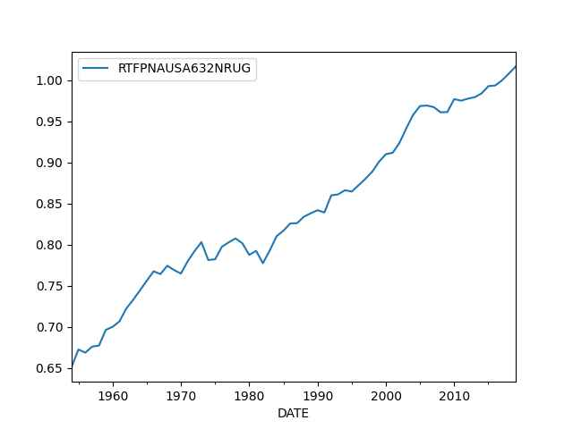

# Week 35


Windpower Monthly: "Brazil calls hydrogen a ‘fundamental milestone’ in
global energy transition.. Minister Alexandre Silveira’s comments came
during the presentation of the triennial work plan for 2023–2025 of
the country’s national hydrogen programme (PNH2)"

---

H2 View: "Hydrogen pipeline could see Scotland meet 10% of Europe’s
import demand, says report"

---

AggNet: "JCB install hydrogen-powered internal combustion engine into
Mercedes Sprinter van.. The white van retrofit was completed in just
two weeks and one of the vehicle’s first test drivers was JCB chairman
Anthony Bamford, who is leading the company’s £100 million hydrogen
engine project"

---

<iframe title="vimeo-player" src="https://player.vimeo.com/video/859331362?h=888505255a" width="340" frameborder="0"  allowfullscreen></iframe>

---

The EV Report: "Hyzon Motors Inc., a leader in high-power hydrogen
fuel cell technology, has successfully completed its first commercial
demonstration of a liquid hydrogen fuel cell electric vehicle (LH2
FCEV)...

- The LH2 FCEV trial began in Temple, TX and covered over 540 miles
during a 16-hour continuous run, delivering to eight PFG customers
near Dallas, TX.

- The vehicle operated under strenuous conditions, including
temperatures exceeding 100 degrees Fahrenheit, proving the feasibility
of liquid hydrogen in real-world applications.

- Liquid hydrogen offers several advantages over its gaseous form,
including higher energy density and no added weight to the vehicle.

- The proprietary 200kW fuel cell system developed by Hyzon Motors is
expected to provide a driving range between 650 and 800 miles,
comparable to many diesel trucks.

- Chart Industries designed a specialized tank system to store liquid
hydrogen at extreme cold temperatures, as low as negative 400 degrees
Fahrenheit, while maintaining necessary pressure levels"

---

"@miguel_pacheco@masto.pt

Anglo-Australian mining company Rio Tinto is building four calcifiers
using #hydrogen as fuel in their Yarwun in Gladstone, Queensland,
Australia.

Rio Tinto partnered with Sumitomo Corporation and the Australian
Renewable Energy Agency for the project.

The new plant will include a 2.5MW on-site electrolyzer to produce
\#greenhydrogen to supply operations.

Construction will start in 2024 and operation in 2025"

---

Utility Week: "Cadent has calculated that 40GW of offshore wind
capacity would be sufficient to create the green hydrogen needed to
decarbonise home heating across the UK"

---

How about Peter Thiel and the merry band of assclowns around him?
They have some shady dealings.. Thiel himself [reportedly](https://www.propublica.org/article/lord-of-the-roths-how-tech-mogul-peter-thiel-turned-a-retirement-account-for-the-middle-class-into-a-5-billion-dollar-tax-free-piggy-bank)
turned his Roth IRA "into a gargantuan tax-exempt piggy bank".
Thiel's [bestie](../2022/ejagoffthiel2.jpeg) is neck deep in all kinds of
[fraud](https://www.reuters.com/investigates/special-report/tesla-batteries-range/),
not to mention involvement in dysfuctional battery-electric tech.

---

FedSoc is one of those "originalist" groups - ie libertarians who
interpret the Constitution in a "freedom oriented way" basically for
the benefit of oligarchs, claiming "the framers" meant it that way.

---

"@wendysiegelman@mastodon.social

D.C. Attorney General is probing Leonard Leo’s network.. The
Federalist Society co-chair.. has utilized nonprofit groups to collect
more than $1 billion for conservative causes... in March that one of
Leo’s nonprofits — registered as a charity — paid his for-profit
company tens of millions of dollars in the two years since he joined
the company" via Politico

---

Reshare

WaPo: "[08/17] The U.S. intelligence community assesses that Ukraine’s
counteroffensive will fail to reach the key southeastern city of
Melitopol.. a finding that, should it prove correct, would mean Kyiv
won’t fulfill its principal objective of severing Russia’s land bridge
to Crimea in this year’s push"

---

NYT: "As Ukraine’s Fight Grinds On, Talk of Negotiations Becomes Nearly
Taboo.. Discussion of a Plan B, should Ukraine fail to win a total
victory, has become more fraught than ever, say those who have tried"

---

SciTechDaily: "The Los Alamos National Laboratory introduced a
corrosion-resistant fuel cell design featuring a coaxial nanowire
electrode. This innovative approach holds promise for heavy-duty
trucking, showing impressive durability in stress tests"

 

---

"@Toky02@famichiki.jp

Fukushima water: Sellafield in the UK dumps more radioactive material
onto the Irish channel every year than what is currently planned to be
released from Fukushima, and no one reports on it. Japan and Fukushima
is facing a PR disaster rather than an environmental one"

---

Arab News: "Greece wildfire destroys area bigger than New York City"

---

If milk can be lab-grown then you get cheese, and yogurt or
kefir. Companies Perfect Day, New Culture are working on this problem.
Lab-manufacture meat and dairy, vertical farm vegs. We can do away
with animal and plant farming for most needs.

---

The Sound Stylistics - Get Ya Some \#music

[[-]](https://youtu.be/PStFpLhJIv0)

---

H2 Central: "Western Australia is a step closer to the creation of a
large-scale green hydrogen hub with bp completing its concept
development"

---

"@dmoser@mastodon.social

'10 years ago today, people said we were crazy to pedestrianize
Broadway. Today, it would be crazy to bring the cars back.' ~ Janette
Sadik-Khan"

[[-]](https://files.mastodon.social/media_attachments/files/110/877/404/148/358/188/small/ced87526728108b9.jpeg)

---

OM is a fantastic app.

"@toxi@mastodon.thi.ng

Just donated $100 to the amazing Organic Maps project: Trackerless,
fully offline, OSM based, open source mapping for Android/iOS. Great
UX & routing, super fast & good coverage even of hiking paths,
elevation lines & public transport layers...

From their website: 'Organic Maps is one of a few applications
nowadays that supports 100% of features without an active Internet
connection. Install Organic Maps, download maps, throw away your SIM
card (by the way, your operator constantly tracks you), and go for a
weeklong trip on a single battery charge without any byte sent to the
network'"

---

[Link](billclintonep2.jpg)

---

It was always hilarious to me Clintons slinging mud all over the place
using bizarre conspiracy theories like Russiagate. Anyone can dig up
dirt on them under 10 minutes flat - no need to go back to even before
2000s.

---

Claire Wong: "Guys, I think I've solved it. Hear me out..

We make any day the temperature goes above 32 C in the UK an automatic
bank holiday.

And then watch the big corporations scramble to fix climate change ASAP"

---

*Meg 2: The Trench*, fun action.. Chinese characters weren't placed
awkwardly in the script this time, cast/story was great. Had a fine
90s lighthearted action vibe, it even had a goofy little
dog. Recommend.

---

CNBC: "European savers complain lenders are quick to raise mortgage
costs, but very slow at increasing returns on deposits"

---

Changes in fundamental tech is different than productivity achieved
through that tech. For most of us twofold tech increase since 50s
sounds odd - it feels like it should've been more. When you talk to
older boomers, you can see they are actually shocked with the types of
tech that became available during their lifetime. A notebook, a
smartphone, for people who grew up seeing these things in their
clumsiest forms the new products have features that approach magic.

But productive application of a that tech is different. You could
manufacture scratch resistant, cyrstal clear smartphone screen, there
is surely productivity associated with its production, but if most
consumers will use this device for silly pastime applications, that is
not productive.

---

"@fuck_cars_bot@botsin.space

'Interesting new law in Denmark...'"

[[-]](https://files.botsin.space/media_attachments/files/110/966/746/958/601/098/original/364509245f5e767f.jpeg)

---

NYT: "Pope Says a Strong U.S. Faction Offers a Backward, Narrow View
of the Church..  In unusually sharp remarks published this week, Pope
Francis said some conservative American Catholics wrongly ignore much
of the Church’s mission and reject the possibility of change...

Pope Francis has expressed in unusually sharp terms his dismay at 'a
very strong, organized, reactionary attitude' opposing him within the
U.S. Roman Catholic Church, one that fixates on social issues like
abortion and sexuality to the exclusion of caring for the poor and the
environment"

---

GB News: "Britain's multibillion-pound free trade deal with India is
at risk of collapsing.. The UK is demanding new curbs on the
production of cheap generic drugs.. India has rejected the demand that
patents on drugs should be extended before cheaper copies can be
produced"

---

"@breadandcircuses@climatejustice.social

Three groups — 'Fridays for Future', 'Fight Fossil Fuels', and 'End
Fossil Fuels USA' — are teaming up to stage mass climate protests and
strikes all around the world next month"

---

Aw shit fires in Greece again, and near homeboi

```python
u.modis_fire(0,0,18)
```

[[-]](modis2.jpg)

---

FuelCellWorks: "French Government Allocates 4 Billion Euros to
Low-Carbon Hydrogen Production"

---

"@carnage4life@mas.to

The Digital Services Act went live in the EU on Friday. The below is a
handy list of the most visible changes Europeans will see

1. Chronological views are now a required option in social media apps including TikTok.

2. It’s easier to report harmful content.

3. You’ll get an explanation when your post is moderated and taken down.

4. You can report fake products on marketplaces like Amazon.

5. Teens under 18 won’t see targeted ads based on their interests"

---

"@GeofCox@climatejustice.social

Quick reminder that we are not actually in a 'Cost of Living Crisis'.
It's a 'Extreme Inequality and Record Untaxed Profits Crisis..'"

---

Spanish football coach with that female player.. it doesn't look good,
unprofessional.  What will he do in the next game, after a win run to
a player slap that ass and go 'woo hooo'? C'mon. He can apologize
publicly to the player in a joint press conf, if he doesn't agree,
reprimand.

---

CBS News: "50 years of tax cuts for the rich failed to trickle down,
[London School of Economics] study says"

---

Dem infighting.. Hochul slams federal gov, Adams slams Hochul.. Lota
Dem-on-Dem violence \#immigration

Politico: "Adams condemns Hochul’s handling of New York migrant crisis
as ‘wrong’"

---

"SSAB, LKAB and Vattenfall building unique pilot project in Luleå for
large-scale hydrogen storage..  The 100 cubic metre hydrogen storage
is being built in an enclosed rock cavern approximately 30 metres
below ground"

---

Some visuals.. UA advanced on Robotyne, but RU is not standing still,
approaching Kupiansk.

```python
geo = [['Main'],['Urozhaine','Staromaiorske'], ['Robotyne'],
       ['Marinka'],['Bilohorivka'], ['Synkivka','Kupiansk','Lyman Pershyi'],
       ['Zarichne','Lyman','Kreminna'],['Klischchiivka','Horlivka','Bakhmut'],['Zolotarivka','Spirne']]
       
u.sm_plot_ukr4('ukrdata/fl-0830.csv','ukrdata/fl-0814.csv',geo,3,3,zoom=0.03,fsize=(10,10),)
```

[[-]](https://drive.google.com/uc?export=view&id=1_iet7_BqIVocPAwuWf2f3rllLdd2X9Ox)

---

Amount of area taken back by Ukraine since the start of the counter-offensive

```python
df = u.ru_areas()
a1 = df.loc[(df.index.month == 6) & (df.index.day == 9)]
a2 = df.tail(1)
print ('a1 =',int(a1.area),'km2','a2 =',int(a2.area),'km2')
print (int(a1.area) - int(a2.area), 'sq km taken')
```

```text
a1 = 154618 km2 a2 = 154401 km2
217 sq km taken
```

A square whose sides are 14 x 14 km. UA took back a third of the
Tenerife island. Many more Tenerifes to go.

---

It is interesting in his video the Gabon deposed Prez spoke in
English, not French, good catch by F24 anchor - was he making a plea
to the Anglo and perceives the coup as "anti-US"?

---

F24: "Gabon's economy: A wealth of resources that fails to trickle
down to the population..The Central African nation is the
fourth-largest oil producer in sub-Saharan Africa, but a third of its
population lives below the poverty line. One particular source of
frustration lies in the high levels of corruption: the country ranks
136th in Transparency International's Corruption Perceptions Index"

---

The Guardian: "Gabon military officers declare coup after Ali Bongo
wins disputed election"

---

<iframe width="340" src="https://www.youtube.com/embed/2vhw3y5XFvU?start=34&end=260" title="Is Cummins Hydrogen Engine the Diesel KILLER?" frameborder="0" allow="accelerometer; autoplay; clipboard-write; encrypted-media; gyroscope; picture-in-picture; web-share" allowfullscreen></iframe>

---

"@TheWarOnCars@mastodon.social

'A study published in the Journal of Safety Research last year found
that children were eight times more likely to die when struck by an
SUV than those struck by a passenger car'"

---

H2 View: "Enoah orders 101 of Enapter’s AEM electrolysers to deploy in
Japanese hydrogen projects"

---

H2 Central: "Ulsan’s hydrogen tram passes feasibility study. Ulsan’s
long-awaited urban railway, Line 1, has successfully passed a
government feasibility study, marking a significant step toward its
realization"

---

Low-Tech Magazine: "Direct Solar Power: Off-Grid Without
Batteries.. Using solar panels without backup infrastructure makes
renewable energy production much more affordable, efficient and
sustainable. As an example.. take [my] small autonomous solar
installation.. while the solar panels should last 30 years and the
charge controller about 10 years, I have to replace the lead battery
on average every three to five years. Over a 30-year lifespan, the
costs then amount to €120 for the solar panels, €150 for the charge
controllers and – in the best case scenario – €1,020 for the
batteries. The batteries (and associated charge controllers) therefore
account for about 90% of the total lifetime costs"

---

"@CptSuperlative@toot.cat

This is huge. This should be headline news but it isn't.

The NLRB just ruled that when companies engage in illegal
union-busting they will be automatically forced to recognize the union
and start negotiations"

---

J. Stewart's "You Don't Know Dick" segments were funny back in the
day, I'll give him that

---

It is clear corporate interests wanted to invade Iraq from the start,
with or without 9/11. Halliburton Dick and his posse aptly used 9/11
for the invasion though, they managed to sell it to W, they
buttonholed Colin Powell who was uneasy with the idea \#vice

---

Dick had Dubya truly surrounded, with his people, only he had 100% access. \#vice

---

The right info (from a real human) is [here](https://qr.ae/py3MOK) \#vice

---

Searched for the book the film was based on, landed on Quora, its
douchebag chatgpt gave a completely [wrong answer](vice1.jpg)
\#vice

---

FCC had a [fairness doctrine](https://en.wikipedia.org/wiki/FCC_fairness_doctrine), HW killed it 1987,
Dick apparently persuaded other Rep House members not to re-introduce
the doctrine as law. *Vice* claims the cancellation of the doctrine
gave rise to hacky opinion news.

---

Interesting scene with Rummy/Cheney plotting to undermine Kissinger
who was advocating for a Ford admin detente with the Soviets. Him and his
team were pushed out. Ford later lost the election. \#vice

---

*Vice* was great work, a movie about "Halliburton's Dick"

---

BloombergNEF: "Hydrogen Subsidies Skyrocket to $280 Billion With US in the Lead"

---

It's good to strive to bring clean energy costs down, eg solar energy,
of clean fuel production.. but we need to remember beyond a certain
number price doesn't really matter - what matters is that the storage
medium has certain optimal characteristics in terms of engineering
properties. Crude oil, natgas had that, and so does hydrogen
(batteries do not). IMF report showed the world spent over a trillion
on fossil fuel subsidies - wout the subsidies, without national navies
protecting sea transport routes, how much would the true cost of oil,
natgas be?  Let's bring the price down for renewables, but we also
need to see subsidies give life to the alternative. The market is
irrelevant.

---

"@Brendanjones@fosstodon.org

Still can’t get over the fact that an editor of the Financial Times
said that we need to do away with #capitalism in order to deal with
the #climate. "

[[-]](https://cdn.fosstodon.org/media_attachments/files/110/673/202/865/669/361/original/b3740d466d00eb85.jpeg)

---

E-mail had been around for too long for the free market to f--k it up,
in a way it was too late - the system was already established, it was
working too well. Too late for unfettered capitalism.

---

Even for social media, disparate solutions are still not talking to
eachother. Imagine GMail not being able to communicate with Yahoo
Mail. What kind of dipshit would build a system like that? Well
unfettered capitalism did (by encouraging it). Regulation can mandate
they all implement a common protocol, eg ActivityPub.

---

For every regulation you take out, two more needs to be put in its place

---

How is the system hindering application of tech? Monopolies are
likely hindering it. There isn't enough regulation, most patents need
to be banned, especially for software. There are companies who need
to be broken up. 

---

Informed Comment: "European Union Strongly Condemns Israeli Minister
Ben-Gvir’s Racist Remarks on Palestinians.. 'My right, my wife’s, my
children’s, to roam the roads of Judea and Samaria are more important
than the right of movement of the Arabs,' Ben-Gvir said on Wednesday
in an interview with Channel 12, using the biblical term for the
Occupied Territory. His remark drew widespread condemnation, including
from the US, which labelled it 'racist rhetoric'".

---

Informed Comment: "Israeli Minister Eliyahu: The Palestinians aren’t
under Apartheid, they’re Just in a Prison Camp"

---

Variety: "Walt Disney Pictures VFX Workers Move to Unionize"

---

Telegraph India: "Tata Steel is set to amplify its utilisation of
hydrogen in the steel-making process following the successful
completion of a pilot project at its Jamshedpur plant in Jharkhand"

---

Aviation Today: "[2022] American Airlines Invests in Hydrogen-Electric
Engine Developer ZeroAvia.. American Airlines announced an investment
into ZeroAvia as well as its intent to order up to 100
hydrogen-electric engines"

---

Business Insider: "Tech's broken promises: Streaming is now just as
expensive and confusing as cable. Ubers cost as much as taxis. And the
cloud is no longer cheap... The tech industry has been on a quest for
profitability lately.  To get there, some tech companies have been
raising prices.  The result: Supposedly revolutionary services are
looking a lot like what came before"

---

Producing H2 from metals. Note the side products of this H2 generation
are heat and alumina. Heat can be used for central heating of
buildings, alumina is obviously useful for many consumer
products. \#GHPower

---

H2 Central: "GH Power has developed a unique renewable energy
technology..  The hydrogen produced by the modular version of GH
Power’s 2MW reactor is pure and clean, with zero emissions, zero
carbon and zero waste, using only 2 inputs (recycled aluminum and
water)... It also produces green hydrogen, exothermic heat, as well as
highly valuable green alumina, which has numerous commercial
applications..

The company has also had successful tests using scrap steel (iron) as
another metal fuel for hydrogen generation.  The use of recycled
metals provides a scalable solution with a much lower costs basis at
under a $1/kg hydrogen.  Scrap iron is the most widely available metal
fuel in most markets"

---

Energy.gov: "[2022] Biden-Harris Administration Announces Historic $7
Billion Funding Opportunity to Jump-Start America's Clean Hydrogen
Economy"

---

You fit a formula / model to data, what remains is the residual. As
below, I fit a straight line to data, it looks linear, the fit looks
ok, I look at the residual (diff between formula and data), if it
looks "noisy" that's good, all patterns are explained with the
formula, the rest is noise (which has a precise statistical
definition, anyway).

The Solow method looks at the residue and tries to find leftover
patterns there, proposes once labor, capital are accounted for, what
remains has to be technology.

[[-]](https://www.researchgate.net/publication/333469185/figure/fig3/AS:764122706743298@1559192458294/Comparisons-of-linear-regression-models-and-residual-plots-obtained-from-the-two-other.png)

---

Maybe that's why Solow also said "you can see the computer age
everywhere but in the productivity statistics". Tech is not being
applied properly, or the system was hindering their application. 

---

Since the 50s TFP nearly doubled. Certain amount of tech progress
surely (although some could argue it's not enough). Time to
re-distribute the benefits and grow less (as growth requires more
dirty fuels)?

---

TFP from FRED

```python
u.get_fred(1950,"RTFPNAUSA632NRUG").plot()
```

 

---

Using residuals from capital + labor regression.. that makes sense...
Whatever growth labor and capital cannot explain has to be technology.

"How to Measure Technological Progress.. The Solow Residual method
works under the assumption that all changes in output that can’t be
explained by changes in the capital stock or changes in the number of
workers must be due to technological progress. The method uses a
simple linear regression to estimate growth. Regress output on capital
and labor using simple linear regression.  The regression residuals
are [Total Factor Productivity] growth"

---

Mother Jones: "A March 2023 Washington Post investigation
revealed.. how regional insurance companies in Florida were
“aggressively seeking to limit payouts to policyholders by altering
the work of licensed adjusters,” reducing the amount the initial
adjuster estimated by as much as 97 percent"

---

It happens in engineering all the time; the Euler-Bernoulli beam
formula $E I d^4 y / d X_1^4 = q$ shows how a construction beam
behaves under stress. You can derive this formula from start to
finish, with certain assumptions, one which is uniform width, that is
why the $I$ is constant. But then we want to apply this formula to
complex shapes where $I$ changes.  Here the scientist knows he cannot
use the formula as-is, so says the math. But.. what if he uses the the
formula on a *small* piece of the object where $I$ can stay reliably
constant so the formula is still relevant and we put all the pieces
together computationally? Voila. This BTW is the famous Finite Element
approach, entire buildings, complex structures are now designed this
way.

With a neural net the data effects neuron \#11121 or neuron \#889444,
which one we have no idea, it's a jungle in there, it does whatever
the hell it does before parroting its shit out, its structure is not
something you can work with, legibly. The best anyone can hope for is
can generating "art" impressing audiences who are not aware of how the
sausage is made.

---

For the [circle area formula](../../2023/05/how-to-science.html) we used the
mental gymnastics to reach a final formula, but do not revisit the
derivation once we are done. Could this be similar to a neural net
learning from data, once done, we pay no attention to how you got
there (so ignore the internal junk that is the NN design)? That is not
the same thing at all.. In the first case even if not used, we still
have the math, it makes sense to us, still connected to the problem
domain somehow, can always go back and change some assumptions, for a
different problem, or a new application. With NNs this is not
possible.

---

There are no first generation Polish, Irish, Lithuanians in America.
There are no Turks in Turkey.

---

Anatolia ("Turkey") is a traditional Paki ally - they were Anglo
poodles together, their militaries were similar (loved coups,
constantly meddled in politics). Is Paki rival India balancing out a
Paki ally with a friendship of that ally's rival?

---

Firstpost: "India, Greece agree to double bilateral trade by 2030"

---

The Guardian: "Niger coup leaders give French ambassador 48 hours to
leave country"

---

Politico: "Trump’s lead is more than double [compared to 6 months
ago]: 42 percentage points."

---

TASS: "'The strategy pursued so far in NATO, based on constant
military supplies to Ukraine and the logic of escalation, did not lead
to a military defeat for Russia,' [ex-Italian PM] Giuseppe Conte said"

---

Computer Weekly: "Why water usage is the datacentre industry’s dirty
little secret..  most datacentres use chlorine and bromine-based
chemicals and disinfectants, causing pollution and acid rain. Bromine
is a nasty chemical that is highly toxic for organic systems and
impacts the neuronal membrane. It has a toxic effect on our brains,
and exposure to the chemical can result in drowsiness and psychosis
amongst other neurological disorders"

---

The Guardian: "An influential thinktank closely linked to two
billionaires who provided lavish travel gifts to conservative supreme
court justices is behind a successful lobbying campaign to get the US
high court to take on a case that could protect them and other
billionaires from a possible future wealth tax"

---

\#Humans

[[-]](https://s3.eu-central-2.wasabisys.com/mastodonworld/media_attachments/files/110/954/001/874/915/257/original/3521311fabda75af.png)

---

"@straphanger@urbanists.social

'While real trolleys languish for lack of patronage...people flock to
Disneyland to ride fake trolleys.'  —historian Kenneth Jackson"

---

"@straphanger@urbanists.social

Walt Disney World has significantly better transit than most cities in the US.

Its 12-train-set monorail, 325 buses would make it the 16th most
ridden transit system in the nation.

America's fantasy world, it turns out, is a place you can get around
without getting into a car"

 

---

"@trisweb@m.trisweb.com

We need a better model for how we create the future than just idiots
trying to make money"

---

CNBC: "Mastercard ends Binance card partnership in latest blow to
crypto giant"

---

"AI" researchers are divided on whether these f-ing neural nets can
actually think or not... Hinton admitted as much. In comparison does
materials science have divisions? Aeorodynamics? How about the Fluid
Dynamics community? Are they divided? No. They are not divided on core
issues because their branch is scientific - it has solid mathematical
foundations.

---

China's subsidies are high I bet bcz much industrial production is
outsourced to them (the world's factory). Some of the would-be Western
subsidies would show up on their side of the ledger.

IMF: "Globally, fossil fuel subsidies were $7 trillion in 2022 or 7.1
percent of GDP.. By country.. China contributes by far the most to
total subsidies (2.2 trillion) in 2022, followed by the United States
(760 billion), Russia (420 billion), India (350 billion), and the
European Union (310 billion)"

[[-]](https://www.imf.org/en/Publications/WP/Issues/2023/08/22/IMF-Fossil-Fuel-Subsidies-Data-2023-Update-537281)

---

SciTechDaily: "Scientists have now proven that graphene is naturally
permeable to protons.. This discovery, which defies previous theories,
holds significant potential for [providing better H2 electrolysis
catalysts in the form of] sustainable 2D crystals"

 

---

😂 😂 

"GPT detectors frequently misclassify non-native English writing as AI
generated, raising concerns about fairness and robustness"

---

@LadyDragonfly@universeodon.com \#AI

[[-]](https://cdn.fosstodon.org/media_attachments/files/110/920/880/098/385/436/original/f373b65f0768c123.jpg)

---

*Numbers Station*  ⭐ ⭐ ⭐ ⭐ 

*Mud* ⭐ ⭐ ⭐ ⭐ ⭐ 

---

Writer: "Comic companies are spending more money on the multiple
covers then they pay the artist doing the 20 pages of interiors. Let
that sink in"

---

Yahoo News: "Facebook data center water use scrutinized.. The proposed
expansion of the Facebook data center in Los Lunas has prompted
community concerns about water use competing with local farms and
businesses"

---

"@lakens@mastodon.social

It is often more worthwhile to read the best paper written in your
field in 1972 than to read the latest paper everyone on social media
is talking about"

---

