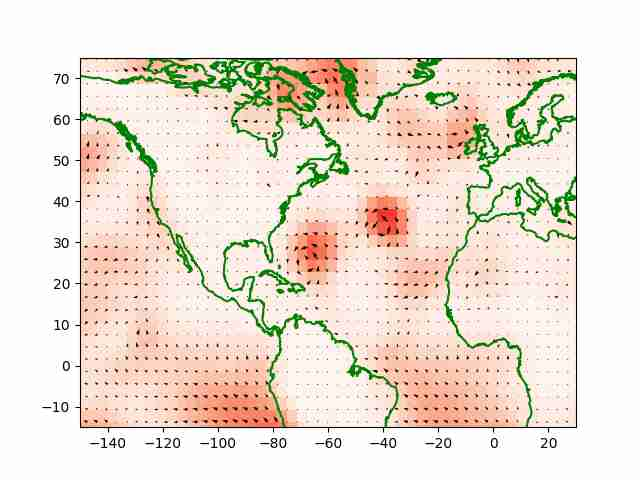

# Week 37


Bloomberg: "The Energy Department plans to award $1 billion to
stimulate demand for hydrogen, Energy Sectary Jennifer Granholm said
Thursday"

---

"Nikola Announces Expansion of Dealer Sales and Service Network Into
Canada in Partnership with ITD Industries"

 

---

H2 Central: "UAE – Masdar Tells Hydrogen Summit A ‘Green Wave is Coming’"

---

The Guardian: "[2023/01] Chemical pollution has passed safe limit for
humanity, say scientists.. Plastics are of particularly high concern,
they said, along with 350,000 synthetic chemicals including
pesticides, industrial compounds and antibiotics"

---

"@Hypx@mastodon.social

Bosch ramps up trucking’s hydrogen future.. Fuel-cell production in
Germany—and soon in the U.S.—will first supply Nikola Class 8 FCEV
trucks. The global mobility supplier is leaning into hydrogen as
trucking’s best hope for decarbonization and TCO"

---

"@merc@techhub.social

Batman presumably owns DC comics using a shell company.

Think about it.  They can't hide how Gotham is a hellscape with
massive wealth inequality and crumbling infrastructure.  But they
frame it as a rich heroic vigilante fighting a one-man war.  The
villains are almost never the ultra rich (other than Penguin, who is
more of a poseur).  Instead the criminals are frequently doctors,
lawyers, scientists, etc.

Most of his opponents keep escaping from Gotham Asylum.  But, instead
of raising taxes to improve its security and improving the
effectiveness of treatments, DC comics frames it so we're supposed to
cheer for the vigilante who roughs up the escaped mentally ill people
then returns them to the same underfunded asylum over and over"

---

Renewables Now: "Japan's IHI enters 1-GW hydrogen export project in
Queensland"

---

The Age: "Amsterdam was choked with cars until mass protests in the
1970s against their dominance and vehicular 'Kindermoord' (child
murder) forced that to change"

---

"@fediversereport@mastodon.social

We now have the following national governments with a Mastodon server:

- Germany: https://social.bund.de

- The Netherlands: https://social.overheid.nl

- Switzerland: https://social.admin.ch

As well as the EU with

- https://social.network.europa.eu

Let's hope that other countries will follow this.. pattern, and all
launch a fediverse server at social.[governmentwebsite].[TLD]..
[as it] makes it immediately clear to people they are communicating
with an official government account"

---

"@glyph@mastodon.social

I've seen vague public testimonials about how great Copilot [MS "AI"
code helper tool] is, but everyone I've spoken to directly about the
day to day experience of how it's impacting engineering culture are
telling me stories of junior engineers churning out boilerplate with
less understanding than before, overwhelmed staff & senior people
desperately trying to block common errors in code reviews, failing,
and having to do big rewrites or just blanket reverts. the dynamic is
toxic and the tool is a net negative"

---

Netanyahu: "Israel is at the focus of an unprecedented international
project that will link infrastructure from Asia to Europe... Its
vision reshapes the face of our region and allows a dream to become
reality. The initiative includes the construction of railways, the
laying of a hydrogen pipeline, the energy of the future, the laying of
fiber optic communications cables"

---

Reuters: "TotalEnergies announced a call for tenders for the annual
production of 500,000 tonnes of green hydrogen on Thursday, as part of
the French oil major's plans to decarbonise its European refineries"

---

Richard Bergman: "This is simply an extraordinary study. Researchers
gave $7,500 (CAD) to homeless people in Vancouver. The result? The
program saved money. It helped many of them to move into housing
faster, which saved the shelter system 8277 dollars per person"

---

Janes: "NATO flies Phoenix UAV along Finnish-Russian border for first
time"

---

FuelCellWorks: "UK Pours £25.7 Million Into Hydrogen-Based Red Diesel
Alternatives"

---

LA Times: "California is moving to outlaw watering some grass that’s
purely decorative"

---

"@patrickhadfield@mastodon.scot

Liz Truss blames everyone else in new book"

---

"@nickheer@c.im

Only Microsoft can build basic file syncing software that consumes two
full CPU cores while doing nothing, and uses 1.19 GB of disk
space. One of the world’s richest corporations is responsible for this
heap of shit"

[[-]](https://s3.c.im/media_attachments/files/111/026/468/283/093/559/original/092f4b4f28a8ea53.png)

---

FuelCellWorks: "Ursula Von Der Leyen's Bold Claim: Europe Is Outpacing
China and the U.S. in Hydrogen Energy"

---

Bitcoin being an energy hog is one of its many disadvantages. The most
important one is its limited money base - money base needs to expand,
otherwise you will get deflation. Some think this feature makes
bitcoin "politics free" bcz politicians "print and debase money" but
no money is politics free. Gold became currency because the king made
it so. It has no intrinsic moneyness attribute. Bitcoin is libertard
cosplay, that's all it is. AND a waste of energy.

"@lopp@lopp.social

Bitcoin's energy consumption doesn't make it a grift, con, or
scam. Bitcoin is an incredibly transparent system with regard to how
it operates"

---

Public sphere is overrun by private interests

The Atlantic: "America Has a Private-Beach Problem.. Accessing the
least-crowded section of New York’s Lido Beach requires either money
or insider knowledge. Anyone staying at one of the hotels on the beach
can walk through the lobby, and those living in the adjoining town can
waltz in through a separate gate using a residents-only electronic
access code. Everyone else, though, has to come in through a public
entrance half a mile away and walk over the sand. In theory, some
portion of every beach in the coastal United States is reserved for
collective use—even those that border private property. But exactly
how big that portion is varies widely, and in practice, much of the
shore is impenetrable"

---

Reshare

NYT: "Pope Says a Strong U.S. Faction Offers a Backward, Narrow View
of the Church..  In unusually sharp remarks published this week, Pope
Francis said some conservative American Catholics wrongly ignore much
of the Church’s mission and reject the possibility of change...

Pope Francis has expressed in unusually sharp terms his dismay at 'a
very strong, organized, reactionary attitude' opposing him within the
U.S. Roman Catholic Church, one that fixates on social issues like
abortion and sexuality to the exclusion of caring for the poor and the
environment"

---

"@HeavenlyPossum@kolektiva.social

Watching Greenland burn and Libya flood and France turn to desert,
some in the last few years and some in the last few days, reinforces
the lesson: there is no precedent for the climate catastrophe in any
meaningful human memory. The last time the global average temperature
was as different as we’re about to face was 12,000 years ago, before
the state and before the city and before writing.

There’s nowhere that will be predictably stable or safe. There’s no
preparation that can address the flux. I am unmoored and bereft in a
way I can’t articulate"

---

"@bobwyman@mastodon.social

NIH researchers 'found that living in an area with high levels of
particulate air pollution was associated with an increased incidence
of breast cancer'... Fossil fuel combustion is a major source of
PM2.5. \*\*Fossil fuels kill.\*\*"

---

It's strange.. 

\#ACDC #BeeGee #Mashup

[[-]](https://music.youtube.com/watch?v=n3muSFoAu6g)

---

It's like Hakeem Jeffries is his own sign-language interpreter.

---

"@burgerdrome@aus.social

I love my smart TV. I love the way it takes a long time to boot up
because it's trying to refresh the advertisements on the home
screen. I delight in the way it randomly restarts because it's
downloaded an update without asking me, each of which makes the TV
slower and slower with every subsequent install. I adore the way it
buries the apps that I want to use, and that I use without fail every
single time, below the apps that it's being paid to promote and which
I have never touched in my life and would never use without the cold
metal of a glock pressed hard against my sweating temple. I am
infinitely thrilled by the way the interface lags constantly, due to
the need to have one thousand unnecessary animations rendered on
hardware ripped wholesale from a ten year old phone. I feel myself
borne aloft on wings of pure joy when I am notified that my data will
be collected and analysed to determine my useage patterns. Even now I
am writing this from a field of beautiful flowers and soft luscious
grass as I lie and look up happily at the bright blue sky, smiling
happily to know that this is the future of technology"

---

"@miguel_pacheco@masto.pt

🇦🇺 ⚡ 💧 

Hysata, an Australian startup that achieved a 95% efficiency in water
electrolysis for #hydrogen production (41.5 kWh/kg), was awarded
US$13.5 million to build a 5MW demonstration plant"

---

Fuelcellworks: "Bavaria Bolsters Hydrogen Ecosystem With Expanded
Funding Program For Another 50 Hydrogen Filling Stations"

 

---

"Hysata opens new electrolyser manufacturing facility in Port Kembla
with $23m vote of confidence from Australian and Queensland
Governments"

---


Taking this shit out of source codes will be FUN

"@protik@cyberplace.social

Think about the money Software Engineers will make de-LLM-ing the
codebases once the hype is over"

---

Remember the scene in *Toy Story* where Buzz Lightyear jumps in air
wanting to fly, but with a succession of accidents stays in the air
for a while, and declares he is flying. Another toy says to him "you
are not flying, you are falling with style". That is precisely what's
going on with these neural net "AI" approaches, LLMs - they are
stupid, but they are stupid with style, their output sometimes looks
intelligent, either by chance (stochastically) or through a 
phenomenon known as [psychic's con](https://softwarecrisis.dev/letters/llmentalist).

---

They are basically stupid

Melanie Mitchell: "Can Large Language Models Reason?.. [I]f LLMs rely
primarily on memorization and pattern-matching rather than true
reasoning, then they will not be generalizable—we can’t trust them to
perform well on 'out of distribution' tasks, those that are not
sufficiently similar to tasks they’ve seen in the training data...  If
LLMs Are Not Reasoning, What Are They Doing?..  Several researchers
have shown that LLMs are substantially better at solving problems that
involve terms or concepts that appear more frequently in their
training data, leading to the hypothesis that LLMs do not perform
robust abstract reasoning to solve problems, but instead solve
problems (at least in part) by identifying patterns in their training
data that match, or are similar to, or are otherwise related to the
text of the prompts they are given.

For example, a study by Razeghi et al. showed that some GPT-based LLMs
(pre-trained on a known corpus) were much better at arithmetic
problems that involved numbers that appeared frequently in the
pre-training corpus than those that appeared less frequently. These
models appear to lack a general ability for arithmetic, but instead
rely on a kind of “memorization”—matching patterns of text they have
seen in pre-training"

---

The Apple USB-c change will ultimately be beneficial for the
consumers.  But let's remember Apple was bitchslapped into it, by the
EU. Unfettered capitalism gives you walled gardens, lock-in. Only
regulation can shake things up, encourage corps to do the right thing.

---

Looks like trouble

```python
u.ecmwf_wind(30,-60,10,M=100,N=60,show_ike=True)
```

 

---

Mozilla Foundation: "While we worried that our doorbells and watches
that connect to the internet might be spying on us, car brands quietly
entered the data business by turning their vehicles into powerful
data-gobbling machines"

---

H2 View: "Solaris set to deliver 90 hydrogen-powered buses to Venice"

---

"Fascism should more properly be called corporatism because it is the
merger of state and corporate power" — Mussolini.

---

The Guardian: "Chile president gives staunch defence of democracy, 50
years after Pinochet coup..  'Problems with democracy can always be
solved …  and a coup d’état is never justifiable – nor is endangering
the human rights of those who think differently,' said Gabriel Boric
in a speech outside La Moneda, the presidential palace bombed by
British-built Hawker Hunter jets during the 1973 coup"

---

"@jwz@mastodon.social

Breaking: Scorpion stings frog.

As I keep saying: maybe using a web browser owned by the world's
largest advertising company is a bad idea"

---

"@malwaretech@infosec.exchange

For anyone unaware, Google Chrome is currently rolling out an update
that track your interests based on browsing history, then share them
with 3rd party websites. The notification page makes it sound like
they added a new privacy feature, but in actuality they automatically
enrolled you into their tracking system and you have to go and
manually opt out"

---

When cloud co marketing uses the word "serverless" that's not exactly
true, they do have an app server. What they mean is co offers machines
with predefined services, preset APIs (could lead to lock-in,
careful), not blank hosts.

---

Many other read-only type services can be implemented in this static
site style.. without app server.

---

[Link](https://drive.google.com/uc?export=view&id=1qd1_t9N3kkBMTY-Gd38ITsz9YEBJt3ZZ)

---

That's right

---

Who da man

---

Yes yes I used this "inverted index" concept, simple to code, 50 lines
of py. I split the index to different files one for words starting
with a-, one for b- etc that way retrieval downloads small piece of
index for search term.

---

Site search done. 

---

Unzicker has a new book out, I'm looking forward to reading it.

 

---

"@dangillmor@mastodon.social

Apple's resistance to USB-C has always been about money, not its
customers' convenience. Money as in paying absurdly high fees for
proprietary technology -- including the Lightning tax it charges to
third-party sellers"

---

Reuters: "French watchdog halts iPhone 12 sales over too-high
radiation"

---

@carnage4life@mas.to

Apple says 'privacy is a human right' but would rather collect $10
billion a year from Google than set DuckDuckGo as the default search
engine in Safari.

---

The Jerusalem Post: "Linking Saudi normalization with a prerequisite
of peace.. Riyadh has consistently said its position on the
Israeli-Palestinian conflict hasn’t officially changed. It backed the
Arab Peace Initiative in 2002, a plan that called for peace in return
for a just and comprehensive peace with the Palestinians based on a
two-state solution"

---

QZ: "An antitrust lawsuit against Google goes to trial on Sep. 12"

---

The Conversation: "Ever-larger cars and trucks are causing a safety crisis on US streets"

[[-]](https://theconversation.com/ever-larger-cars-and-trucks-are-causing-a-safety-crisis-on-us-streets-heres-how-communities-can-fight-back-206382)

---

Ars Technica: "The room-temperature superconductor that wasn’t.. The
summer of room-temperature superconductivity was short-lived" \#LK99

---

OnlySky: "Why libertarian cities fail"

[[-]](https://onlysky.media/alee/why-libertarian-cities-fail/)

---

Schools clearly bet on the wrong technology - ed solutions need to be
based on true open architectures. DoEd can buy commodity hardware
(cheap as they will buying in bulk) and keep Ed software as "images"
on a DoEd server. Images are snapshots of a machine that has
everything kids need, you burn this image on each machine, give that
to students. A few visiting gov IT people for each school occasionally
can fix issues as they arise. Do not depend on some questionable
bidness "on the cloud".

"‘Chromebook Churn’ report highlights problems of short-lived laptops
in schools Chromebooks are not designed to last...Schools have piles
of working Chromebooks that have become e-waste because they’ve
expired...

Chromebooks have a built-in 'death date,' after which software support
ends. We expect milk to expire, but not laptops. Adding to customer
confusion, expiration dates are based on the certification of a given
model, not the purchase date. This means that consumers or schools can
buy a used or refurbished Chromebook thinking they’re getting a great
deal, only to be surprised when their new laptop expires after a year"

[[-]](https://pirg.org/edfund/resources/chromebook-churn-report-highlights-problems-of-short-lived-laptops-in-schools/)

---

[Link](https://drive.google.com/uc?export=view&id=1XHVZ3G6muR29BGSAsV2zBOqtn9TIvJHA)

---

Browser side programs are usually in Javascript. But Imma test a new
tech - Python in the browser \#PyScript.

---

A lot can be done via static files, even big ones. Some do not realize
but client can even read *parts* of a file on the web server, it's part
of the standard,

```python
from requests import get
url = "http://download.thinkbroadband.com/5MB.zip"
get(url, headers={"Range": "bytes=0-100"})
```

That gets only first 100 bytes. In theory one could even read parts of
a whole database if client knew how to seek/jump between the right
parts of the db file.. This is for read-only apps sure, still,
covers a lot of ground.

---

No need for a whole app server to offer search, static files can work
too (this blog's setup). IDEA: Create a search index offline, push the
index files on the the static site, client, with its code, can read
specific parts of the index, combine, sort them, and present results
on its end.

---

The hell with this "cloud".. Another dependency will be removed.. Time
to DIY

---

WTF happened to site search? Place search box on your page, connect to
ext search (Goog) showed search results for that site. Now bust.

---

\#Bitcoin

[[-]](https://media.universeodon.com/media_attachments/files/111/047/126/852/664/674/original/d7e44c1dce405349.png)

---

CBS News: "Texas paid bitcoin miner more than $31 million to cut
energy usage during heat wave"

---

They apparently make the fake one from horseadish and some starch

"It is estimated only 1% of American wasabi and 5% of Japanese wasabi is real"

[[-]](https://youtu.be/K0OtGIPRcAs?t=315)

---

WION: "Following reports that China, one of the company’s major
markets, had prohibited government personnel from using iPhones as
Beijing intensifies its continuing tech war with the US, Apple shares
plummeted during after-hours trading on Thursday, following the
company’s greatest single day loss in a month, according to a report
by Forbes"

---

"[Clean Energy Latin America's] LCoH Brazil Index reveals that it is
currently feasible to manufacture green hydrogen in select strategic
locations within Brazil at a levelized cost ranging from $2.87/kg to
3.56/kg. However, with optimization and incentives, these costs could
potentially decrease to as low as 1.69 dollar/kg, making them highly
competitive when compared to gray hydrogen derived from fossil fuels,
known for its environmental impact"

 

---

Ars Technica: "Chrome's invasive new ad platform, ridiculously branded
the 'Privacy Sandbox,' is.. getting a widespread rollout in Chrome
today. If you haven't been following this, this feature will track the
web pages you visit and generate a list of advertising topics that it
will share with web pages whenever they ask, and it's built directly
into the Chrome browser.. Google seemingly knows this won't be
popular. Unlike the glitzy front-page Google blog post that the
redesign got, the big ad platform launch announcement is tucked away
on the privacysandbox.com page"

---

Over 200 mil in the red. Why did it bomb so bad? Was it Woke? Because
it looks like film went broke. 😂 😂 

```python
u.mov_profit(budget=294,gross=380)
```

```text
Out[1]: -213.0
```

---

Ugh.. looks bad.. Lost munee

```python
u.boxofficemojo("Indiana Jones and the Dial of Destiny")
```

```text
Out[1]: 
{'Domestic Opening': '$60,368,101',
 'Domestic': '$174,385,511',
 'International': '$207,888,377',
 'Worldwide Total': '$382,273,888',
 'Release Date': 'June 28, 2023'}
```

---

"@croissant@zeroes.ca

Long COVID, which occurs in 10% of infections and which is not fully
prevented by vaccines, is becoming an exclusion criteria for any kind
of insurance — including travel, disability, and life.

The actuaries know."

---

Aero Testing Intl: "H2FLY.. plans to open its Hydrogen Aviation Center
at Stuttgart Airport next year. The Center, which is co-funded by the
regional ministry of transport will provide fuel cell aircraft
integration facilities and liquid hydrogen infrastructure.

H2FLY was founded by five engineers from the German Aerospace Center
in Stuttgart and the University of Ulm.. The company was acquired in
2021 by Joby Aviation, the California-based eVTOL aircraft developer"

---

Interesting Eng: "First liquid hydrogen-powered piloted plane soars
into sky.. H2FLY, the Stuttgart-based firm acquired by Joby Aviation
in 2021, completed four such flights in its HY4 demonstrator aircraft
fitted with a cutting-edge hydrogen-electric fuel cell propulsion
system and cryogenically stored liquid hydrogen..

Replacing gaseous hydrogen with liquid hydrogen effectively doubled
the maximum range of the HY4 aircraft from around 466 miles (750 km)
to approximately 932 miles (1,500 km), showing great promise for a
future with cleaner and more sustainable air travel"

 

---

F24: "G20 summit closes with Russia, Brazil and India boasting
success.. Modi formally closed the summit by passing on a ceremonial
gavel to Brazilian President Luiz Inacio Lula da Silva, whose country
will take the bloc's presidency in December. 'We cannot let
geopolitical issues sequester the G20 agenda of discussions,' Lula
said, an implicit reference to wrangling over the Ukraine war"

---

Politico: "West goes easy on Russia to save the G20"

---

AP: "Biden, Modi and G20 allies unveil rail and shipping project
linking India to Middle East and Europe.. President Joe Biden and his
allies on Saturday announced [the] plans.. an ambitious project aimed
at fostering economic growth and political cooperation... The rail and
shipping corridor would help physically tie together a vast stretch of
the globe, improving digital connectivity and enabling more trade
among countries, including with energy products such as hydrogen"

---

The planes attacked the building on 9/11. Many died, both during and
after the terrible event.

 

We are talking about Chilean Air Force bombing the presidential
residence as part of a coup, photographed above. The date was
September 11, 1973, and the left-wing president Allende was
toppled. Pinochet would become president and usher in neo-liberal
reforms, jail opponents, opress political dissent. "Chicago Boys" were
asked to help, thanks to them, the new system would create inequality
and subsequently cause the 1982 monetary crisis.

September 11 for US was tragic too, but US reacted to it by telling
people "to shop more", and invaded a random country to benefit
Halliburton. Dare I say due to its actions US made its own 9/11 matter
less. From now on we will only commemorate the Chilean 9/11, not the
American one.

---

"@motorpuntoes@mastodon.social

\#Coches | Los prototipos del BMW X5 de hidrógeno superan una nueva
serie de pruebas, esta vez en las extremas condiciones de Dubai"

 

---

.. lest we interfere with crooked ass bidness in an "opressive" kinda
way. No cannot do that. The right-wing way is to have the mofo to
feast off public money even more, as if cheap energy, the infra they
live on was not enough.

CBS News: "Texas paid bitcoin miner more than $31 million to cut
energy usage during heat wave"

---

See what I did there.. You thought one thing got another thing.. Boom!

---

Trump: "We know collective action can be incredibly effective. In
July, UPS agreed to a deal with the Teamsters Union in which, on
average, the annual salary of full-time drivers will be raised to
$170,000, including healthcare and other benefits.

What the rich and the politicians they own have succeeded in doing
since the Reagan administration, is convincing white working-class
Americans that unions are the enemy of working people, and
trickle-down economics (essentially tax cuts for the very rich) will,
counterintuitively, lead to economic equality. These are lies"

[[-]](https://marytrump.substack.com/p/doing-the-work)

---

