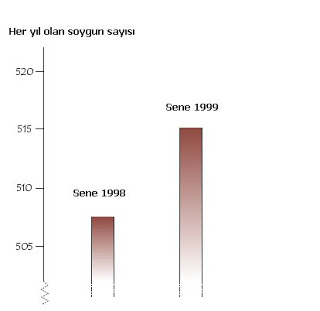
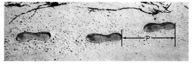
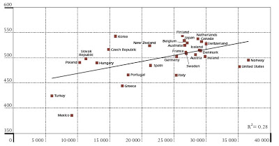
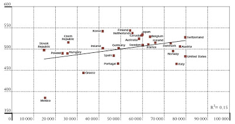

# PISA 2003

PISA, Programme for International Student Assessment, yani
"uluslararası öğrenci seviye ölçüm programı" kelimelerinin baş
harflerinden oluşan bir kısaltma. PISA, OECD'nin bir alt programıdır,
ve 2000, 2003 yıllarında üyesi olan her ülkede 15 yaşindaki
öğrencilerin seviyesini ölçüp sonuçlarını rapor etmiştir (program her
uc senede olcum yapmaya devam ediyor). Türkiye aktif olarak 2003 ve
2006 sınavına katilmistir. 2003 sonuçları bellidir, 2006'nin sonuçları
Aralık 2007'de belli olacaktır.

Bizim burada analiz edeceğimiz
sonuçları, 2003 raporu temelli. Sonuclarin, verilerle sunulmuş
orijinalini burada (PDF - 5.67 MB) bulabilirsiniz. MEB sitesinde de
kısa ve pek detaylı olmayan bir analiz mevcut. Biz, her zaman
yaptığımız gibi, probleme detaylı verilerle saldırıp, sesi sonuna
kadar açmaya çalışacağız.

Durum

Pekalaaa... Nasildir halet-i maarif-i umumiye? "Bizim çocuğun durumu
nasıl öğretmen bey?". Çocuğun durumunu söyleyeyim: 2003 itibariyle
durumu TKF. Yani Tek Kelimeyle Felaket. Yani, durum gelişmekte olan
bir ülke için o kadar rezalettir ki, açıkça söyleyeyim ne yapsak
bundan daha kötü olamayız. Hiçbir şey yapılmasa, belki şans eseri
ilerlemiş olunurdu; Durum o kadar berbattir. Ya da, 2003'teki durum o
kadar diptedir ki, nereye gitsek, yukarı çıkıyoruz demektir. Umarım
halimizi tarif edebilmisimdir.

PISA testi, her ülkede rasgele seçilen okulların öğrencileri için
hazırlanmıştır. Sinavdaki her sorunun zorluğuna ve verilen cevap
yeterliligine değişik puan ağırlıkları olabilmektedir, ve bu puanlar
en sonda toplanıp öğrenci seviyesi belirlenmektedir. Sınav sonucunda
öğrenciler 6 değişik seviyeden birine verilmiştir, 6 en yüksek
seviyedir.

Sorularin mahiyetini anlayalım diye örneklerini
göstereceğiz, fakat bazı ilk rakamları hemen paylasalim. Eğer
rapordaki Figur 2.16a'ya bakarsanız, Türkiye'nin ortalama olarak
matematikte 40 ülke arasında 35. olduğunu göreceksiniz. Bu kötü ama
eğer tüm ülkelerin notları yüksek olsaydı, bu bir anlam ifade
etmeyebilirdi. Sonuclarin derinliğine inince, iş daha iyi ortaya
çıkmaya başlıyor. Çünkü bilgi ekonomisinde lazım olacak türden
düşüncenin varlığını test eden bu sınavda, Türk öğrencilerinin
takriben yarısının daha 1. seviyeyi bile gecemedigi belli oluyor!
Alarm zilleri çalmaya başladı mi? Calmadiysa, fikriniz olsun diye
1.'yi bırakın, 4. seviyedeki sorulara bir örnek veriyorum:

"Televizyon yorumcusu alttaki grafiği gösterdi ve şunu söyledi:

Bu grafige bakarsak, y şehrindeki soygunlarda 1998'den 1999'a büyük
bir artış olduğunu görüyoruz.Bu yorumcunun söylediklerine katılıyor
musunuz?  Cevabinizi açıklayın ve destekleyici argümanlar ortaya
koyun".

Grafige bakıyorsunuz: Y eksenindeki skala 505'ten başladığı için
aslında artış fazla değil. Bunu bile söylemek size 4. seviyeye
getirecek puan kazandırıyor. Eğer artışın yüzde olarak hesabını
yaparsanız, 6. seviyede bir cevap vermiş oluyorsunuz. Peki üstteki
sorunun en basit cevabının bile sizi taşıyacağı 4. seviyeye kaç kişi
gelebilmis?  Ya da kaç kişi gelememis, ona bakalım:

Cevap: Türk öğrencilerinin %88'i!

Düşünebiliyor musunuz? Adamın en basit grafige bakarak, çok basit bazı
sonuçlara bile varamadigi gozukmektedir!  Efendim ikna olmadım. Bir
örnek daha vereyim.

"Alttaki resim, bir insanın ayak izlerini göstermektedir. Adım
büyüklüğü P yanyana basılmış iki ayak izin arkalarinin uzakligina
bakılarak hesaplanmıştır. Erkekler için n/p=140 formülü n ile p
arasında bir ilişki kurmuştur, ve "n = bir dakikada atılan adım
sayısı" ve "p = her adımın metre olarak ölçüsü'dur. O zaman, eğer
Hasan adım ölçüsünün 0.8 metre olduğunu biliyorsa, ve formül Hasan
için geçerli ise, Hasan'in metre/dakika ve kilometre/saat olarak
olarak yürüyüş hızı nedir?"

Bu soru, çok basit bir formuldeki yerlere koyma ve sonucu bulma
işlemine bir örnektir. Düşünce çizgisi n / 0.8 = 140 diye başlayacak,
sonra n = 140 x 0.8 = 112 olarak devam edecektir. Bu bile sizi
4. seviyeye ulastirmaktadir. Bu ilk çıkan 112 adım/dakika sonucunu,
adamın adım ölçüsü bilindigine göre, metre/dakika ve kilometre/saate
cevirebilirseniz (ki çok kolaydır) bu sizi 6. seviyeye
ulastirmaktadir. Bu soruda matematiksel model oluşturmayı geciniz,
mevcut model üzerinden hesap yapmanız istenmiştir. Ve, üzülerek
söylüyorum, yuzdelerimize bakılırsa bu soru türlerini 4. seviyede bile
cevaplayamayan öğrencilerimizin oranı yukarıda belirtildiği
gibidir.

Diğer Rakamlar

PISA sınavında en iyi sonuç alan milletlerin Finlandiya,
Çin, Kore ve Kanada olduğu gözükmektedir. Bu ülkeler öğrencilerinin
yarısından daha fazlasını 4. seviye ve yukarısında tutmayı
basarmislardir. Türkiye'nin ise öğrencisi ağırlıklı olarak 3. seviye
ve altındadır. Aslında bu sonuçlar şu anki iş gücümüzün hikayesini de
anlatmaktadır. Az sayıda uzman vardır, ve "ne iş olursa yaparım abi"
havasindaki insanlar çoğunluktadır. 1. seviyeye bile "gelememis" (yani
seviyesiz) insanların sayısının Türkiye'de %27.7 olması durumu pek
güzel açıklıyor zannediyoruz! Bu öğrencilerin matematiksel düşüncenin
m'sini almamış oldukları ve bilgi ekonomisinde geride kalacakları
kaçınılmaz olacaktır. Bizi bu alanda geçen yegane ülkelerin Meksika,
Brezilya, Indonezya olması bizi rahatlatmamali.. Yunanistan hem alt
seviyelerde bizden az, hem üst seviyelerde bizden fazla öğrenci
seviyesi ile bizden daha iyi bir konuma gelmeyi başarmıştır (ama
onlarinda yapacak çok işi var tabii). En üst seviyede %2.4 ile ABD'nin
%2.1'inden daha iyi bir sonuç almamız güzeldir, fakat ABD'nin 4. ve
5'inci seviyelerdeki öğrencileri bizden çok daha fazladır, ve en alt
seviyelerdeki öğrencileri bizden daha az sayidadir. Yani ufak bir
yerde istatistiki eşitlik genele bakılınca olan durumu telafi
etmemektedir. Eğitim, aynen sağlık gibi, satha yayılması gereken bir
hizmettir - tek tük adamı kurtararak ilerlemek mümkün değildir. Ayrıca
Türkiye'nin Amerika gibi dışarıdan eğitilmiş beyinleri "ithal etme"
şansı nispeten daha azdır.

İlginç bir grafik ise, milli gelir ile PISA sınav notu arasındaki
korelasyon (büyük hali için tıklayın):

Bu grafige göre kişi başına
milli gelir ile PISA başarısı arasında direk bir ilişki (correlation)
olduğu gözüküyor. Fakat hemen uyaralim, iki değişken arasında
korelasyon olması, o parametrelerden birinin her zaman diğerinin
sebebi olduğu anlamına gelmez, belki ortada iki parametrenin dayandığı
bir üçüncü parametre vardır, ve korelasyon aslında bu diğer saklı
korelasyonu göstermektedir, bu üçüncü korelasyonun olup olmadığı
eğitim ve sosyalbilimcilerin işidir, fakat her halükarda, aradaki
direk bağlantı dikkat çekicidir. Bu grafige bakarak varilacak bir
diğer sonuç, Türkiye'nin milli gelirine oranla hakettiği puanı
alamamış olmasıdır (eğer milli gelirin hakettiği sonuç alinsaydi,
Türkiye veri noktası çizgiye yakın olurdu), ve belkide bir sonraki
grafik bunu aciklamaktadir (büyük hali için tıklayın).

Bu grafik her milletin eğitim için öğrenci başına harcadığı para ile
PISA sonuçlarının grafigidir, yine arada korelasyon mevcuttur, ve
Türkiye (demek ki) harcadığı müthiş cuzi miktar sebebiyle, grafige
köşesinden bile dahil olmayı basaramamistir. Yani, hem GSMH düşüktür,
evet, ama bir yandan da GSMH'nin gereken oranı eğitime
harcanmamaktadir.

Final Analiz

Şimdi işin yapılacaklar ve sorumluluklar kısmına gelelim. İtiraf etmek
gerekir ki, PISA 2003 sınav sonuçlarının sorumlusu AKP hükümeti değil,
2000/1 ve öncesi başta olan hukumetlerdir, ya da daha geniş bağlamda
2003'te 15 yaşında olan çocuğun eğitim hayatı boyunca başta olmuş her
milli eğitim bakanligidir. 2006'daki sinavin sonuçlarının sorumlusu
olan AKP olacaktır. Bu sonucu merakla bekliyoruz.

Milli Eğitim Bakanlığı, PISA sınavına aktif olarak katıldığı, okul
seçiminde, sinavlarin tercumesinde yardım sağladığı için sonuçlardan
birinci derecede haberdar olmalidir; Önemli olan, bu sonuçlara göre ne
kadar icraat yapıldığı/yapacakları, ve ne kadar rota değişikliği
olacağı, olmuş olduğu sorusudur.

PISA sinavinin ruhu hakkında biraz daha bilgi vermek gerekirse,
amaçlarının matematiğin günlük/teknik hayata uyarlanması, okunanin
anlanmasi, modelleme, grafik yorumlama, veri analizi gibi modern
ekonomide lazım olacak konular olduğundan bahsetmiştik. PISA'nin
yapmadığı, matematik derslerinde çoğunlukla yapılan "f(x)'in turevini
al" gibi mekanik, artık bilgisayarların (bile) yaptığı sorulardan
kaçmak, bundan ziyade, hiçbir metot ve mantık zinciri "rengini belli
etmeden" sadece teknik bir sorunun, bir şekilde, kullanılabilir bir
teknik cevabını beklemektir. Bu mentaliteyi mastır öğrencileri için en
güzel GRE sınavı test ediyor. Hele hele grafik analiz, korelasyon
görme, modelleme gibi konuların üstüne ne kadar bassak az olur. Bu
konu (modelleme hariç) daha yüksek seviyede GRE tarafından çok güzel
şekilde test edilmektedir.

Mufredat gelistirmesinde, eğer hala yapilmadiysa, OECD ile ortaklık
muhakkak faydalı sonuçlar doğuracaktır. Bunu yapan pek çok (hatta
gelişmiş) ülke mevcuttur. Herhalde bizde de üniversite sinavlarindaki
soru tiplerinin değişmiş olmasının sebebi PISA sonuçları idi, inşallah
bunun meyvelerinin 2006 yılındaki sınavda göreceğiz.

Ayrıca, daha ilerisi için, mufredatlarda yetenekli öğrencilere daha
fazla seçenekler, "illa analiz (calculus)" yerine daha geniş yelpazede
matematik - lineer cebir, olasılık ve istatistik gibi konularının
tanitilmasinin gelecek nesil yeni ekonomi çalışanları için faydalı
olacağını zannediyoruz.

