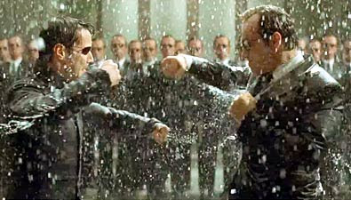

# Filmler ve Akimlar

Holywood filmlerine bakarak akim savaslarini takip etmemiz mumkun
olabilir mi? Sanayiciler ile bilgi toplumculari birbirleri ile hangi
filmler uzerinden surtusmektedirler? Hangi filmler kime aittir?Mesela
daha once bahsettigimiz Matrix filmini, tum trilogy'sine bakarak bir
daha incelenmemiz uygun olabilir: Bu uclu set'teki ilk film, aslinda
gercek surtusmeyi yakalayip kahramani ve kotu adami dogru hatlarda
sectigi icin beyaz yakali yeni ekonomi bireyleri arasinda bu kadar
begeni kazanmistir. Fakat bu begeninin boyutlarini filmin yapimcilari
Wachowski kardesler bile onceden tahmin edememis olmalilar ki, radar
altinda gelisen, finanse olan bu film bu kadar begenilince, ikinci
akimcilarin Matrix II ve III'e el atmasi gerekti.Takip eden bu yeni
filmlerde, Neo'nun sistem ile kavgasi yerine, karsi taraf ile Neo'nun
arasindaki "baglantilar" ve "benzerlikler" islenmistir. Oyle ki, son
filmin bitisinde ikinci akimi temsil eden makineler yokedilmeden
birakilarak, bir baris havasi yaratilmis ve "ikimizin de birbirimize
ihtiyaci var" havasi filmin bitis mesaji haline donusmustur. Buyuk bir
ozenle Matrix I sonunda herkesin hayalini kurdugu "uykudaki insanlarin
topluca uyanmasi" gibi bir kuvvetli sahne ve simge, bilincli bir
sekilde seyircilerden uzak tutulmustur. Ve bu sasmis kurgu ve ana
mesaji yuzundendir ki Matrix II ve III bizim grubumuz tarafindan hic
begenilmemistir.

Wachowski kardeslerin bu yeni filmlere nasil bir zorlama altinda sekil
verdigini bilemiyoruz; Ama "eski sistemi" sevmeyen damarlarinin bu
duruma dayanayip, "V For Vandetta" filminde iyice kabardigini
hissedebiliyoruz. VFV filminde Wachowski kardesler nihayet
hedefledikleri sistem ile hesaplasmalarini sonucuna vardirabiliyorlar,
serbestce kurgulayabildikleri bu filmde, totaliter, tek-tipci,
standartci, toptanci bu sistemi, Matrix filminde sistemin adami (yani
kotu adami) oynamis olan ayni aktore yiktirtma zevkine
variyorlar. Sonuc, Ingiliz parlamento binasinin cokmesi ... Bu mesajda
muhakkak biraz anarsisizm var, ama Wachowski kardeslerin daralmis
oldugu besbelli. Ingiltere'nin secilmis olmasi da aslinda o kadar kotu
bir secim degil..  Demokratik bir ulke, ama sanayilesmesi en eski
oldugu icin ve emperyalizm cagrisimlarini da yapabiliyor icin, arti,
gunumuzde demokrasinin kotuye kullanilabilmesi simgelerini de
isleyebilecegi icin mukemmel bir sembol.11 Eylul oncesinde Swordfish
filmi ikinci akimi hem kotu, hem de 3.'den faydalanmaya calisir halde
betimledigi icin artik cogunlugu beyaz yakali olan Amerika'lilarin
kendi hayatlarina iliski kurabilmelerini saglayarak ilgi gormeyi
basaran bir film olmustur. Bu filmde John Travolta'nin oynadigi
militer, sanayi cikarlarini savunan, "amac icin her arac mubah"'tirci
karakter, bireyselligi, insan haklarini gayri-merkeziyetciligi savunan
ve bu yuzden sistemle basi dertli cracker/programci tarafindan her
adimda durdurulmaya calismaktadir, ve filmin kahraman rolu buyuk
olcude bu asi cracker'dadir. Fakat filmin drama ozelligini arttiran
ilginc bir baska aci (twist), daginik yapida organize olan terorizme
karsi, Travolta'nin karakterinin de daginik bir yapida savasmayi
secmis "asi savasci" gorunumune girmis olmasidir... Bu amaci
dogrultusunda mesela "banka soyan" bu karakter, cok ilginc bir senaryo
numarasi ile, kendisi de bir olcude gayri-merkezi, bireysel, "kendi
isini kendin yap" havasina burundurulmustur. Terorizm'in "uzaklarda
bir yerde" oldugu zamanin Amerika'sinda bu iki katmanli kotu adam ilgi
cekici ve her iki taraf icin kabul edilir tattadir.

Sanayici, bu kotu adama bakarak kendi amaclarini savundugu icin
neselenebilir, ucuncu akimci ise kotu adamin kotulugunun farkinda
olarak kendi metotlarini kullanilmasina biyik altinda
gulecektir. Ayrica yeni dunyanin iplerinin kimin elinde oldugu film
tarafindan gayet bariz bir sekilde Travolta karakterinin cracker'a
olan bitmeyen saygi gosterileri ile surekli vurgulanmaktadir.  Buna
karsi sanayicilerin elinin armut toplamadigini goruyoruz. Top Gun
filminde her ne kadar Amerikan militarizmini yuceltmis olsa da, gunun
sonunda beyaz yakali bilgi isleyici bir pilotu oynamis olan Tom Cruise
imaji, The Last Samurai filmindeki samurai rolu uzerinden, Japon
imparatoru onunde secdeye vardiriliyor. Burada sistem bir gol atmis
olmakta, herkesin zihnindeki kahraman imaji, sisteme biat ettirilerek
bir takim mesajlarin verilmesi saglanmis. Burada hangi simgeler var?
Tarihte bilinen bir gercektir ki samurai, Japon endustriyellesmesinin
silahlari sayesinde yenildi. Ek olarak Japon sanayisi de Amerikan
sanayisi tarafindan yenildi - boylece sistem, ozellikle Amerikan
ikinci akimi, her seviyede kendi ustunlugunu vurgulamis
olmaktadir.Karsi tarafta, ikinci akima muhalefet olarakf aktif ve
tutarli olarak film yapan tek aktorun su anda George Clooney oldugu
gorulmektedir. Clooney, Syriana filminde endustrinin favori arka
bahcesi olan fosil kaynak politikalarini desmistir ve Syrina filminde,
kuvvetli bazi bilincaltisal mesajlar gondermeyi basarmistir; Mesela
Arabistan'da cocugunu kaybeden bir Amerika'li, ulkesini gelistirmek
isteyen ama bu yuzden oldurulen Arap seyhi gibi..

Clooney'nin ozel yasami da politik secimlerini yansitmaya
baslamistir. Hatta birkac filmde arka arkaya bir araya gelmis olan ve
kafalarinin da tuttugu gozuken Clooney etrafinda toplanmis ve gittikce
60'lardaki Rat Pack havasina burunmekte olan yeni "havali biraderler"
Matt Damon, Brad Pitt ve Ben Afleck gibi aktorler, alternatif akima
bir goruntu saglamaya adaydirlar. Bu grup, odunluga baskaldirinin
basladigi yillari romantize ederek, beraber Las Vegas'ta bir otel bile
yaptirmaya karar verdiler. Otel icerisinde Rat Pack havasinin
esecegine muhakkak gozuyle bakiliyor.Televizyon dunyasinda da bol
hareketlilik mevcuttur... 24 dizisini finanse eden Fox kanalinin
ABD'de sanayi cikarlarini savunan Bush hukumeti ile siki fiki oldugunu
tekrar belirttikten sonra, 11 Eylul sonrasi Jack Bauer'in "amac icin
her arac mubahtir" anlayisini niye surekli afise ettigini belki daha
iyi irdeleyebilmis oluyoruz. Bu kanaldan cikan diger bir dizi Prison
Break ise daha ilginc bir goruntude.. Az zaman once tamamlamis oldugu
iki sezonunda bir "devlet komplosu"'nu islemekte ve bu acidan sanki
kendi kimyasina aykiri bir yayin yaptigi goruntusunu vermis olsa da,
ki bu kismen dogrudur, bu Fox dizisi kotu insani sanayicinin eve
tiktigi "kadin" goruntusune burundurerek ve daha kotusu bu "kadini"
ayrica sanayicinin ic savasta yendigi ve en favori dusmani olan "koylu
guneyli" goruntusune burundurerek ikinci akimcilarin tokatlari
bildikleri yerlere gondermeyi hedefledikleri gostermistir. Ustune
ustluk kadin baskanin son dizilerde ortaya cikan ve hep guneylilere
atfedilen "aile ici iliskisinin" olmasi, artik iyice ortada olan
hedefi iyice kacinilmaz duzeylere cikarmistir.

