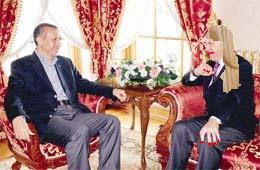

# Asrın röportajı

Gücün Fahisesi: Hosgeldiniz Sn. Basbakan. Nasilsiniz? Roportaja, uzlasmaya hazir misiniz?

Recep Tayyip Erdogan: Tabii Gücün Bey. Uzlasalim. Anlasalim. Baslamadan once tum Turkiye [vs..vs..] ve eklemek isterim ki tuyu bitmemis yetim [vs.. vs..] ve bunlari derken rahmet dilekleriyle tum dunyaya baris, selamet, vesairefilan dilerim, amin derim.

G.F.: Aynen benim dileklerim de bunlar efendim. Once biraz sizden bahsedelim. Sizin muzige kabiliyetiniz var yanilmiyorsam, sesiniz guzel, iyi sarki soyluyorsunuz.

R.T.E: ♪♫ Ordu'nun dere-leeeeri ♪♫ Aksa yukari aaaaksa.. ♪♫ Vermem seni ellere ♪♫ Ordu ustume kalksa ♪♫

G.F.: Anlayamadim. Burada ordu'ya bir mesaj mi verdiniz? Simdi bu roportajda sizi uzlastirmak zorundayim, bu sarkiyi nasil uzlastiracagim anlamadim.

R.T.E: ♪♫ Oy mehmedim mehmee-eeedim ♪♫ sana kusum demee-eedim ♪♫ Beni sana gecmiii-iisler ♪♫ vallahi ben demeee-eedim

G.F.: Peki ben sonradan satir aralarina ekleyecegim ifadeler ile bunlari bir sekilde uzlastiririm.

R.T.E: Biraz da sizden bahsedelim Gucun Bey. Siz muzikten anlar misiniz?

G.F.: Cok iyi anlarim.

R.T.E: Muzik enstrumani calar misiniz?

G.F.: Cok iyi saksafon calarim. Ayrica cok iyi dansederim. En iyi figurlerimden birisi "hizla donmek" adini verdigim bir figurdur. Patenti bana aittir. Pek cok diger gazeteci arkadas bu figuru biliyor ama en iyi yapan benim, ve ozel bir sekilde yapiyorum.

R.T.E: Peki. Simdi nasil uzlasacagiz bana siz anlatin bakalim.

G.F.: Biz Karanlikci Medya olarak politikacilara bazi hizmetler sunuyoruz. Siz bu hizmetlerden istediginiz paketleri seciyorsunuz. Mesela "Liberal Lite" adli bir paketimiz var, az seviyede ozgurlukleri musterilerimize biz pazarliyoruz, siz icraatinizi yapiyorsunuz. Galeyan olmuyor. Ses cikmiyor. Politikaci aksam evinde rahat uyuyor.

R.T.E: Baska neler var?

G.F.: Bunlardan once sizi nasil pazarlayacagiz onu bir konusmamiz lazim. Fasist kitle sizi kendinden gormek istiyor.

R.T.E: O basit canim. Mesela benim soyadim Erdogan. Er dogmus demek, yani "asker dogan" demek. Zaten her Turk asker dogdugu slogani uzerinden bunu pazarlayabilirsiniz.

G.F.: Cok guzel! Bunu hemen yaziyorum. [Ayaga firlar] Her! Turk! Asker! Dogar!!! Her! Turk! ...

R.T.E: Aman oturun Gucun Bey. Korumalar isgilleniyor sonra.

G.F.: Ha tamam. Anladim [oturur]. Dedigim gibi pek cok diger hizmetlerimiz var. Bu gecis aninda mesela biz eski soylemler ile yenisi arasinda bir kopru kuracagiz. Mesela is yapmadigimiz siralarda sizi "sinirli" olarak etiketlemistik. Simdi ben bu roportajim satir aralarina "sinirlenmeden soyluyor" diyerek hem eski dediklerimize hem de yeni imaja mutabik kalindigini gosterecegim.

R.T.E: Peki. Ama bu fasist kitle ile nasil uzlasilacak? Benim ne yapmam gerekiyor?

G.F.: Karanlikci Medya'nin farkliligi burada ortaya cikiyor efendim. Sizin kitle ile uzlasmaniz gerekmiyor, biz sizin icin onlarla uzlasiyoruz. Siz sadece bizimle uzlasiyorsunuz. Yani biz size bir "one-stop-shop" servis sunuyoruz. Tum uzlasma ihtiyaclariniz icin Karanlikci Medya. Vallahi reklam filmi bile gozumun onunden gecti.Tayyip Erdogan'in eskiden sinirlendigini ama simdi sinirlenmedigini belirtmek icin, "bunlari sinirlenmeden soyluyor" diye buraya ekliyorum.

R.T.E: O zaman anlastik Gucun Bey. Yakinda bizim partimizden bir cek alirsiniz. Karanlik Bey'e selamimi iletin.

G.F.: Derhal efendim. Iyi calismalar dilerim.

