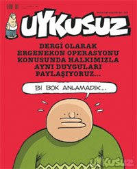

# Hiciv Denemeleri

Yeni bir kategori başlattık; Bu yeni "hiciv" kategorisi altında
dışarıda The Onion geleneğinde olan ciddi/şaka havasında bazı
yazılarımız olacak.

Türkiye'deki bazı olaylar öyle saçma ve aptalca ki, bunları eleştirmek
ve kızmak yetersiz, bunun ötesine geçmeniz gerekiyor, dalga geçmek ve
makaraya almak lazım ve gerekli. Şu anda ülkemizde bir politik komedi
kıtlığı var; kimsenin burnundan kıl aldırmaması ayrıca komedyenlerin
komedi yapabilmek için gereken doğru politik görüşte olmamaları burada
rol oynuyor.

Alttaki karikatür dergisi başlığı, Ergenekon olayı patladıktan sonra
çıktı ve Türkiye siyasi mizahının içinde olduğu hazin durumu
yansıtmaktadır.

Tam bir beyin durması durumunu gözlüyoruz.Not: The Onion'ın unutulmaz
başlıklarından bir tanesi "Suriye 15 Milyon Arap Barındırıyor"
başlığıdır. Burada kitle medyası ve savaş tamtamcıları ile dalga
geçiliyor; Genelde bu haber "vs ülkesi .. tane terörist barındırıyor!"
havasında çıkar. The Onion'da terörist yerine Arap kelimesi
kullanmışlar, ve "barındırıyor" demişler, o ülkede yaşayan insanlardan
bahsediyorlar tabii. Tam makara..

