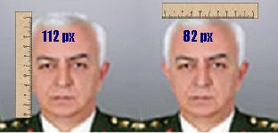

# Brekisefal Degil

Org. Koşaner malum devir-teslim töreninde bizi pek derin felsefi
görüşleri ile aydınlattı. Madem ulusalcı ideolojiyi bu kadar
hatmetmiş, etnikçilikten, cemaatlerden bahsetmiş, kendisi acaba bir
diğer 1930 model düşünce olan Türk Tarih Tezi (TTT) hakkında ne
düşünüyor?TTT'ye göre Türk'lerin brekisefal (bir kafatası şekli)
yapısında olması gerekir, yani kafatasının eninin boyuna olan oranı
0.85'ten daha yüksek olmalıdır. Piksel bazında bizim yaptığımız
ölçümlere göre Koşaner, enine 82 px boyuna 112 px ölçülerde ve bu iki
ölçümün oranı 0.73 çıkıyor.

Yani bu ölçümlere göre ve TTT'ye göre Sn. Koşaner Türk değil. Neyse:
Bu saçmalıklar tabii ki bizim umrumuzda değil. Bizce, bir insanın
işinde yükselmesi için tek önemli kıstas meritokrasi yani o kişinin
kabiliyeti ve becerisi.

