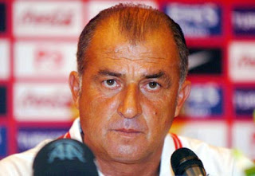
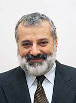
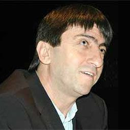
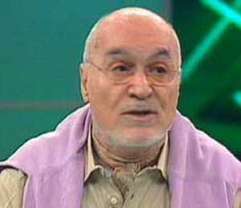
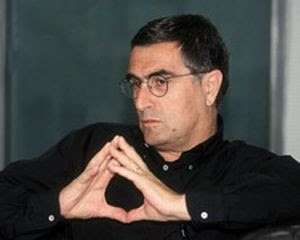
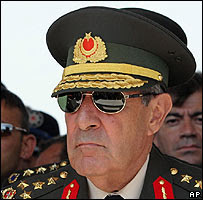

# Fisleme devam ediyor

Futbol Federasyonu gizli servisinin, futbol camiasında yazarlık, teknik adamlık yapmış kişileri fişlediği ortaya çıktı. Dışarıya sızan bilgilerden bazı yazarlar hakkında verilenler şöyle:

---

Fatih Terim: Çok üst seviyede İngilizcesi yüzünden Terim'in ilk başta İngiliz çıkarlarına hizmet ettiği izlenimi çıkmıştır.. Fakat, ajan kod adı "Commandatöre" olan Terim, Milan ve Fiorina örgütlerine hizmet etmektedir. Türkiye Milli Takımı'nın ekol olması yolundaki planları bu örgütlere sızdırmıştır. İtalya tarafından enforme edilmektedir.

Deniz Gokce: Kod adı "Noel Baba" olan Deniz Gökçe, küresel piyasa ile ilişkiler içindedir. Bu piyasayı "takip" etmektedir. Atletizm ile ilgilenme gibi irticai faliyetlerde bulunduğu gözlenmiştir. Almanya tarafından enforme edilmektedir.

Ridvan Dilmen: "Şeytan" kod adlı Rıdvan Dilmen, Fenerbahçe Cumhuriyeti ajanlarının en önde gelen isimlerindendir. GS/FB, BJK/FB çerçevesinde bölücü faliyetleri tespit edilmiştir. Fenerbahçe Cumhuriyeti eşbaşkanı Tayyip Erdoğan tarafından enforme edilmektedir.

Hincal Uluc: Kimse tarafından enforme edilmemektedir. Zaten futboldan pek anlamamaktadır. Dezenformasyon kampanyaları için kullanılmaktadır.

Hasan Cemal: "Paşa" kod adlı Cemal'in AB üzerinden FIFA için ajanlık yaptığı, milli takımımızın taktiklerini, tezahüratlarını aktardığı saptanmıştır. Çok fazla gezmesi sebebiyle pek çok bilgi sızdırma eylemleri için odak oluşturmaktadır. GS/BJK, GS/FB çerçevesinde bölücü eylemleri saptanmıştır. FIFA tarafından enforme edilmektedir.

Yasar Buyukanit: "Abide" kod adlı ajan Büyükanıt, camiaya "köşe yazarı" olarak katılmak istediğini duyurmuştur. Fenerbahçe Cumhuriyeti ile bağlantıları saptanmıştır, fakat kim tarafından enforme edildiği hala net olarak bilinmemektir. Yazılarında "asımetrik kontratak", "bölücü defans" gibi terimler kullanacağı tahmin edilmektedir. Kurum tarafından takibe alınmıştır.

Cengiz Candar: Dışarıda "Neo" yurt içinde "Neco" kod adıyla faliyet yürüten Cengiz Çandar, Amerika ve Fenerbahçe Cumhuriyeti arasında "aracı ajan" görevini yapmaktadır. Washington'daki "düşünce kurumlarına" ülkenin yerli futbol sırlarını sızdırmaktadır. Kadıköy menşeili televizyon yayınlarında propaganda faliyetleri yürüttüğü gözlenmiştir. Amerika tarafından enforme edilmektedir.

Adnan Polat: Kod adı "Obama" olan Polat Fenerbahçe Cumhuriyeti'nin ajan olarak GS'ye soktuğu kişilerden biridir. Ajanlığı sırasında dönerek GS ıcın çalışmaya başlamıştır, ikili ajan olmuştur. Sonra FB tarafından bir daha döndürülen Polat bu sefer üçlü oynamaya başlamıştır. Ardından araya giren BJK, TSE, TSK gibi faktörler ile ortalık iyice karışmıştır. Herkes tarafından enforme edilmektedir.

Tayyip Erdogan: "The Imam", "One Minute" kod adlarıyla bilinen Tayyip Erdoğan en üst seviye ajanlardan biri aynı zamanda Fenerbahçe Cumhuriyeti'nin eşbaşkanıdır. Görevi süresinde "stat inşası", "takiye taraftarlık" gibi bazı tekniklerle GS'ye sızmayı başarmıştır. "Obama" kod adlı ajan Adnan Polat'ı yetiştirip GS'ye yerleştirenin o olduğu tespit edilmiştir. FB Amigolar Birliği tarafından enforme edilmektedir.

Hakan Şükür: "Şaban Şükür", "Yarabbi Şükür", "Hizmetçi" kod adlarıyla bilinen ajan / futbolcu, yorumcu olarak katıldığı programlarda GS / FB minvalinde bölücülük ve "taraftarların bir kısmını diğerine karşı kışkırtma" eyleminde bulunmustur. Örgüt şeması içinde "9 numara" olarak bilinmektedir. Arnavutluk tarafından enforme edilmektedir.

