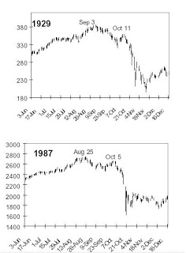

# 1987

Borsa cokuslerinin en ilginc olani 16 Ekim 1987 tarihindeki %23'luk
kayip ile Kara Pazartesi adi verilen cokustur. Bu cokusu ilginc yapan
cok hizli bir sekilde (bir gunde) meydana gelmesi, tum dunyaya
yayilmasi, ve simdiye kadar, halen, dogru durust aciklanamamis
olmasidir. Etki/tepki, rasyonellik, tahmin edilebilirlik bu rekor
dusus karsisinda tamamen erimekte, yetersiz kalmaktadir.1987'nin
aciklanamamasinin sebebi bir bakima cokusun sebebinin klasik ekonomi
parametreleri baz alinarak aranmasindadir denebilir. Bu tur
aciklamalar, bir borsadaki fiyatlari reel ekonomideki olaylarin (en
azindan kisa vadede) sadece "dolayli" olarak etkileyebildigini goz
ardi etmekteler. Nitekim, kisa vadede fiyatlari olusturan reel dunya
degil, o dunya hakkinda aktorlerin "ne dusundugudur". Bu aktorlerin
beklentileridir.Peki 1987'deki dusus hangi "beklentinin" ortaya
cikmasi sebebiyle olusmustur?Ortaya konulan hipotez ilginc: Bu
beklenti, 1987'nin 1929 kriziyle olan sozde benzerliginden baska bir
sey degildir. Ozetlemek gerekirse, 87 dususu oncesinde, aynen 29
oncesine benzer fiyat, hacim hareketleri goruldugu icin, bu benzerlik
ilk once buyuk borsacilar tarafindan daha sonra Wall Street Journal,
CNBC gibi kitle haber kanallarinca tekerrur olarak algilanmis, ama
tekerrur olmasa bile bu algilanis uzerine hareketler yapilinca bu
benzerlik, gercek benzerlige donusmustur! Yani Ingilizce'deki deyim,
"kendi kendini gerceklestiren kehanet (sell fullfilling prophecy)"
durumu olusmustur!Zamanin onde gelen yatirimcilari Paul Tudor-Jones ve
Stanley Druckenmiller'in (Soros'un sag kolu, Quantum fonunun
yoneticisiydi) verdikleri mulakatlar bu hipotezi dogrular
niteliktedir.

Her iki yatirimci da Kara Pazartesi'den bir onceki Cuma meydana gelen
rekor hacimde azalisi (fiyat seviyesinde azalis rekor degil, dikkat,
eksi yonde ama hacim rekor seviyede), farkedip, modellerinde bunun
1929'den hemen onceki bir duruma tekabul ettigini farkedip, sat
pozisyonuna gectiklerini belirtmistir. Diger gec uyanan aktorler ise,
kismen bu buyuk aktorlere, kismen kendi kurduklari analog (benzerlik)
sonrasi ayni sekilde davranmaya baslayinca, tahmin, kendini
dogrulamaya degil, kendini "gerceklestirmeye" baslamis ve 1929
cokusune tipatip benzeyen 1987 cokusu meydana gelmistir.Altta her iki
buyuk dususun grafigini bulabilirsiniz.Demek ki, 1987'nin sebebi 1929
krizidir. 1929'un insanlarin belleginde olan kalintilaridir.Peki 1987
hafizasi daha sonraki krizleri etkilemis midir? Hayir. Cunku
yatirimcilar bu iki tecrubeden ogrendiklerini alim/satim
stratejilerine yansitmislardir.

1987 krizi ile beraber baska bir gercek artik hafizalardadir; 1987'den
sonraki cabuk duzelis (gerci fiyatlarin 87 oncesine donmesi iki kusur
sene almistir, fakat bu Buyuk Buhran zamani ile karsilastirilamaz
bile).Daha fazla bilgi icin [1, 2].Dikkat: 87 ve 29 arasinda baglanti
kurduk, fakat su anda olan dusus hakkinda yorum yapmiyoruz. Yazinin
ana tezi, reel ekonominin direk degil, algilayis uzerinden fiyatlari
etkiledigidir, bu algilayis bir onceki algilayis, ondan alinan ders,
dersin dersi gibi cetrefil seviyelerde degisebilir. Su anda reel
ekonomide riskin uzun sure az fiyatlanmasinin bedeli odenmektedir, bir
onceki algilayisin duzeltmesi, ayrica sistemdeki bozukluklarin
duzelmesi sozkonusudur. Bu cokus (tarihe gececek bir cokus olacak mi
onu zaman gosterecek) buyuk bir ihtimalle eskiye kurulan yanlis
analoglar ile alakali olmayacaktir.

