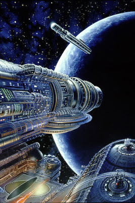
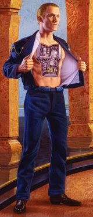

# Asimov

Gelecek tahmini, uygarlıklar, bilimden söz açılmışken Asimov'un
Foundation ve robotlar hakkındaki roman serisine atıf yapmamak
olmaz. Bu seri bir dizi ya da filme çevirilecek olsa, uzay operası
(space opera) diye nitelendirilebilecek, "büyük" olayları ve epik
kişilikleri merkez alan bir roman serisidir. Asimov seriye başlamadan
önce Toynbee'nin Roma İmparatorluğu hakkındaki kitabını okumuş ve
kitaptaki Galaktik İmparatorluğu için Roma İmparatorluğunu örnek
almıştır.  Seri Hari Seldon adli bir matematikçi ile başlar. Seldon,
yeni geliştirdiği psiko-tarih adlı bir bilim ile imparatorluğun
çökeceğini tahmin etmiştir. Fakat bu matematik sadece "büyük" olayları
büyük bir örneklem kullanarak tahmin edebilmektedir. Burada Roma
İmparatorluğu çöküşü ile paralellik var, ve arkasından takip edecek
barbar çağı kitapta Seldon tarafından tahmin edilir. Seldon, bundan
sonra barbarlık çağının kısalması için galaksinin en ücra köşesinde bu
çağda yokolması kesin olacak bilimi depolamak için bir merkez
kurar. Vakıf burasıdır.  Vakıf kavramı bana hep 80'li yılların
Japonya'sını ve (kısmen) İsrail devletini hatırlatmıştır. Her iki
devletin de doğal kaynakları azdır, bu yüzden inovasyona dayanarak
gelişmelidirler. Vakıf, aynen Japonya gibi, "ufak" teknolojik
aletlerin üretilmesinde ustalaşır.  Galaksinin ücra köşedeki vakıf
yanlızdır, fakat elinde bazı kozlar vardır, ve basına gelen onlarca
olay birkaç kitapta anlatılır.

Seldon, tabii artık vefat etmiştir, ama tahmin ettiği "büyük" olayları
teyit etmek için arada sırada önceden kaydedilmiş belli günlerde
gösterilen video mesajlarıyla ortaya çıkmaktadır. "Bunu da atlattınız,
ve bunu şöyle şöyle yaptınız .."  gibi.  Şimdi bundan ayrı (olduğunu
zannettiğimiz) robot serisine gidelim. Bu evrende, yakın geleceğe
dönüyoruz; İnsanların bazıları dünyayı terketmiştir, ve ileri
gittikleri için müthiş gelişmişlerdir. Bunlara artık Uzaycılar
denmektedir. Uzaycıların icin Amerika'dan ilham alındığı kesin. Bu
insanların teknolojileri sayesinde ömürleri uzamıştır, ve insan
güçleri kısıtlı olduğu için robot teknolojisinde odaklanmaya mecbur
kalmışlardır. Bu robotlardan insana benzeyen bir tanesi, dünyaya bir
cinayet soruşturması için gönderilir. Daneel Oliwaw adlı bu robot,
dünyalı Elijah Bailey ile beraber cinayeti çözerler. İşin içindeki
dünya/uzaycı politikaları, "büyük" sorular bu kitabın en zevkli
tarafıdır.

Dünyalılar dünyada kaldıkları için "geri" kalmışlardır, dünyalı Bailey
onların uzaya açılmasını istemektedir. Daneel ile Bailey arkadaş
olurlar ve Daneel insanları anlamayı bu ilk arkadaşından öğrenir
(Daneel bu kitapta daha yeni inşa edilmiştir).  Takip eden romanlarda
başka bir cinayeti çözmek için bu sefer Bailey Uzaycı dünyasına
gelir. Yine işin ortasında büyük politikalar vardır. Dünyalıların
uzaya açılmasına engel olmak isteyen tipleri engellerler. Ama daha
önemlisi resime başka, insana benzemeyen ve herkesin dandik bir robot
zannettiği Giskard girer. Meğer Giskard onu kurcalayan bir çocuğun
sayesinde telepat haline gelmiştir zihinleri okuyabilmektedir. Bir
sonraki kitaptaki macerada, bir sürü karışıklık sonrası Giskard
"donma" noktasına gelir, ama bu olmadan hemen önce bu "özelliğini"
Daneel'e aktarır.  Donma sebebi ise, üç robot kanunu "üstünde" yeni
bir kanunu kendi kendine kabul etmiş olmasıdır. Bu "sıfırıncı kanun"
insanoğlunun iyiliği için bazı tekil suçlu karakterleri
durdurabilmesini sağlamıştır, fakat bu Giskard'a fazla gelir, ve
donar. Bu noktadan sonra Daneel insana benzeyen, zihinleri okuyabilen,
ve sıfırıncı kanuna sahip bir yeni oluşuma dönüşür. Bu kanunları
yüzünden hep iyilik yapması gereken, yarı-peygamberimsi bir kişilik
olmustur. Fakat insan gruplarının iyiliğinin ne olduğunu nereden
bilecektir?
 İşte bu noktada robot ve vakıf serileri birleşir. Başka
bir romanda anlarız ki, matematikçi Hari Seldon'a gizlice verilen
desteğin arkasında yüzyıllar sonra hala işlemekte olan Daneel
vardır.

Bu noktada insanlar uzaya "tekrar" açılmıştır (Bailey'nin istediği
gibi), ama kısa ömürleri sayesinde daha dinamik oldukları için bu
sefer uzaycıları "geri" bırakmışlardır, ve imparatorluğu onlar
kurmuştur. Daneel bütün bunları yüzyıllarca yaşayarak hep takip
etmiştir. Telepat olduğu için zihin okuma ve manipüle yeteneği ile
imparatorun sağ kolu, "vezirliğe" yükselmiştir. Perde arkasından
imparatorluğu o yönetmektedir! Bir başka roman Seldon'un bunu
anlaması, ve psiko-tarihi inşa etme hikayesi çevresinde geçer. Bu
arada Daneel ve Seldon psiko-tarihin kendisinin geliştirilmesini
vakıftan alır, onu gizli bir tarikat gibi örgütlenen bilimci/rahip
kişilere bırakır. Bunların ayrıca telepat özellikleri de vardır. Bu
insanlar bir "ikinci vakfı" oluştururlar. Onların birinci vakıf ile
iletişimleri birkaç romana konu olur.  Fakat Daneel işi sağlama almak
istemiştir. Başka bir seçenek için, bu sefer bir "telepat gezegen"
inşa ettirir. Gaia adlı bu gezegende herşey birbiri ile iletişim
halindedir. Asimov'a buradaki ilhami veren herhalde o zamanlarda
yükselmeye başlayan yeşilcilik akımlarıdır - gezegende bir taş bile
durumunu telepatik olarak bildirebilmektedir. Bir başka benzerliği en
sonda işleyeceğiz.  Ve böylece en son romana geliriz. Bu noktada,
artık insanlık iki yoldan birini seçmeye mecbur kalmıştır. Ya
psiko-tarih, iki vakıf ile devam edilecek, ya da Gaia
olunacaktır. Meclisteki evet ve hayır oyları bir oy haricinde eşit
çıkar, ve kilit kişi, karar verici oyu vermek Trevize adlı bir
1. vakıf meclis üyesine düşer. Trevize Gaia'yı seçer. Ama bu seçimi
nasıl yaptığını tam bilemez. İçini rahatlatmak için koca bir gezintiye
çıkar.  Bu noktada Trevize ile beraber, baştaki tüm romanları okumuş
bizler bir nostaljik geziye çıkarız. Trevize Dünyayı arar (çünkü
Daneel tarafından Dünya kayıtları silinmiştir, ki geri dönülmesin
-Tarık Ziyad'ın gemilerini yaktığı gibi-), ama ipuçlarını takip ederek
nihayet Dünyayı bulurlar. Bu arada Uzaycıların çoğunlukla terkedilmiş
dünyalarını bulurlar. Ve en nihayet, Ay'da Daneel ile
karşılaşırlar. Daneel bu noktada artık yüzyıllarca yaşamıştır ve
"yaşlanmıştır".  Onunla konuşunca (yani bizim bildiğimiz tüm romanlar
ona anlatılınca) Trevize artık seçimini niye yaptığını anlar. Eski
Uzaycı dünyaların birinde mutasyon geçirmiş, garip güçleri olan ve
insanlığa düşman Uzaycıların torunları olan garip bir ırk ile
karşılaşmışlardır, ve bu ırkın oluşumunu büyük soruları cevaplayabilen
psiko-tarihin cevaplaması mümkün değildir. Böyle ve galaksi ötesindeki
bir sürü değişik potasiyel düşman ile savaşmanın en iyi yolu, her biri
öteki ile hızlı iletişimde olabilen (telepat) ve her gezegenin taşının
bile bu iletişime dahil olabildiği insanlar olacaktır.  Burada
Asimov'un kurduğu analoji, bugünün Internet üzerinden hızla iletişim
halindeki insanlığa benzer.

Ayrıca büyük ve bilinemeyen soruları, bir o kadar büyük olan insan
gruplarının dinamiğine bırakarak, bir anlamda ekstrem olayların
tahmini için merkezi planlamaya bir darbe indirir. İşin daha ilginci,
seçim yapması gereken Trevize'in doğru seçimi niye yaptığını bilmemesi
ama bunu yapabilmesidir, burada daha önce bahsettiğimiz neural net
konusu ile bir paralellik var.  Ayrıca bahsedilen garip ırkın ortaya
çıkması bir "üç nokta" yani "siyah kuğu"dur ve bu olayları tahmin
etmek son derece zordur. En iyisi merkezi noktası olmayan, ama
birbirine bağlı bir "ağ" yapısıdır. İşte Gaia bu oluşum olacaktır, bu
oluşumda "ağ"daki bir kişinin başına gelen herkes tarafından bilinecek
ve "dağınık" ama "bağlı" yapıda çok hızlı bir şekilde savunma mobilize
edilebilecektir. Bir nevi "kafada Internet" taşıyan telepat
özellikleriyle birbirleri ile istedikleri hızda iletişebilen bu grup
ile savaşmak gerçekten zor olacaktır.  Benim icin bu "uzay operasinin"
en mükemmel anları, hiç beklenmeyen anlarda, değişik kitaplarda
Daneel'in ortaya çıkmasıdır. Asimov birbiri ilgisiz gibi duran (ve
başlangıçtan belki öyle olan) hikaye akıntılarını ustaca birleştirir,
ve müthiş bir epik ortaya çıkartır.  Bu serinin yıllardır dizi ya da
film formatında çıkmasını bekliyoruz, şimdiye kadar Wil Smith'in rol
aldığı I, Robot haricinde bir şey yapılmadı, zaten onun da romanla pek
alakası yoktu. İnşallah orijinalina sadık kalan ve tüm külliyatı
ekrana taşıyacak bir şeyler yapılır, fakat şimdiye kadar yapılmaması,
belki de bu romanları ekrana taşımanın zorluğudur. Yine de bekliyoruz
ve umuyoruz.

