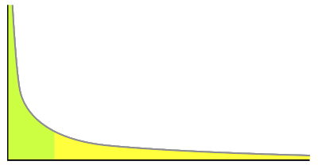

# Uzun Kuyruklu Dağılım (The Long Tail)

Aslında, teknolojiler insanları, onların temel yapısını değiştirir
diyemeyiz.. İnsanlar zaten çok çeşitli, farklı özellikleri olan,
değişik durumlara adapte olabilen canlılardır. Fakat bu çeşitliliğin
ne kadarının ve ne şekilde dışa yansıyabileceği, zamanın teknolojisi
üzerinden olduğu için sosyal yapılarda teknolojinin çok belirgin bir
etkisi olur.  Bunun en son örneğini dijital teknolojilerin güçlenmesi
ile eğlence (entertainment) sektöründe görüyoruz.  Tek televizyon, tek
kanal, çok az sayıda televizyon dizinin olduğu günleri hatırlayın. Bu
zamanlarda herkes aynı dizilere bakıyor, her çocuk birkaç aynı çizgi
filmi biliyor, herkes aynı ünlü kişilikler hakkında konuşuyordu.
Fakat bu durum, insanların zevklerinin aynı olmasıyla ilgili bir durum
değildi. Ortada çok az seçenek vardı, ve bu olan seçenekler üzerinden
tüketim kalıpları meydana çıkıyordu. Yani problem bir tüketim problemi
değil, üretim problemiydi. Daha doğrusu üretilen eğlencenin "yeterince
dağıtım kanalı bulamaması" ile ilgili bir sorundu. Dağıtım kanalının
çok az sayıda olduğu bir ekonomide, "hit" kavramı öne çıkacaktı, bir
dizi, kişilik ya "hit" olacak, ya da "çuvallayıp" ortadan
yokolacaktı...

Sınırlı seviyede eğlenceyi dağıtabilen bir sistemde başka türlüsü
düşünülemezdi.  Bu sebeple eğlenceyi, yani müziği, dizileri, filmleri
üretenler hep ürünlerinin "hit" olması için uğraşıyorlar, herkese
hitap edebilecek eğlenceler üretmeye gayret ediyorlardı. Bu sektörde
"niche" kavramı daha duyulmamıştı bile.  Günümüze gelelim. ABD'de
kitle televizyonu altın çağlarını yaşadığı 70/80'lı yıllardan beri
sürekli bir şekilde kan kaybetmektedir. Öyle ki bugünün "bir numara"
diye bilinen bir TV programı 70'lı yıllarda ilk ona giremezdi
bile. ABD'de televizyon, izleyicilerini daha niche ihtiyaçlara
karşılık verebilen kablolu kanallara, Internet'e ve gün geçtikçe
sofistikeleşen oyun konsollarındaki bilgisayar oyunlarına
kaybetmektedir.  Bu kaybın sebebi dağıtım kanallarının çoğalmasıyla
tüketim seçeneklerin fazlalaşmış olmasıdır. Ayrıca alternatiflere
kayan tüketiciler, ilginç bir şekilde seçeneklerin hepsine eşit
(üniform) şekilde yayılır. Bu yayılım, The Long Tail adlı kitaba
ismini veren, sonsuza (potansiyel seçeneklerin olduğu ölçüde) doğru
giden bir çizgide hiç sıfırlanmadan uzanan bir dağılım bölgesini
temsil eder.

Bu yeni dünyada eğlence tüketiminin ürün bazında dağılımı hep alttaki
şekilde çıkmaktadır.  Bu tür bir tüketim dünyasında, evet, "hit"
kavramı hala vardır, fakat hitlerin önemi eskisine göre "daha azalır
(hits start to rüle less)". Daha ilginç bir istatistik, "niche" denen
bölgenin toplamının "hit" denen bölgeyi artık geçmiş olmasıdır!  Şimdi
hangi şirketlerin "hit", hangilerinin "niche" bölgesinde olduğunu
ayırdelim. Mesela müzik diskleri/albümleri satan Wal-Mart tamı
tamamına hit bölgesindedir. Dağıtım kanalı fiziksel raflarıdır,
dükkanlarıdır - insanlar bu fiziksel dağıtım kanalı arasında/içinde
gezinirler. Fakat bu fiziksellik yüzünden hit bölgesindeki şirketler,
dağıtım kanalı açısından sınırlıdır. Wal-Mart'ın ne kadar aşırı büyük
bir yer olursa olsun, tüm müzik disklerini barındırması mümkün
değildir. Bilahere Wal-Mart, bugün itibariyle mevcut müziğin sadece
yüzde 1'ini taşıyabilmektedir.  Fakat Rhapsody, iTunes gibi müziği
dijital olarak dağıtan şirketler, bu fiziksel sınırlamaların hiçbirine
tabi değildir. Dahası da var: Eğer Wal-Mart bir mucize eseri tüm
diskleri taşıyabiliyor olsa bile, bu sefer aşamayacağı başka fiziksel
sınırlamalar onu engeller. Bir dışkın kategorizasyonunu düşünelim. Bir
disk rock mi, pop mu, alternatif mi olmalı? Fiziksel dünyada ve
depolama açısından bir dışkı iki yere birden koymanız çok
zordur.

Fakat dijital dünyada, iTüneş için bir dışkın kategorizasyona bir veri
tabanı tablosunda atılan bir sanal işaretten ibarettir. Bu işaret
istenildiği kadar istenildiği şekilde atılabilir. Dijital
kategorizasyonda hiçbir sınır yoktur.  Dijital dünyada, ve sadece
dijital dünyada yapılabilen bir diğer önemli tüketici hizmeti,
"tavsiye motorları (recommendation engine)" kavramıdır. Amazon sitesi
kullanıcılarının alım kalıplarına bakarak siz bir kitabı alırken başka
bir kitabı size tavsiye edebilir. Bu sayede "niche" ürünler ilk
çıktıklarında göz önünde olmasalar bile, motorun tavsiyesi sayesinde
yavaş yavaş alıcılara erişebilmektedirler. Bu motorlar olmasa bile,
insanların "değişik bir şey deneme" ihtiyacı sayesinde, dağılımdaki
uzun kuyruk hiç sıfırlanmadan sonsuza kadar gidebilmektedir. Bu
dünyada her ürünün bir alıcısı vardır. Burada eCast adlı dijital
jukebox'tan bahsetmek gerekir. Jukebox bilindiği gibi barlarda olan,
seçtiğiniz bir şarkıyı hemen çalan aletlerdir, eCast'teki tek fark,
onların jukebox'inin Internet'e bağlı ve 10000 tane şarkı seçeneği
sunmasıdır. Soru şudur: Bu seçenek enflasyonu içinde şarkıların yüzde
kaçı bir çeyrekte (quarter) en az bir tane satmıştır?  Cevap: Yuzde
98!
 Sınırsız dağıtım, her niche ürünün bir tüketici bulmasını
sağlamaktadır. Sınırsız dağıtım, insanların merkezi, tekil, "herkese
aynı ölçü elbise" yapan dünyada egzersiz edemediği çeşitliliğini açığa
koymasını sağlamaktadır.  --
 [1] The Long Tail, Anderson, C.

