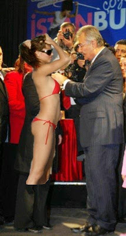

# Baykal'dan mayo acilimi

CHP'nin tüm Türkiye'yi kucaklayan bir parti olduğunu söyleyen Baykal,
son günlerdeki açılımlarına devam ediyor. En son rozet taktiği
CHP'lilere bir mayolu delegeyi ekleyen Baykal şöyle konuştu: "Artık
CHP'nin ayırımcı olmadığını herkes anlamıştır sanıyorum. Gördüğünüz
gibi iki senede bir muhakkak bir açılım yapıyoruz".Baykal bu sefer
rozet takmak için bir top model seçti, fakat rozeti iliştirecek yer
bulamayınca şunları söylediği ısıtıldı: "Merak etme kızım ben sana
sonra takarım ". Bu sırada CHP üyelerinin "inadına çıplak!" şeklinde
slogan attıkları gözlendi. Rozet törenini anahtar deliğinden izleyen
Onur Öymen mutlu olduğunu belirtti. "Halkımızla birleşiyoruz" yorumunu
yaptı.Cep telefonundan garip sesler gelen Önder Sav'a yorum için
erişilemedi.

