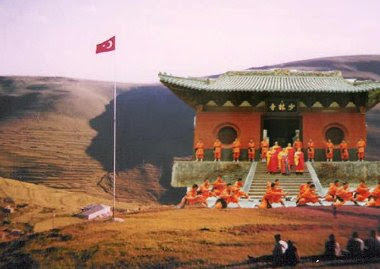
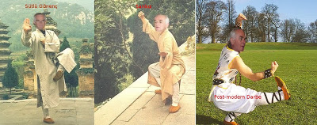
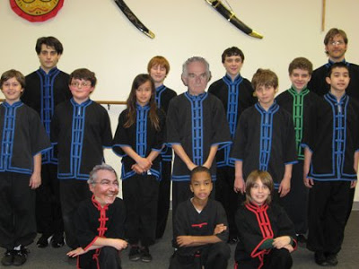

# Damal Tapınağı  Rahipleri

Bloğumuz bir habercilik başarısına daha imza attı; muhabirlerimiz son
derece gizli bir örgütü gün ışığına çıkardılar. Bu örgüt, Ata'mızın
her sene gölgesinin göründüğü Damal'da inşa edilmiş olan bir tapınakta
saklanıyor... Tapınaktaki rahipler çok gizli ve ölümcül, "Damal-Fu"
adında bir savaş sanatını öğreniyorlar. Bu topluluk, kısaca Damal
Tapınağı Rahipleri olarak biliniyor.

En üst seviye Damal-Fu hocasının Önder Sav olduğu ortaya çıktı. Sav,
öğrencileri arasında "Sıfu Sav" olarak anılıyor. Sanatta, Ata'mızın
günlük eşyalarını silah olarak kullanmak en usta tekniklerden
sayılıyor; Bunlar kültablası fırlatmak, burna ve kulağa leblebi
sokmak, kafaya rakı boşaltıp kibrit çakmak olarak sayılabilir. Altta,
Sıfu Sav tekniklerden bazılarını gösteriyor.

Damal Tapınağı Rahiplerinin rütbeleri var: Bunlar kaz, öküz, kabız,
geyik, düdük, ve sıfu olarak sıralanıyor. CHP genel başkanı Deniz
Baykal rahiplerden biri fakat şu anda öküz seviyesinde. Rahipler
gizliliklerini sürdürmek için dış dünyada rütbeler tersine çevriliyor;
En üst seviye olan Sıfu Sav'a CHP'de "yardımcı" rolü verilmiş ve
Baykal "başkan" seviyesine getirilmiş. Halbuki tapınaktaki rütbeler
bunun tam tersi. Bu Sav'i korumak için yapılmış.  Ergenekon
yapılanmasının Damal Tapınağının alt işlerinden sadece bir tanesi
olduğu bildirildi. Demek ki rahiplerin rütbelerine göre Önder Sav
Ergenekon'da "1 Numara". Ele geçirilen bir diğer belgeye göre Deniz
Baykal'ın örgütlenmede "100 Numara" olduğu ortaya çıktı.
Muhabirlerimiz araştırmalarına devam ediyor... Yeni bilgileri
okuyucularımızla hemen paylaşacağız.

Üçüncü Dalga Geliyor Blog.

"İlk bilen siz olun".

(Arka plan [muzigi](https://www.dropbox.com/s/hc4i5abpnc8lkge/kungfufighting.mp3?dl=0))
