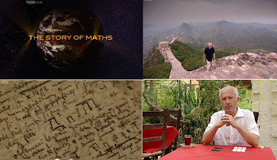
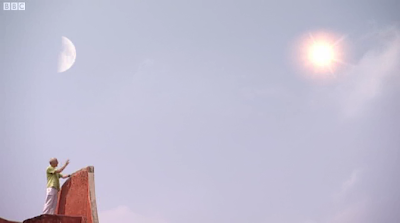
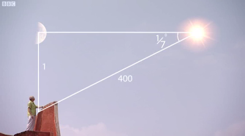

# Matematigin Hikayesi

BBC'de guzel bir belgesel cikti; Matematigin Hikayesi (Story of
Maths). Sunucunun kendisi bir matematikci, hikayeyi bizzat arastirmis
ve BBC ile hayata gecirmisler. Program icin matematige katkida
bulunmus her cografyaya gidilmis ve oradaki gelismeler aktarilmis,
Misir, Babil, Iskenderiye, Hindistan, Cin, Iran, Avrupa, ABD'ye
gidilip, oradaki gelismeler cografyanin kendisi arka plan alinarak
anlatiliyor.Programin sunusunda onemli bir faktor, sunucucunun da
vurguladigi gibi, anlatimin ve soylemin "kuresel" olmasi [1]. Tipik
olarak insanligin gelisim tarihi Eski Yunan -> Roma -> Avrupa -> ABD
olarak aktarilir; ki bu son derece Avrupa merkezci bir bakis acisidir
ve insanligin buyuk kismini disarida birakmaktadir. Bati nihayet bu
hatasini gormeye basliyor, ve tarih mefrumunu genisleterek tum
insanligi kapsayacak hale getiriyor. Tarihi tekrar yaziyor. Bir acidan
aslinda bunu yapmak zorunda, cunku eninde sonunda kendisi de bu yeni
"merkezsiz" dunyaya, bir sekilde, "dahil" olmak
mecburiyetinde.

Programda Hindistan'daki matematiksel gelismeler anlatilirken guzel
bir anektod paylasildi. Hintli matematikciler trigonometri bilgileri
sayesinde, sadece aci bilgisi kullanarak, gunesin dunyaya olan
uzakligini dogru sekilde olcebilmisler. Bu olcumun yapilabilmesi icin
oncelikle ay yarim ay konumunda olmali, ki gunesten gelen isinlarin
yansiyarak tam doksan derece acida dunyaya geldigi bir an olsun,
boylelikle dik ucgenler hakkinda bilinenler devreye
sokulabilsin. Baslibasina bu akillica bir gozlem/teknik.Bu noktadan
sonra dunya ile gunes arasindaki aci olculuyor. Hintliler bu aciyi 1/7
derece olarak saptamislar. Bu bilgiyle dik acili bir ucgen kurgulamak
mumkun; ve sinus, karsi bolu hipotenus demekse, o zaman 1/7 derecenin
sinusu, gunese olan uzakligimizin aya olan uzakligimizin kac kati
oldugunu soyleyebilir.Dereceden radyana gidelim, 1/7*(pi/180), bunun
sinusunu alip ve ters cevirelim, yani 1/sin(1/7*(pi/180)) = 401
buluruz. Demek ki gunesin uzakligi, aya olan uzakligin 401 katidir
(altta 400 gosteriliyor bu da yakin).Gercek rakamlari baska metotlar
kullanarak artik biliyoruz: Bunlar aya 238855 mil, gunese 93000000
mil; Bolunce sonuc 389 kat. Fena degil!--[1] Kuresellesmenin dogru
tanimi bu olmali [3]: Mesafelerin kisaldigi ve merkezin parcalandigi
bir dunya.

Bu ucuncu dalganin direk bir sonucudur; bilginin on plana cikmasi,
mobillesen ve kuculen uretim araclari [2] bireylerin gucunu ve hareket
alanini genisleterek, bireylerin toplami olan koca topluluklarin
hareket alaninin genisletmistir. Boyle bir dunyada kimse merkezdeki
bir aktorun ne yapacagini beklemek zorunda degildir.[2] Dizustunde
bilgisayarli programcidan, omuzundaki Stinger ile bir Afgan mucahiti
bu baglamda ayni dinamigin parcasidir. Gerci mucahitinki uretim araci
degil yokedim aracidir, fakat devredeki dinamik aynidir. Teknoloji
kuculerek bireyin normalde yapabileceginden cok daha fazlasini
yapabilmesini saglamaktadir.[3] Kiyasla, 90'li yillarda insanlarin
kafasina sokusturulan kuresellesme jargonu, Pax Amerikana fikrinin
tekrar ambalanmis halinden baska bir sey degildi.

