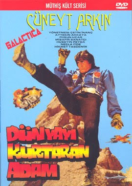

# Cüneyt Arkın Kürt açılımını destekliyor

Bugün ünlü sinema sanatçısı Cüneyt Arkın ile röportajımızı
sunacağız. Kendisine Kürt açılımı, AB gibi konular hakkında
sorularımız oldu.

UDG: Cüneyt Bey merhaba, hoşgeldiniz.

Cuneyt Arkın: [[cevap](nosbulduk.wav)]

UDG: Kürt açılımını desteklediğiniz haberini aldık. Bunlar doğru mu acaba?

CA: Evet destekliyorum.

UDG: Ama hep Türk kahramanları oynadınız filmlerinizde.

CA: Evet ama Kürt kahramanları da olabilir. Dilaveroğlu, Necirvan Gazi, Newroz Paşa.

UDG: Bazıları Türkiye bölünür diyor, evham yaratıyorlar.

CA: [[cevap](cahil.wav)]

UDG: Bu sözlerinize tepki gösterirlerse ne yapacaksınız?

CA: [[cevap](pence.wav)]

UDG: Bu filmi hatırladım, pençe takmıştınız..

CA: Evet pençelerle karate yaptım

UDG: Unutulmaz bir klasik

CA: Öyle..

UDG: AB'ye girelim mi ne diyorsunuz?

CA: AB taraftarı değilim

UDG: Ama para, yatırım gelecek

CA: [[cevap](azpara.wav)]

UDG: Katılım süreci filan iyi olmuyor mu?

CA: [[cevap](sasirt.wav)]

UDG: AB Bizans mı?

CA: Boşverin AB'yi.. onlar bize yolu şaşırtacak..

UDG: Kürt açılımına tepkili olanlara ne diyorsunuz?

CA: Faşo diyorum

UDG: O ne?

CA: Onu en iyi rahmetli Kemal Sunal söylemişti. [[cevap](faso.wav)]

UDG: Teşekkürler Cüneyt Bey

CA: N'rica n'ederim.

