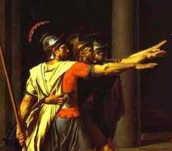
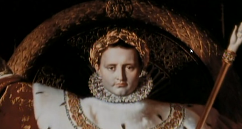
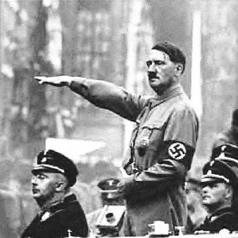
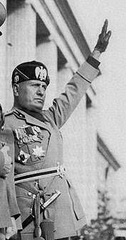

# Avrupa'nin Kulturel Fay Hatti

Ülkelerin kültür kodlarından ve fay hatlarından bahsettik. ABD'de bu
hat sakınma / serbestleşme noktasından geçiyor, TR'de, İngiltere'de
ise değişik yerlerden... İnsanlar bilinçaltısal bir şekilde konuları
tartarken bu şekilde gruplanma eğilimi gösteriyorlar. Tarihlerinde bir
taraf ile öteki arasında bir halat çekme yarışı görülüyor.Peki bir
kıta olarak Avrupa'nın kendine has bir fay hattı olduğu söylenebilir
mi? Acaba Avrupa, tek vücut olarak bir kültürel alt yapıya ve kendine
has kodlara ve bir fay hattına sahip midir? İddiamız Avrupa'ya has
kültürel fay hattının "Roma / Ortaçağ" noktasından geçtiğidir
[1].

Tarihi boyunca Avrupa'yı tanımlayan önemli olayların bahsedilen
çerçevede vuku bulduğunu görebiliriz. Hristiyanlık ve Hz. İsa'nın
çarmıha gerilmesinde bir taraf militarist, yağmaçı, baskıcı Roma'dır,
diğer tarafında sadece din değil, düşünce ve yaşam özgürlüğü
vardır. Sonraları Ortaçağ sırasında Avrupa daha kalabalık "çoğulcu"
bir yapıya kavuşmuş ve bu sayede, dağınık yapısıyla rönesans / reform
evrelerini yaşamıştır; böylece çekişme noktası artık kendine has bir
"periyoda", ayrı olarak düşünülen bir "hatıraya da" kavuşmuştur. Tabii
bir fay hattından beklenecek şekilde, karşı taraf olan Roma'nın
hayaleti tamamen yokolmamıştır.Avrupa'da modernitenin başlangıcı kabul
edilebilecek Fransız Devrimi'nden sonra başa gelen diktatör Napolyon,
Roma imparatorlarının ruhani mirasçısı olduğunu iddia ediyordu --
üstte yaptırdığı resimde kafasında görülen taç, Roma imparatorlarının
taktiği taçın bir kopyasıdır.

Napolyon (o zaman artık güç merkezi sayılmayan) Roma şehrini ele
geçirdiğinde, bu olaya adeta dini bir önem atfetmişti
[2].Endüstriyelleşme ilerledikçe, onun üzerinden güçlenen aşırı
merkezileşme, standardizasyon, kitleselleşme, insanları montaj
bantından çıkan tek tip ürünlere çevirebilme mentalitesi ile totaliter
yapıları tekrar mümkün kılmış ve bazıları bu kolay yoldan geçerek yeni
bir tür Roma'nın hayalini takip etmeye başlamıştır. Mussolini
İtalya'sının, Nazi Almanya'sının Roma ilhami bir sır
değildir. Fetihsel amaçından tutun, Roma askerlerinin selamına kadar
İtalyanlar ve Nazi Almanya'sı Roma İmparatorluğunu kopyalamaya
çalışmıştır. Diğer tarafta tepki olarak (halat çekme yarışı devam
ediyor) Avrupa'nın geri kalanı çoğulcu damarını hatırlamış, ve Nazi
Almanya'sıyla bir varoluşsal savaş vermiştir. Direnenler arasındaki
İngiltere, Roma İmparatorluğu zamanında fethedilen en uzak
karakollarından biriydi, ve Roma'ya karşı gerilla taktikleri
kullanmaya kadar varan çok sert bir direniş göstermişti. Yanına
dışarıdan (ama nihayetinde kendisi de Avrupa çıkışlı olan) Amerika'nın
da katılmasıyla 2. Dünya Savaşı'nda kazanan taraf çoğulcular
olmuştur. "4. Roma" hayali yerle bir edilmiştir.Bu hat üzerinden
günümüzdeki Avrupa'nın olaylara olan tepkisini anlayabilir miyiz?
Amerika'nın Iİ. Irak Savaşı Avrupa'da "ABD'nin Romalastiği" imajını
pekiştirdiği için destek bulamamıştır.

AB kendi geleceği açısından çoğulcu bir yapıyı tercih etmiş
gözükmektedir, "yumuşak gücü" ile bu yeni yapının yayılması için
uğraşmaktadır. Amaç artık militarist fetihler değildir.Bağlantılı
olarak Türkiye'nin AB ilişkilerinde, ona Türkiye içinde eski Roma'yı
hatırlatacak hiçbir görüntüye iyi gözle bakmayacağını tahmin
edebiliriz; yani militarist, baskıcı, yağmaçı 3. Roma ve onun devamı
[Cumhuriyet olmayan] Cumhuriyet'ten arta kalan tortularda
bulunabilecek her türlü totaliter, resmi / gayrı-resmi
örgütlenme.--[1] Bazıları bu hattın aslında "din / bilim" noktasından
geçtiğini iddia edebilir. Buna katılmıyoruz. Tarihte kılisenin bazı
evrelerde otoriter, gerici bir görüntüye büründüğü doğrudur (ki bu
durum kısmen hala devam ediyor). Fakat yozlaştığı zaman o dinin
karşısına bu sefer Luther eşliğinde "baksa bir din" dikildi.[2]

Discovery Channel, Ancient Rome, The Rise Of the Roman Empire, 1. Bolum

