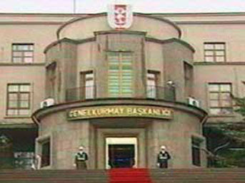
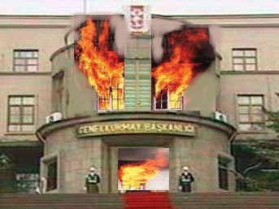
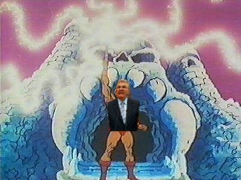
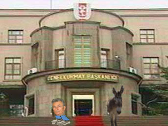

# Demeclerin arkasındaki sır perdesi

Gazetelerin her Genelkurmay demeci sonrasi niye surekli GK binasinin
fotografini on sayfalarina koyduklari anlasildi. Muhabirimizin binbir
zorlukla aldigi bilgiye gore, demecleri aslinda Genelkurmay binasinin
kendisi veriyor.Evet bu bina aslinda canli bir bina. Transformers gibi
kendini transforme edebiliyor, yuruyor, konusuyor, hatta darbe
yapabiliyor. Ustteki fotografta bina, 'ibreeetleee seyrediyoruuuz'
sozunu sarfederken goruluyor.Binanin bu halini duyan Deniz Baykal onu
unlu He-Man cizgi filmindeki Kurukafa Magarasina benzetti. He-Man
bilindigi gibi magaranin onunde durarak 'golgelerin gucu adina' diye
baslayan unlu sozleri soyluyordu ve guc onun oluyordu. Aynisini
tekrarlayabilecegini dusunen Baykal, acilen GK binasinin onune kosarak
ayni kelimeleri tekrarladi. Altta muhabirimizin Baykal bunlari
yaparken cektigi bir fotografi daha goruyorsunuz.Fakat Baykal bu
denemesinde istedigi sonuca varamadi. He-Man'e donusemedi ve guc onun
olmadi. Baykal 'kendimizi anlatamadik' diyerek avunmaya calisti 'bir
donem daha muhalefetteyiz anlasilan' yorumunu yapti. Altta Baykal'in
donusumunu tamamlayamadigi hatta guclerin onun uzerinde bir ters etki
yarattigi anlasiliyor. He-Man'in unlu kaplani yerine ise Baykal'a bir
esek verildigini goruyoruz.

