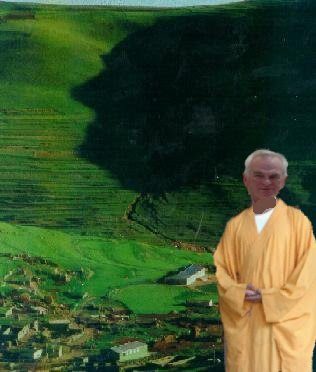
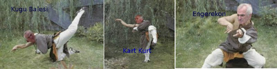

# Tapınak rahatsız

Bir habercilik başarısına imza atan Üçüncü Dalga Geliyor Blog, Damal
Tapınağı adlı bir yapılanma hakkında bazı bilgileri kamuoyu ile
paylaşmıştı. Muhabirimiz tekrar tapınağa sızmayı başardı ve çok önemli
yeni bilgiler ele geçirdi. Tapınağın son zamanlarda çok rahatsız
olduğu öğrenildi. Ölümcül Damal-Fu savaş sanatının yaşayan en üst
büyük ustası ulu Önder Sav, son konjenktürden çok rahatsız olduğunu
tapınaktaki rahiplere anlatıyor. Tapınak, daha önce kapatma davası,
halkın kapatılması gibi projelere imza atmıştı. Büyük usta Sıfu Sav en
son olarak Kürt açılımıni hedef tahtasına aldı, öğrencilerine
"açılımın kapatılması" emrini verdi.

Sıfu Sav ölümcül Damal-Fu sanatının şimdiye kadar hiç öğretilmemiş
bazı tekniklerini de öğretmeye başladı. Bu teknikler yüzyıllarca gizli
tutulmuştu, fakat son durumun açılıyeti sebebiyle teknikler şu yüzüne
çıktı. Altta ulu Önder Sav bu teknikleri uygularken görüyoruz.

İlk teknik Kuğu Balesi uygulanırken rakip güldürülüyor, sonra Kart
Kurt ile şaşkınlığa uğratılıyor. En son darbe "Engerekon" ile rakip
etkisiz hale getiriliyor.

Üçüncü Dalga Geliyor Blog.

"İlk bilen siz olun"

