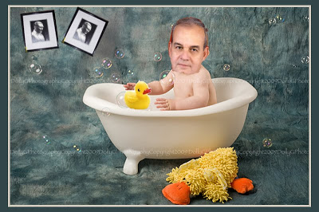

# Yeni bildiri

GK başkanı İlker Başbuğ en son mesajını vermek için banyo küvetini
seçti. Banyo küvetinin deniz kuvvetleriyle ilgili bir mesaj içerdiği
anlaşılıyor. Ayrıca arka planda duvarda görülen "simetrik durmayan"
Ata'mızın resimleri silahlı kuvvetler üzerindeki "asımetrik emellerle"
ilgili bir mesaj. Sabun köpüklerinin ne anlama geldiği halen
anlaşılamadı, konu hakkında TSK yetkilileri bir yorum
yapmadı. Spekülasyonlar sürüyor.

