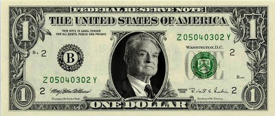

# Ne Mutlu Soroscuyum Diyene

Ulu Önder, yüce kişilik, örnek insan ulu Soros'un piyasada ilk milyon
dolarını kazandığı 4 Ocak günü törenlerle kutlandı. "Küresel Bayram"
günü ilan edilen bu günde, şiirler okundu, ABD darphane binasına
çelenk bırakıldı, borsada spekülasyon yapıldı. 'Soros çocukları' denen
grup yürüyüş yaparak bir günlük Soros'un koltuğuna oturdular, o sırada
bir ülkede pembe devrim bir başkasında kur dalgalanması oldu. Soros
çocuklarla ilgilenip harçlık olarak borsa tüyosu verdi.

