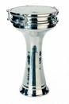

# Son darbe planı: Darbuka

Blog'umuz bir habercilik basarisina daha imza atti. 2004 senesinde
planlanmis 'Darbuka' kod adli bir darbe planini ele gecirdik. Planin
ismi yapilacak eylemlerden ileri geliyor; plana gore once toplum
darbuka gibi gerilecek. Boylece cikacak sesin incelecek olmasindan
hareketle bu 'gerdirme' operasyonu uygulanacak. Teyp mesajlarinda
darbenin nasil baslatilacagi detayiyla anlatiliyor. Herseyi baslatmak
icin bir Orgeneral telefonu acip, diger Orgenarale "cal darbukayi"
diyecek. Karsiliginda sifreli cevap olarak diger Orgeneral ona "tik
tik taka tak, tik taka tak" diyecek. Darbenin ikinci fazi icin Org,
digerine "simdi parmakla calmaya basla" mesajini verecek, isler iyi
gitmiyorsa mesaj "solo yap" olacak.TSK Darbuka darbe planini 5
maddelik bir cevapla yanitladi. Ilk madde "karargahta darbuka calmayi
bilen yoktur" sozleri oldu.

