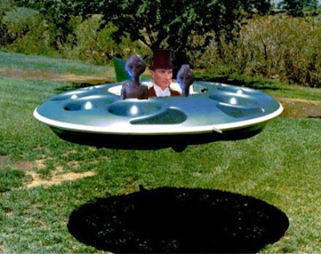
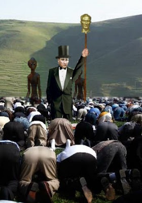

# Ata'nın gemisi inis yaptı!

Heyecanla beklenen an gerçekleşti..! Ata'mızın uzay gemisi Damal'a
iniş yaptı. Bu sürpriz ziyaret Damal Tapınağı'nda inanılmaz bir
heyecan yarattı, derhal dışarı koşan rahipler, Ata'nın ve yaverlerinin
önünde secdeye vardılar.

Ata'nın mucizevi dönüşü bazı soru işaretlerini ortaya çıkardı. Eğer
Ata ölmediyse, 1938 yılında ölen kimdi? İlk paylaşılan bilgilere göre,
bugün geri gelen biyolojik olarak gerçek, esas Ata. 1881'de dünyaya
gönderilen ise Ata'nın biyolojik bir kopyasıydı, yani bir
klondu. Gerçek Ata yaşlanmıyor ve ölmüyor. İkamet ettiği yer ise
Sirius Galaksisi. Türkler bu galaksiden geliyorlar, demek ki ilk insan
bir Türk. Anlaşıldığı üzere Türkiye'deki tüm kasaba ve şehirler
aslında Sırıus'taki gezegen ve yıldızlara göre isimlendirilmiş,
yerleri bile ufaltılmış boyutta Sirius'taki yerler ile birebir aynı.

Bu gezegen ve yıldız isimlerinden bazıları yukarıdaki haritada
görülüyor.Haritada ortada bulunan Ankara bir kara delik.Daha fazla
detayı bir sonraki yazıda paylaşacağız.

Üçüncü Dalga Geliyor Blog

"İlk bilen siz olun"

