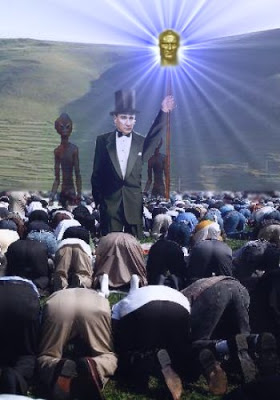
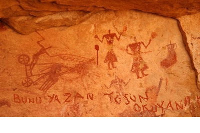
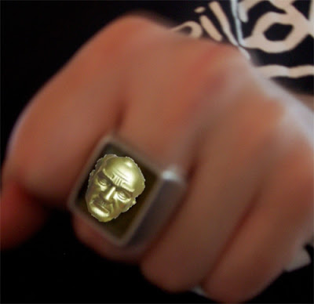

# Gizemli asa

Ata'mız Damal'a iniş yaptığından beri onu yakınen takip
ediyoruz. Bugün onun gizemli asasından bahsedeceğiz. Asa'nın özel
güçleri var. Ata istediği anda ondan çok parlak bir ışık
çıkartabiliyor ve bu ışıkla karanlıkta olan herkes aydınlanıyor. Bu
asanın tarihteki bilinen ismi Asena. İsim "bu **as**a eb**en**e **a**tlar'
kelimelerinin parçaları birleştirilerek oluşturulmuş. Damal Tapınağı
rahipleri asanın güçlerini iyi biliyorlar.

Asena, ilk insan (yani Türk) dünyaya getirildiği zaman Ata'nın yaninda
getirdiği asa. Çatalhöyük'teki ilk insanın (yani Türkün) yaptığı
mağara duvar resimlerinde Asena'nın resmedildiğini görüyoruz.

Fakat gizemler bununla bitmiyor. Ulu Önder'in özel yüzükleri var. Bu
yüzükler Kızılmaske'nin yüzüklerine benziyor.

Aynen o çizgi romanda olduğu gibi bu yüzükle yumruk yiyen kötü
kişilerin yüzünde hiç çıkmayan bir Ata imajı kalıyor. Böyle yumruk
yiyenler kamusal alana bir daha giremiyorlar ve otomatik olarak
katsayıları artıyor.Daha fazla detaydan bir sonraki yazıda
bahsedeceğiz.

Üçüncü Dalga Geliyor Blog

"İlk bilen siz olun"
