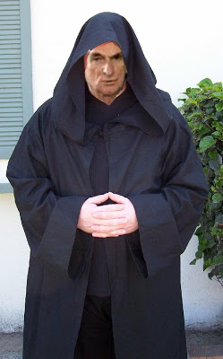

# Damalische Kamalismus und Faschismus

Daha onceki yazilarimizda muhabirlerimizin Damal Tapinagi adli bir
olusumu ortaya cikardigini soylemistik. Tapinakta Sifu Onder Sav
olumcul Damal-Fu sanatinin yasayan en buyuk ustasi olarak
biliniyordu. Sav, Ergenekon olusumunda "1 Numara"'da idi; Sav
kimliginin gizlenmesi icin genelde hic on plana cikmiyordu, ama bazen
son CHP olaylarinda goruldugu gibi, ogrencilerine bir ders vermek icin
arka planda degisiklikler yaptigini goruyoruz. CHP baskanligi
Ergenekon siralamasinda "100 numara" olarak biliniyor. Burada Damal-Fu
sanatinda okuz seviyesinde olan Baykal basarili olamayinca, Ulu Sifu
Sav'in onun yerine duduk seviyesindeki Kilicdaroglu'nu getirmeye karar
verdigini goruyoruz.Bu arada Sirius galaksisinden gelen Ata'mizin
ziyareti halen devam ediyor. Muhabirlerimiz kaset konusunda Ata'nin
yaverleri Hamdi ve Hakkı adli uzaylilarin (yani Turklerin) bir rolunun
oldugunu ortaya cikardi.Ucuncu Dalga Geliyor Blog"Ilk bilen siz olun"

