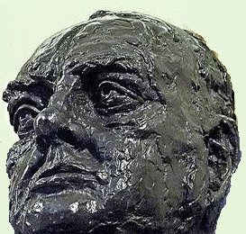

# Taksim'de Soros büstü

Taksim'de disko, Taksim'de cami tartismalarina simdi de Taksim'de
Soros büstü tartismasi eklendi. "Soros cocuklari" adi verilen bir
grup, ornek insan, ulu onder Soros'un borsada ilk 10 milyonunu bir
kerede kazandigi 20 Haziran gunu Taksim'e kutlama amacli bir büst
koyacak. Izin verilmeyen bu gosteride karisiklik cikmasi
bekleniyor. Soros cocuklari grubunun sozcusu "yilmayacagiz, Taksim
artik 1 Mayis kutlamalarina acik, biz niye kendi büstümüzü koymayalim"
yorumunu yapti.

