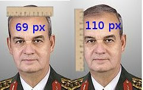

# Brekisefal Degil

Daha önce bu ölçümü Isik Koşaner için yapmıştık, şimdi de "Türk kanı"
kavramından bahseden İlker Başbuğ için yapıyoruz. 1930'lu yıllarda
Mustafa Kemal'in teşvikiyle oluşturulan Türk Tarih Tezine göre Türkler
brekisefal kafatasına sahiptir. Bu yapıya göre kafatasının eninin
boyuna oranı 0.85'ten büyük olmalıdır. Başbuğ için piksel bazlı
yaptığımız ölçümlere göre sonuç 69 / 110 = 0.62 çıkıyor. Bu sayı
0.85'ten küçüktür, demek ki TTT'ye göre İlker Başbuğ Türk değildir.

