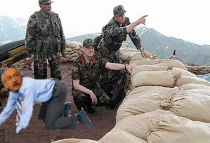

# Kılıçdaroğlu çömelmedi

CHP genel baskani Kilicdaroglu, Irak sinirinda cephe ziyareti yapti,
fakat basbakan Tayyip Erdogan gibi comelmedi. Kilicdaroglu "ben
domalmayi tercih ettim" diyerek fotografi anlatti."Aklima bir fikir
geldi, surpriz bir hareket yaparak PKK'yi taktik olarak saskinliga
ugratmayi planladim. Basbakan olursam savasta bu tur surpriz
taktiklerin daha fazla uygulandigini goreceksiniz " diyerek hareketini
yorumladi. Kandil menseili yayin organlari hakikaten PKK'nin bu duruma
sasirdiklarini ortaya koyuyor; bir yayin soyleydi: "durbunle GK
baskanini gorduk, ama yanindaki g.t kimdir onu anlayamadik".

