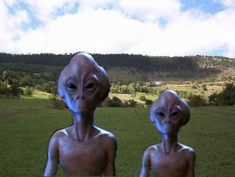
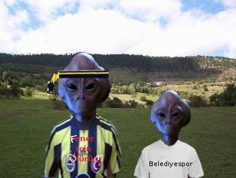

# Yaverleri tanıyalım

Bugünkü yazımızda Sirius galaksisinden Damal'ı ziyarete gelen
Ata'mızın yaverleri Hamdi ve Hakkı'yı tanıyacağız.

UDG: Merhaba

Hamdi, Hakkı: Merhaba

UDG: Sirius Galaksisi'nden geldiğinizi duyduk. Oranın
neresindensiniz?

Hakkı: Sirius buyuk bir galaksi tabii. Pek çok ili, ilçesi var. Biz
Yozgat'ın köylüsüyüz.Hamdi: 200 sene önce bölgede kuraklık oldu. Biz
de evimizden çıkıp göç etmeye karar verdik. Bir uzay gemisine atladık,
şehre doğru yola çıktık. Ama..

Hakkı: Ama yolumuza kaybettik. Düz git, köprüyü geç, simitçiden sağa
dön dediler, biz sol yapmışız, yanlış oldu. Birden bire galaksi
merkezindeki kara delik Ankara bizi çekmeye başladı. Eyvah
dedik..

Hamdi: Neredeyse deliğe düşüyorduk. O sırada Ata bizi farketmiş, uzay
gemisi ile kurtardı.

[koro halinde şiire başlıyorlar]

>Atam! Ufkunda doğacağım, ufkunda batacağım
>
>Asırlarca yazsam hep seni anlatacağım.
>
>Ben de giyersem eğer bir gün deha tacını
>
>"İstersen çiğne" diye önüne atacağım...

UDG: Pekala.. Ata sizi kurtardı. Ondan sonra onun yaveri mi
oldunuz?

Hakkı: Öyle oldu. Gemisi Savarona'da seyahat etmeye başladık.

UDG: Soyadlarınız var mı?

Hamdi: Benim tam ismim Hamdi Türkedön. Arkadaş Hakkı Daum.

UDG: Nasıl yani Daum?

Hakkı: Annem fanatik Fenerbahçeli, 2004-2005 yılında şampiyonluk
sonrası "aynen Daum'a benziyor" dedi, bana böyle soyadı verdi.

UDG: Sizde soyadını anne, baba mı veriyor?

Hakkı: Öyle. İlk isim anne, babadan geliyor. Benim babamın, annemin de
ismi Hakkı.

UDG: Peki Sirius'tan buradaki futbol ligini nasıl
seyrediyorsunuz?

Hakkı: Çok uzakta olduğumuz yayın çekmiyordu, biz de seyretmek için
özel antenler yaptırdık. Birkaç gezegeni tamamen anten haline
getirdik.

Hamdi: Burada aldığımız formaları giyelim de görün.

UDG: Teşekkürler.

Hamdi, Hakkı: Biz teşekkür ederiz.

