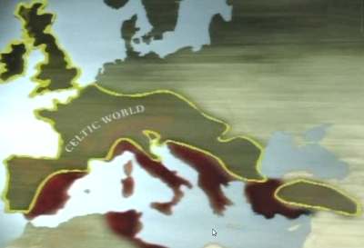

# Barbarlar

BBC birkac haftadır Terry Jones'un Barbarlari adli bir belgeseli
yayınlıyor. Barbar terimi Roma imparatorluğu tarafından sınırları
dışında olan diğer (tüm) insan gruplarını tanımlamak amacıyla
kullanılıyordu. Roma'nın kendine bakışı (self image) şöyleydi: O, '
geri kalmış', 'insanlık dışı' 'barbarlara' karşı savaşıyor, ve kendi
'medeni' düzenini yayıyordu.  Jones, bu tanımlamayı tekrar irdeliyor
ve tarihi olayları tekrar gözden geçirip, yeni arkeolojik kazıların
bulguları ışığında, barbar olarak tanımlanan insanların aslında
Roma'dan hiç de geri olmadığını ortaya koyuyor. Aksine, Roma'ya rakip
olan toplumlar, bilim, sosyal, ahlaki bakımdan ondan fersah fersah
ilerideydiler. Roma sadece yağma, şiddet kategorilerinde daha
ilerideydi.  Barbarlar listesindeki ilk ornek Keltler. Bugun
Fransa'nin oldugu yer Gaul, Kartaca'dan sonra Roma tarafindan
gerceklestirilen ilk buyuk katliamin merkezi olacakti.

Arkeolojik kazılarda ortaya çıkan mekanik bir araç, ve 1989'da bazı
yazıtların çözülmesiyle, Keltlerin seneye göre güneşin nerede
olacağını tahmin edebilecek bilimsel seviyede olduğunu
gösteriyor. Kıyasla Romalılar takvimlerinin yanlış hesaplaması
yüzünden Ağustos ortasında baharı kutluyorlardı. Sosyal düzen: Roma'da
yaygın uygulama istenmeyen çocukların çöplüğe
bırakılmasıdır. Keltler'de eğer anne / baba görevini yerine
getiremiyor / getirmek istemiyorsa, başkasını bu görev için tavsiye
edebiliyor, görevi alan yeni anne, baba hizmetleri için
ödüllendiriliyordu. Roma'nın erkek-üstün düzeni yerine Keltlerde
cinslerin eşit olduğu bir düzen vardı.  Yolları hep Romalıların
yaptığı düşünülse de [1], Kelt yol sistemini gösteren su harita bu
kaninin yanlışlığını gösteriyor.  Nihayetinde, Sezar bugün Fransa'nın
olduğu Gaul'a sudan bir bahane ile saldırdı, ve takriben 1 milyon kişi
öldürüp, bir o kadarını da esir aldı. Gaul dümdüz edildi.  Ikinci
katliam: Dacia.

Bugün Romanya'nın (isme dikkat) olduğu yer Dacia'da
altın madeni mevcuttu. Roma imparatoru Trajan'ın paraya çok ihtiyacı
vardı, ve Trajan Dacia'daki ganimetlere gözünü dikti. Daha önce
Germenler'e saldırısı başarısız olan ve çok sayıda asker kaybeden Roma
bu sefer işi şansa bırakmak istemedi, Daçia'ya 13 lejyon, 100,000
asker yollandı, bir katiam daha yaşandı. Sağda resimde görülen anıt,
aslında bir soykırım anıtıdır. İşin ilginci Roma yaptığı katliamdan
utanmıyor, aksine övünüyordu. Katliam sonucu (sayesinde) 1600 ton
altın yağmalandı, Trajan'ın Roma'da düzenlediği eğlencelerle soykırım
tam 123 gün kutlandı. Roma'nın eğlenceden anladığı (doğal olarak) daha
fazla vahşet sergilenmesidir, tam 10,000 gladyatör bu eğlencelerde
savaşacak, yüzlerce hayvan gösteri için telef edilecekti.  Trajan bu
yağmalanmış altınla büyük bir inşaat hamlesi başlattı. Basılıkalar, şu
kanalları, yeni tapınaklar hep bu zamanda inşa edildi. Bugünkü İtalyan
Roma şehrine gittiğinizde, antik turistik eser olarak göreceğiniz tüm
yapılar, Dacia'dan gelen işte bu kanlı paranın sayesinde inşa
edilmiştir.  Dizi yine barbar olarak görülen Partia'ya (bugünkü İran)
değiniyor. Bu toplum da tabii ki medeniydi, edebiyat, bilim, sosyal
hayat aktifti. Askeri yapılanmasında bir tür şövalye düzeni de
mevcuttu (fief sahibi zırhlı, atlı askerler) -- Roma Partia'ya karşı
ağır yenilgiler aldı. En çok şaşırdıkları, atlılar kaçarken 180 derece
dönüp geriye ok atmalarıydı [2]. Kaçanları kovalamaya şartlanmış
Romalılar (çünkü kendi düzenlerinde geri giden / çekilen askere çok
ağır cezalar veriliyordu), Partia askerleri tarafından ok yağmuruna
tutulunca darmadağın oldular.  Yunanlılar: Fazla detaya gerek bile
yok. Yunanlılar bilimde, matematikte en ileri toplumlardan
biriydi. Onlar da Roma tarafından barbar olarak
tanımlanıyordu. Arşimet bilimiyle uğraşırken bir Romalı asker
tarafından katledilmiştir, ve bu olay, aslında Avrupa'nın kültürel fay
hattını gösteren kritik bir tarihi andır.  Terry Jones ardı ardına
sıraladığı bu tür kanıtlar sonrasında kameraya dönüp şu bitirici sözü
telafuz ediyor: Roma kendisi dışında herkesi barbar olarak
tanımlıyordu -- ama aslında şu soruyu sormak lazım.. acaba barbar olan
Roma'nın kendisi miydi?  Yerinde bir soru. Bu soru niye uzun süre
ortaya çıkamadı? Sebep: Roma fetişizmi.  Fetisizmin birkac sebebi
var:

1) Tarihi kazananlar yazdı 2) Roma sosyal düzen, bilim gibi konularda
ileri olmamasına rağmen, bir noktada çok ileriydi:
Propaganda. Kartaca, Keltler, Parthia gibi toplumların yüzyıllarca
kötülenmesini sebebi bu olmalıdır.  3) Katolik Kilisesi: Daha doğrusu
Romalı Katolik Kilisesi (Roman Catholic Church). Roma paganlıktan
hristiyanlığa geçti, sonra yıkıldı; o süreçte ve sonrasında aktif olan
Katolik Kilisesi zamanın bazı kültürel duruşlarını, seramonilerini
dondurarak dini ritüeller üzerinden sonraki nesillere aktardı.  4)
Modernite kendisi gibi merkeziyetçi, yeri geldiğinde (endüstriyel yapı
gerektirdiği için, hammadde ihtiyacıyla) yağmacı [4], ve emperyalist
yapısını tarihe bakarak doğrulamak (justify)
durumundaydı. Modernistler geriye baktılar, ve aynen kendileri gibi
merkeziyetçi, çok rahat despotlaşabilen ve ötekileştirebilen [3]
tarihteki bir diğer yapıyı buldular: Roma.  Fakat çağ değişiyor, bu
değişim ışığında eskiye tekrar bakıyoruz, ve onu daha açık bir zihinle
irdeleyebilmeye başlıyoruz. Bizdeki 3. Romacılık ta (Osmanlıcılık)
aynı sebepte dolayı marjinalize edilip, aşılıyor.  --

[1] "Bütün yollar Roma'ya çıkar" deyişi bu benmerkezi durusun bir
göstergesi, ayrıca aşırı merkezi bir kafa yapısının da dışavurumu. Tüm
yollar Roma'ya çıkar çünkü 1) güya tüm yollar Roma tarafından
yapılmıştır 2) ganimet, yiyecek sürekli olarak Roma'ya akmalıdır,
sistem buna göre kurulmuştur.

[2] Milliyetçi bazı şaşkınlar bunun Türklere ait olduğunu filan
zannetmesin; atışa İngilizce Partia'dan gelen "parting shot", "the
Partian shot" ismi verilmesi durumu açıklıyor zaten. Parting =
ayrılan, giden.

[3] Roma'nın medeniler / barbarlar ayırımı, ulus-devletlerin
"standardize" ettiği vatandaşlarının "ötekileştirdiği" düşman kavramı
ile birebire uyuşuyor. 12 Eylül "hiyerarşik", "modern" darbesinin
Osmanlıcılığı pompalaması raslantı olmasa gerek.

[4] Sovyetlerin "emperyalizme" karşı olan retoriği kimseyi
yanıltmamalı; Kapitalist Batı ne kadar endüstriyel amacı itibariyle
hammaddeye aç ise, Sovyetler bir o kadar hammaddeye muhtaç
konumdaydı. Bu ihtiyaç sebebiyle Sovyetler Birliği, kontrolü altındaki
demirperde ülkelerinin doğal kaynaklarını talan etmiştir.

