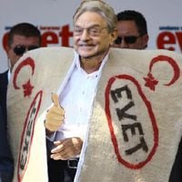

# Soros "evet" dedi

Ulu Önder, örnek insan, yüce Soros 12 Eylül referandumunda "evet"
tarafını desteklediğini bildirdi. Soros evet tarafı için aktif bir
şekilde çalışmaya başladı -- Soros Çocukları adı verilen sivil toplum
örgütü ile beraber Türkiye'de sürekli gezen Soros, evet oyu verenlere
senet, kar payı, bedava kömür dağıttıklarını söyledi. Soros evet
tarafını niye desteklediği sorusuna "bölünmüş bir Türkiye'nin

